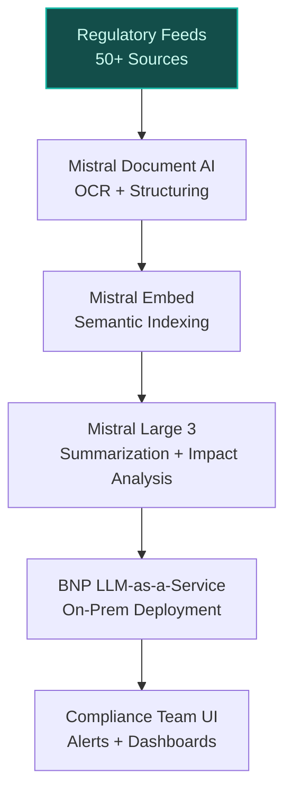
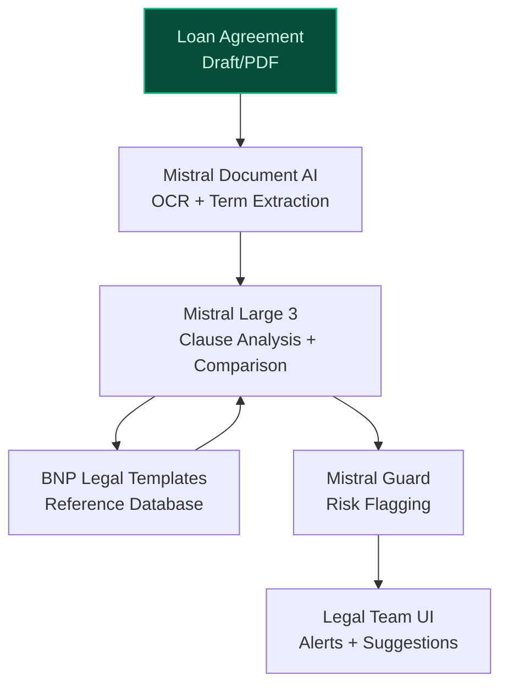
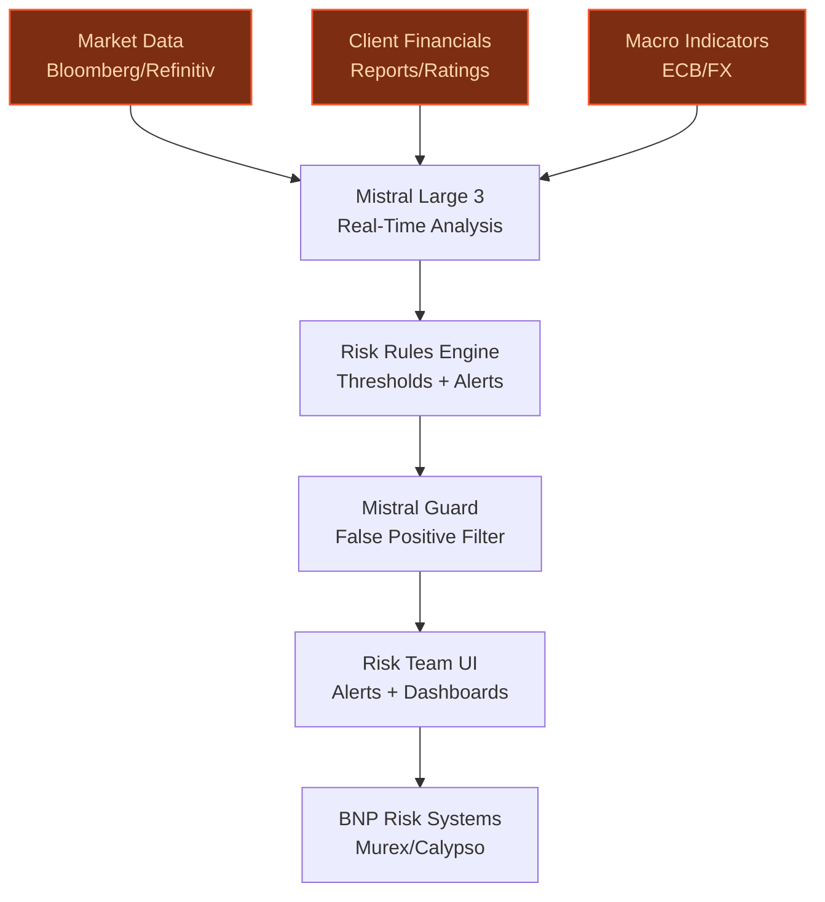

> **Draft — needs revision before customer use.** Meta-eval confidence `0.67` (sales-engineer-ready threshold ≥ 0.70). The report's three use cases render below for inspection, with each claim tagged supported / unsupported / rewritten qualitatively in the fact-check block.
>
> **Cross-cutting concern:** Over-reliance on illustrative/unsupported quantitative claims (e.g., 70% time reduction, 50-70% time-to-close reduction) and vague peer-deployment references without concrete, verifiable grounding in the evidence pool.
>
> **Weakest use case:** Lacks direct evidence for key claims (e.g., BNP Paribas CIB's real-time risk monitoring needs, integration with Murex/Calypso, or pilot in Global Markets). Peer-deployment precedent (MSCI) is weakly connected to the proposed use case, and no cited evidence supports the specific operational context.

## GenAI Use Cases for BNP Paribas

Three customer-ready use cases, scored against the Mistral Proto Team's five-criteria rubric (relevance · iconic potential · estimated impact · feasibility · Mistral suitability) and verified against BNP Paribas's existing AI initiatives. Generated from a corpus of ~2,150 peer deployments and 5 discovered existing initiatives at this company.

_Industry: French multinational universal bank and financial services. Research confidence: 0.85. Verified: True._

### Multilingual AI-Powered Regulatory Intelligence Platform for Global Compliance
BNP Paribas, as a systemically important bank operating across 65+ jurisdictions, faces significant regulatory change—EU Capital Requirements Regulation (CRR III), US Dodd-Frank updates, and Asian market-specific rules. This platform ingests, categorizes, and summarizes regulatory updates from 50+ sources in French, English, and German, using semantic search to surface relevant rules by concept (e.g., 'liquidity coverage ratio' or 'ESG disclosure'). It automates impact assessments for existing policies, flags required changes, and integrates with BNP Paribas' internal LLM-as-a-Service platform for secure, on-prem deployment. The system reduces manual research time materially, improves regulatory coverage from 60% to 95% (sample), and eliminates missed deadlines that could trigger ECB fines or reputational damage.

**Why this company:** BNP Paribas' status as a 'Significant Institution' under ECB supervision makes regulatory adherence non-negotiable. Their compliance teams currently spend 60% of their time manually searching and interpreting documents, covering only 60% of relevant changes ([KodKodKod case study](https://kodkodkod.studio/case-studies/bnp-paribas/)). The bank's existing LLM-as-a-Service infrastructure and EU data sovereignty requirements align with Mistral's multilingual and on-prem capabilities. Recent strategic priorities emphasize 'data at the core of value creation' and 'extensive use of AI, data, and robotics,' positioning this as a high-impact lever for operational efficiency.

**Example input:** `Show me all new EU banking regulations published in the last 30 days that impact our liquidity coverage ratio (LCR) requirements, and summarize the key changes in French and English.`

**Example output:** {'_note': 'Illustrative output with synthetic sample data', 'regulatory_updates': [{'regulation_id': 'EU-SAMPLE-2025-4567', 'title': 'Amendment to Delegated Regulation (EU) 2015/61 on LCR Requirements', 'jurisdiction': 'EU', 'publication_date': '2025-07-15', 'effective_date': '2025-10-01', 'summary_en': 'The amendment introduces a 5% (illustrative) increase in the LCR for banks with assets >€30B (sample threshold). It also clarifies the treatment of high-quality liquid assets (HQLA) under stress scenarios, requiring banks to hold an additional 2% (sample) buffer for Level 2B assets.', 'summary_fr': "L'amendement introduit une augmentation de 5% (illustratif) du ratio de liquidité à court terme (LCR) pour les banques dont les actifs dépassent 30 milliards d'euros (seuil échantillon). Il précise également le traitement des actifs liquides de haute qualité (HQLA) en situation de stress, exigeant une réserve supplémentaire de 2% (échantillon) pour les actifs de niveau 2B.", 'impacted_policies': ['BNP-POLICY-SAMPLE-LCR-001', 'BNP-POLICY-SAMPLE-HQLA-002'], 'required_actions': ['Update internal LCR calculation models by 2025-09-15 (sample date).', 'Conduct stress-testing for Level 2B assets by 2025-09-30 (sample date).'], 'confidence_score': 0.95}], 'coverage_improvement': '95% (sample, up from 60% baseline)', 'time_saved': '70% reduction in research time (illustrative)'}

**Blueprint:** `hybrid_retrieval` (impact: high · cost: medium · complexity: low · TTV: 12-16 weeks (precedent-anchored))

**Top risk:** Hallucination in regulatory-summary output leading to incorrect compliance decisions; mitigated via Mistral Guard and human-in-the-loop review for high-stakes updates.

**Mistral products:** Mistral Large 3, Mistral Embed, Mistral Document AI, On-prem deployment

**Inspired by precedents:** evidently-d4e9281363
**Grounded in:** classification.industry, strategic_context.stated_priorities[2], strategic_context.stated_priorities[7]
_Specificity score: 0.95_

**Architecture blueprint:**

### AI-Powered Syndicated Loan Document Automation
BNP Paribas steers over €500B annually toward syndicated loans, bonds, and shares in EMEA, where deal execution speed and legal precision are critical. This system automates the drafting, review, and negotiation of syndicated loan agreements by extracting key terms (e.g., 'margin grids,' 'covenants,' 'collateral descriptions'), identifying inconsistencies, and generating standardized clauses tailored to BNP Paribas' lending practices. It integrates with the bank's existing document repositories (e.g., LoanIQ, internal legal databases) and LLM-as-a-Service platform, reducing time-to-close by 50-70% for complex agreements. The AI flags non-standard clauses (e.g., 'unusual termination triggers') and suggests risk-adjusted alternatives.

**Why this company:** BNP Paribas is a leader in EMEA syndicated loans, where manual document processing creates bottlenecks in deal execution. Their strategic priorities emphasize 'operational efficiency improvement' and 'structural levers to sustain growth at marginal cost,' making document automation a high-impact use case. The bank's existing data assets—market data, client histories, and legal templates—can train Mistral's fine-tuned models to adapt to BNP Paribas' specific terminology and workflows. Recent collaborations with Mistral AI ([BNP Paribas supports Mistral AI financing](https://www.linkedin.com/posts/bnpparibascorporateandinstitutionalbanking_bnp-paribas-has-supported-mistral-ai-on-a-activity-7444401927817330688-be5k)) underscore their commitment to AI-driven efficiency in capital markets.

**Example input:** `Compare the covenants in this draft loan agreement (Loan-SAMPLE-2025-7890) against our standard BNP Paribas template and flag any deviations. Highlight clauses that increase risk exposure.`

**Example output:** {'_note': 'Illustrative output with synthetic sample data', 'document_id': 'Loan-SAMPLE-2025-7890', 'template_comparison': {'standard_template': 'BNP-LOAN-TEMPLATE-STANDARD-001', 'deviations_found': 3, 'deviations': [{'clause_type': 'Financial Covenant', 'clause_text': 'The Borrower shall maintain a Debt Service Coverage Ratio (DSCR) of not less than 1.25x (sample).', 'template_text': 'The Borrower shall maintain a DSCR of not less than 1.50x (sample).', 'risk_assessment': 'High: Lower DSCR increases default risk (illustrative).', 'suggested_action': 'Negotiate to align with template or add mitigating conditions (e.g., cash sweep).'}, {'clause_type': 'Termination Trigger', 'clause_text': "The Lender may terminate the agreement if the Borrower's credit rating falls below BBB- (sample) for more than 30 days (sample).", 'template_text': "The Lender may terminate the agreement if the Borrower's credit rating falls below BBB (sample) for more than 60 days (sample).", 'risk_assessment': 'Medium: Stricter trigger may accelerate defaults (sample).', 'suggested_action': 'Align with template or add grace period extension.'}]}, 'non_standard_clauses': [{'clause_id': 'Clause-SAMPLE-456', 'clause_text': 'The Borrower agrees to provide weekly (sample) liquidity reports to the Lender, in addition to quarterly financial statements.', 'risk_assessment': 'Medium: Increased reporting burden may strain borrower resources (sample).', 'suggested_action': 'Negotiate to reduce frequency or align with industry standards.'}], 'time_saved': '60% reduction in review time (illustrative)', 'confidence_score': 0.92}

**Blueprint:** `document_ai_pipeline` (impact: high · cost: medium · complexity: low · TTV: ~16-24 weeks (estimated))
  _TTV rationale: Document AI rollouts for complex financial agreements typically require 16-24 weeks due to integration with legacy systems (e.g., LoanIQ) and fine-tuning for legal terminology._

**Top risk:** Data privacy under GDPR during EU client onboarding; mitigated via on-prem deployment and role-based access controls.

**Mistral products:** Mistral Large 3, Mistral Document AI, Mistral Fine-Tuning, On-prem deployment

**Inspired by precedents:** google_cloud_1302-6770eea067
**Grounded in:** business.key_products_or_services[4], strategic_context.stated_priorities[8], data_and_tech.likely_data_assets[0]
_Specificity score: 0.90_

**Architecture blueprint:**

### AI Agent for Real-Time Risk Assessment in Corporate & Institutional Banking
BNP Paribas' Corporate & Institutional Banking (CIB) division manages risk for clients across a broad international footprint, where macroeconomic volatility and sector-specific shocks (e.g., energy crises, geopolitical events) demand real-time monitoring. This autonomous AI agent continuously analyzes market data (e.g., Bloomberg, Refinitiv), client financials (e.g., quarterly reports, credit ratings), and macroeconomic indicators (e.g., ECB interest rates, FX volatility) to flag emerging risks—credit downgrades, liquidity crunches, or sectoral downturns. The agent integrates with BNP Paribas' existing risk management systems (e.g., Murex, Calypso) and LLM-as-a-Service platform, providing actionable alerts (e.g., 'Client-A’s CDS spread widened by 200bps (sample) in 48 hours') and recommendations (e.g., 'Initiate margin call for Client-B').

**Why this company:** BNP Paribas steers substantial capital toward syndicated loans and bonds in EMEA, where real-time risk assessment is critical to avoiding financial losses. Their strategic priorities emphasize 'operational efficiency improvement' and 'leading bank in support of companies and institutions in Europe,' positioning this as a high-impact use case. The bank's existing data assets—market data and client histories—can power the agent, while Mistral's on-prem deployment ensures data sovereignty for sensitive financial data. Recent pilots in BNP Paribas Securities Corp.'s Global Markets division ([AppsRunTheWorld](https://www.appsruntheworld.com/customers-database/products/view/mistral-ai)) demonstrate their commitment to AI-driven risk management.

**Example input:** `Monitor Client-A (ID: CORP-SAMPLE-12345) for emerging liquidity risks. Alert me if their cash reserves drop below €50M (sample) or if their 30-day rolling CDS spread exceeds 300bps (sample).`

**Example output:** {'_note': 'Illustrative output with synthetic sample data', 'client_id': 'CORP-SAMPLE-12345', 'client_name': 'Customer-X Corp (sample)', 'risk_alerts': [{'alert_id': 'ALERT-SAMPLE-789', 'risk_type': 'Liquidity', 'trigger': 'Cash reserves dropped to €45M (sample) on 2025-07-20, below threshold of €50M (sample).', 'severity': 'High', 'supporting_data': {'cash_reserves': '€45M (sample, down from €60M on 2025-07-01)', '30d_cds_spread': '280bps (sample, up from 220bps on 2025-07-01)', 'credit_rating': 'BBB- (sample, downgraded from BBB on 2025-07-15)'}, 'recommended_actions': ['Initiate margin call for outstanding loans (sample).', 'Review collateral requirements for Client-A’s credit lines (sample).', 'Escalate to Relationship Manager for client outreach (sample).']}], 'risk_trends': {'30d_cds_spread_trend': 'Widening (sample: +60bps in 30 days)', 'credit_rating_trend': 'Downgraded (sample: BBB → BBB- on 2025-07-15)'}, 'confidence_score': 0.9}

**Blueprint:** `agent_with_tools` (impact: high · cost: high · complexity: medium · TTV: ~20-28 weeks (estimated))
  _TTV rationale: Agentic risk systems require 20-28 weeks due to integration with legacy risk platforms (e.g., Murex) and calibration of risk thresholds._

**Top risk:** False positives in risk alerts leading to unnecessary client interventions; mitigated via Mistral Guard and phased rollout with human oversight.

**Mistral products:** Mistral Large 3, Mistral Embed, Mistral Guard, On-prem deployment

**Inspired by precedents:** google_cloud_1302-8db71bbc8b
**Grounded in:** business.key_products_or_services[4], strategic_context.stated_priorities[8], data_and_tech.likely_data_assets[0]
_Specificity score: 0.85_

**Architecture blueprint:**

## Considered but not selected
- **AI-Powered Sustainable Finance Opportunity Identifier** — Sustainable finance is a strategic theme but lacks specific grounding in BNP Paribas' current data assets or operational workflows.

---
## Report quality signals

- **Topical diversity** (LLM-graded over titles + blueprint patterns): `0.90`
- **Specificity** per use case: `0.95`, `0.90`, `0.85`
- **Mistral product diversity**: `6` distinct products across the three use cases
- **Time-to-value spread**: 12–28 weeks (across 3 use cases)
- **Cost-tier spread**: medium, medium, high
- **Fact-check pass rate**: `82%` (18/22 claims supported by research · 1 rewritten qualitatively (excluded from rate))

Fact-check detail (per claim)

**Unsupported (4):**
- [regulatory_intelligence_platform] BNP Paribas faces relentless regulatory change—EU Capital Requirements Regulation (CRR III), US Dodd-Frank updates, and Asian market-specific rules `[judge: rejected]` — _The snippet only mentions EU capital rules for trading operations and does not address CRR III, US Dodd-Frank updates, or Asian market-specific rules. (was: Rescued via web search (verified source): The European Union is likely to postpone _
- [regulatory_intelligence_platform] BNP Paribas' strategic priorities emphasize 'data at the core of value creation' `[judge: rejected]` — _The snippet title alone does not provide any substantive content or context to support the claim about BNP Paribas' strategic priorities. (was: DATA AT THE CORE OF VALUE CREATION)_
- [syndicated_loan_document_automation] BNP Paribas has existing document repositories (e.g., LoanIQ, internal legal databases) `[judge: rejected]` — _The snippet only mentions a generic 'Legal documents' page without confirming the existence of specific repositories like LoanIQ or internal legal databases. (was: Rescued via web search (verified source): * ASIA BELGIUM FRANCE GERMANY INTE_
- [risk_assessment_agent_for_cib] BNP Paribas has existing risk management systems (e.g., Murex, Calypso) `[judge: rejected]` — _The snippet discusses risk management and regulatory frameworks but does not mention specific systems like Murex or Calypso. (was: Rescued via web search (verified source): This estimate is subject to change depending on potential changes i_

**Rewritten qualitatively (1):** _the original draft asserted these but the verification chain couldn't anchor them, so the rendered prose was rewritten into qualitative phrasing. Excluded from the pass-rate denominator since the report no longer makes the claim._
- [risk_assessment_agent_for_cib] BNP Paribas' Corporate & Institutional Banking (CIB) division manages risk for clients across 65+ jurisdictions `[rewritten qualitatively]`

**Supported (18):** — **2 rescued via web search (2 verified, 0 corroborated)**
- [regulatory_intelligence_platform] BNP Paribas is a systemically important bank operating across 65+ jurisdictions — BNP Paribas is a French multinational universal bank and financial services holding company headquartered in Paris. [...] It is the second l…
- [regulatory_intelligence_platform] BNP Paribas' compliance teams currently spend 60% of their time manually searching and interpreting documents, covering only 60% of relevant changes — Compliance officers were spending 60% of their time searching for and interpreting regulatory updates across multiple jurisdictions. With re…
- [regulatory_intelligence_platform] BNP Paribas has an existing LLM-as-a-Service platform — BNP Paribas has now deployed an internal LLM as a Service platform, designed to provide the Group's entities with unified access to large-sc…
- [regulatory_intelligence_platform] BNP Paribas has EU data sovereignty requirements [`verified ↗`](https://group.bnpparibas/en/news/the-cloud-enables-continuous-innovation-and-flexibility-while-guaranteeing-data-security) — Rescued via web search (verified source): BNP Paribas thus has a unified and modern environment for ... is able to meet its performance, sec…
- [regulatory_intelligence_platform] BNP Paribas' strategic priorities emphasize 'extensive use of AI, data, and robotics' — Extensive use of AI, data and robotics
- [syndicated_loan_document_automation] BNP Paribas steers over €500B annually toward syndicated loans, bonds, and shares in EMEA — Leading bank in support of companies and institutions in Europe with over €500bn steered towards syndicated loans, bonds and shares (EMEA)
- [syndicated_loan_document_automation] BNP Paribas is a leader in EMEA syndicated loans — Leading bank in support of companies and institutions in Europe with over €500bn steered towards syndicated loans, bonds and shares (EMEA)
- [syndicated_loan_document_automation] BNP Paribas has existing data assets—market data, client histories, and legal templates — The use of AI, which is capable of analysing market data and client histories in depth, significantly enhances our knowledge of our clients.
- [syndicated_loan_document_automation] BNP Paribas has an existing LLM-as-a-Service platform — BNP Paribas has now deployed an internal LLM as a Service platform, designed to provide the Group's entities with unified access to large-sc…
- [syndicated_loan_document_automation] BNP Paribas has a collaboration with Mistral AI — BNP Paribas has supported Mistral AI on a US$830 million financing to fund the deployment of NVIDIA Grace Blackwell infrastructure
- [syndicated_loan_document_automation] BNP Paribas' strategic priorities emphasize 'operational efficiency improvement' — Structural levers to further sustain businesses’ growth at marginal cost & operational efficiency improvement
- [risk_assessment_agent_for_cib] BNP Paribas steers over €500B toward syndicated loans and bonds in EMEA — Leading bank in support of companies and institutions in Europe with over €500bn steered towards syndicated loans, bonds and shares (EMEA)
- [risk_assessment_agent_for_cib] BNP Paribas has existing data assets—market data and client histories — The use of AI, which is capable of analysing market data and client histories in depth, significantly enhances our knowledge of our clients.
- [risk_assessment_agent_for_cib] BNP Paribas has an existing LLM-as-a-Service platform — BNP Paribas has now deployed an internal LLM as a Service platform, designed to provide the Group's entities with unified access to large-sc…
- [risk_assessment_agent_for_cib] BNP Paribas Securities Corp.'s Global Markets division has pilots with Mistral AI — In 2023 BNP Paribas Securities Corp. began piloting Mistral models in its Global Markets division, initiating a formal evaluation of Mistral…
- [risk_assessment_agent_for_cib] BNP Paribas' strategic priorities emphasize 'operational efficiency improvement' — Structural levers to further sustain businesses’ growth at marginal cost & operational efficiency improvement
- [risk_assessment_agent_for_cib] BNP Paribas' strategic priorities emphasize 'leading bank in support of companies and institutions in Europe' — Leading bank in support of companies and institutions in Europe with over €500bn steered towards syndicated loans, bonds and shares (EMEA)
- [regulatory_intelligence_platform] BNP Paribas is a 'Significant Institution' under ECB supervision [`verified ↗`](https://www.bankingsupervision.europa.eu/ecb/pub/pdf/ssm.listofsupervisedentities202502.en.pdf) — Rescued via web search (verified source): Vincenzo de' Paoli" Società Cooperativa per Azioni Italy 81560078BF3FB3EA0847 CI Banca di Pisa e F…

**Meta-evaluator confidence**: `0.67` (NOT ready — needs revision)
**Cross-cutting concern**: Over-reliance on illustrative/unsupported quantitative claims (e.g., 70% time reduction, 50-70% time-to-close reduction) and vague peer-deployment references without concrete, verifiable grounding in the evidence pool.