# Pipeline blueprint (architecture)

Static view of the pipeline regardless of run timing — shows agents,
models, and gates. The chronological execution log follows below.

```mermaid
flowchart TD
    Start([User: company name]) --> R
    R["<b>1. Research</b><br/>parallel: Wikipedia · Tavily news ·<br/>existing initiatives · live verification<br/><i>mistral-medium</i> synthesis"]
    R --> G["<b>1b. Gap-fill</b><br/>identify missing fields →<br/><i>mistral-small</i> generates queries →<br/>Tavily search per field →<br/><i>mistral-small</i> per-field extraction"]
    G --> Conf{Confidence ≥ 0.5<br/>OR verified<br/>OR ≥ 1 existing initiative?}
    Conf -->|no| Refuse([Refusal])
    Conf -->|yes| Ret
    Ret["<b>2. Retrieve</b><br/><i>mistral-embed</i> on company query →<br/>cosine top-K + industry/depth filter +<br/>MMR diversification"]
    Ret --> Gen["<b>3. Generate 12 candidates</b><br/><i>mistral-medium</i> with web_search tool<br/>(Tavily + deep-read) — fact citations<br/>flow into the EvidenceLedger"]
    Gen --> Score["<b>4. Score</b><br/>self-consistency: 2 parallel passes<br/><i>mistral-small</i> @ T=0.2 and T=0.4 →<br/>aggregate weighted scores"]
    Score --> Verify["<b>5. Per-candidate verify</b><br/>top-3: Tavily search + deep-read +<br/><i>mistral-small</i> verdict (pass /<br/>partial / confirmed_existing)"]
    Verify --> Enrich["<b>6. Enrich</b><br/><i>mistral-large</i> drafts customer-facing<br/>prose for 3 use cases (or<br/><i>mistral-medium</i> on fast tier)"]
    Enrich --> NumScrub["<b>6a. Numeric scrub</b><br/>flag any number not in cited content"]
    NumScrub --> Polish["<b>6b. Polish</b><br/><i>mistral-small</i> per use case (parallel):<br/>convert markers→qualitative,<br/>(ev-XXX)→[title](url)"]
    Polish --> Attr["<b>6c. Attribution check</b><br/><i>mistral-small</i> per use case (parallel):<br/>fix corpus-ID ↔ company mismatches"]
    Attr --> Meta["<b>7. Meta-evaluation</b><br/><i>mistral-medium</i> reviews report against<br/>cited precedents + ledger entries:<br/>strict claim verification"]
    Meta --> RegenQ{confidence < 0.6<br/>AND not fast tier?}
    RegenQ -->|yes| Regen["<b>7b. Targeted regen</b><br/><i>mistral-large</i> re-enriches just the<br/>weakest use case with the next-best<br/>near-miss; re-runs meta-eval"]
    RegenQ -->|no| QS
    Regen --> QS
    QS["<b>Quality signals</b><br/>LLM-graded diversity + specificity,<br/>fact-check pass rate, TTV/cost spread"]
    QS --> Render([Markdown report + trace])

    classDef agent fill:#fef3c7,stroke:#f59e0b
    classDef gate fill:#dbeafe,stroke:#3b82f6
    classDef io fill:#dcfce7,stroke:#16a34a
    class R,G,Ret,Gen,Score,Verify,Enrich,NumScrub,Polish,Attr,Meta,Regen,QS agent
    class Conf,RegenQ gate
    class Start,Refuse,Render io
```

## Execution trace — BNP Paribas

Started: `2026-05-09T23:12:56.959874+00:00`. Total wall time: `199.3s` across `51` recorded actions.

### Per-step time totals

| Step | Calls | Total time | Avg time |
|---|---:|---:|---:|
| `research` | 1 | 9.07s | 9068ms |
| `gap_fill` | 4 | 3.84s | 959ms |
| `retrieve` | 2 | 0.54s | 268ms |
| `generate` | 2 | 32.81s | 16405ms |
| `generate.web_search` | 2 | 6.27s | 3134ms |
| `score` | 2 | 35.26s | 17632ms |
| `verify` | 6 | 19.08s | 3180ms |
| `enrich` | 1 | 69.21s | 69209ms |
| `polish` | 1 | 2.69s | 2689ms |
| `meta_eval` | 1 | 13.59s | 13590ms |
| `web_verify` | 1 | 3.07s | 3072ms |
| `source_judge` | 24 | 32.43s | 1351ms |
| `final_qualify` | 2 | 4.57s | 2285ms |
| `quality_signals` | 2 | 4.39s | 2196ms |

### Chronological event log

- `23:13:05.581` **[research]** `mistral-medium-2604.chat.complete` — 9068ms
   - inputs: synthesize CompanyContext for BNP Paribas | depth=medium
   - outputs: industry='French multinational universal bank and financial services' verified=True conf=0.75
- `23:13:14.652` **[gap_fill]** `mistral-small-2603.chat.complete` — 817ms
   - inputs: generate gap queries | fields=['business_model', 'products', 'data_assets', 'priorities']
   - outputs: queries=4
- `23:13:23.904` **[gap_fill]** `mistral-small-2603.chat.complete` — 1581ms
   - inputs: layer-2 extract field=priorities
   - outputs: items=14
- `23:13:23.911` **[gap_fill]** `mistral-small-2603.chat.complete` — 753ms
   - inputs: layer-2 extract field=data_assets
   - outputs: items=6
- `23:13:23.915` **[gap_fill]** `mistral-small-2603.chat.complete` — 683ms
   - inputs: layer-2 extract field=products
   - outputs: items=6
- `23:13:25.489` **[retrieve]** `mistral-embed.embeddings.create` — 177ms
   - inputs: company_query | industries='French multinational universal bank and financial services'
   - outputs: embedded 1024-dim query vector
- `23:13:25.666` **[retrieve]** `precedent_corpus.cosine_topk` — 358ms
   - inputs: k=8 min_depth=0.4 target='BNP Paribas'
   - outputs: retrieved 8 | mmr=True | top_sim=0.800
- `23:13:27.064` **[generate]** `mistral-medium-2604.chat.complete` — 2163ms
   - inputs: iteration=0 tool_calls_used=0/2 tools=on
   - outputs: tool_calls=4 | content_chars=0
- `23:13:29.242` **[generate.web_search]** `tavily.search` — 3726ms
   - inputs: query='BNP Paribas recent AI initiatives 2025 2026'
   - outputs: 2 raw results
- `23:13:33.160` **[generate.web_search]** `tavily.search` — 2542ms
   - inputs: query='BNP Paribas regulatory compliance AI projects'
   - outputs: 2 raw results
- `23:13:37.034` **[generate]** `mistral-medium-2604.chat.complete` — 30647ms
   - inputs: iteration=1 tool_calls_used=2/2 tools=off
   - outputs: tool_calls=0 | content_chars=23193
- `23:14:08.111` **[score]** `mistral-small-2603.chat.complete` — 16569ms
   - inputs: self-consistency pass T=0.2
   - outputs: scored 12 candidates
- `23:14:08.115` **[score]** `mistral-small-2603.chat.complete` — 18695ms
   - inputs: self-consistency pass T=0.4
   - outputs: scored 12 candidates
- `23:14:26.845` **[verify]** `tavily.search` — 2084ms
   - inputs: candidate=regulatory_intelligence_platform | query='BNP Paribas Multilingual AI-Powered Regulatory Intelligence '
   - outputs: 4 results
- `23:14:26.846` **[verify]** `tavily.search` — 2207ms
   - inputs: candidate=syndicated_loan_document_automation | query='BNP Paribas AI-Powered Syndicated Loan Document Automation M'
   - outputs: 4 results
- `23:14:26.846` **[verify]** `tavily.search` — 1834ms
   - inputs: candidate=risk_assessment_agent_for_cib | query='BNP Paribas AI Agent for Real-Time Risk Assessment in Corpor'
   - outputs: 4 results
- `23:14:28.997` **[verify]** `mistral-small-2603.chat.complete` — 4241ms
   - inputs: verdict for risk_assessment_agent_for_cib
   - outputs: verdict='pass'
- `23:14:29.427` **[verify]** `mistral-small-2603.chat.complete` — 3914ms
   - inputs: verdict for regulatory_intelligence_platform
   - outputs: verdict='pass'
- `23:14:30.274` **[verify]** `mistral-small-2603.chat.complete` — 4800ms
   - inputs: verdict for syndicated_loan_document_automation
   - outputs: verdict='pass'
- `23:14:35.080` **[enrich]** `mistral-large-2512.chat.complete` — 69209ms
   - inputs: tier=standard top_3=['regulatory_intelligence_platform', 'syndicated_loan_document_automation', 'risk_assessment_agent_for_cib']
   - outputs: enriched 3 use cases
- `23:15:44.317` **[polish]** `mistral-small-2603.chat.complete` — 2689ms
   - inputs: use_case=syndicated_loan_document_automation unanchored=True opaque_ev=False
   - outputs: polished 5 fields
- `23:15:47.010` **[meta_eval]** `mistral-medium-2604.chat.complete` — 13590ms
   - inputs: reviewing 3 use cases
   - outputs: review + claims
- `23:16:00.622` **[web_verify]** `tavily.search.rescue_unsupported_claims` — 3072ms
   - inputs: company='BNP Paribas' unsupported=6 budget=12
   - outputs: rescued: verified=6 corroborated=0 of 6 attempted
- `23:16:03.699` **[source_judge]** `mistral-small-2603.judge_claim_sources` — 5616ms
   - inputs: pairs=23
   - outputs: judged 23 pairs
- `23:16:03.699` **[source_judge]** `mistral-small-2603.chat.complete` — 777ms
   - inputs: claim='BNP Paribas is a systemically important bank operating acros'
   - outputs: verdict=supported
- `23:16:03.706` **[source_judge]** `mistral-small-2603.chat.complete` — 807ms
   - inputs: claim='BNP Paribas faces relentless regulatory change—EU Capital Re'
   - outputs: verdict=unsupported
- `23:16:03.711` **[source_judge]** `mistral-small-2603.chat.complete` — 856ms
   - inputs: claim="BNP Paribas' compliance teams currently spend 60% of their t"
   - outputs: verdict=supported
- `23:16:03.714` **[source_judge]** `mistral-small-2603.chat.complete` — 1308ms
   - inputs: claim='BNP Paribas has an existing LLM-as-a-Service platform'
   - outputs: verdict=supported
- `23:16:03.720` **[source_judge]** `mistral-small-2603.chat.complete` — 773ms
   - inputs: claim='BNP Paribas has EU data sovereignty requirements'
   - outputs: verdict=supported
- `23:16:03.724` **[source_judge]** `mistral-small-2603.chat.complete` — 1293ms
   - inputs: claim="BNP Paribas' strategic priorities emphasize 'data at the cor"
   - outputs: verdict=unsupported
- `23:16:03.727` **[source_judge]** `mistral-small-2603.chat.complete` — 715ms
   - inputs: claim="BNP Paribas' strategic priorities emphasize 'extensive use o"
   - outputs: verdict=supported
- `23:16:03.729` **[source_judge]** `mistral-small-2603.chat.complete` — 788ms
   - inputs: claim='BNP Paribas steers over €500B annually toward syndicated loa'
   - outputs: verdict=supported
- `23:16:04.442` **[source_judge]** `mistral-small-2603.chat.complete` — 1194ms
   - inputs: claim='BNP Paribas is a leader in EMEA syndicated loans'
   - outputs: verdict=supported
- `23:16:04.476` **[source_judge]** `mistral-small-2603.chat.complete` — 4839ms
   - inputs: claim='BNP Paribas has existing data assets—market data, client his'
   - outputs: verdict=supported
- `23:16:04.493` **[source_judge]** `mistral-small-2603.chat.complete` — 2449ms
   - inputs: claim='BNP Paribas has an existing LLM-as-a-Service platform'
   - outputs: verdict=supported
- `23:16:04.514` **[source_judge]** `mistral-small-2603.chat.complete` — 670ms
   - inputs: claim='BNP Paribas has existing document repositories (e.g., LoanIQ'
   - outputs: verdict=unsupported
- `23:16:04.518` **[source_judge]** `mistral-small-2603.chat.complete` — 2745ms
   - inputs: claim='BNP Paribas has a collaboration with Mistral AI'
   - outputs: verdict=supported
- `23:16:04.567` **[source_judge]** `mistral-small-2603.chat.complete` — 484ms
   - inputs: claim="BNP Paribas' strategic priorities emphasize 'operational eff"
   - outputs: verdict=supported
- `23:16:05.017` **[source_judge]** `mistral-small-2603.chat.complete` — 771ms
   - inputs: claim="BNP Paribas' Corporate & Institutional Banking (CIB) divisio"
   - outputs: verdict=unsupported
- `23:16:05.022` **[source_judge]** `mistral-small-2603.chat.complete` — 2132ms
   - inputs: claim='BNP Paribas steers over €500B toward syndicated loans and bo'
   - outputs: verdict=supported
- `23:16:05.051` **[source_judge]** `mistral-small-2603.chat.complete` — 623ms
   - inputs: claim='BNP Paribas has existing data assets—market data and client '
   - outputs: verdict=supported
- `23:16:05.183` **[source_judge]** `mistral-small-2603.chat.complete` — 515ms
   - inputs: claim='BNP Paribas has an existing LLM-as-a-Service platform'
   - outputs: verdict=supported
- `23:16:05.636` **[source_judge]** `mistral-small-2603.chat.complete` — 670ms
   - inputs: claim='BNP Paribas has existing risk management systems (e.g., Mure'
   - outputs: verdict=unsupported
- `23:16:05.674` **[source_judge]** `mistral-small-2603.chat.complete` — 637ms
   - inputs: claim="BNP Paribas Securities Corp.'s Global Markets division has p"
   - outputs: verdict=supported
- `23:16:05.698` **[source_judge]** `mistral-small-2603.chat.complete` — 613ms
   - inputs: claim="BNP Paribas' strategic priorities emphasize 'operational eff"
   - outputs: verdict=supported
- `23:16:05.788` **[source_judge]** `mistral-small-2603.chat.complete` — 589ms
   - inputs: claim="BNP Paribas' strategic priorities emphasize 'leading bank in"
   - outputs: verdict=supported
- `23:16:06.306` **[source_judge]** `mistral-small-2603.chat.complete` — 567ms
   - inputs: claim="BNP Paribas is a 'Significant Institution' under ECB supervi"
   - outputs: verdict=supported
- `23:16:09.316` **[final_qualify]** `mistral-small-2603.chat.complete` — 2181ms
   - inputs: use_case=regulatory_intelligence_platform unsupported=1
   - outputs: qualified 4 fields
- `23:16:09.320` **[final_qualify]** `mistral-small-2603.chat.complete` — 2390ms
   - inputs: use_case=risk_assessment_agent_for_cib unsupported=1
   - outputs: qualified 4 fields
- `23:16:11.915` **[quality_signals]** `mistral-small-2603.chat.complete` — 3012ms
   - inputs: specificity grade (3 use cases)
   - outputs: scored 3 use cases
- `23:16:14.928` **[quality_signals]** `mistral-small-2603.chat.complete` — 1380ms
   - inputs: diversity grade
   - outputs: diversity=0.9

## Mermaid sequence diagram (execution)

```mermaid
sequenceDiagram
    autonumber
    participant pipeline as pipeline
    participant mistral_medium_2604 as mistral-medium-2604
    participant mistral_small_2603 as mistral-small-2603
    participant mistral_embed as mistral-embed
    participant precedent_corpus as precedent_corpus
    participant tavily as tavily
    participant mistral_large_2512 as mistral-large-2512
    participant tavily_search as tavily.search
    pipeline->>mistral_medium_2604: research: chat.complete (9068ms)
    mistral_medium_2604-->>pipeline: industry='French multinational universal bank and financial 
    pipeline->>mistral_small_2603: gap_fill: chat.complete (817ms)
    mistral_small_2603-->>pipeline: queries=4
    pipeline->>mistral_small_2603: gap_fill: chat.complete (1581ms)
    mistral_small_2603-->>pipeline: items=14
    pipeline->>mistral_small_2603: gap_fill: chat.complete (753ms)
    mistral_small_2603-->>pipeline: items=6
    pipeline->>mistral_small_2603: gap_fill: chat.complete (683ms)
    mistral_small_2603-->>pipeline: items=6
    pipeline->>mistral_embed: retrieve: embeddings.create (177ms)
    mistral_embed-->>pipeline: embedded 1024-dim query vector
    pipeline->>precedent_corpus: retrieve: cosine_topk (358ms)
    precedent_corpus-->>pipeline: retrieved 8 | mmr=True | top_sim=0.800
    pipeline->>mistral_medium_2604: generate: chat.complete (2163ms)
    mistral_medium_2604-->>pipeline: tool_calls=4 | content_chars=0
    pipeline->>tavily: generate.web_search: search (3726ms)
    tavily-->>pipeline: 2 raw results
    pipeline->>tavily: generate.web_search: search (2542ms)
    tavily-->>pipeline: 2 raw results
    pipeline->>mistral_medium_2604: generate: chat.complete (30647ms)
    mistral_medium_2604-->>pipeline: tool_calls=0 | content_chars=23193
    pipeline->>mistral_small_2603: score: chat.complete (16569ms)
    mistral_small_2603-->>pipeline: scored 12 candidates
    pipeline->>mistral_small_2603: score: chat.complete (18695ms)
    mistral_small_2603-->>pipeline: scored 12 candidates
    pipeline->>tavily: verify: search (2084ms)
    tavily-->>pipeline: 4 results
    pipeline->>tavily: verify: search (2207ms)
    tavily-->>pipeline: 4 results
    pipeline->>tavily: verify: search (1834ms)
    tavily-->>pipeline: 4 results
    pipeline->>mistral_small_2603: verify: chat.complete (4241ms)
    mistral_small_2603-->>pipeline: verdict='pass'
    pipeline->>mistral_small_2603: verify: chat.complete (3914ms)
    mistral_small_2603-->>pipeline: verdict='pass'
    pipeline->>mistral_small_2603: verify: chat.complete (4800ms)
    mistral_small_2603-->>pipeline: verdict='pass'
    pipeline->>mistral_large_2512: enrich: chat.complete (69209ms)
    mistral_large_2512-->>pipeline: enriched 3 use cases
    pipeline->>mistral_small_2603: polish: chat.complete (2689ms)
    mistral_small_2603-->>pipeline: polished 5 fields
    pipeline->>mistral_medium_2604: meta_eval: chat.complete (13590ms)
    mistral_medium_2604-->>pipeline: review + claims
    pipeline->>tavily_search: web_verify: rescue_unsupported_claims (3072ms)
    tavily_search-->>pipeline: rescued: verified=6 corroborated=0 of 6 attempted
    pipeline->>mistral_small_2603: source_judge: judge_claim_sources (5616ms)
    mistral_small_2603-->>pipeline: judged 23 pairs
    pipeline->>mistral_small_2603: source_judge: chat.complete (777ms)
    mistral_small_2603-->>pipeline: verdict=supported
    pipeline->>mistral_small_2603: source_judge: chat.complete (807ms)
    mistral_small_2603-->>pipeline: verdict=unsupported
    pipeline->>mistral_small_2603: source_judge: chat.complete (856ms)
    mistral_small_2603-->>pipeline: verdict=supported
    pipeline->>mistral_small_2603: source_judge: chat.complete (1308ms)
    mistral_small_2603-->>pipeline: verdict=supported
    pipeline->>mistral_small_2603: source_judge: chat.complete (773ms)
    mistral_small_2603-->>pipeline: verdict=supported
    pipeline->>mistral_small_2603: source_judge: chat.complete (1293ms)
    mistral_small_2603-->>pipeline: verdict=unsupported
    pipeline->>mistral_small_2603: source_judge: chat.complete (715ms)
    mistral_small_2603-->>pipeline: verdict=supported
    pipeline->>mistral_small_2603: source_judge: chat.complete (788ms)
    mistral_small_2603-->>pipeline: verdict=supported
    pipeline->>mistral_small_2603: source_judge: chat.complete (1194ms)
    mistral_small_2603-->>pipeline: verdict=supported
    pipeline->>mistral_small_2603: source_judge: chat.complete (4839ms)
    mistral_small_2603-->>pipeline: verdict=supported
    pipeline->>mistral_small_2603: source_judge: chat.complete (2449ms)
    mistral_small_2603-->>pipeline: verdict=supported
    pipeline->>mistral_small_2603: source_judge: chat.complete (670ms)
    mistral_small_2603-->>pipeline: verdict=unsupported
    pipeline->>mistral_small_2603: source_judge: chat.complete (2745ms)
    mistral_small_2603-->>pipeline: verdict=supported
    pipeline->>mistral_small_2603: source_judge: chat.complete (484ms)
    mistral_small_2603-->>pipeline: verdict=supported
    pipeline->>mistral_small_2603: source_judge: chat.complete (771ms)
    mistral_small_2603-->>pipeline: verdict=unsupported
    pipeline->>mistral_small_2603: source_judge: chat.complete (2132ms)
    mistral_small_2603-->>pipeline: verdict=supported
    pipeline->>mistral_small_2603: source_judge: chat.complete (623ms)
    mistral_small_2603-->>pipeline: verdict=supported
    pipeline->>mistral_small_2603: source_judge: chat.complete (515ms)
    mistral_small_2603-->>pipeline: verdict=supported
    pipeline->>mistral_small_2603: source_judge: chat.complete (670ms)
    mistral_small_2603-->>pipeline: verdict=unsupported
    pipeline->>mistral_small_2603: source_judge: chat.complete (637ms)
    mistral_small_2603-->>pipeline: verdict=supported
    pipeline->>mistral_small_2603: source_judge: chat.complete (613ms)
    mistral_small_2603-->>pipeline: verdict=supported
    pipeline->>mistral_small_2603: source_judge: chat.complete (589ms)
    mistral_small_2603-->>pipeline: verdict=supported
    pipeline->>mistral_small_2603: source_judge: chat.complete (567ms)
    mistral_small_2603-->>pipeline: verdict=supported
    pipeline->>mistral_small_2603: final_qualify: chat.complete (2181ms)
    mistral_small_2603-->>pipeline: qualified 4 fields
    pipeline->>mistral_small_2603: final_qualify: chat.complete (2390ms)
    mistral_small_2603-->>pipeline: qualified 4 fields
    pipeline->>mistral_small_2603: quality_signals: chat.complete (3012ms)
    mistral_small_2603-->>pipeline: scored 3 use cases
    pipeline->>mistral_small_2603: quality_signals: chat.complete (1380ms)
    mistral_small_2603-->>pipeline: diversity=0.9
```

