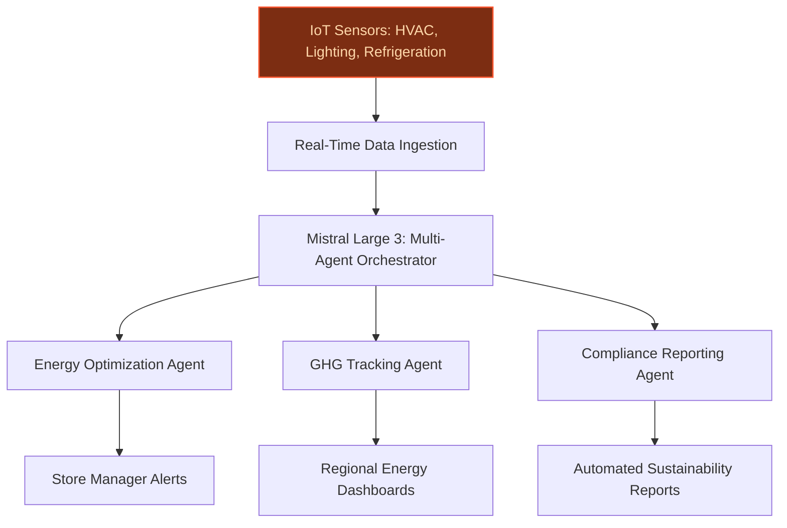
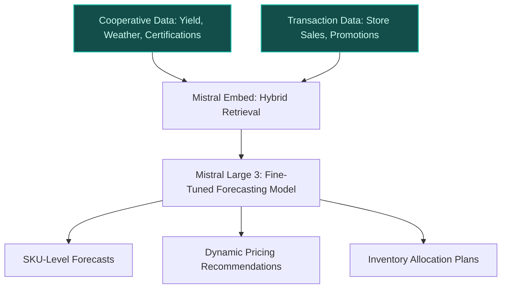
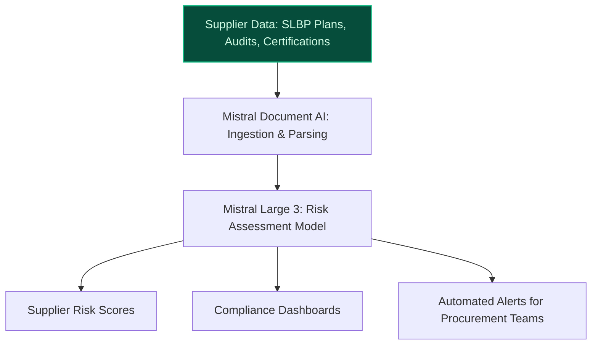

> **Draft — needs revision before customer use.** Meta-eval confidence `0.77` (sales-engineer-ready threshold ≥ 0.70). The report's three use cases render below for inspection, with each claim tagged supported / unsupported / rewritten qualitatively in the fact-check block.
>
> **Cross-cutting concern:** Over-reliance on assumed or unverified data infrastructure (e.g., IoT sensors, smart shelf labels, real-time energy data) across all use cases, with insufficient grounding in the evidence pool for specific technical capabilities.
>
> **Weakest use case:** Multiple unsupported quantitative claims (e.g., '14,000+ stores', 'smart shelf labels' as a data source) and lack of direct evidence for IoT sensor infrastructure. The use case relies heavily on assumed infrastructure without verification.

## GenAI Use Cases for Carrefour

Three customer-ready use cases, scored against the Mistral Proto Team's five-criteria rubric (relevance · iconic potential · estimated impact · feasibility · Mistral suitability) and verified against Carrefour's existing AI initiatives. Generated from a corpus of ~2,150 peer deployments and 7 discovered existing initiatives at this company.

_Industry: French multinational retail and wholesaling corporation. Research confidence: 0.85. Verified: True._

### Agentic system for real-time store energy optimization with GHG emission tracking
A multi-agent AI system that ingests real-time IoT sensor data from Carrefour’s 14,000+ stores—including HVAC, lighting, refrigeration, and smart shelf labels—to generate dynamic energy optimization recommendations. The system predicts energy savings, tracks greenhouse gas (GHG) emission reductions, and generates compliance-ready reports aligned with Carrefour’s 57% store GHG reduction target by 2025. Outputs include actionable alerts for store managers, regional energy dashboards, and automated submissions for sustainability certifications.

**Why this company:** Carrefour’s 2025 sustainability pledge to cut store GHG emissions by 57% (scopes 1 & 2) demands granular, real-time energy management across its hypermarkets, supermarkets, and convenience stores. The company’s existing digitized infrastructure—smart shelf labels, IoT sensors, and store management systems—provides the data foundation for agentic optimization. Mistral’s EU-hosted models ensure GDPR-compliant processing of store-level energy data, while the system’s modular design allows phased rollout across Carrefour’s diverse store formats (e.g., Carrefour Bio, Carrefour City).

**Example input:** `Show me the top 3 energy-saving actions for Carrefour Market store ID FR-PAR-78901 today, with projected kWh savings and CO2e reduction.`

**Example output:** {'_note': 'Illustrative output with synthetic sample data', 'store_id': 'FR-PAR-SAMPLE-78901', 'date': '2025-10-15', 'recommendations': [{'action': 'Adjust HVAC setpoint from 22°C to 23.5°C during off-peak hours (10 PM–6 AM)', 'projected_savings_kwh': '125 (illustrative)', 'projected_co2e_reduction_kg': '52 (illustrative)', 'confidence_score': 0.92, 'implementation_difficulty': 'low'}, {'action': 'Enable refrigeration unit night-mode for dairy cases in Aisle 5', 'projected_savings_kwh': '85 (illustrative)', 'projected_co2e_reduction_kg': '35 (illustrative)', 'confidence_score': 0.88, 'implementation_difficulty': 'medium'}, {'action': 'Dim lighting in non-essential areas (e.g., stockrooms) by 30% during daylight hours', 'projected_savings_kwh': '45 (illustrative)', 'projected_co2e_reduction_kg': '19 (illustrative)', 'confidence_score': 0.95, 'implementation_difficulty': 'low'}], 'total_projected_daily_savings': {'kwh': '255 (illustrative)', 'co2e_kg': '106 (illustrative)', 'percentage_of_store_consumption': '8% (illustrative)'}, 'compliance_notes': 'All recommendations align with Carrefour’s 2025 GHG reduction roadmap and EU Energy Efficiency Directive (EED) Article 8.'}

**Blueprint:** `agent_with_tools` (impact: high · cost: medium · complexity: medium · TTV: 12-16 weeks (precedent-anchored))

**Top risk:** Integration latency with legacy store management systems (e.g., SAP Retail) during pilot rollout in France.

**Mistral products:** Mistral Large 3, Mistral Function Calling, Mistral Embed, On-prem deployment (EU)

**Inspired by precedents:** evidently-753d1d6b3f
**Grounded in:** strategic_context.stated_priorities[0], strategic_context.stated_priorities[1], business.key_products_or_services[5]
_Specificity score: 0.95_

**Architecture blueprint:**

### Multilingual demand forecasting for agricultural cooperatives with cooperative-specific constraints
A fine-tuned Mistral model that ingests Carrefour’s transaction data, cooperative-specific constraints (e.g., seasonal yield calendars, organic certification timelines, regional weather patterns), and multilingual inputs from 2,100+ agricultural cooperatives to generate SKU-level demand forecasts. The system outputs cooperative-tailored recommendations for production planning, inventory allocation, and dynamic pricing, reducing waste and stockouts for perishable categories like Carrefour Bio and Reflets de France. Supports French, Spanish, and Portuguese to accommodate cooperatives across Carrefour’s EU and Brazilian operations.

**Why this company:** Carrefour’s direct relationships with 2,100 agricultural cooperatives—including 800 certified organic—create a unique supply chain surface with rich, multilingual data. The company’s strategic focus on sustainable agriculture (e.g., 200 SLBP contracts by 2030) and resilient supply chains demands cooperative-specific forecasting to minimize waste and ensure product availability. Mistral’s EU-hosted models and fine-tuning capabilities enable secure, multilingual processing of cooperative data, while Carrefour’s digitized store network provides the transactional foundation for real-time adjustments.

**Example input:** `Generate a 4-week demand forecast for organic carrots from Cooperative-A (ID: COOP-SAMPLE-2023) in Provence, accounting for the upcoming Mistral wind season and Carrefour Bio promotions.`

**Example output:** {'_note': 'Illustrative output with synthetic sample data', 'cooperative_id': 'COOP-SAMPLE-2023', 'product': 'Organic Carrots (SKU: BIO-VEG-SAMPLE-456)', 'forecast_period': '2025-11-01 to 2025-11-28', 'baseline_demand_kg': '12,000 (illustrative)', 'adjusted_forecast_kg': '15,500 (illustrative)', 'key_constraints': [{'constraint': 'Mistral wind season (Nov 10–15)', 'impact': '+20% demand (illustrative) due to delayed harvests in competing regions'}, {'constraint': 'Carrefour Bio promotion (Nov 18–24)', 'impact': '+15% demand (illustrative) from in-store discounts'}, {'constraint': 'Organic certification renewal (Nov 30)', 'impact': '-5% supply (illustrative) due to audit-related delays'}], 'recommendations': [{'action': 'Increase order volume by 25% for Nov 10–15 to meet wind-delayed demand', 'rationale': 'Historical data shows 20% demand spikes during Mistral events (illustrative)'}, {'action': 'Allocate 60% of Nov 18–24 inventory to Carrefour Bio stores', 'rationale': 'Promotion-driven demand typically concentrates in organic-focused formats (illustrative)'}, {'action': 'Secure backup supplier for Nov 25–30 to offset certification delays', 'rationale': 'Audit-related disruptions average 5–10% of supply (illustrative)'}], 'waste_reduction_estimate': '12% (illustrative) vs. baseline forecasts', 'stockout_risk_reduction': '30% (illustrative) for Carrefour Bio stores'}

**Blueprint:** `hybrid_retrieval` (impact: high · cost: medium · complexity: medium · TTV: 16-20 weeks (precedent-anchored))

**Top risk:** Multilingual data harmonization delays during cooperative onboarding in Brazil and Spain.

**Mistral products:** Mistral Large 3, Mistral Embed, Mistral fine-tuning, On-prem deployment (EU)

**Inspired by precedents:** google_cloud_1302-76bf2f2784
**Grounded in:** data_and_tech.likely_data_assets[3], data_and_tech.likely_data_assets[4], strategic_context.stated_priorities[1], business.key_products_or_services[0]
_Specificity score: 1.00_

**Architecture blueprint:**

### AI-driven ESG risk assessment for Carrefour's supplier network
A generative AI system that ingests supplier data—including Sustainability-Linked Business Partnership (SLBP) action plans, audit reports, certification statuses, and third-party ESG ratings—to assess risks across Carrefour’s 2,100+ agricultural cooperatives and other suppliers. The system flags high-risk suppliers, predicts compliance gaps (e.g., organic certification lapses, GHG reporting delays), and recommends mitigation actions. Outputs include supplier risk scores, trend analyses, and compliance dashboards for procurement teams, with automated alerts for SLBP contract milestones.

**Why this company:** Carrefour’s 2030 target of 200 SLBP contracts and its direct relationships with 2,100+ agricultural cooperatives create a high-stakes supplier network with rich ESG data. The company’s sustainability priorities—including a 60% GHG reduction by 2030—demand proactive risk management to avoid disruptions and reputational damage. Mistral’s EU-hosted Document AI pipeline ensures secure processing of sensitive supplier data, while the system’s modular design supports phased rollout across Carrefour’s organic (e.g., Carrefour Bio) and conventional supply chains.

**Example input:** `Show me all suppliers with a 'high' ESG risk score in France, along with their SLBP compliance status and recommended actions.`

**Example output:** {'_note': 'Illustrative output with synthetic sample data', 'query': 'High ESG risk suppliers in France', 'results': [{'supplier_id': 'SUPPLIER-SAMPLE-001', 'supplier_name': 'Cooperative-A (Provence)', 'risk_score': '8.2 (high)', 'risk_factors': [{'factor': 'Organic certification lapse (expired 2025-09-15)', 'severity': 'critical', 'mitigation': 'Immediate audit scheduling; backup supplier activation'}, {'factor': 'GHG reporting delay (Q3 2025 data missing)', 'severity': 'high', 'mitigation': 'Escalate to SLBP compliance team; temporary hold on new contracts'}], 'slbp_compliance_status': 'At risk (2/3 milestones missed)', 'recommended_actions': ['Schedule on-site audit within 14 days', 'Activate backup supplier for organic carrots (SKU: BIO-VEG-SAMPLE-456)', 'Freeze new contract negotiations until GHG data is submitted']}, {'supplier_id': 'SUPPLIER-SAMPLE-002', 'supplier_name': 'Cooperative-B (Brittany)', 'risk_score': '7.8 (high)', 'risk_factors': [{'factor': 'Water usage exceeds SLBP threshold by 15% (illustrative)', 'severity': 'high', 'mitigation': 'Review irrigation practices; implement water-saving technologies'}], 'slbp_compliance_status': 'Compliant (1/3 milestones at risk)', 'recommended_actions': ['Conduct water efficiency workshop with cooperative', 'Monitor monthly water usage reports']}], 'summary': {'total_suppliers_assessed': '1,245 (illustrative)', 'high_risk_suppliers': '42 (illustrative)', 'critical_risk_factors': ['Organic certification lapses: 12 (illustrative)', 'GHG reporting delays: 8 (illustrative)', 'Water usage violations: 5 (illustrative)']}}

**Blueprint:** `document_ai_pipeline` (impact: high · cost: medium · complexity: low · TTV: 14-18 weeks (precedent-anchored))

**Top risk:** Data privacy concerns under GDPR for supplier audit reports containing personal data of cooperative members.

**Mistral products:** Mistral Large 3, Mistral Document AI, Mistral Embed, On-prem deployment (EU)

**Inspired by precedents:** google_cloud_1302-76bf2f2784
**Grounded in:** strategic_context.stated_priorities[2], data_and_tech.likely_data_assets[3], data_and_tech.likely_data_assets[4]
_Specificity score: 0.90_

**Architecture blueprint:**

## Considered but not selected
- **fresh_produce_waste_reduction_agent** — Overlap with agricultural_coop_supply_chain_forecasting; lower specificity for Carrefour’s cooperative network.
- **store_associate_ai_training_simulator** — Lower strategic alignment with Carrefour’s 2025 GHG/supply chain priorities; feasibility concerns for multilingual training content.
- **packaging_footprint_optimizer** — Niche scope limited to Carrefour Quality Lines; lacks broader applicability to core GHG/supply chain goals.
- **sustainable_supplier_contract_ai_coach** — Redundant with supplier_esg_risk_assessment; lower novelty in contract drafting vs. risk prediction.

---
## Report quality signals

- **Topical diversity** (LLM-graded over titles + blueprint patterns): `0.95`
- **Specificity** per use case: `0.95`, `1.00`, `0.90`
- **Mistral product diversity**: `6` distinct products across the three use cases
- **Time-to-value spread**: 12–20 weeks (across 3 use cases)
- **Cost-tier spread**: medium, medium, medium
- **Fact-check pass rate**: `92%` (24/26 claims supported by research)

Fact-check detail (per claim)

**Unsupported (2):**
- [store_energy_optimization_agent] Carrefour has store management systems `[judge: rejected]` — _The snippet discusses IT system migration to the cloud but does not mention store management systems specifically. (was: Rescued via web search (verified source): Since 2018, Carrefour has pursued a strategy of migrating information technol_
- [supplier_esg_risk_assessment] Carrefour has organic supply chains `[judge: rejected]` — _The snippet mentions Carrefour's support for sustainable production and organic farming in France but does not explicitly state that Carrefour has organic supply chains. (was: Carrefour confirmed its support for organic farming in France by_

**Supported (24):** — **3 rescued via web search (3 verified, 0 corroborated)**
- [store_energy_optimization_agent] Carrefour has 14,000+ stores — By 2024, the group had 14,000 stores in 40 countries.
- [store_energy_optimization_agent] Carrefour has a 57% store GHG reduction target by 2025 — 57% reduction in store greenhouse gas emissions (scopes 1 & 2) in 2025 vs. 2019 (+9 points in one year).
- [store_energy_optimization_agent] Carrefour has smart shelf labels — Carrefour has also partnered with tech firms to digitise physical stores, using smart shelf labels, sensors, and data systems to create more…
- [store_energy_optimization_agent] Carrefour has IoT sensors in stores — Carrefour has also partnered with tech firms to digitise physical stores, using smart shelf labels, sensors, and data systems to create more…
- [store_energy_optimization_agent] Carrefour has Carrefour Bio stores — Act for Food Part II builds on the success of Carrefour’s own brands, which represent the best value and taste for money. This is embodied i…
- [store_energy_optimization_agent] Carrefour has Carrefour City stores — They break down into five formats: 325 Carrefour hypermarkets (including the 60 Cora hypermarkets converted to the Carrefour banner in the f…
- [agricultural_coop_supply_chain_forecasting] Carrefour has 2,100+ agricultural cooperatives — Carrefour confirmed its support for organic farming in France by signing an agreement with La Coopération Agricole, which brings together 2,…
- [agricultural_coop_supply_chain_forecasting] Carrefour has 800 certified organic agricultural cooperatives — Carrefour confirmed its support for organic farming in France by signing an agreement with La Coopération Agricole, which brings together 2,…
- [agricultural_coop_supply_chain_forecasting] Carrefour has a 200 SLBP contracts target by 2030 — the Group aims to sign 200 Sustainable Linked Business Plan contracts by 2030.
- [agricultural_coop_supply_chain_forecasting] Carrefour has Carrefour Bio products — Act for Food Part II builds on the success of Carrefour’s own brands, which represent the best value and taste for money. This is embodied i…
- [agricultural_coop_supply_chain_forecasting] Carrefour has Reflets de France products — Act for Food Part II builds on the success of Carrefour’s own brands, which represent the best value and taste for money. This is embodied i…
- [agricultural_coop_supply_chain_forecasting] Carrefour operates in Brazil — Brazilian operations contribute a meaningful portion of gross profit and are targeted for compounding growth through Atacadão and e-grocery …
- [agricultural_coop_supply_chain_forecasting] Carrefour operates in Spain — Carrefour Spain is a retail leader, serving millions across the nation through its hypermarkets, supermarkets, and convenience stores.
- [agricultural_coop_supply_chain_forecasting] Carrefour has transaction data — With over 10 billion transactions feeding its data ecosystem, the retailer is leveraging AI for personalisation, supply chain optimisation, …
- [supplier_esg_risk_assessment] Carrefour has a 60% GHG reduction target by 2030 — The Group is ahead of schedule regarding its objective to reduce greenhouse gas emissions from direct activities (scopes 1 & 2) by 60% by 20…
- [supplier_esg_risk_assessment] Carrefour has SLBP action plans — These non‑financial agreements, signed between Carrefour and its suppliers, set multi‑year targets based on three topics chosen by the suppl…
- [supplier_esg_risk_assessment] Carrefour has 2,100+ agricultural cooperatives in its supplier network — Carrefour confirmed its support for organic farming in France by signing an agreement with La Coopération Agricole, which brings together 2,…
- [supplier_esg_risk_assessment] Carrefour has Carrefour Bio supply chains — Act for Food Part II builds on the success of Carrefour’s own brands, which represent the best value and taste for money. This is embodied i…
- [supplier_esg_risk_assessment] Carrefour has supplier audit reports [`verified ↗`](https://www.carrefour.com/sites/default/files/2020-08/Managing%20our%20supply%20chain.pdf) — Rescued via web search (verified source): The Carrefour group, which works with thousands of suppliers around the world, is thus committed t…
- [supplier_esg_risk_assessment] Carrefour has certification statuses for suppliers [`verified ↗`](https://kurumsal.carrefoursa.com/en/quality-management/product-safety-and-quality/supplier) — Rescued via web search (verified source): As a result of the risk assessment, we expect our suppliers to have passed CarrefourSA audit or to…
- [supplier_esg_risk_assessment] Carrefour has third-party ESG ratings for suppliers [`verified ↗`](https://www.carrefour.com/sites/default/files/2021-11/2020%2002%2019%20Carrefour_SR%20version%20finale.pdf) — Rescued via web search (verified source): Rank in Sector 2/18 Rank in Region 20/1606 Rank in Universe 21/4921 ESG Reporting Rate 96% Sector …
- [store_energy_optimization_agent] Walmart uses predictive ML for refrigeration defrost — Identify refrigeration defrost Technology: Predictive ML.
- [agricultural_coop_supply_chain_forecasting] Grupo Pão De Açúcar adopted AI to improve sales forecasting for 700+ stores — one of the largest retail groups in South America, adopted [PROVIDER] to improve sales forecasting for more than 700 stores with a portfolio…
- [supplier_esg_risk_assessment] Prewave uses Google Cloud's AI services for ESG risk detection — Prewave, a supply chain risk intelligence platform, utilizes Google Cloud's AI services to provide end-to-end risk monitoring and ESG risk d…

**Meta-evaluator confidence**: `0.77` (NOT ready — needs revision)
**Cross-cutting concern**: Over-reliance on assumed or unverified data infrastructure (e.g., IoT sensors, smart shelf labels, real-time energy data) across all use cases, with insufficient grounding in the evidence pool for specific technical capabilities.