# Pipeline blueprint (architecture)

Static view of the pipeline regardless of run timing — shows agents,
models, and gates. The chronological execution log follows below.

```mermaid
flowchart TD
    Start([User: company name]) --> R
    R["<b>1. Research</b><br/>parallel: Wikipedia · Tavily news ·<br/>existing initiatives · live verification<br/><i>mistral-medium</i> synthesis"]
    R --> G["<b>1b. Gap-fill</b><br/>identify missing fields →<br/><i>mistral-small</i> generates queries →<br/>Tavily search per field →<br/><i>mistral-small</i> per-field extraction"]
    G --> Conf{Confidence ≥ 0.5<br/>OR verified<br/>OR ≥ 1 existing initiative?}
    Conf -->|no| Refuse([Refusal])
    Conf -->|yes| Ret
    Ret["<b>2. Retrieve</b><br/><i>mistral-embed</i> on company query →<br/>cosine top-K + industry/depth filter +<br/>MMR diversification"]
    Ret --> Gen["<b>3. Generate 12 candidates</b><br/><i>mistral-medium</i> with web_search tool<br/>(Tavily + deep-read) — fact citations<br/>flow into the EvidenceLedger"]
    Gen --> Score["<b>4. Score</b><br/>self-consistency: 2 parallel passes<br/><i>mistral-small</i> @ T=0.2 and T=0.4 →<br/>aggregate weighted scores"]
    Score --> Verify["<b>5. Per-candidate verify</b><br/>top-3: Tavily search + deep-read +<br/><i>mistral-small</i> verdict (pass /<br/>partial / confirmed_existing)"]
    Verify --> Enrich["<b>6. Enrich</b><br/><i>mistral-large</i> drafts customer-facing<br/>prose for 3 use cases (or<br/><i>mistral-medium</i> on fast tier)"]
    Enrich --> NumScrub["<b>6a. Numeric scrub</b><br/>flag any number not in cited content"]
    NumScrub --> Polish["<b>6b. Polish</b><br/><i>mistral-small</i> per use case (parallel):<br/>convert markers→qualitative,<br/>(ev-XXX)→[title](url)"]
    Polish --> Attr["<b>6c. Attribution check</b><br/><i>mistral-small</i> per use case (parallel):<br/>fix corpus-ID ↔ company mismatches"]
    Attr --> Meta["<b>7. Meta-evaluation</b><br/><i>mistral-medium</i> reviews report against<br/>cited precedents + ledger entries:<br/>strict claim verification"]
    Meta --> RegenQ{confidence < 0.6<br/>AND not fast tier?}
    RegenQ -->|yes| Regen["<b>7b. Targeted regen</b><br/><i>mistral-large</i> re-enriches just the<br/>weakest use case with the next-best<br/>near-miss; re-runs meta-eval"]
    RegenQ -->|no| QS
    Regen --> QS
    QS["<b>Quality signals</b><br/>LLM-graded diversity + specificity,<br/>fact-check pass rate, TTV/cost spread"]
    QS --> Render([Markdown report + trace])

    classDef agent fill:#fef3c7,stroke:#f59e0b
    classDef gate fill:#dbeafe,stroke:#3b82f6
    classDef io fill:#dcfce7,stroke:#16a34a
    class R,G,Ret,Gen,Score,Verify,Enrich,NumScrub,Polish,Attr,Meta,Regen,QS agent
    class Conf,RegenQ gate
    class Start,Refuse,Render io
```

## Execution trace — Carrefour

Started: `2026-05-09T23:06:30.928629+00:00`. Total wall time: `200.2s` across `51` recorded actions.

### Per-step time totals

| Step | Calls | Total time | Avg time |
|---|---:|---:|---:|
| `research` | 1 | 8.09s | 8087ms |
| `gap_fill` | 4 | 4.62s | 1155ms |
| `retrieve` | 2 | 0.54s | 270ms |
| `generate` | 2 | 34.85s | 17427ms |
| `generate.web_search` | 2 | 5.23s | 2614ms |
| `score` | 2 | 40.32s | 20158ms |
| `verify` | 6 | 22.37s | 3729ms |
| `enrich` | 1 | 76.90s | 76903ms |
| `meta_eval` | 1 | 14.91s | 14905ms |
| `web_verify` | 1 | 2.13s | 2128ms |
| `source_judge` | 27 | 36.89s | 1366ms |
| `quality_signals` | 2 | 4.01s | 2004ms |

### Chronological event log

- `23:06:34.012` **[research]** `mistral-medium-2604.chat.complete` — 8087ms
   - inputs: synthesize CompanyContext for Carrefour | depth=medium
   - outputs: industry='French multinational retail and wholesaling corporation' verified=True conf=0.75
- `23:06:42.101` **[gap_fill]** `mistral-small-2603.chat.complete` — 1067ms
   - inputs: generate gap queries | fields=['business_model', 'products', 'data_assets', 'priorities']
   - outputs: queries=4
- `23:06:48.068` **[gap_fill]** `mistral-small-2603.chat.complete` — 1760ms
   - inputs: layer-2 extract field=priorities
   - outputs: items=14
- `23:06:48.073` **[gap_fill]** `mistral-small-2603.chat.complete` — 862ms
   - inputs: layer-2 extract field=data_assets
   - outputs: items=6
- `23:06:48.076` **[gap_fill]** `mistral-small-2603.chat.complete` — 931ms
   - inputs: layer-2 extract field=products
   - outputs: items=16
- `23:06:49.830` **[retrieve]** `mistral-embed.embeddings.create` — 207ms
   - inputs: company_query | industries='French multinational retail and wholesaling corporation'
   - outputs: embedded 1024-dim query vector
- `23:06:50.037` **[retrieve]** `precedent_corpus.cosine_topk` — 333ms
   - inputs: k=8 min_depth=0.4 target='Carrefour'
   - outputs: retrieved 8 | mmr=True | top_sim=0.796
- `23:06:50.795` **[generate]** `mistral-medium-2604.chat.complete` — 2296ms
   - inputs: iteration=0 tool_calls_used=0/2 tools=on
   - outputs: tool_calls=4 | content_chars=0
- `23:06:53.113` **[generate.web_search]** `tavily.search` — 2849ms
   - inputs: query='Carrefour 2024 sustainability goals SLBP contracts agricultural cooperatives'
   - outputs: 2 raw results
- `23:06:55.985` **[generate.web_search]** `tavily.search` — 2379ms
   - inputs: query='Carrefour loyalty program Le Club Carrefour data scale personalization'
   - outputs: 2 raw results
- `23:06:59.965` **[generate]** `mistral-medium-2604.chat.complete` — 32558ms
   - inputs: iteration=1 tool_calls_used=2/2 tools=off
   - outputs: tool_calls=0 | content_chars=23854
- `23:07:33.431` **[score]** `mistral-small-2603.chat.complete` — 23052ms
   - inputs: self-consistency pass T=0.2
   - outputs: scored 12 candidates
- `23:07:33.433` **[score]** `mistral-small-2603.chat.complete` — 17263ms
   - inputs: self-consistency pass T=0.4
   - outputs: scored 12 candidates
- `23:07:56.520` **[verify]** `tavily.search` — 2509ms
   - inputs: candidate=sustainable_supplier_contract_ai_coach | query='Carrefour AI-powered coach for Sustainability-Linked Busines'
   - outputs: 4 results
- `23:07:56.521` **[verify]** `tavily.search` — 3389ms
   - inputs: candidate=agricultural_coop_supply_chain_forecasting | query='Carrefour Multilingual demand forecasting for agricultural c'
   - outputs: 4 results
- `23:07:56.521` **[verify]** `tavily.search` — 3023ms
   - inputs: candidate=supplier_esg_risk_assessment | query="Carrefour AI-driven ESG risk assessment for Carrefour's supp"
   - outputs: 4 results
- `23:07:59.600` **[verify]** `mistral-small-2603.chat.complete` — 4489ms
   - inputs: verdict for sustainable_supplier_contract_ai_coach
   - outputs: verdict='pass'
- `23:07:59.768` **[verify]** `mistral-small-2603.chat.complete` — 5017ms
   - inputs: verdict for supplier_esg_risk_assessment
   - outputs: verdict='pass'
- `23:08:00.304` **[verify]** `mistral-small-2603.chat.complete` — 3949ms
   - inputs: verdict for agricultural_coop_supply_chain_forecasting
   - outputs: verdict='pass'
- `23:08:04.788` **[enrich]** `mistral-large-2512.chat.complete` — 76903ms
   - inputs: tier=standard top_3=['store_energy_optimization_agent', 'agricultural_coop_supply_chain_forecasting', 'supplier_esg_risk_assessment']
   - outputs: enriched 3 use cases
- `23:09:21.716` **[meta_eval]** `mistral-medium-2604.chat.complete` — 14905ms
   - inputs: reviewing 3 use cases
   - outputs: review + claims
- `23:09:36.640` **[web_verify]** `tavily.search.rescue_unsupported_claims` — 2128ms
   - inputs: company='Carrefour' unsupported=4 budget=12
   - outputs: rescued: verified=4 corroborated=0 of 4 attempted
- `23:09:38.772` **[source_judge]** `mistral-small-2603.judge_claim_sources` — 8012ms
   - inputs: pairs=26
   - outputs: judged 26 pairs
- `23:09:38.772` **[source_judge]** `mistral-small-2603.chat.complete` — 619ms
   - inputs: claim='Carrefour has 14,000+ stores'
   - outputs: verdict=supported
- `23:09:38.777` **[source_judge]** `mistral-small-2603.chat.complete` — 820ms
   - inputs: claim='Carrefour has a 57% store GHG reduction target by 2025'
   - outputs: verdict=supported
- `23:09:38.780` **[source_judge]** `mistral-small-2603.chat.complete` — 834ms
   - inputs: claim='Carrefour has smart shelf labels'
   - outputs: verdict=supported
- `23:09:38.783` **[source_judge]** `mistral-small-2603.chat.complete` — 836ms
   - inputs: claim='Carrefour has IoT sensors in stores'
   - outputs: verdict=supported
- `23:09:38.785` **[source_judge]** `mistral-small-2603.chat.complete` — 818ms
   - inputs: claim='Carrefour has store management systems'
   - outputs: verdict=unsupported
- `23:09:38.789` **[source_judge]** `mistral-small-2603.chat.complete` — 836ms
   - inputs: claim='Carrefour has Carrefour Bio stores'
   - outputs: verdict=supported
- `23:09:38.793` **[source_judge]** `mistral-small-2603.chat.complete` — 810ms
   - inputs: claim='Carrefour has Carrefour City stores'
   - outputs: verdict=supported
- `23:09:38.795` **[source_judge]** `mistral-small-2603.chat.complete` — 835ms
   - inputs: claim='Carrefour has 2,100+ agricultural cooperatives'
   - outputs: verdict=supported
- `23:09:39.391` **[source_judge]** `mistral-small-2603.chat.complete` — 606ms
   - inputs: claim='Carrefour has 800 certified organic agricultural cooperative'
   - outputs: verdict=supported
- `23:09:39.598` **[source_judge]** `mistral-small-2603.chat.complete` — 962ms
   - inputs: claim='Carrefour has a 200 SLBP contracts target by 2030'
   - outputs: verdict=supported
- `23:09:39.603` **[source_judge]** `mistral-small-2603.chat.complete` — 706ms
   - inputs: claim='Carrefour has Carrefour Bio products'
   - outputs: verdict=supported
- `23:09:39.607` **[source_judge]** `mistral-small-2603.chat.complete` — 629ms
   - inputs: claim='Carrefour has Reflets de France products'
   - outputs: verdict=supported
- `23:09:39.615` **[source_judge]** `mistral-small-2603.chat.complete` — 612ms
   - inputs: claim='Carrefour operates in Brazil'
   - outputs: verdict=supported
- `23:09:39.620` **[source_judge]** `mistral-small-2603.chat.complete` — 740ms
   - inputs: claim='Carrefour operates in Spain'
   - outputs: verdict=supported
- `23:09:39.626` **[source_judge]** `mistral-small-2603.chat.complete` — 661ms
   - inputs: claim='Carrefour has transaction data'
   - outputs: verdict=supported
- `23:09:39.631` **[source_judge]** `mistral-small-2603.chat.complete` — 749ms
   - inputs: claim='Carrefour has a 60% GHG reduction target by 2030'
   - outputs: verdict=supported
- `23:09:39.997` **[source_judge]** `mistral-small-2603.chat.complete` — 743ms
   - inputs: claim='Carrefour has SLBP action plans'
   - outputs: verdict=supported
- `23:09:40.227` **[source_judge]** `mistral-small-2603.chat.complete` — 704ms
   - inputs: claim='Carrefour has 2,100+ agricultural cooperatives in its suppli'
   - outputs: verdict=supported
- `23:09:40.237` **[source_judge]** `mistral-small-2603.chat.complete` — 730ms
   - inputs: claim='Carrefour has organic supply chains'
   - outputs: verdict=unsupported
- `23:09:40.287` **[source_judge]** `mistral-small-2603.chat.complete` — 682ms
   - inputs: claim='Carrefour has Carrefour Bio supply chains'
   - outputs: verdict=supported
- `23:09:40.310` **[source_judge]** `mistral-small-2603.chat.complete` — 581ms
   - inputs: claim='Carrefour has supplier audit reports'
   - outputs: verdict=supported
- `23:09:40.360` **[source_judge]** `mistral-small-2603.chat.complete` — 716ms
   - inputs: claim='Carrefour has certification statuses for suppliers'
   - outputs: verdict=supported
- `23:09:40.380` **[source_judge]** `mistral-small-2603.chat.complete` — 660ms
   - inputs: claim='Carrefour has third-party ESG ratings for suppliers'
   - outputs: verdict=supported
- `23:09:40.560` **[source_judge]** `mistral-small-2603.chat.complete` — 555ms
   - inputs: claim='Walmart uses predictive ML for refrigeration defrost'
   - outputs: verdict=supported
- `23:09:40.741` **[source_judge]** `mistral-small-2603.chat.complete` — 5537ms
   - inputs: claim='Grupo Pão De Açúcar adopted AI to improve sales forecasting '
   - outputs: verdict=supported
- `23:09:40.891` **[source_judge]** `mistral-small-2603.chat.complete` — 5892ms
   - inputs: claim="Prewave uses Google Cloud's AI services for ESG risk detecti"
   - outputs: verdict=supported
- `23:09:47.078` **[quality_signals]** `mistral-small-2603.chat.complete` — 2659ms
   - inputs: specificity grade (3 use cases)
   - outputs: scored 3 use cases
- `23:09:49.737` **[quality_signals]** `mistral-small-2603.chat.complete` — 1348ms
   - inputs: diversity grade
   - outputs: diversity=0.95

## Mermaid sequence diagram (execution)

```mermaid
sequenceDiagram
    autonumber
    participant pipeline as pipeline
    participant mistral_medium_2604 as mistral-medium-2604
    participant mistral_small_2603 as mistral-small-2603
    participant mistral_embed as mistral-embed
    participant precedent_corpus as precedent_corpus
    participant tavily as tavily
    participant mistral_large_2512 as mistral-large-2512
    participant tavily_search as tavily.search
    pipeline->>mistral_medium_2604: research: chat.complete (8087ms)
    mistral_medium_2604-->>pipeline: industry='French multinational retail and wholesaling corpor
    pipeline->>mistral_small_2603: gap_fill: chat.complete (1067ms)
    mistral_small_2603-->>pipeline: queries=4
    pipeline->>mistral_small_2603: gap_fill: chat.complete (1760ms)
    mistral_small_2603-->>pipeline: items=14
    pipeline->>mistral_small_2603: gap_fill: chat.complete (862ms)
    mistral_small_2603-->>pipeline: items=6
    pipeline->>mistral_small_2603: gap_fill: chat.complete (931ms)
    mistral_small_2603-->>pipeline: items=16
    pipeline->>mistral_embed: retrieve: embeddings.create (207ms)
    mistral_embed-->>pipeline: embedded 1024-dim query vector
    pipeline->>precedent_corpus: retrieve: cosine_topk (333ms)
    precedent_corpus-->>pipeline: retrieved 8 | mmr=True | top_sim=0.796
    pipeline->>mistral_medium_2604: generate: chat.complete (2296ms)
    mistral_medium_2604-->>pipeline: tool_calls=4 | content_chars=0
    pipeline->>tavily: generate.web_search: search (2849ms)
    tavily-->>pipeline: 2 raw results
    pipeline->>tavily: generate.web_search: search (2379ms)
    tavily-->>pipeline: 2 raw results
    pipeline->>mistral_medium_2604: generate: chat.complete (32558ms)
    mistral_medium_2604-->>pipeline: tool_calls=0 | content_chars=23854
    pipeline->>mistral_small_2603: score: chat.complete (23052ms)
    mistral_small_2603-->>pipeline: scored 12 candidates
    pipeline->>mistral_small_2603: score: chat.complete (17263ms)
    mistral_small_2603-->>pipeline: scored 12 candidates
    pipeline->>tavily: verify: search (2509ms)
    tavily-->>pipeline: 4 results
    pipeline->>tavily: verify: search (3389ms)
    tavily-->>pipeline: 4 results
    pipeline->>tavily: verify: search (3023ms)
    tavily-->>pipeline: 4 results
    pipeline->>mistral_small_2603: verify: chat.complete (4489ms)
    mistral_small_2603-->>pipeline: verdict='pass'
    pipeline->>mistral_small_2603: verify: chat.complete (5017ms)
    mistral_small_2603-->>pipeline: verdict='pass'
    pipeline->>mistral_small_2603: verify: chat.complete (3949ms)
    mistral_small_2603-->>pipeline: verdict='pass'
    pipeline->>mistral_large_2512: enrich: chat.complete (76903ms)
    mistral_large_2512-->>pipeline: enriched 3 use cases
    pipeline->>mistral_medium_2604: meta_eval: chat.complete (14905ms)
    mistral_medium_2604-->>pipeline: review + claims
    pipeline->>tavily_search: web_verify: rescue_unsupported_claims (2128ms)
    tavily_search-->>pipeline: rescued: verified=4 corroborated=0 of 4 attempted
    pipeline->>mistral_small_2603: source_judge: judge_claim_sources (8012ms)
    mistral_small_2603-->>pipeline: judged 26 pairs
    pipeline->>mistral_small_2603: source_judge: chat.complete (619ms)
    mistral_small_2603-->>pipeline: verdict=supported
    pipeline->>mistral_small_2603: source_judge: chat.complete (820ms)
    mistral_small_2603-->>pipeline: verdict=supported
    pipeline->>mistral_small_2603: source_judge: chat.complete (834ms)
    mistral_small_2603-->>pipeline: verdict=supported
    pipeline->>mistral_small_2603: source_judge: chat.complete (836ms)
    mistral_small_2603-->>pipeline: verdict=supported
    pipeline->>mistral_small_2603: source_judge: chat.complete (818ms)
    mistral_small_2603-->>pipeline: verdict=unsupported
    pipeline->>mistral_small_2603: source_judge: chat.complete (836ms)
    mistral_small_2603-->>pipeline: verdict=supported
    pipeline->>mistral_small_2603: source_judge: chat.complete (810ms)
    mistral_small_2603-->>pipeline: verdict=supported
    pipeline->>mistral_small_2603: source_judge: chat.complete (835ms)
    mistral_small_2603-->>pipeline: verdict=supported
    pipeline->>mistral_small_2603: source_judge: chat.complete (606ms)
    mistral_small_2603-->>pipeline: verdict=supported
    pipeline->>mistral_small_2603: source_judge: chat.complete (962ms)
    mistral_small_2603-->>pipeline: verdict=supported
    pipeline->>mistral_small_2603: source_judge: chat.complete (706ms)
    mistral_small_2603-->>pipeline: verdict=supported
    pipeline->>mistral_small_2603: source_judge: chat.complete (629ms)
    mistral_small_2603-->>pipeline: verdict=supported
    pipeline->>mistral_small_2603: source_judge: chat.complete (612ms)
    mistral_small_2603-->>pipeline: verdict=supported
    pipeline->>mistral_small_2603: source_judge: chat.complete (740ms)
    mistral_small_2603-->>pipeline: verdict=supported
    pipeline->>mistral_small_2603: source_judge: chat.complete (661ms)
    mistral_small_2603-->>pipeline: verdict=supported
    pipeline->>mistral_small_2603: source_judge: chat.complete (749ms)
    mistral_small_2603-->>pipeline: verdict=supported
    pipeline->>mistral_small_2603: source_judge: chat.complete (743ms)
    mistral_small_2603-->>pipeline: verdict=supported
    pipeline->>mistral_small_2603: source_judge: chat.complete (704ms)
    mistral_small_2603-->>pipeline: verdict=supported
    pipeline->>mistral_small_2603: source_judge: chat.complete (730ms)
    mistral_small_2603-->>pipeline: verdict=unsupported
    pipeline->>mistral_small_2603: source_judge: chat.complete (682ms)
    mistral_small_2603-->>pipeline: verdict=supported
    pipeline->>mistral_small_2603: source_judge: chat.complete (581ms)
    mistral_small_2603-->>pipeline: verdict=supported
    pipeline->>mistral_small_2603: source_judge: chat.complete (716ms)
    mistral_small_2603-->>pipeline: verdict=supported
    pipeline->>mistral_small_2603: source_judge: chat.complete (660ms)
    mistral_small_2603-->>pipeline: verdict=supported
    pipeline->>mistral_small_2603: source_judge: chat.complete (555ms)
    mistral_small_2603-->>pipeline: verdict=supported
    pipeline->>mistral_small_2603: source_judge: chat.complete (5537ms)
    mistral_small_2603-->>pipeline: verdict=supported
    pipeline->>mistral_small_2603: source_judge: chat.complete (5892ms)
    mistral_small_2603-->>pipeline: verdict=supported
    pipeline->>mistral_small_2603: quality_signals: chat.complete (2659ms)
    mistral_small_2603-->>pipeline: scored 3 use cases
    pipeline->>mistral_small_2603: quality_signals: chat.complete (1348ms)
    mistral_small_2603-->>pipeline: diversity=0.95
```

