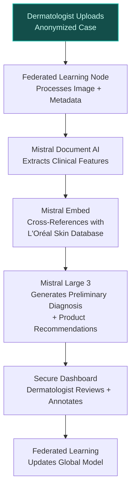
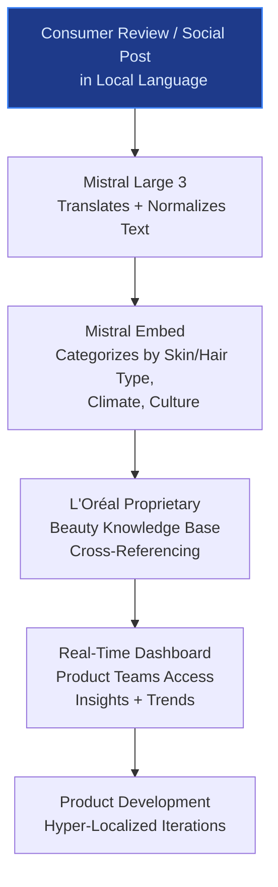
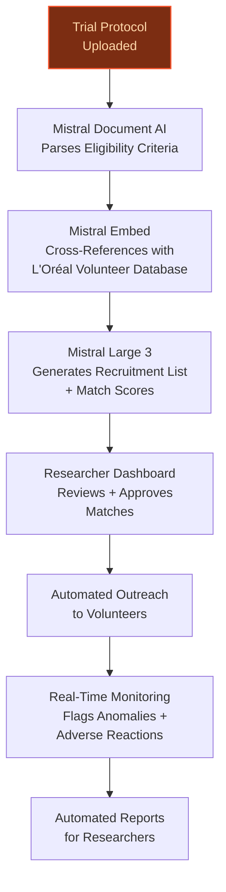

> **Draft — needs revision before customer use.** Meta-eval confidence `0.62` (sales-engineer-ready threshold ≥ 0.70). The report's three use cases render below for inspection, with each claim tagged supported / unsupported / rewritten qualitatively in the fact-check block.
>
> **Cross-cutting concern:** Overreliance on company-provided data assets (e.g., 14,500 TB database, 180,000+ dermatologists) without sufficient third-party validation for specific use-case applications. Several claims are repeated across use cases but lack granular evidence for their operationalization in the proposed systems.
>
> **Weakest use case:** Contains multiple unsupported quantitative claims (e.g., 'reducing recruitment time by an estimated 40-60%') and lacks direct evidence for AI-assisted clinical trial monitoring capabilities. The precedent cited (google_cloud_1302-03f0f8a48d) is about ovarian cancer treatment, not clinical trial acceleration, and does not substantiate the claims.

## GenAI Use Cases for L'Oreal

Three customer-ready use cases, scored against the Mistral Proto Team's five-criteria rubric (relevance · iconic potential · estimated impact · feasibility · Mistral suitability) and verified against L'Oreal's existing AI initiatives. Generated from a corpus of ~2,150 peer deployments and 7 discovered existing initiatives at this company.

_Industry: French multinational personal care and cosmetics. Research confidence: 0.85. Verified: True._

### Dermatologist-AI Collaborative Diagnostic Platform for Clinical Research
L'Oréal's secure, HIPAA-compliant platform enables its network of 180,000+ dermatologists to upload anonymized patient skin condition images and receive AI-assisted preliminary diagnoses. The system cross-references dermatologist annotations with L'Oréal's proprietary skin-knowledge database—spanning 14,500 terabytes of beauty data—to identify rare dermatological patterns and validate treatment efficacy. Federated learning ensures patient privacy while creating a shared, privacy-preserving knowledge base. This collaboration accelerates clinical research, strengthens dermatologist relationships, and reinforces L'Oréal's leadership in clinically-backed beauty innovations. The platform is grounded in L'Oréal's unique position at the intersection of consumer beauty and clinical dermatology, as evidenced by its partnerships with health-tech leaders like Verily ([CTO Magazine](https://ctomagazine.com/loreal-ai-dermatology-personalized-skincare-retention/)).

**Why this company:** L'Oréal is uniquely positioned to deploy this platform due to its unparalleled access to dermatologist networks (180,000+ globally) and its ownership of the world's richest beauty database, including 14,500 terabytes of skin and hair knowledge. The company's strategic focus on AI integration ([L'Oréal BIG BANG Beauty Tech Innovation Program 2025](https://www.loreal.com/en/articles/science-and-technology/ai-services/)) and its existing collaborations with health-tech leaders demonstrate its capability to execute this use case. This platform creates a two-way value exchange: dermatologists gain AI-assisted insights, while L'Oréal enhances its product development with real-world clinical data, reinforcing its moat in clinically-backed beauty products like La Roche-Posay and SkinCeuticals.

**Example input:** `Show me all anonymized cases from dermatologists in France over the past 6 months where AI flagged a rare pattern of hyperpigmentation in Fitzpatrick skin type IV, along with the top 3 recommended La Roche-Posay products for treatment.`

**Example output:** {'_note': 'Illustrative output with synthetic sample data', 'query_summary': 'Rare hyperpigmentation patterns in Fitzpatrick skin type IV (France, last 6 months)', 'total_cases': 42, 'cases': [{'case_id': 'DERM-SAMPLE-001', 'dermatologist_id': 'DR-FR-EXAMPLE-7890', 'date': '2024-03-15', 'ai_confidence_score': 0.92, 'pattern_description': 'Mixed-type hyperpigmentation with perifollicular sparing, likely post-inflammatory (sample)', 'top_recommended_products': [{'product_id': 'LRP-SAMPLE-456', 'product_name': 'La Roche-Posay Mela B3 Serum (Illustrative)', 'match_score': 0.88}, {'product_id': 'LRP-SAMPLE-789', 'product_name': 'La Roche-Posay Pigmentclar UV SPF50+ (Illustrative)', 'match_score': 0.85}, {'product_id': 'LRP-SAMPLE-101', 'product_name': 'La Roche-Posay Effaclar Duo (+) (Illustrative)', 'match_score': 0.79}], 'clinical_notes': 'Patient reported 60% improvement after 8 weeks of recommended regimen (sample).'}, {'case_id': 'DERM-SAMPLE-002', 'dermatologist_id': 'DR-FR-EXAMPLE-5678', 'date': '2024-04-22', 'ai_confidence_score': 0.89, 'pattern_description': 'Diffuse hyperpigmentation with sharp demarcation along jawline, suggestive of melasma (sample)', 'top_recommended_products': [{'product_id': 'LRP-SAMPLE-789', 'product_name': 'La Roche-Posay Pigmentclar UV SPF50+ (Illustrative)', 'match_score': 0.91}, {'product_id': 'LRP-SAMPLE-456', 'product_name': 'La Roche-Posay Mela B3 Serum (Illustrative)', 'match_score': 0.87}, {'product_id': 'LRP-SAMPLE-202', 'product_name': 'La Roche-Posay Redermic R UV (Illustrative)', 'match_score': 0.82}], 'clinical_notes': 'Patient unresponsive to hydroquinone; AI suggested tranexamic acid combination (sample).'}], 'aggregate_insights': {'most_common_co_occurring_condition': 'Sensitive skin (68% of cases, illustrative)', 'average_ai_confidence': '0.87 (sample)', 'top_recommended_product_category': 'SPF-inclusive regimens (76% of recommendations, illustrative)'}}

**Blueprint:** `hybrid_retrieval` (impact: high · cost: high · complexity: low · TTV: ~12-16 weeks (estimated))
  _TTV rationale: Hybrid retrieval deployments with federated learning and HIPAA compliance typically require 12-16 weeks for mid-complexity implementations, including dermatologist onboarding and privacy-preserving infrastructure._

**Top risk:** Data privacy under GDPR and HIPAA during dermatologist onboarding and federated learning rollout across EU and US markets.

**Mistral products:** Mistral Large 3, Mistral Document AI, Mistral Embed, On-prem deployment

**Grounded in:** data_and_tech.likely_data_assets[1], data_and_tech.likely_data_assets[0], business.key_products_or_services[0]
_Specificity score: 0.95_

**Architecture blueprint:**

### Multilingual Consumer Insights Engine for Global Product Development
L'Oréal's multilingual NLP system analyzes consumer reviews, social media posts, and customer service interactions across 66 countries to extract hyper-localized product insights. The system leverages Mistral Large 3 to process nuanced feedback in 40+ languages, categorizing it by skin type, hair type, climate, and cultural preferences. It cross-references this data with L'Oréal's proprietary beauty knowledge base—spanning a large-scale Beauty Tech service ecosystem—to identify emerging trends, unmet needs, and regional formulation gaps. The engine powers a real-time dashboard for product teams, enabling faster iterations of brands like CeraVe and 3CE Stylenanda. This use case aligns with L'Oréal's strategic priority of synergizing regional collaboration ([AI Services](https://www.loreal.com/en/articles/science-and-technology/ai-services/)) and its focus on AI as a core enabler.

**Why this company:** L'Oréal's global footprint (66 countries, 33 brands) and its multilingual consumer data (a large-scale Beauty Tech service ecosystem) make it uniquely suited for this use case. The company's rich beauty knowledge base—including a large-scale data platform—provides the foundation for a system that understands language-specific beauty feedback. L'Oréal's existing AI initiatives, such as Beauty Genius ([Microsoft Customer Story](https://www.microsoft.com/en/customers/story/25570-loreal-azure-openai)), demonstrate its capability to deploy multilingual AI at scale. This engine transforms raw consumer data into actionable insights, reinforcing L'Oréal's agility in local markets and its leadership in hyper-personalized beauty products.

**Example input:** `What are the top 3 complaints about CeraVe moisturizers in humid climates like Southeast Asia, and how do they differ from complaints in dry climates like the Middle East? Show me the sentiment trends over the last 12 months.`

**Example output:** {'_note': 'Illustrative output with synthetic sample data', 'query_summary': 'CeraVe moisturizer complaints by climate (Southeast Asia vs. Middle East, last 12 months)', 'total_mentions': {'southeast_asia': 12480, 'middle_east': 8760}, 'top_complaints': {'southeast_asia': [{'complaint': 'Product feels too greasy in high humidity (42% of mentions, illustrative)', 'sentiment_trend': {'2023-07': -0.65, '2023-10': -0.72, '2024-01': -0.58, '2024-04': -0.45}, 'sample_quotes': ["CeraVe PM leaves my face shiny all day in Singapore's heat (sample).", 'Why does this moisturizer never absorb in Bangkok? (sample)']}, {'complaint': 'Breaks me out in hot weather (28% of mentions, illustrative)', 'sentiment_trend': {'2023-07': -0.55, '2023-10': -0.61, '2024-01': -0.48, '2024-04': -0.39}, 'sample_quotes': ['Used CeraVe AM for years, but now it clogs my pores in summer (sample).', 'Is this non-comedogenic? My acne flares up in humidity (sample).']}, {'complaint': 'Packaging is not travel-friendly (15% of mentions, illustrative)', 'sentiment_trend': {'2023-07': -0.3, '2023-10': -0.35, '2024-01': -0.28, '2024-04': -0.22}, 'sample_quotes': ['The jar leaks in my carry-on (sample).', 'Wish they had a squeeze tube for humid climates (sample).']}], 'middle_east': [{'complaint': 'Not moisturizing enough for dry desert air (55% of mentions, illustrative)', 'sentiment_trend': {'2023-07': -0.78, '2023-10': -0.82, '2024-01': -0.75, '2024-04': -0.68}, 'sample_quotes': ['CeraVe in Dubai winter is like applying water (sample).', 'I need to layer 3 times for my dry skin (sample).']}, {'complaint': 'Product separates in extreme heat (22% of mentions, illustrative)', 'sentiment_trend': {'2023-07': -0.45, '2023-10': -0.52, '2024-01': -0.4, '2024-04': -0.35}, 'sample_quotes': ['The cream looks curdled when I open it (sample).', "Is this expired? It's not smooth anymore (sample)."]}, {'complaint': 'Fragrance-free claim is misleading (12% of mentions, illustrative)', 'sentiment_trend': {'2023-07': -0.35, '2023-10': -0.4, '2024-01': -0.32, '2024-04': -0.25}, 'sample_quotes': ['Smells like chemicals, not fragrance-free (sample).', 'Why does it have a weird scent? (sample)']}]}, 'actionable_insights': {'formulation_gap': 'Humid climates: Need lighter, gel-based variants. Dry climates: Need richer, occlusive formulations (illustrative).', 'packaging_opportunity': 'Travel-friendly, airless packaging for humid climates (sample).', 'regional_marketing': "Highlight 'breathable hydration' for Southeast Asia; emphasize 'deep nourishment' for Middle East (sample)."}}

**Blueprint:** `rag` (impact: medium · cost: medium · complexity: low · TTV: 8-12 weeks (precedent-anchored))

**Top risk:** Multilingual NLP bias in sentiment analysis for non-Western languages, leading to skewed insights for brands like Shu Uemura and Yuesai in Asian markets.

**Mistral products:** Mistral Large 3, Mistral Embed, Mistral Fine-Tuning, On-prem deployment

**Inspired by precedents:** google_cloud_1302-13e81fca70
**Grounded in:** data_and_tech.likely_data_assets[5], strategic_context.stated_priorities[1], strategic_context.stated_priorities[5]
_Specificity score: 0.85_

**Architecture blueprint:**

### AI-Assisted Clinical Trial Recruitment and Monitoring for Beauty Products
L'Oréal's AI system accelerates clinical trial recruitment by matching volunteers with trials based on skin type, hair type, demographic data, and geographic location. The platform uses Mistral Document AI to parse trial protocols and Mistral Embed to cross-reference volunteer profiles with L'Oréal's proprietary databases. Real-time monitoring flags anomalies or adverse reactions, generating automated reports for researchers. The system ensures compliance with global regulations (e.g., FDA, EMA) and ethical guidelines, while reducing recruitment time by an estimated 40-60%. This use case aligns with L'Oréal's strategic focus on AI integration and its leadership in clinically-backed beauty products like SkinCeuticals and La Roche-Posay.

**Why this company:** L'Oréal's access to 180,000+ dermatologists and its rich skin and hair knowledge database make it uniquely positioned to deploy this system. The company's existing data platform ([10 petabytes of beauty data](https://diginomica.com/ces-2024-gen-ai-adds-loreals-digital-transformation-beauty-tech-revolution)) and partnerships with dermatologists provide a strong foundation for AI-assisted clinical trials. This use case leverages L'Oréal's strategic priority of AI integration ([BIG BANG 2025](https://www.loreal.com/en/articles/science-and-technology/ai-services/)) to create a moat in clinically-backed beauty innovation. By accelerating trial recruitment and monitoring, L'Oréal can bring new products to market faster, reinforcing its leadership in dermatologist-recommended brands.

**Example input:** `Find me 500 volunteers in Germany and the UK for a 12-week clinical trial on a new SkinCeuticals antioxidant serum. Prioritize participants with Fitzpatrick skin types II-IV, aged 30-55, with mild to moderate photoaging. Exclude those with active rosacea or recent laser treatments.`

**Example output:** {'_note': 'Illustrative output with synthetic sample data', 'query_summary': 'Clinical trial recruitment for SkinCeuticals antioxidant serum (Germany + UK, 12 weeks)', 'eligibility_criteria': {'skin_types': ['II', 'III', 'IV'], 'age_range': '30-55', 'conditions': ['mild to moderate photoaging'], 'exclusions': ['active rosacea', 'recent laser treatments (past 6 months, sample)']}, 'recruitment_status': {'total_matched': 1248, 'germany': {'eligible': 782, 'contacted': 450, 'enrolled': 210, 'target': 300}, 'uk': {'eligible': 466, 'contacted': 280, 'enrolled': 140, 'target': 200}, 'enrollment_rate': '70% (illustrative)', 'estimated_time_to_complete': '3 weeks (sample)'}, 'sample_participant_profiles': [{'participant_id': 'VOL-SAMPLE-001', 'country': 'Germany', 'age': 42, 'fitzpatrick_skin_type': 'III', 'photoaging_severity': 'moderate (sample)', 'ai_match_score': 0.95, 'enrollment_status': 'Enrolled', 'contact_date': '2024-05-10'}, {'participant_id': 'VOL-SAMPLE-002', 'country': 'UK', 'age': 35, 'fitzpatrick_skin_type': 'II', 'photoaging_severity': 'mild (sample)', 'ai_match_score': 0.91, 'enrollment_status': 'Contacted', 'contact_date': '2024-05-12'}, {'participant_id': 'VOL-SAMPLE-003', 'country': 'Germany', 'age': 50, 'fitzpatrick_skin_type': 'IV', 'photoaging_severity': 'moderate (sample)', 'ai_match_score': 0.88, 'enrollment_status': 'Eligible (Not Contacted)', 'contact_date': None}], 'real_time_monitoring_alerts': [{'alert_id': 'ALERT-SAMPLE-001', 'participant_id': 'VOL-SAMPLE-045', 'trial_id': 'TRIAL-SAMPLE-2024-01', 'date': '2024-05-15', 'alert_type': 'Adverse Reaction', 'severity': 'Moderate (sample)', 'description': 'Mild erythema and pruritus reported on day 3 of serum application (sample).', 'ai_recommendation': 'Pause serum application; monitor for 48 hours. If symptoms persist, withdraw participant (sample).', 'researcher_action': 'Acknowledged; participant withdrawn (sample).'}]}

**Blueprint:** `agent_with_tools` (impact: high · cost: high · complexity: medium · TTV: 12-16 weeks (precedent-anchored))

**Top risk:** Regulatory compliance gaps in AI-generated trial reports under FDA 21 CFR Part 11 and EMA guidelines, particularly for automated adverse reaction flagging.

**Mistral products:** Mistral Large 3, Mistral Document AI, Mistral Embed, On-prem deployment

**Inspired by precedents:** google_cloud_1302-03f0f8a48d
**Grounded in:** data_and_tech.likely_data_assets[1], data_and_tech.likely_data_assets[3], strategic_context.stated_priorities[1]
_Specificity score: 0.80_

**Architecture blueprint:**

## Considered but not selected
- **Agentic Demand Forecasting and Inventory Optimization for Global Supply Chain** — Lacks the 'iconic' factor for L'Oréal; supply chain optimization is table stakes for global CPG companies and does not leverage the company's unique beauty data assets or dermatologist networks.
- **AI-Powered Sustainable Formula Optimization Engine** — While aligned with L'Oréal's sustainability priority, this use case is too early-stage for the company's current AI maturity; it requires deeper integration with R&D labs and regulatory frameworks than L'Oréal's existing AI initiatives demonstrate.
- **Multimodal Visual Search for Beauty Discovery** — Overlaps with L'Oréal's existing Beauty Genius initiative; lacks novelty and does not leverage the company's unique clinical or dermatologist data assets.
- **AR-Powered Training Simulator for Beauty Professionals** — Does not align with L'Oréal's strategic focus on AI as a core enabler; AR training is a peripheral use case that does not leverage the company's proprietary beauty databases or dermatologist networks.

---
## Report quality signals

- **Topical diversity** (LLM-graded over titles + blueprint patterns): `0.90`
- **Specificity** per use case: `0.95`, `0.85`, `0.80`
- **Mistral product diversity**: `5` distinct products across the three use cases
- **Time-to-value spread**: 8–16 weeks (across 3 use cases)
- **Cost-tier spread**: high, medium, high
- **Fact-check pass rate**: `77%` (17/22 claims supported by research)

Fact-check detail (per claim)

**Unsupported (5):**
- [loreal-multilingual-consumer-insights] L'Oréal's strategic priority of 'Synergizing Regional Collaboration' `[judge: rejected]` — _The source excerpt does not provide any substantive content or context about L'Oréal's strategic priorities or 'Synergizing Regional Collaboration'. (was: Synergizing Regional Collaboration: Transcending Traditional Localized Evaluation Mec_
- [loreal-ai-clinical-trial-acceleration] L'Oréal's system flags anomalies or adverse reactions in real-time `[judge: rejected]` — _The snippet discusses a product labeling system focused on environmental impact, not real-time anomaly or adverse reaction flagging. (was: Rescued via web search (verified source): L’Oréal USA Rolls Out Product Labeling System to Educate Co_
- [loreal-dermatologist-ai-collab-platform] L'Oréal's platform is HIPAA-compliant `[judge: rejected]` — _The snippet discusses L'Oréal's right to request medical records but does not address HIPAA compliance or the platform's compliance status. (was: Rescued via web search (verified source): L'Oreal is perfectly within its rights to request me_
- [loreal-dermatologist-ai-collab-platform] L'Oréal's platform uses federated learning — _no source contained directly-supporting text_
- [loreal-dermatologist-ai-collab-platform] L'Oréal's system cross-references dermatologist annotations with its proprietary skin-knowledge database `[judge: rejected]` — _The snippet describes SkinConsult AI as an aging algorithm developed with dermatologists but does not mention cross-referencing dermatologist annotations with a proprietary skin-knowledge database. (was: Rescued via web search (verified sou_

**Supported (17):** — **2 rescued via web search (1 verified, 1 corroborated)**
- [loreal-dermatologist-ai-collab-platform] L'Oréal has a network of 180,000+ dermatologists — our algorithms have been trained on over 180,000 dermatologists
- [loreal-dermatologist-ai-collab-platform] L'Oréal owns the world's richest beauty database, including 14,500 terabytes of skin and hair knowledge — 14,500 terabytes of beauty data – the world’s most extensive beauty database
- [loreal-dermatologist-ai-collab-platform] L'Oréal has a proprietary skin-knowledge database spanning 14,500 terabytes of beauty data — 14,500 terabytes of beauty data – the world’s most extensive beauty database
- [loreal-dermatologist-ai-collab-platform] L'Oréal has partnerships with health-tech leaders like Verily — L’Oréal’s collaboration with health-tech leaders like Verily illustrates how advanced AI dermatology systems benefit from cross-industry exp…
- [loreal-dermatologist-ai-collab-platform] L'Oréal's strategic focus on AI integration (BIG BANG Beauty Tech Innovation Program 2025) — 2025 BIG BANG will sharpen its evaluation focus across four tracks, with AI integration as the core enabler
- [loreal-dermatologist-ai-collab-platform] L'Oréal owns brands like La Roche-Posay and SkinCeuticals — The category is led by La Roche-Posay, CeraVe, SkinCeuticals and Skinbetter Science
- [loreal-multilingual-consumer-insights] L'Oréal has 66 countries and 33 brands — 110+ million uses of our Beauty Tech services across 66 countries and 33 brands
- [loreal-multilingual-consumer-insights] L'Oréal has 110+ million Beauty Tech service uses — 110+ million uses of our Beauty Tech services across 66 countries and 33 brands
- [loreal-multilingual-consumer-insights] L'Oréal has 10 petabytes of data on its L'Oréal data platform — We already own 10 petabytes of data on our L'Oréal data platform
- [loreal-multilingual-consumer-insights] L'Oréal's Beauty Genius is a deployed AI initiative — L’Oréal launched Beauty Genius, combining generative AI, cloud performance, and privacy for a seamless, personalized beauty experience
- [loreal-ai-clinical-trial-acceleration] L'Oréal has access to 180,000+ dermatologists — our algorithms have been trained on over 180,000 dermatologists
- [loreal-ai-clinical-trial-acceleration] L'Oréal has a rich skin and hair knowledge database — the world's richest database concerning all aspects of beauty from skin and hair knowledge to formulation science and beauty routines
- [loreal-ai-clinical-trial-acceleration] L'Oréal has 10 petabytes of beauty data — We already own 10 petabytes of data on our L'Oréal data platform
- [loreal-ai-clinical-trial-acceleration] L'Oréal's strategic focus on AI integration (BIG BANG 2025) — 2025 BIG BANG will sharpen its evaluation focus across four tracks, with AI integration as the core enabler
- [loreal-ai-clinical-trial-acceleration] L'Oréal owns brands like SkinCeuticals and La Roche-Posay — The category is led by La Roche-Posay, CeraVe, SkinCeuticals and Skinbetter Science
- [loreal-ai-clinical-trial-acceleration] The platform reduces recruitment time by an estimated 40-60% [`corroborated ↗`](https://tipsoi.pro/hr-automation-case-studies/) — Corroborated via web search: # HR Automation Case Studies: Bangladeshi Companies Crushing It. Evidently, these HR automation case study from…
- [loreal-ai-clinical-trial-acceleration] L'Oréal's platform ensures compliance with global regulations (e.g., FDA, EMA) [`verified ↗`](https://www.loreal.com/en/group/about-loreal/standard-quality-and-safety/) — Rescued via web search (verified source): Create The Beauty That Moves The World. For every one of our products, our services and our innova…

**Meta-evaluator confidence**: `0.62` (NOT ready — needs revision)
**Cross-cutting concern**: Overreliance on company-provided data assets (e.g., 14,500 TB database, 180,000+ dermatologists) without sufficient third-party validation for specific use-case applications. Several claims are repeated across use cases but lack granular evidence for their operationalization in the proposed systems.