# Pipeline blueprint (architecture)

Static view of the pipeline regardless of run timing — shows agents,
models, and gates. The chronological execution log follows below.

```mermaid
flowchart TD
    Start([User: company name]) --> R
    R["<b>1. Research</b><br/>parallel: Wikipedia · Tavily news ·<br/>existing initiatives · live verification<br/><i>mistral-medium</i> synthesis"]
    R --> G["<b>1b. Gap-fill</b><br/>identify missing fields →<br/><i>mistral-small</i> generates queries →<br/>Tavily search per field →<br/><i>mistral-small</i> per-field extraction"]
    G --> Conf{Confidence ≥ 0.5<br/>OR verified<br/>OR ≥ 1 existing initiative?}
    Conf -->|no| Refuse([Refusal])
    Conf -->|yes| Ret
    Ret["<b>2. Retrieve</b><br/><i>mistral-embed</i> on company query →<br/>cosine top-K + industry/depth filter +<br/>MMR diversification"]
    Ret --> Gen["<b>3. Generate 12 candidates</b><br/><i>mistral-medium</i> with web_search tool<br/>(Tavily + deep-read) — fact citations<br/>flow into the EvidenceLedger"]
    Gen --> Score["<b>4. Score</b><br/>self-consistency: 2 parallel passes<br/><i>mistral-small</i> @ T=0.2 and T=0.4 →<br/>aggregate weighted scores"]
    Score --> Verify["<b>5. Per-candidate verify</b><br/>top-3: Tavily search + deep-read +<br/><i>mistral-small</i> verdict (pass /<br/>partial / confirmed_existing)"]
    Verify --> Enrich["<b>6. Enrich</b><br/><i>mistral-large</i> drafts customer-facing<br/>prose for 3 use cases (or<br/><i>mistral-medium</i> on fast tier)"]
    Enrich --> NumScrub["<b>6a. Numeric scrub</b><br/>flag any number not in cited content"]
    NumScrub --> Polish["<b>6b. Polish</b><br/><i>mistral-small</i> per use case (parallel):<br/>convert markers→qualitative,<br/>(ev-XXX)→[title](url)"]
    Polish --> Attr["<b>6c. Attribution check</b><br/><i>mistral-small</i> per use case (parallel):<br/>fix corpus-ID ↔ company mismatches"]
    Attr --> Meta["<b>7. Meta-evaluation</b><br/><i>mistral-medium</i> reviews report against<br/>cited precedents + ledger entries:<br/>strict claim verification"]
    Meta --> RegenQ{confidence < 0.6<br/>AND not fast tier?}
    RegenQ -->|yes| Regen["<b>7b. Targeted regen</b><br/><i>mistral-large</i> re-enriches just the<br/>weakest use case with the next-best<br/>near-miss; re-runs meta-eval"]
    RegenQ -->|no| QS
    Regen --> QS
    QS["<b>Quality signals</b><br/>LLM-graded diversity + specificity,<br/>fact-check pass rate, TTV/cost spread"]
    QS --> Render([Markdown report + trace])

    classDef agent fill:#fef3c7,stroke:#f59e0b
    classDef gate fill:#dbeafe,stroke:#3b82f6
    classDef io fill:#dcfce7,stroke:#16a34a
    class R,G,Ret,Gen,Score,Verify,Enrich,NumScrub,Polish,Attr,Meta,Regen,QS agent
    class Conf,RegenQ gate
    class Start,Refuse,Render io
```

## Execution trace — L'Oreal

Started: `2026-05-09T23:16:17.311342+00:00`. Total wall time: `210.5s` across `49` recorded actions.

### Per-step time totals

| Step | Calls | Total time | Avg time |
|---|---:|---:|---:|
| `research` | 1 | 9.15s | 9154ms |
| `gap_fill` | 4 | 4.16s | 1040ms |
| `retrieve` | 2 | 0.53s | 267ms |
| `generate` | 2 | 33.60s | 16799ms |
| `generate.web_search` | 2 | 6.16s | 3081ms |
| `score` | 2 | 36.43s | 18217ms |
| `verify` | 6 | 13.36s | 2227ms |
| `enrich` | 1 | 84.86s | 84863ms |
| `polish` | 2 | 8.38s | 4189ms |
| `meta_eval` | 1 | 12.40s | 12399ms |
| `web_verify` | 1 | 9.06s | 9055ms |
| `source_judge` | 22 | 16.88s | 767ms |
| `final_qualify` | 1 | 2.20s | 2200ms |
| `quality_signals` | 2 | 4.30s | 2151ms |

### Chronological event log

- `23:16:20.050` **[research]** `mistral-medium-2604.chat.complete` — 9154ms
   - inputs: synthesize CompanyContext for L'Oreal | depth=medium
   - outputs: industry='French multinational personal care and cosmetics' verified=True conf=0.75
- `23:16:29.208` **[gap_fill]** `mistral-small-2603.chat.complete` — 1124ms
   - inputs: generate gap queries | fields=['business_model', 'products', 'data_assets', 'priorities']
   - outputs: queries=4
- `23:16:39.960` **[gap_fill]** `mistral-small-2603.chat.complete` — 1017ms
   - inputs: layer-2 extract field=priorities
   - outputs: items=6
- `23:16:39.965` **[gap_fill]** `mistral-small-2603.chat.complete` — 1010ms
   - inputs: layer-2 extract field=data_assets
   - outputs: items=6
- `23:16:39.969` **[gap_fill]** `mistral-small-2603.chat.complete` — 1008ms
   - inputs: layer-2 extract field=products
   - outputs: items=12
- `23:16:40.979` **[retrieve]** `mistral-embed.embeddings.create` — 199ms
   - inputs: company_query | industries='French multinational personal care and cosmetics'
   - outputs: embedded 1024-dim query vector
- `23:16:41.178` **[retrieve]** `precedent_corpus.cosine_topk` — 335ms
   - inputs: k=8 min_depth=0.4 target="L'Oreal"
   - outputs: retrieved 8 | mmr=True | top_sim=0.772
- `23:16:42.527` **[generate]** `mistral-medium-2604.chat.complete` — 1788ms
   - inputs: iteration=0 tool_calls_used=0/2 tools=on
   - outputs: tool_calls=3 | content_chars=0
- `23:16:44.335` **[generate.web_search]** `tavily.search` — 3972ms
   - inputs: query="L'Oréal 2024 sustainability goals and data initiatives"
   - outputs: 2 raw results
- `23:16:48.340` **[generate.web_search]** `tavily.search` — 2189ms
   - inputs: query="L'Oréal Noli AI marketplace and Beauty Tech services details"
   - outputs: 2 raw results
- `23:16:50.882` **[generate]** `mistral-medium-2604.chat.complete` — 31810ms
   - inputs: iteration=1 tool_calls_used=2/2 tools=off
   - outputs: tool_calls=0 | content_chars=23019
- `23:17:23.034` **[score]** `mistral-small-2603.chat.complete` — 18990ms
   - inputs: self-consistency pass T=0.2
   - outputs: scored 12 candidates
- `23:17:23.039` **[score]** `mistral-small-2603.chat.complete` — 17444ms
   - inputs: self-consistency pass T=0.4
   - outputs: scored 12 candidates
- `23:17:42.061` **[verify]** `tavily.search` — 2436ms
   - inputs: candidate=loreal-dermatologist-ai-collab-platform | query="L'Oreal Dermatologist-AI Collaborative Diagnostic Platform f"
   - outputs: 4 results
- `23:17:42.061` **[verify]** `tavily.search` — 2129ms
   - inputs: candidate=loreal-multilingual-consumer-insights | query="L'Oreal Multilingual Consumer Insights Engine for Global Pro"
   - outputs: 4 results
- `23:17:42.061` **[verify]** `tavily.search` — 2208ms
   - inputs: candidate=loreal-ai-clinical-trial-acceleration | query="L'Oreal AI-Assisted Clinical Trial Recruitment and Monitorin"
   - outputs: 4 results
- `23:17:44.504` **[verify]** `mistral-small-2603.chat.complete` — 1702ms
   - inputs: verdict for loreal-multilingual-consumer-insights
   - outputs: verdict='pass'
- `23:17:44.839` **[verify]** `mistral-small-2603.chat.complete` — 2093ms
   - inputs: verdict for loreal-ai-clinical-trial-acceleration
   - outputs: verdict='pass'
- `23:17:45.559` **[verify]** `mistral-small-2603.chat.complete` — 2794ms
   - inputs: verdict for loreal-dermatologist-ai-collab-platform
   - outputs: verdict='pass'
- `23:17:48.357` **[enrich]** `mistral-large-2512.chat.complete` — 84863ms
   - inputs: tier=standard top_3=['loreal-dermatologist-ai-collab-platform', 'loreal-multilingual-consumer-insights', 'loreal-ai-clinical-trial-acceleration']
   - outputs: enriched 3 use cases
- `23:19:13.247` **[polish]** `mistral-small-2603.chat.complete` — 4261ms
   - inputs: use_case=loreal-multilingual-consumer-insights unanchored=True opaque_ev=False
   - outputs: polished 5 fields
- `23:19:13.252` **[polish]** `mistral-small-2603.chat.complete` — 4116ms
   - inputs: use_case=loreal-ai-clinical-trial-acceleration unanchored=True opaque_ev=False
   - outputs: polished 5 fields
- `23:19:17.511` **[meta_eval]** `mistral-medium-2604.chat.complete` — 12399ms
   - inputs: reviewing 3 use cases
   - outputs: review + claims
- `23:19:29.934` **[web_verify]** `tavily.search.rescue_unsupported_claims` — 9055ms
   - inputs: company="L'Oreal" unsupported=6 budget=12
   - outputs: rescued: verified=4 corroborated=1 of 6 attempted
- `23:19:38.991` **[source_judge]** `mistral-small-2603.judge_claim_sources` — 2132ms
   - inputs: pairs=21
   - outputs: judged 21 pairs
- `23:19:38.991` **[source_judge]** `mistral-small-2603.chat.complete` — 771ms
   - inputs: claim="L'Oréal has a network of 180,000+ dermatologists"
   - outputs: verdict=supported
- `23:19:38.994` **[source_judge]** `mistral-small-2603.chat.complete` — 772ms
   - inputs: claim="L'Oréal owns the world's richest beauty database, including "
   - outputs: verdict=supported
- `23:19:38.998` **[source_judge]** `mistral-small-2603.chat.complete` — 722ms
   - inputs: claim="L'Oréal has a proprietary skin-knowledge database spanning 1"
   - outputs: verdict=supported
- `23:19:39.005` **[source_judge]** `mistral-small-2603.chat.complete` — 768ms
   - inputs: claim="L'Oréal has partnerships with health-tech leaders like Veril"
   - outputs: verdict=supported
- `23:19:39.008` **[source_judge]** `mistral-small-2603.chat.complete` — 822ms
   - inputs: claim="L'Oréal's strategic focus on AI integration (BIG BANG Beauty"
   - outputs: verdict=supported
- `23:19:39.013` **[source_judge]** `mistral-small-2603.chat.complete` — 844ms
   - inputs: claim="L'Oréal owns brands like La Roche-Posay and SkinCeuticals"
   - outputs: verdict=supported
- `23:19:39.016` **[source_judge]** `mistral-small-2603.chat.complete` — 685ms
   - inputs: claim="L'Oréal has 66 countries and 33 brands"
   - outputs: verdict=supported
- `23:19:39.021` **[source_judge]** `mistral-small-2603.chat.complete` — 689ms
   - inputs: claim="L'Oréal has 110+ million Beauty Tech service uses"
   - outputs: verdict=supported
- `23:19:39.701` **[source_judge]** `mistral-small-2603.chat.complete` — 601ms
   - inputs: claim="L'Oréal has 10 petabytes of data on its L'Oréal data platfor"
   - outputs: verdict=supported
- `23:19:39.710` **[source_judge]** `mistral-small-2603.chat.complete` — 598ms
   - inputs: claim="L'Oréal's Beauty Genius is a deployed AI initiative"
   - outputs: verdict=supported
- `23:19:39.721` **[source_judge]** `mistral-small-2603.chat.complete` — 596ms
   - inputs: claim="L'Oréal's strategic priority of 'Synergizing Regional Collab"
   - outputs: verdict=unsupported
- `23:19:39.762` **[source_judge]** `mistral-small-2603.chat.complete` — 622ms
   - inputs: claim="L'Oréal has access to 180,000+ dermatologists"
   - outputs: verdict=supported
- `23:19:39.766` **[source_judge]** `mistral-small-2603.chat.complete` — 793ms
   - inputs: claim="L'Oréal has a rich skin and hair knowledge database"
   - outputs: verdict=supported
- `23:19:39.773` **[source_judge]** `mistral-small-2603.chat.complete` — 634ms
   - inputs: claim="L'Oréal has 10 petabytes of beauty data"
   - outputs: verdict=supported
- `23:19:39.830` **[source_judge]** `mistral-small-2603.chat.complete` — 557ms
   - inputs: claim="L'Oréal's strategic focus on AI integration (BIG BANG 2025)"
   - outputs: verdict=supported
- `23:19:39.857` **[source_judge]** `mistral-small-2603.chat.complete` — 689ms
   - inputs: claim="L'Oréal owns brands like SkinCeuticals and La Roche-Posay"
   - outputs: verdict=supported
- `23:19:40.302` **[source_judge]** `mistral-small-2603.chat.complete` — 718ms
   - inputs: claim='The platform reduces recruitment time by an estimated 40-60%'
   - outputs: verdict=supported
- `23:19:40.308` **[source_judge]** `mistral-small-2603.chat.complete` — 815ms
   - inputs: claim="L'Oréal's platform ensures compliance with global regulation"
   - outputs: verdict=supported
- `23:19:40.317` **[source_judge]** `mistral-small-2603.chat.complete` — 701ms
   - inputs: claim="L'Oréal's system flags anomalies or adverse reactions in rea"
   - outputs: verdict=unsupported
- `23:19:40.384` **[source_judge]** `mistral-small-2603.chat.complete` — 703ms
   - inputs: claim="L'Oréal's platform is HIPAA-compliant"
   - outputs: verdict=unsupported
- `23:19:40.387` **[source_judge]** `mistral-small-2603.chat.complete` — 645ms
   - inputs: claim="L'Oréal's system cross-references dermatologist annotations "
   - outputs: verdict=unsupported
- `23:19:41.126` **[final_qualify]** `mistral-small-2603.chat.complete` — 2200ms
   - inputs: use_case=loreal-multilingual-consumer-insights unsupported=1
   - outputs: qualified 4 fields
- `23:19:43.508` **[quality_signals]** `mistral-small-2603.chat.complete` — 2840ms
   - inputs: specificity grade (3 use cases)
   - outputs: scored 3 use cases
- `23:19:46.348` **[quality_signals]** `mistral-small-2603.chat.complete` — 1463ms
   - inputs: diversity grade
   - outputs: diversity=0.9

## Mermaid sequence diagram (execution)

```mermaid
sequenceDiagram
    autonumber
    participant pipeline as pipeline
    participant mistral_medium_2604 as mistral-medium-2604
    participant mistral_small_2603 as mistral-small-2603
    participant mistral_embed as mistral-embed
    participant precedent_corpus as precedent_corpus
    participant tavily as tavily
    participant mistral_large_2512 as mistral-large-2512
    participant tavily_search as tavily.search
    pipeline->>mistral_medium_2604: research: chat.complete (9154ms)
    mistral_medium_2604-->>pipeline: industry='French multinational personal care and cosmetics' 
    pipeline->>mistral_small_2603: gap_fill: chat.complete (1124ms)
    mistral_small_2603-->>pipeline: queries=4
    pipeline->>mistral_small_2603: gap_fill: chat.complete (1017ms)
    mistral_small_2603-->>pipeline: items=6
    pipeline->>mistral_small_2603: gap_fill: chat.complete (1010ms)
    mistral_small_2603-->>pipeline: items=6
    pipeline->>mistral_small_2603: gap_fill: chat.complete (1008ms)
    mistral_small_2603-->>pipeline: items=12
    pipeline->>mistral_embed: retrieve: embeddings.create (199ms)
    mistral_embed-->>pipeline: embedded 1024-dim query vector
    pipeline->>precedent_corpus: retrieve: cosine_topk (335ms)
    precedent_corpus-->>pipeline: retrieved 8 | mmr=True | top_sim=0.772
    pipeline->>mistral_medium_2604: generate: chat.complete (1788ms)
    mistral_medium_2604-->>pipeline: tool_calls=3 | content_chars=0
    pipeline->>tavily: generate.web_search: search (3972ms)
    tavily-->>pipeline: 2 raw results
    pipeline->>tavily: generate.web_search: search (2189ms)
    tavily-->>pipeline: 2 raw results
    pipeline->>mistral_medium_2604: generate: chat.complete (31810ms)
    mistral_medium_2604-->>pipeline: tool_calls=0 | content_chars=23019
    pipeline->>mistral_small_2603: score: chat.complete (18990ms)
    mistral_small_2603-->>pipeline: scored 12 candidates
    pipeline->>mistral_small_2603: score: chat.complete (17444ms)
    mistral_small_2603-->>pipeline: scored 12 candidates
    pipeline->>tavily: verify: search (2436ms)
    tavily-->>pipeline: 4 results
    pipeline->>tavily: verify: search (2129ms)
    tavily-->>pipeline: 4 results
    pipeline->>tavily: verify: search (2208ms)
    tavily-->>pipeline: 4 results
    pipeline->>mistral_small_2603: verify: chat.complete (1702ms)
    mistral_small_2603-->>pipeline: verdict='pass'
    pipeline->>mistral_small_2603: verify: chat.complete (2093ms)
    mistral_small_2603-->>pipeline: verdict='pass'
    pipeline->>mistral_small_2603: verify: chat.complete (2794ms)
    mistral_small_2603-->>pipeline: verdict='pass'
    pipeline->>mistral_large_2512: enrich: chat.complete (84863ms)
    mistral_large_2512-->>pipeline: enriched 3 use cases
    pipeline->>mistral_small_2603: polish: chat.complete (4261ms)
    mistral_small_2603-->>pipeline: polished 5 fields
    pipeline->>mistral_small_2603: polish: chat.complete (4116ms)
    mistral_small_2603-->>pipeline: polished 5 fields
    pipeline->>mistral_medium_2604: meta_eval: chat.complete (12399ms)
    mistral_medium_2604-->>pipeline: review + claims
    pipeline->>tavily_search: web_verify: rescue_unsupported_claims (9055ms)
    tavily_search-->>pipeline: rescued: verified=4 corroborated=1 of 6 attempted
    pipeline->>mistral_small_2603: source_judge: judge_claim_sources (2132ms)
    mistral_small_2603-->>pipeline: judged 21 pairs
    pipeline->>mistral_small_2603: source_judge: chat.complete (771ms)
    mistral_small_2603-->>pipeline: verdict=supported
    pipeline->>mistral_small_2603: source_judge: chat.complete (772ms)
    mistral_small_2603-->>pipeline: verdict=supported
    pipeline->>mistral_small_2603: source_judge: chat.complete (722ms)
    mistral_small_2603-->>pipeline: verdict=supported
    pipeline->>mistral_small_2603: source_judge: chat.complete (768ms)
    mistral_small_2603-->>pipeline: verdict=supported
    pipeline->>mistral_small_2603: source_judge: chat.complete (822ms)
    mistral_small_2603-->>pipeline: verdict=supported
    pipeline->>mistral_small_2603: source_judge: chat.complete (844ms)
    mistral_small_2603-->>pipeline: verdict=supported
    pipeline->>mistral_small_2603: source_judge: chat.complete (685ms)
    mistral_small_2603-->>pipeline: verdict=supported
    pipeline->>mistral_small_2603: source_judge: chat.complete (689ms)
    mistral_small_2603-->>pipeline: verdict=supported
    pipeline->>mistral_small_2603: source_judge: chat.complete (601ms)
    mistral_small_2603-->>pipeline: verdict=supported
    pipeline->>mistral_small_2603: source_judge: chat.complete (598ms)
    mistral_small_2603-->>pipeline: verdict=supported
    pipeline->>mistral_small_2603: source_judge: chat.complete (596ms)
    mistral_small_2603-->>pipeline: verdict=unsupported
    pipeline->>mistral_small_2603: source_judge: chat.complete (622ms)
    mistral_small_2603-->>pipeline: verdict=supported
    pipeline->>mistral_small_2603: source_judge: chat.complete (793ms)
    mistral_small_2603-->>pipeline: verdict=supported
    pipeline->>mistral_small_2603: source_judge: chat.complete (634ms)
    mistral_small_2603-->>pipeline: verdict=supported
    pipeline->>mistral_small_2603: source_judge: chat.complete (557ms)
    mistral_small_2603-->>pipeline: verdict=supported
    pipeline->>mistral_small_2603: source_judge: chat.complete (689ms)
    mistral_small_2603-->>pipeline: verdict=supported
    pipeline->>mistral_small_2603: source_judge: chat.complete (718ms)
    mistral_small_2603-->>pipeline: verdict=supported
    pipeline->>mistral_small_2603: source_judge: chat.complete (815ms)
    mistral_small_2603-->>pipeline: verdict=supported
    pipeline->>mistral_small_2603: source_judge: chat.complete (701ms)
    mistral_small_2603-->>pipeline: verdict=unsupported
    pipeline->>mistral_small_2603: source_judge: chat.complete (703ms)
    mistral_small_2603-->>pipeline: verdict=unsupported
    pipeline->>mistral_small_2603: source_judge: chat.complete (645ms)
    mistral_small_2603-->>pipeline: verdict=unsupported
    pipeline->>mistral_small_2603: final_qualify: chat.complete (2200ms)
    mistral_small_2603-->>pipeline: qualified 4 fields
    pipeline->>mistral_small_2603: quality_signals: chat.complete (2840ms)
    mistral_small_2603-->>pipeline: scored 3 use cases
    pipeline->>mistral_small_2603: quality_signals: chat.complete (1463ms)
    mistral_small_2603-->>pipeline: diversity=0.9
```

