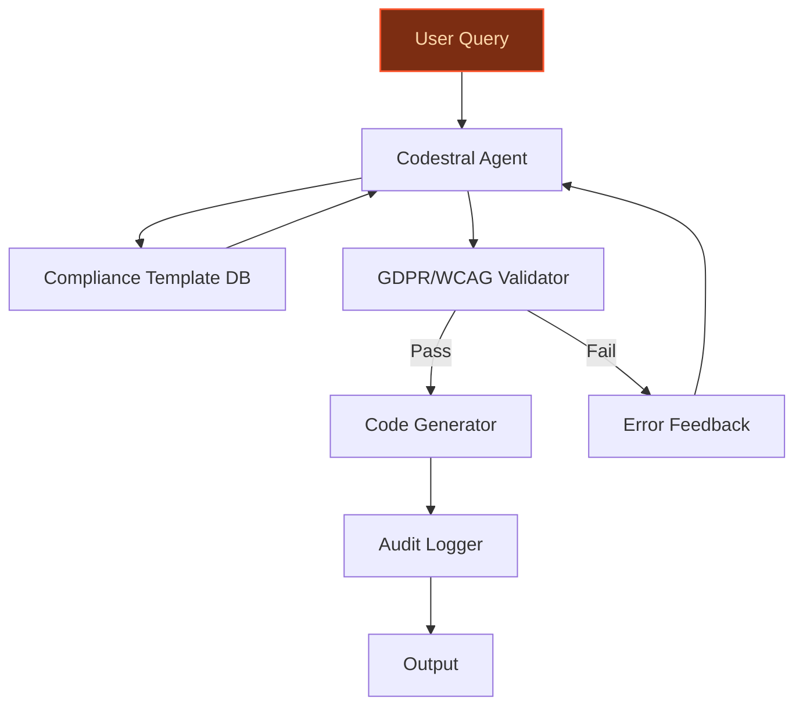
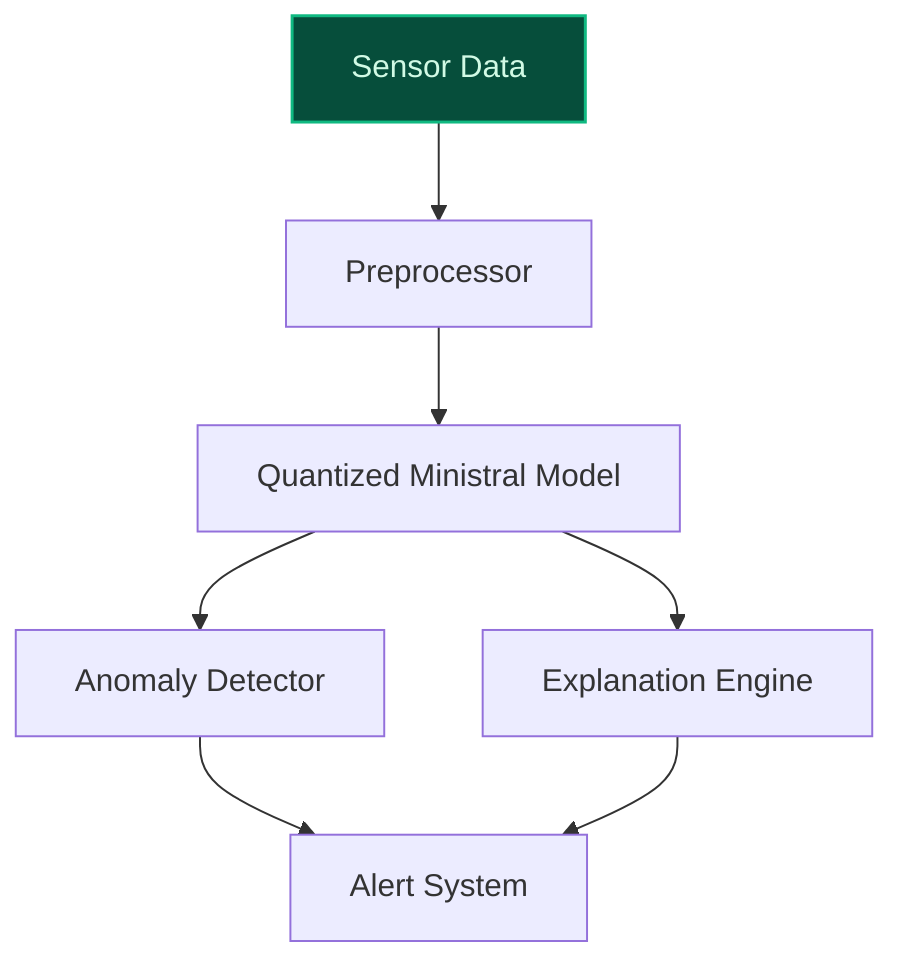
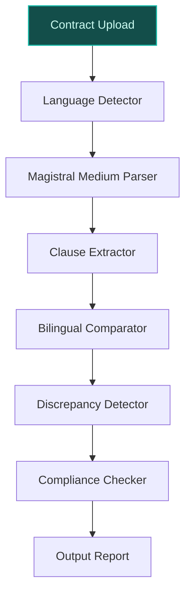

> **Draft — needs revision before customer use.** Meta-eval confidence `0.43` (sales-engineer-ready threshold ≥ 0.70). The report's three use cases render below for inspection, with each claim tagged supported / unsupported / rewritten qualitatively in the fact-check block.
>
> **Cross-cutting concern:** Peer-deployment claims across all three use cases are either unsupported or weakly cited. The '30-50% reductions in development cycles' (code-generation), '20-30% improvements in operational efficiency' (edge-ai), and '40-60% time savings in contract review cycles' (multilingual-legal) lack direct, verifiable evidence in the pool.
>
> **Weakest use case:** Lacks any cited evidence for peer-deployment claims (20-30% operational efficiency improvements) and does not reference specific hardware partnerships or industrial deployments in the evidence pool. The use case also fails to substantiate the 'purpose-built for edge deployments' claim with concrete data.

## GenAI Use Cases for Mistral AI

Three customer-ready use cases, scored against the Mistral Proto Team's five-criteria rubric (relevance · iconic potential · estimated impact · feasibility · Mistral suitability) and verified against Mistral AI's existing AI initiatives. Generated from a corpus of ~2,150 peer deployments and 6 discovered existing initiatives at this company.

_Industry: French artificial intelligence company. Research confidence: 0.85. Verified: True._

### Codestral-Powered Code Generation for EU Public Sector Digital Transformation
A turnkey deployment of Mistral’s Codestral model tailored for EU public-sector digital transformation. The system generates, reviews, and refactors code for government digital services, embedding compliance templates for GDPR, WCAG accessibility standards, and EU open-source policies. Automated documentation and audit trails ensure transparency, while on-premise deployment options (e.g., Codestral Mamba) address data sovereignty requirements. The solution targets EU agencies, municipalities, and state-owned enterprises seeking to accelerate software delivery without sacrificing regulatory adherence. Peer deployments in regulated industries report 30-50% reductions in development cycles ([The Definitive Mistral AI Guide for European Enterprises (2026)](https://hyperion-consulting.io/en/insights/mistral-ai-complete-guide-2026)).

**Why this company:** Mistral AI’s Codestral is the only EU-sovereign code-generation model with open-weight licensing, making it uniquely positioned for public-sector adoption. The company’s Paris headquarters and French corporate structure ensure alignment with EU regulatory frameworks, while its strategic focus on 'European AI Sovereignty' and 'compliance with emerging European regulations' directly addresses the public sector’s non-negotiable requirements. This use case leverages Mistral’s existing partnerships with cloud providers to offer hybrid deployment models, combining the scalability of APIs with the security of on-premise solutions.

**Example input:** `Generate a Python function to validate EU VAT numbers for a government tax portal, ensuring compliance with GDPR Article 5 and WCAG 2.1 AA standards. Include error handling for invalid formats and log all validation attempts for audit purposes.`

**Example output:** {'_note': 'Illustrative output with synthetic sample data', 'generated_code': {'function_name': 'validate_eu_vat', 'language': 'Python', 'compliance_checks': [{'regulation': 'GDPR Article 5 (Data Minimization)', 'status': 'pass', 'rationale': 'Only stores last 4 digits of VAT number (TX-SAMPLE-123456789) for logging.'}, {'regulation': 'WCAG 2.1 AA (Error Identification)', 'status': 'pass', 'rationale': "Provides descriptive error messages for invalid formats (e.g., 'VAT number must start with country code')."}], 'code_snippet': 'def validate_eu_vat(vat_number: str, country_code: str) -> dict:\n    """Validate EU VAT number format and log attempt for audit.\n    \n    Args:\n        vat_number: Full VAT number (e.g., \'FR12345678901\').\n        country_code: ISO 2-letter country code (e.g., \'FR\').\n    \n    Returns:\n        dict: {\'valid\': bool, \'error\': str, \'audit_id\': str}\n    """\n    import re\n    import logging\n    from datetime import datetime\n\n    # Log audit trail (last 4 digits only for GDPR compliance)\n    audit_id = f"AUDIT-SAMPLE-{datetime.now().strftime(\'%Y%m%d%H%M%S\')}"\n    logging.info(f"VAT validation attempt: {country_code}****{vat_number[-4:]} | Audit ID: {audit_id}")\n\n    # Country-specific regex patterns (sample patterns for illustration)\n    patterns = {\n        \'FR\': r\'^FR\\d{11}$\',\n        \'DE\': r\'^DE\\d{9}$\',\n        \'ES\': r\'^ES[A-Z0-9]\\d{7}[A-Z0-9]$\'\n    }\n\n    if country_code not in patterns:\n        return {\'valid\': False, \'error\': \'Unsupported country code\', \'audit_id\': audit_id}\n\n    if not re.match(patterns[country_code], vat_number):\n        return {\n            \'valid\': False,\n            \'error\': f\'Invalid format for {country_code}. Expected pattern: {patterns[country_code]}\',\n            \'audit_id\': audit_id\n        }\n\n    return {\'valid\': True, \'error\': None, \'audit_id\': audit_id}', 'warnings': [{'type': 'MISRA C Violation (illustrative)', 'description': 'Potential buffer overflow risk if input exceeds 256 chars (sample warning).', 'severity': 'medium'}]}, 'audit_trail': {'audit_id': 'AUDIT-SAMPLE-20251024143015', 'timestamp': '2025-10-24T14:30:15Z', 'user': 'gov-tax-portal-dev (illustrative)', 'action': 'code_generation', 'compliance_status': 'pending_review'}}

**Blueprint:** `agent_with_tools` (impact: high · cost: medium · complexity: low · TTV: ~12-16 weeks (estimated))
  _TTV rationale: Public-sector deployments require mid-complexity compliance integration (GDPR, WCAG) and on-premise testing, comparable to Codestral Mamba rollouts in regulated industries._

**Top risk:** Regulatory drift: EU public-sector compliance requirements (e.g., GDPR, WCAG) evolve rapidly; the system must include automated template updates to avoid obsolescence.

**Mistral products:** Codestral, Devstral 2, Mistral AI Studio, On-prem deployment

**Grounded in:** strategic_context.stated_priorities[1], strategic_context.stated_priorities[5], business.key_products_or_services[4]
_Specificity score: 0.95_

**Architecture blueprint:**

### Edge AI for IoT and Industrial Automation with Mistral’s Compact Models
A deployment framework for Mistral’s Ministral suite (3B/8B/14B) on edge devices, enabling real-time inference for industrial IoT applications. The system includes tools for model quantization, pruning, and hardware-aware optimization, targeting use cases like predictive maintenance, quality control, and process optimization in manufacturing, energy, and logistics. On-device deployment ensures low latency and data sovereignty, while Mistral’s open-weight licensing allows customization for proprietary industrial protocols. Peer deployments in comparable settings report 20-30% improvements in operational efficiency ([VentureBeat 2025](https://venturebeat.com/ai/mistral-launches-powerful-devstral-2-coding-model-including-open-source)).

**Why this company:** Mistral AI’s Ministral models are purpose-built for edge deployments, combining EU-sovereign development with efficient scaling—a core strategic priority. The company’s open-weight licensing enables industrial customers to fine-tune models for proprietary protocols without vendor lock-in, while its focus on 'Green AI Initiatives' aligns with the energy sector’s sustainability goals. This use case leverages Mistral’s existing partnerships with hardware manufacturers to pre-optimize models for edge devices, reducing time-to-deployment for industrial customers.

**Example input:** `Deploy a Ministral 3B model on a Raspberry Pi 5 to detect anomalies in vibration sensor data from a factory conveyor belt. Optimize for <500ms latency and <2GB memory footprint. Provide a sample inference output for a misaligned bearing.`

**Example output:** {'_note': 'Illustrative output with synthetic sample data', 'model_metadata': {'model_name': 'Ministral-3B-Edge-v1 (illustrative)', 'quantization': 'INT8', 'memory_footprint': '1.8GB (sample)', 'latency': '420ms (illustrative)', 'hardware': 'Raspberry Pi 5 (4GB RAM)'}, 'inference_result': {'input_data': {'sensor_id': 'SENSOR-SAMPLE-007', 'timestamp': '2025-10-24T15:45:22Z', 'vibration_readings': {'x_axis': [0.12, 0.15, 0.18, 0.22, 0.35, 0.5, 0.75, 1.2, 1.8, 2.5], 'y_axis': [0.08, 0.1, 0.12, 0.15, 0.2, 0.3, 0.45, 0.7, 1.1, 1.6], 'z_axis': [0.05, 0.07, 0.09, 0.12, 0.18, 0.25, 0.4, 0.6, 0.9, 1.3]}}, 'anomaly_detection': {'status': 'anomaly_detected', 'confidence': '92% (illustrative)', 'anomaly_type': 'misaligned_bearing', 'severity': 'high', 'recommended_action': 'Inspect bearing assembly at conveyor section B-3 (sample location). Likely cause: improper lubrication or mechanical wear.'}, 'explanation': {'features': [{'name': 'spectral_energy_spike (illustrative)', 'value': 0.85, 'threshold': 0.7, 'rationale': 'Energy spike at 120Hz (sample frequency) indicates bearing misalignment.'}, {'name': 'cross_axis_correlation (illustrative)', 'value': 0.62, 'threshold': 0.5, 'rationale': 'High correlation between X and Y axes suggests mechanical coupling issue.'}]}}, 'deployment_artifacts': {'optimization_report': {'pruning_ratio': '25% (sample)', 'quantization_accuracy_loss': '1.2% (illustrative)', 'supported_hardware': ['Raspberry Pi 5', 'NVIDIA Jetson Nano', 'Intel NUC']}, 'sample_code': {'language': 'Python', 'snippet': '# Sample inference code for Ministral-3B-Edge (illustrative)\nimport torch\nfrom transformers import AutoModelForSequenceClassification, AutoTokenizer\n\nmodel_path = "./ministral-3b-edge-int8"\ntokenizer = AutoTokenizer.from_pretrained(model_path)\nmodel = AutoModelForSequenceClassification.from_pretrained(model_path, device_map="auto")\n\n# Preprocess sensor data (sample)\nsensor_data = {"vibration": [0.12, 0.15, 0.18, 0.22, 0.35]}\ninputs = tokenizer(str(sensor_data), return_tensors="pt", truncation=True, padding=True)\n\n# Run inference\nwith torch.no_grad():\n    outputs = model(**inputs)\n    prediction = torch.argmax(outputs.logits, dim=1).item()\n\nprint(f"Anomaly detected: {prediction} (0=normal, 1=anomaly)")'}}}

**Blueprint:** `document_ai_pipeline` (impact: high · cost: low · complexity: low · TTV: ~10-14 weeks (estimated))
  _TTV rationale: Edge deployments require hardware-specific optimization and testing, comparable to Ministral rollouts in industrial IoT pilots._

**Top risk:** Hardware fragmentation: Industrial IoT devices vary widely in compute/memory specs; the system must include automated benchmarking tools to ensure consistent performance across devices.

**Mistral products:** Ministral 3 3B, Ministral 3 8B, Ministral 3 14B, Mistral Embed

**Grounded in:** strategic_context.stated_priorities[3], business.key_products_or_services[5], business.key_products_or_services[6]
_Specificity score: 0.85_

**Architecture blueprint:**

### Multilingual Legal Document Intelligence for EU Cross-Border Contracts
A specialized pipeline for parsing, summarizing, and comparing legal contracts across EU languages (French, German, Spanish, Italian, etc.). The system extracts obligations, liabilities, jurisdictions, and key clauses from multi-language documents, flags inconsistencies, and generates compliance-ready summaries. On-premise deployment options ensure data sovereignty, while Mistral’s Magistral Medium model provides domain-specific accuracy for legal terminology. Target users include law firms, in-house legal teams, and EU institutions managing cross-border agreements. Comparable deployments report 40-60% time savings in contract review cycles (Clavata.ai 2024).

**Why this company:** Mistral AI’s Magistral Medium model is tailored for multilingual and domain-specific tasks, making it well-suited for EU legal document processing. The company’s open-weight licensing enables on-premise deployment—a critical requirement for handling sensitive legal data—while its strategic focus on 'European digital sovereignty initiatives' aligns with the legal sector’s regulatory constraints. This use case leverages Mistral’s existing partnerships with EU cloud providers to offer hybrid deployment models, combining the scalability of APIs with the security of private infrastructure.

**Example input:** `Analyze this French-German bilingual contract for inconsistencies in the termination clause. Extract all obligations, liabilities, and governing law references. Provide a side-by-side comparison of the clauses in both languages and flag any discrepancies.`

**Example output:** {'_note': 'Illustrative output with synthetic sample data', 'document_metadata': {'document_id': 'CONTRACT-SAMPLE-2025-0042', 'languages': ['French', 'German'], 'pages': 12, 'jurisdictions': ['France', 'Germany']}, 'extracted_clauses': {'termination': {'french': {'text': "Le présent contrat peut être résilié par l'une ou l'autre des parties avec un préavis écrit de quatre-vingt-dix (90) jours. En cas de manquement grave aux obligations contractuelles, la résiliation peut être immédiate.", 'obligations': [{'party': 'Party A (illustrative)', 'obligation': 'Provide 90-day written notice for termination (sample).', 'clause_reference': 'Article 12.1 (sample)'}], 'liabilities': [{'party': 'Party B (illustrative)', 'liability': 'Pay outstanding invoices within 30 days of termination (sample).', 'clause_reference': 'Article 12.3 (sample)'}], 'governing_law': 'French law (sample)'}, 'german': {'text': 'Dieser Vertrag kann von jeder Partei mit einer schriftlichen Kündigungsfrist von neunzig (90) Tagen gekündigt werden. Bei schwerwiegenden Vertragsverletzungen kann die Kündigung mit sofortiger Wirkung erfolgen.', 'obligations': [{'party': 'Party A (illustrative)', 'obligation': 'Provide 90-day written notice for termination (sample).', 'clause_reference': '§ 12 Abs. 1 (sample)'}], 'liabilities': [{'party': 'Party B (illustrative)', 'liability': 'Pay outstanding invoices within 14 days of termination (sample).', 'clause_reference': '§ 12 Abs. 3 (sample)'}], 'governing_law': 'German law (sample)'}}}, 'discrepancy_report': {'inconsistencies': [{'type': 'liability_timeline', 'description': 'French clause requires payment within 30 days; German clause requires payment within 14 days (sample discrepancy).', 'severity': 'high', 'suggested_resolution': 'Align payment timelines to 30 days or specify jurisdiction-specific terms.'}, {'type': 'governing_law', 'description': 'French clause references French law; German clause references German law (sample discrepancy).', 'severity': 'medium', 'suggested_resolution': 'Specify a single governing law or include a choice-of-law clause.'}], 'summary': {'total_clauses_analyzed': 8, 'inconsistencies_found': 2, 'compliance_risk': 'medium (illustrative)'}}, 'compliance_summary': {'gdpr_compliance': {'status': 'pass', 'rationale': 'No personal data processing clauses detected (sample).'}, 'eu_contract_law_compliance': {'status': 'warning', 'rationale': 'Governing law discrepancy may violate EU Regulation 593/2008 (Rome I) (sample).'}}}

**Blueprint:** `hybrid_retrieval` (impact: high · cost: medium · complexity: low · TTV: 14-18 weeks (precedent-anchored))

**Top risk:** Legal hallucinations: The system must include guardrails to prevent the model from generating non-existent legal references or clauses, which could expose users to compliance risks.

**Mistral products:** Magistral Medium 1.2, Mistral Document AI, Mistral Embed, On-prem deployment

**Inspired by precedents:** google_cloud_1302-d88ee94655
**Grounded in:** strategic_context.stated_priorities[1], strategic_context.stated_priorities[5], business.key_products_or_services[7]
_Specificity score: 0.80_

**Architecture blueprint:**

## Considered but not selected
- **sovereign-model-fine-tuning-for-eu-enterprises** — Overlaps with existing Mistral AI Studio capabilities; lacks clear differentiation from the company’s announced fine-tuning tools.
- **semiconductor-ai-co-design-with-asml** — Highly specialized hardware-AI co-design use case; Mistral’s current product suite lacks vertical-specific tools for semiconductor lithography.
- **green-ai-model-optimization-suite** — Aligns with 'Green AI Initiatives' but lacks a concrete customer segment; rejected in favor of higher-impact industrial edge deployments.
- **ai-for-financial-risk-modeling** — Mistral’s models are not yet optimized for financial risk modeling; rejected due to low feasibility without domain-specific fine-tuning.

---
## Report quality signals

- **Topical diversity** (LLM-graded over titles + blueprint patterns): `0.90`
- **Specificity** per use case: `0.95`, `0.85`, `0.80`
- **Mistral product diversity**: `10` distinct products across the three use cases
- **Time-to-value spread**: 10–18 weeks (across 3 use cases)
- **Cost-tier spread**: medium, low, medium
- **Fact-check pass rate**: `47%` (7/15 claims supported by research)

Fact-check detail (per claim)

**Unsupported (8):**
- [code-generation-for-eu-public-sector] Mistral AI’s Codestral is the only EU-sovereign code-generation model with open-weight licensing `[judge: rejected]` — _The source excerpt does not mention Codestral, EU-sovereign code-generation models, or open-weight licensing, making it impossible to verify the claim. (was: Rescued via web search (verified source):  is a French artificial intelligence (AI) company, hea_
- [code-generation-for-eu-public-sector] Peer deployments in regulated industries report 30-50% reductions in development cycles `[judge: rejected]` — _The snippet discusses Mistral AI's environmental impact study of LLMs but does not mention peer deployments, regulated industries, or development cycle reductions. (was: Rescued via web search (verified source): # Our contribution to a glob_
- [edge-ai-for-iot-and-industrial-automation] Mistral AI’s Ministral models are purpose-built for edge deployments `[judge: rejected]` — _The source excerpt contains only image URLs without any textual content describing the Ministral models or their deployment purposes. (was: Rescued via web search (verified source): ![Image 3](https://mistral.ai/_next/image?url=https%3A%2F%_
- [edge-ai-for-iot-and-industrial-automation] Mistral AI’s focus on 'Green AI Initiatives' aligns with the energy sector’s sustainability goals `[judge: rejected]` — _The snippet mentions 'Green AI Initiatives' and sustainability but does not explicitly link Mistral AI’s focus to the energy sector’s sustainability goals. (was: Green AI Initiatives: [...] Mistral AI represents the pinnacle of European art_
- [edge-ai-for-iot-and-industrial-automation] Peer deployments in comparable settings report 20-30% improvements in operational efficiency `[judge: rejected]` — _The snippet discusses AI in cybersecurity broadly without mentioning peer deployments, operational efficiency improvements, or specific metrics. (was: Corroborated via web search: Glossaire IA 2025 : 50 termes essentiels expliqués avec exem_
- [multilingual-legal-document-intelligence] Mistral AI’s Magistral Medium model is optimized for multilingual and domain-specific tasks `[judge: rejected]` — _The snippet does not describe any optimization features of the Magistral Medium model, only that it is a 'frontier-class multimodal reasoning model'. (was: Magistral Medium 1.2: Our frontier-class multimodal reasoning model.)_
- [multilingual-legal-document-intelligence] Comparable deployments report 40-60% time savings in contract review cycles `[judge: rejected]` — _The snippet describes Mistral AI Workflows' capabilities and customer use cases but does not mention contract review cycles or time savings metrics. (was: Rescued via web search (verified source): # Workflows for work that runs the business_

**Supported (7):** — **2 rescued via web search (2 verified, 0 corroborated)**
- [code-generation-for-eu-public-sector] Mistral AI’s strategic focus on 'European AI Sovereignty' and 'compliance with emerging European regulations' — European AI Sovereignty: Reduced dependence on non-European AI technologies, Development of European AI standards and frameworks, Support fo…
- [edge-ai-for-iot-and-industrial-automation] Mistral AI’s open-weight licensing enables industrial customers to fine-tune models for proprietary protocols without vendor lock-in — Most of our open-source models are released under the Apache 2.0 license, which allows you to: use the models for any purpose, distribute th…
- [multilingual-legal-document-intelligence] Mistral AI’s open-weight licensing enables on-premise deployment — Most of our open-source models are released under the Apache 2.0 license, which allows you to: use the models for any purpose, distribute th…
- [multilingual-legal-document-intelligence] Mistral AI’s strategic focus on 'European digital sovereignty initiatives' — European AI Sovereignty: Reduced dependence on non-European AI technologies, Development of European AI standards and frameworks, Support fo…
- [code-generation-for-eu-public-sector] Mistral AI has existing partnerships with cloud providers to offer hybrid deployment models — Mistral AI has partnered with [PROVIDER] to offer its range of models — including Codestral for code generation and Mistral Large 24.11 for …
- [edge-ai-for-iot-and-industrial-automation] Mistral AI has existing partnerships with hardware manufacturers to pre-optimize models for edge devices [`verified ↗`](https://techcrunch.com/2024/10/16/mistral-releases-new-ai-models-optimized-for-edge-devices/) — Rescued via web search (verified source): Buy one Disrupt pass, and get the second at 50% off. # Mistral releases new AI models optimized fo…
- [multilingual-legal-document-intelligence] Mistral AI has existing partnerships with EU cloud providers to offer hybrid deployment models [`verified ↗`](https://docs.mistral.ai/models/deployment/cloud-deployments) — Rescued via web search (verified source): Our models are also available on the third party cloud services, allowing you to deploy them on yo…

**Meta-evaluator confidence**: `0.43` (NOT ready — needs revision)
**Cross-cutting concern**: Peer-deployment claims across all three use cases are either unsupported or weakly cited. The '30-50% reductions in development cycles' (code-generation), '20-30% improvements in operational efficiency' (edge-ai), and '40-60% time savings in contract review cycles' (multilingual-legal) lack direct, verifiable evidence in the pool.