# Pipeline blueprint (architecture)

Static view of the pipeline regardless of run timing — shows agents,
models, and gates. The chronological execution log follows below.

```mermaid
flowchart TD
    Start([User: company name]) --> R
    R["<b>1. Research</b><br/>parallel: Wikipedia · Tavily news ·<br/>existing initiatives · live verification<br/><i>mistral-medium</i> synthesis"]
    R --> G["<b>1b. Gap-fill</b><br/>identify missing fields →<br/><i>mistral-small</i> generates queries →<br/>Tavily search per field →<br/><i>mistral-small</i> per-field extraction"]
    G --> Conf{Confidence ≥ 0.5<br/>OR verified<br/>OR ≥ 1 existing initiative?}
    Conf -->|no| Refuse([Refusal])
    Conf -->|yes| Ret
    Ret["<b>2. Retrieve</b><br/><i>mistral-embed</i> on company query →<br/>cosine top-K + industry/depth filter +<br/>MMR diversification"]
    Ret --> Gen["<b>3. Generate 12 candidates</b><br/><i>mistral-medium</i> with web_search tool<br/>(Tavily + deep-read) — fact citations<br/>flow into the EvidenceLedger"]
    Gen --> Score["<b>4. Score</b><br/>self-consistency: 2 parallel passes<br/><i>mistral-small</i> @ T=0.2 and T=0.4 →<br/>aggregate weighted scores"]
    Score --> Verify["<b>5. Per-candidate verify</b><br/>top-3: Tavily search + deep-read +<br/><i>mistral-small</i> verdict (pass /<br/>partial / confirmed_existing)"]
    Verify --> Enrich["<b>6. Enrich</b><br/><i>mistral-large</i> drafts customer-facing<br/>prose for 3 use cases (or<br/><i>mistral-medium</i> on fast tier)"]
    Enrich --> NumScrub["<b>6a. Numeric scrub</b><br/>flag any number not in cited content"]
    NumScrub --> Polish["<b>6b. Polish</b><br/><i>mistral-small</i> per use case (parallel):<br/>convert markers→qualitative,<br/>(ev-XXX)→[title](url)"]
    Polish --> Attr["<b>6c. Attribution check</b><br/><i>mistral-small</i> per use case (parallel):<br/>fix corpus-ID ↔ company mismatches"]
    Attr --> Meta["<b>7. Meta-evaluation</b><br/><i>mistral-medium</i> reviews report against<br/>cited precedents + ledger entries:<br/>strict claim verification"]
    Meta --> RegenQ{confidence < 0.6<br/>AND not fast tier?}
    RegenQ -->|yes| Regen["<b>7b. Targeted regen</b><br/><i>mistral-large</i> re-enriches just the<br/>weakest use case with the next-best<br/>near-miss; re-runs meta-eval"]
    RegenQ -->|no| QS
    Regen --> QS
    QS["<b>Quality signals</b><br/>LLM-graded diversity + specificity,<br/>fact-check pass rate, TTV/cost spread"]
    QS --> Render([Markdown report + trace])

    classDef agent fill:#fef3c7,stroke:#f59e0b
    classDef gate fill:#dbeafe,stroke:#3b82f6
    classDef io fill:#dcfce7,stroke:#16a34a
    class R,G,Ret,Gen,Score,Verify,Enrich,NumScrub,Polish,Attr,Meta,Regen,QS agent
    class Conf,RegenQ gate
    class Start,Refuse,Render io
```

## Execution trace — Mistral AI

Started: `2026-05-09T23:19:48.663252+00:00`. Total wall time: `185.5s` across `44` recorded actions.

### Per-step time totals

| Step | Calls | Total time | Avg time |
|---|---:|---:|---:|
| `research` | 1 | 7.61s | 7613ms |
| `gap_fill` | 4 | 2.67s | 668ms |
| `retrieve` | 2 | 0.60s | 301ms |
| `generate` | 2 | 31.81s | 15903ms |
| `generate.web_search` | 2 | 4.97s | 2487ms |
| `score` | 2 | 34.65s | 17327ms |
| `verify` | 6 | 22.11s | 3684ms |
| `enrich` | 1 | 77.62s | 77621ms |
| `polish` | 3 | 6.80s | 2266ms |
| `meta_eval` | 1 | 10.00s | 10004ms |
| `web_verify` | 1 | 4.78s | 4781ms |
| `source_judge` | 16 | 13.87s | 867ms |
| `final_qualify` | 1 | 1.67s | 1670ms |
| `quality_signals` | 2 | 4.11s | 2053ms |

### Chronological event log

- `23:19:51.503` **[research]** `mistral-medium-2604.chat.complete` — 7613ms
   - inputs: synthesize CompanyContext for Mistral AI | depth=medium
   - outputs: industry='French artificial intelligence company' verified=True conf=0.75
- `23:19:59.117` **[gap_fill]** `mistral-small-2603.chat.complete` — 948ms
   - inputs: generate gap queries | fields=['business_model', 'products', 'data_assets', 'priorities']
   - outputs: queries=4
- `23:20:04.123` **[gap_fill]** `mistral-small-2603.chat.complete` — 621ms
   - inputs: layer-2 extract field=priorities
   - outputs: items=6
- `23:20:04.125` **[gap_fill]** `mistral-small-2603.chat.complete` — 345ms
   - inputs: layer-2 extract field=data_assets
   - outputs: items=0
- `23:20:04.127` **[gap_fill]** `mistral-small-2603.chat.complete` — 758ms
   - inputs: layer-2 extract field=products
   - outputs: items=10
- `23:20:04.886` **[retrieve]** `mistral-embed.embeddings.create` — 259ms
   - inputs: company_query | industries='French artificial intelligence company'
   - outputs: embedded 1024-dim query vector
- `23:20:05.145` **[retrieve]** `precedent_corpus.cosine_topk` — 343ms
   - inputs: k=8 min_depth=0.4 target='Mistral AI'
   - outputs: retrieved 8 | mmr=True | top_sim=0.789
- `23:20:06.321` **[generate]** `mistral-medium-2604.chat.complete` — 1672ms
   - inputs: iteration=0 tool_calls_used=0/2 tools=on
   - outputs: tool_calls=4 | content_chars=0
- `23:20:08.014` **[generate.web_search]** `tavily.search` — 2747ms
   - inputs: query='Mistral AI recent partnerships 2025 2026'
   - outputs: 2 raw results
- `23:20:11.681` **[generate.web_search]** `tavily.search` — 2228ms
   - inputs: query='Mistral AI open-source models list 2025'
   - outputs: 2 raw results
- `23:20:14.494` **[generate]** `mistral-medium-2604.chat.complete` — 30134ms
   - inputs: iteration=1 tool_calls_used=2/2 tools=off
   - outputs: tool_calls=0 | content_chars=22241
- `23:20:45.019` **[score]** `mistral-small-2603.chat.complete` — 16807ms
   - inputs: self-consistency pass T=0.2
   - outputs: scored 12 candidates
- `23:20:45.024` **[score]** `mistral-small-2603.chat.complete` — 17847ms
   - inputs: self-consistency pass T=0.4
   - outputs: scored 12 candidates
- `23:21:02.908` **[verify]** `tavily.search` — 4098ms
   - inputs: candidate=sovereign-model-fine-tuning-for-eu-enterprises | query='Mistral AI Sovereign Model Fine-Tuning Hub for EU Enterprise'
   - outputs: 4 results
- `23:21:02.909` **[verify]** `tavily.search` — 2251ms
   - inputs: candidate=semiconductor-ai-co-design-with-asml | query='Mistral AI AI-Centric Co-Design for Semiconductor Lithograph'
   - outputs: 4 results
- `23:21:02.909` **[verify]** `tavily.search` — 2127ms
   - inputs: candidate=code-generation-for-eu-public-sector | query='Mistral AI Codestral-Powered Code Generation for EU Public S'
   - outputs: 4 results
- `23:21:05.677` **[verify]** `mistral-small-2603.chat.complete` — 4877ms
   - inputs: verdict for semiconductor-ai-co-design-with-asml
   - outputs: verdict='confirmed_existing'
- `23:21:05.977` **[verify]** `mistral-small-2603.chat.complete` — 4524ms
   - inputs: verdict for code-generation-for-eu-public-sector
   - outputs: verdict='pass'
- `23:21:07.251` **[verify]** `mistral-small-2603.chat.complete` — 4228ms
   - inputs: verdict for sovereign-model-fine-tuning-for-eu-enterprises
   - outputs: verdict='confirmed_existing'
- `23:21:11.482` **[enrich]** `mistral-large-2512.chat.complete` — 77621ms
   - inputs: tier=standard top_3=['code-generation-for-eu-public-sector', 'edge-ai-for-iot-and-industrial-automation', 'multilingual-legal-document-intelligence']
   - outputs: enriched 3 use cases
- `23:22:29.129` **[polish]** `mistral-small-2603.chat.complete` — 2257ms
   - inputs: use_case=code-generation-for-eu-public-sector unanchored=True opaque_ev=False
   - outputs: polished 5 fields
- `23:22:29.135` **[polish]** `mistral-small-2603.chat.complete` — 2244ms
   - inputs: use_case=edge-ai-for-iot-and-industrial-automation unanchored=True opaque_ev=False
   - outputs: polished 5 fields
- `23:22:29.139` **[polish]** `mistral-small-2603.chat.complete` — 2296ms
   - inputs: use_case=multilingual-legal-document-intelligence unanchored=True opaque_ev=False
   - outputs: polished 5 fields
- `23:22:31.437` **[meta_eval]** `mistral-medium-2604.chat.complete` — 10004ms
   - inputs: reviewing 3 use cases
   - outputs: review + claims
- `23:22:41.456` **[web_verify]** `tavily.search.rescue_unsupported_claims` — 4781ms
   - inputs: company='Mistral AI' unsupported=7 budget=12
   - outputs: rescued: verified=6 corroborated=1 of 7 attempted
- `23:22:46.239` **[source_judge]** `mistral-small-2603.judge_claim_sources` — 1763ms
   - inputs: pairs=15
   - outputs: judged 15 pairs
- `23:22:46.240` **[source_judge]** `mistral-small-2603.chat.complete` — 662ms
   - inputs: claim='Mistral AI’s Codestral is the only EU-sovereign code-generat'
   - outputs: verdict=unsupported
- `23:22:46.250` **[source_judge]** `mistral-small-2603.chat.complete` — 738ms
   - inputs: claim='Mistral AI’s Paris headquarters and French corporate structu'
   - outputs: verdict=unsupported
- `23:22:46.252` **[source_judge]** `mistral-small-2603.chat.complete` — 1128ms
   - inputs: claim="Mistral AI’s strategic focus on 'European AI Sovereignty' an"
   - outputs: verdict=supported
- `23:22:46.255` **[source_judge]** `mistral-small-2603.chat.complete` — 789ms
   - inputs: claim='Peer deployments in regulated industries report 30-50% reduc'
   - outputs: verdict=unsupported
- `23:22:46.258` **[source_judge]** `mistral-small-2603.chat.complete` — 741ms
   - inputs: claim='Mistral AI’s Ministral models are purpose-built for edge dep'
   - outputs: verdict=unsupported
- `23:22:46.261` **[source_judge]** `mistral-small-2603.chat.complete` — 693ms
   - inputs: claim="Mistral AI’s focus on 'Green AI Initiatives' aligns with the"
   - outputs: verdict=unsupported
- `23:22:46.264` **[source_judge]** `mistral-small-2603.chat.complete` — 896ms
   - inputs: claim='Mistral AI’s open-weight licensing enables industrial custom'
   - outputs: verdict=supported
- `23:22:46.265` **[source_judge]** `mistral-small-2603.chat.complete` — 653ms
   - inputs: claim='Peer deployments in comparable settings report 20-30% improv'
   - outputs: verdict=unsupported
- `23:22:46.902` **[source_judge]** `mistral-small-2603.chat.complete` — 628ms
   - inputs: claim='Mistral AI’s Magistral Medium model is optimized for multili'
   - outputs: verdict=unsupported
- `23:22:46.918` **[source_judge]** `mistral-small-2603.chat.complete` — 1016ms
   - inputs: claim='Mistral AI’s open-weight licensing enables on-premise deploy'
   - outputs: verdict=supported
- `23:22:46.954` **[source_judge]** `mistral-small-2603.chat.complete` — 1048ms
   - inputs: claim="Mistral AI’s strategic focus on 'European digital sovereignt"
   - outputs: verdict=supported
- `23:22:46.988` **[source_judge]** `mistral-small-2603.chat.complete` — 890ms
   - inputs: claim='Comparable deployments report 40-60% time savings in contrac'
   - outputs: verdict=unsupported
- `23:22:46.999` **[source_judge]** `mistral-small-2603.chat.complete` — 837ms
   - inputs: claim='Mistral AI has existing partnerships with cloud providers to'
   - outputs: verdict=supported
- `23:22:47.044` **[source_judge]** `mistral-small-2603.chat.complete` — 768ms
   - inputs: claim='Mistral AI has existing partnerships with hardware manufactu'
   - outputs: verdict=supported
- `23:22:47.160` **[source_judge]** `mistral-small-2603.chat.complete` — 626ms
   - inputs: claim='Mistral AI has existing partnerships with EU cloud providers'
   - outputs: verdict=supported
- `23:22:48.004` **[final_qualify]** `mistral-small-2603.chat.complete` — 1670ms
   - inputs: use_case=multilingual-legal-document-intelligence unsupported=1
   - outputs: qualified 4 fields
- `23:22:50.027` **[quality_signals]** `mistral-small-2603.chat.complete` — 2650ms
   - inputs: specificity grade (3 use cases)
   - outputs: scored 3 use cases
- `23:22:52.677` **[quality_signals]** `mistral-small-2603.chat.complete` — 1455ms
   - inputs: diversity grade
   - outputs: diversity=0.9

## Mermaid sequence diagram (execution)

```mermaid
sequenceDiagram
    autonumber
    participant pipeline as pipeline
    participant mistral_medium_2604 as mistral-medium-2604
    participant mistral_small_2603 as mistral-small-2603
    participant mistral_embed as mistral-embed
    participant precedent_corpus as precedent_corpus
    participant tavily as tavily
    participant mistral_large_2512 as mistral-large-2512
    participant tavily_search as tavily.search
    pipeline->>mistral_medium_2604: research: chat.complete (7613ms)
    mistral_medium_2604-->>pipeline: industry='French artificial intelligence company' verified=T
    pipeline->>mistral_small_2603: gap_fill: chat.complete (948ms)
    mistral_small_2603-->>pipeline: queries=4
    pipeline->>mistral_small_2603: gap_fill: chat.complete (621ms)
    mistral_small_2603-->>pipeline: items=6
    pipeline->>mistral_small_2603: gap_fill: chat.complete (345ms)
    mistral_small_2603-->>pipeline: items=0
    pipeline->>mistral_small_2603: gap_fill: chat.complete (758ms)
    mistral_small_2603-->>pipeline: items=10
    pipeline->>mistral_embed: retrieve: embeddings.create (259ms)
    mistral_embed-->>pipeline: embedded 1024-dim query vector
    pipeline->>precedent_corpus: retrieve: cosine_topk (343ms)
    precedent_corpus-->>pipeline: retrieved 8 | mmr=True | top_sim=0.789
    pipeline->>mistral_medium_2604: generate: chat.complete (1672ms)
    mistral_medium_2604-->>pipeline: tool_calls=4 | content_chars=0
    pipeline->>tavily: generate.web_search: search (2747ms)
    tavily-->>pipeline: 2 raw results
    pipeline->>tavily: generate.web_search: search (2228ms)
    tavily-->>pipeline: 2 raw results
    pipeline->>mistral_medium_2604: generate: chat.complete (30134ms)
    mistral_medium_2604-->>pipeline: tool_calls=0 | content_chars=22241
    pipeline->>mistral_small_2603: score: chat.complete (16807ms)
    mistral_small_2603-->>pipeline: scored 12 candidates
    pipeline->>mistral_small_2603: score: chat.complete (17847ms)
    mistral_small_2603-->>pipeline: scored 12 candidates
    pipeline->>tavily: verify: search (4098ms)
    tavily-->>pipeline: 4 results
    pipeline->>tavily: verify: search (2251ms)
    tavily-->>pipeline: 4 results
    pipeline->>tavily: verify: search (2127ms)
    tavily-->>pipeline: 4 results
    pipeline->>mistral_small_2603: verify: chat.complete (4877ms)
    mistral_small_2603-->>pipeline: verdict='confirmed_existing'
    pipeline->>mistral_small_2603: verify: chat.complete (4524ms)
    mistral_small_2603-->>pipeline: verdict='pass'
    pipeline->>mistral_small_2603: verify: chat.complete (4228ms)
    mistral_small_2603-->>pipeline: verdict='confirmed_existing'
    pipeline->>mistral_large_2512: enrich: chat.complete (77621ms)
    mistral_large_2512-->>pipeline: enriched 3 use cases
    pipeline->>mistral_small_2603: polish: chat.complete (2257ms)
    mistral_small_2603-->>pipeline: polished 5 fields
    pipeline->>mistral_small_2603: polish: chat.complete (2244ms)
    mistral_small_2603-->>pipeline: polished 5 fields
    pipeline->>mistral_small_2603: polish: chat.complete (2296ms)
    mistral_small_2603-->>pipeline: polished 5 fields
    pipeline->>mistral_medium_2604: meta_eval: chat.complete (10004ms)
    mistral_medium_2604-->>pipeline: review + claims
    pipeline->>tavily_search: web_verify: rescue_unsupported_claims (4781ms)
    tavily_search-->>pipeline: rescued: verified=6 corroborated=1 of 7 attempted
    pipeline->>mistral_small_2603: source_judge: judge_claim_sources (1763ms)
    mistral_small_2603-->>pipeline: judged 15 pairs
    pipeline->>mistral_small_2603: source_judge: chat.complete (662ms)
    mistral_small_2603-->>pipeline: verdict=unsupported
    pipeline->>mistral_small_2603: source_judge: chat.complete (738ms)
    mistral_small_2603-->>pipeline: verdict=unsupported
    pipeline->>mistral_small_2603: source_judge: chat.complete (1128ms)
    mistral_small_2603-->>pipeline: verdict=supported
    pipeline->>mistral_small_2603: source_judge: chat.complete (789ms)
    mistral_small_2603-->>pipeline: verdict=unsupported
    pipeline->>mistral_small_2603: source_judge: chat.complete (741ms)
    mistral_small_2603-->>pipeline: verdict=unsupported
    pipeline->>mistral_small_2603: source_judge: chat.complete (693ms)
    mistral_small_2603-->>pipeline: verdict=unsupported
    pipeline->>mistral_small_2603: source_judge: chat.complete (896ms)
    mistral_small_2603-->>pipeline: verdict=supported
    pipeline->>mistral_small_2603: source_judge: chat.complete (653ms)
    mistral_small_2603-->>pipeline: verdict=unsupported
    pipeline->>mistral_small_2603: source_judge: chat.complete (628ms)
    mistral_small_2603-->>pipeline: verdict=unsupported
    pipeline->>mistral_small_2603: source_judge: chat.complete (1016ms)
    mistral_small_2603-->>pipeline: verdict=supported
    pipeline->>mistral_small_2603: source_judge: chat.complete (1048ms)
    mistral_small_2603-->>pipeline: verdict=supported
    pipeline->>mistral_small_2603: source_judge: chat.complete (890ms)
    mistral_small_2603-->>pipeline: verdict=unsupported
    pipeline->>mistral_small_2603: source_judge: chat.complete (837ms)
    mistral_small_2603-->>pipeline: verdict=supported
    pipeline->>mistral_small_2603: source_judge: chat.complete (768ms)
    mistral_small_2603-->>pipeline: verdict=supported
    pipeline->>mistral_small_2603: source_judge: chat.complete (626ms)
    mistral_small_2603-->>pipeline: verdict=supported
    pipeline->>mistral_small_2603: final_qualify: chat.complete (1670ms)
    mistral_small_2603-->>pipeline: qualified 4 fields
    pipeline->>mistral_small_2603: quality_signals: chat.complete (2650ms)
    mistral_small_2603-->>pipeline: scored 3 use cases
    pipeline->>mistral_small_2603: quality_signals: chat.complete (1455ms)
    mistral_small_2603-->>pipeline: diversity=0.9
```

