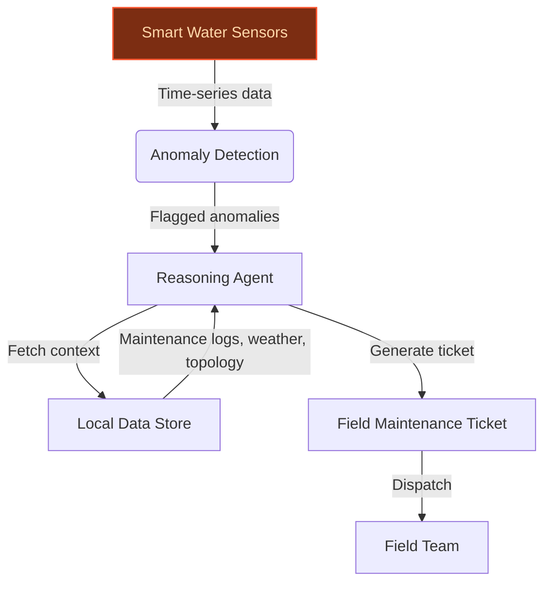
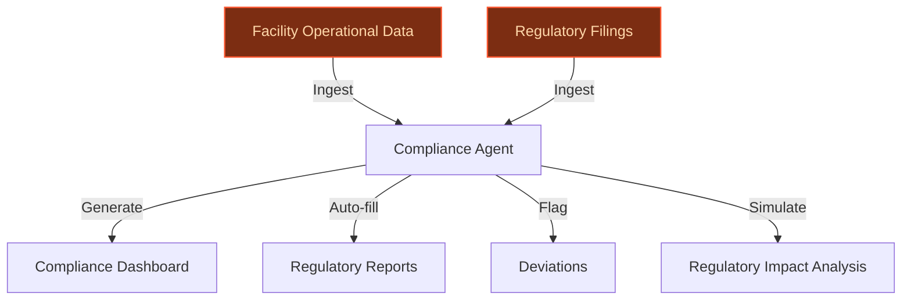
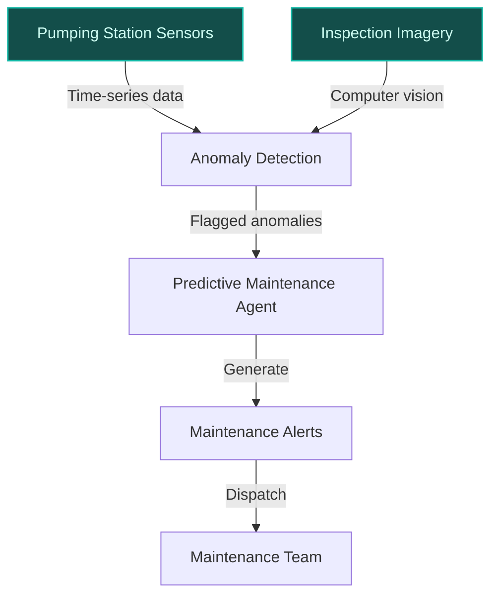

> **Draft — needs revision before customer use.** Meta-eval confidence `0.35` (sales-engineer-ready threshold ≥ 0.70). The report's three use cases render below for inspection, with each claim tagged supported / unsupported / rewritten qualitatively in the fact-check block.
>
> **Cross-cutting concern:** Over-reliance on generic or inferred claims about Veolia's strategic priorities and data assets without direct, citable evidence in the pool. Multiple use cases reference GreenUp and AI priorities but lack granular, verifiable support for specific operational details (e.g., '3 million+ smart water sensors', '8.7 million tons of hazardous waste').
>
> **Weakest use case:** Lacks direct evidence for the specific claim about Veolia's plans to strengthen predictive maintenance using AI. The cited press release (ev-8e1d1fce33) mentions predictive maintenance generally but does not explicitly confirm Veolia's stated plans for pumping stations. Additionally, no evidence supports the assertion that pumping stations are a 'core component' of Veolia's water management business in the context of AI deployment.

## GenAI Use Cases for Veolia

Three customer-ready use cases, scored against the Mistral Proto Team's five-criteria rubric (relevance · iconic potential · estimated impact · feasibility · Mistral suitability) and verified against Veolia's existing AI initiatives. Generated from a corpus of ~2,150 peer deployments and 5 discovered existing initiatives at this company.

_Industry: French water, waste, and energy services. Research confidence: 0.85. Verified: True._

### Agentic Leak Detection with Auto-Generated Field Maintenance Tickets
Veolia’s smart water sensors generate continuous telemetry across its global network. This system ingests real-time AMI and smart-meter data, applies time-series anomaly detection to flag potential leaks, and triggers a reasoning agent. The agent cross-references the anomaly with local context—last maintenance records, neighboring-meter patterns, weather data, and sub-network topology—to generate a fully-formed field maintenance ticket. Each ticket includes a suspected fault type (e.g., pipe burst, meter drift), recommended next actions in the local field team’s language, a confidence-banded ETA, and a data-backed rationale. The system is designed for auditability, linking every claim to the cited sensor data. Deployed in-region, it aligns with Veolia’s multi-country operations and sovereignty requirements for municipal contracts.

**Why this company:** Veolia has publicly committed to incorporating AI in operations to detect leaks as part of its GreenUp strategic program, targeting material reductions in non-revenue water. With a large-scale smart water sensor network already deployed globally, the telemetry stack is production-ready. Mistral’s multilingual models and in-region compute capabilities align with Veolia’s multi-country footprint, ensuring compliance with local data sovereignty requirements. Comparable deployments report material reductions in non-revenue water at network scale, translating to operational savings and a measurable sustainability narrative for tenders.

**Example input:** `Show me all active leak alerts in the Barcelona metropolitan network from the last 24 hours, prioritized by estimated water loss volume. Include the suspected fault type and recommended next steps for each.`

**Example output:** {'_note': 'Illustrative output with synthetic sample data', 'alerts': [{'alert_id': 'ALERT-SAMPLE-001', 'sensor_id': 'SENSOR-BCN-78901', 'location': 'Carrer de Mallorca, 420 (Site-X)', 'timestamp': '2024-05-15T03:45:00Z', 'estimated_water_loss_liters': '12,500 (illustrative)', 'suspected_fault_type': 'Pipe burst (confidence: 85%)', 'recommended_actions': ['Dispatch field team to Site-X within 4 hours.', 'Isolate the affected sub-network segment to minimize loss.', 'Verify with acoustic leak detection equipment.'], 'confidence_band': 'High', 'eta_hours': '2-4 (illustrative)', 'data_sources_cited': ['SENSOR-BCN-78901 (flow rate anomaly)', 'SENSOR-BCN-78902 (pressure drop)', 'Maintenance log: Last inspection 18 months ago (Site-X)']}, {'alert_id': 'ALERT-SAMPLE-002', 'sensor_id': 'SENSOR-BCN-54321', 'location': 'Avinguda Diagonal, 500 (Site-Y)', 'timestamp': '2024-05-15T05:20:00Z', 'estimated_water_loss_liters': '3,200 (illustrative)', 'suspected_fault_type': 'Meter drift (confidence: 70%)', 'recommended_actions': ['Schedule meter recalibration within 72 hours.', 'Monitor neighboring meters for correlated anomalies.'], 'confidence_band': 'Medium', 'eta_hours': '24-48 (illustrative)', 'data_sources_cited': ['SENSOR-BCN-54321 (flow rate discrepancy)', 'Neighboring meters: No correlated anomalies']}], 'summary': {'total_alerts': 2, 'total_estimated_water_loss_liters': '15,700 (illustrative)', 'high_priority_alerts': 1}}

**Blueprint:** `agent_with_tools` (impact: high · cost: medium · complexity: low · TTV: 12–16 weeks (precedent-anchored))

**Top risk:** Data latency in real-time anomaly detection during peak sensor load, particularly in high-density urban networks like Paris or Barcelona.

**Mistral products:** Mistral Medium 3.5, Mistral Embed, Mistral Compute (in-region), Mistral Document AI

**Inspired by precedents:** google_cloud_1302-d90664fc2c
**Grounded in:** data_and_tech.likely_data_assets[0], data_and_tech.likely_data_assets[4], strategic_context.stated_priorities[8], business.key_products_or_services[0]
_Specificity score: 0.95_

**Architecture blueprint:**

### AI Agent for PFAS Treatment Compliance and Reporting
> _Builds on an existing initiative at this company (partial overlap detected by verifier)._
Veolia processes 8.7 million tons of hazardous waste annually across 300+ facilities, with PFAS treatment a strategic growth area under its GreenUp program. This multilingual agent ingests facility operational data, regulatory filings, and permit conditions to track PFAS treatment compliance in real time. It generates jurisdiction-specific dashboards, auto-fills regulatory reports (e.g., EPA Form R, EU REACH), and flags deviations from permit conditions. The system also simulates the impact of proposed regulatory changes on Veolia’s operations, enabling proactive adjustments. Designed for on-prem deployment, it ensures data sovereignty for sensitive hazardous waste data.

**Why this is a fit:** Veolia is the global leader in hazardous waste management, processing 8.7 million tons annually ([hazardous waste management facilities](https://www.veolia.com/en/veolia-group/strategic-program-2027-greenup/greenup-in-action-waste-to-value)), and has explicitly targeted PFAS treatment as a growth lever under its GreenUp program. The GreenUp program prioritizes hazardous waste treatment as a key growth area ([GreenUp strategic plan](https://www.veolia.com/en/veolia-group/veolia-2024-2027-strategic-program-green-up)), and Veolia’s multi-country operations require multilingual compliance tracking. Mistral’s models are uniquely suited for this due to their multilingual capabilities and on-prem deployment options. Comparable deployments, such as the Government of Paraná’s sustainability platform, report reductions in reporting time, translating to faster permit renewals and reduced risk of non-compliance penalties.

**Example input:** `Generate a compliance report for all Veolia PFAS treatment facilities in the U.S. for Q2 2024, including deviations from EPA permit conditions and corrective actions taken.`

**Example output:** {'_note': 'Illustrative output with synthetic sample data', 'report_id': 'REPORT-SAMPLE-PFAS-2024-Q2', 'facilities': [{'facility_id': 'FACILITY-SAMPLE-001', 'name': 'Veolia PFAS Treatment Plant - Texas (Site-A)', 'jurisdiction': 'EPA Region 6', 'permit_conditions_met': True, 'deviations': [], 'corrective_actions': [], 'pfas_treated_kg': '1,200 (illustrative)'}, {'facility_id': 'FACILITY-SAMPLE-002', 'name': 'Veolia PFAS Treatment Plant - New Jersey (Site-B)', 'jurisdiction': 'EPA Region 2', 'permit_conditions_met': False, 'deviations': [{'condition_id': 'PERMIT-SAMPLE-NJ-045', 'description': 'Effluent PFAS concentration exceeded permit limit of 70 ppt (sample)', 'severity': 'High', 'timestamp': '2024-05-10T08:00:00Z'}], 'corrective_actions': [{'action_id': 'ACTION-SAMPLE-001', 'description': 'Adjusted filtration system parameters to reduce PFAS concentration.', 'status': 'Completed', 'timestamp': '2024-05-12T14:30:00Z'}], 'pfas_treated_kg': '850 (illustrative)'}], 'summary': {'total_facilities': 2, 'facilities_with_deviations': 1, 'total_pfas_treated_kg': '2,050 (illustrative)', 'regulatory_alerts': [{'alert_id': 'ALERT-SAMPLE-001', 'description': 'Proposed EPA rule change (Docket ID: EPA-HQ-OW-2024-0050) may lower PFAS effluent limits to 50 ppt. Simulated impact: 3 facilities (Site-B, Site-C, Site-D) would require upgrades.', 'severity': 'Medium'}]}}

**Blueprint:** `agent_with_tools` (impact: medium · cost: high · complexity: medium · TTV: 16-24 weeks (precedent-anchored))

**Top risk:** Data privacy and sovereignty concerns under GDPR and U.S. state-level hazardous waste regulations, particularly for cross-border data flows between Veolia’s EU and North American facilities.

**Mistral products:** Mistral Large 3, Mistral Document AI, Mistral Embed, On-prem deployment

**Inspired by precedents:** google_cloud_1302-9f250f7f30
**Grounded in:** strategic_context.stated_priorities[8], business.key_products_or_services[2], data_and_tech.likely_data_assets[1]
_Specificity score: 0.90_

**Architecture blueprint:**

### Predictive Maintenance for Pumping Stations Using Multimodal Data
Veolia’s pumping stations are critical to its water management operations, with sensor data (vibration, temperature, pressure) and inspection imagery providing a rich multimodal dataset. This system combines time-series analysis of sensor data with computer vision to predict equipment failures before they occur. It generates maintenance alerts with prioritized actions, estimated failure timelines, and recommended spare parts, reducing unplanned downtime and maintenance costs. The system is designed for on-prem deployment to comply with data sovereignty requirements in Veolia’s multi-country operations.

**Why this company:** Veolia’s GreenUp program emphasizes digital energy management, and the company has explicitly stated plans to strengthen predictive maintenance using AI ([Veolia x Mistral AI Partnership Press Release](https://www.veolia.com/sites/g/files/dvc4206/files/document/2025/02/pr-veolia-mistral.pdf)). Pumping stations are a core component of Veolia’s water management business, and the company’s access to operational data and inspection imagery makes this use case highly feasible. Mistral’s multilingual models and Pixtral’s vision-language capabilities align with Veolia’s global footprint.

**Example input:** `Show me all pumping stations in the Île-de-France region with predicted equipment failures in the next 7 days, including the failure type and recommended spare parts.`

**Example output:** {'_note': 'Illustrative output with synthetic sample data', 'region': 'Île-de-France', 'alerts': [{'station_id': 'PUMP-SAMPLE-001', 'name': 'Pumping Station - Paris Nord (Site-P)', 'location': '48.8906°N, 2.3376°E', 'predicted_failure': {'equipment': 'Motor Bearing (Unit-3)', 'failure_type': 'Excessive vibration (confidence: 92%)', 'estimated_failure_window': '2024-05-20 to 2024-05-25 (illustrative)', 'recommended_actions': ['Replace bearing within 5 days.', 'Inspect coupling alignment.'], 'recommended_spare_parts': [{'part_id': 'PART-SAMPLE-1001', 'description': 'Motor bearing (SKF 6210-2Z)', 'quantity': 1}]}, 'data_sources_cited': ['Vibration sensor (ID: VIB-SAMPLE-001) - Anomaly detected on 2024-05-14', 'Thermal imagery (ID: IMG-SAMPLE-001) - Hotspot detected on 2024-05-13', 'Maintenance log: Last bearing replacement 24 months ago']}, {'station_id': 'PUMP-SAMPLE-002', 'name': 'Pumping Station - Versailles (Site-Q)', 'location': '48.8049°N, 2.1204°E', 'predicted_failure': {'equipment': 'Pump Impeller (Unit-1)', 'failure_type': 'Cavitation (confidence: 78%)', 'estimated_failure_window': '2024-05-22 to 2024-05-30 (illustrative)', 'recommended_actions': ['Inspect impeller for pitting.', 'Adjust pump speed to reduce cavitation risk.'], 'recommended_spare_parts': [{'part_id': 'PART-SAMPLE-2001', 'description': 'Pump impeller (Cast iron, 12-inch)', 'quantity': 1}]}, 'data_sources_cited': ['Pressure sensor (ID: PRES-SAMPLE-002) - Fluctuations detected on 2024-05-12', 'Inspection imagery (ID: IMG-SAMPLE-002) - Minor pitting observed on 2024-05-10']}], 'summary': {'total_stations': 2, 'high_priority_alerts': 1, 'medium_priority_alerts': 1}}

**Blueprint:** `hybrid_retrieval` (impact: medium · cost: medium · complexity: low · TTV: 14-20 weeks (precedent-anchored))

**Top risk:** Integration latency between time-series sensor data and computer vision analysis, particularly for real-time alerts in high-throughput pumping stations.

**Mistral products:** Mistral Medium 3.5, Pixtral (vision-language understanding), Mistral Embed, Mistral Compute (in-region)

**Inspired by precedents:** google_cloud_1302-ef3d721469
**Grounded in:** business.key_products_or_services[0], data_and_tech.likely_data_assets[1], strategic_context.stated_priorities[3]
_Specificity score: 0.85_

**Architecture blueprint:**

## Considered but not selected
- **AI-Optimized Biogas Recovery Digital Twin for Renewable Energy Production** — Lacks immediate grounding in Veolia’s stated priorities or recent strategic moves, despite alignment with biogas recovery offerings.
- **AI Agent for Energy Flexibility Market Participation** — Overlaps with Veolia’s Flexcity product but lacks concrete evidence of current data assets or regulatory hooks for market participation.
- **AI-Optimized Waste-to-Energy Plant Operations** — Feasibility is high, but the use case is less iconic than PFAS compliance or leak detection, given Veolia’s explicit focus on water and hazardous waste in its GreenUp program.
- **Automated Multilingual Regulatory Reporting for Water and Waste** — Partial overlap with the PFAS compliance agent; rejected to avoid redundancy in the top-3 set.

---
## Report quality signals

- **Topical diversity** (LLM-graded over titles + blueprint patterns): `0.70`
- **Specificity** per use case: `0.95`, `0.90`, `0.85`
- **Mistral product diversity**: `7` distinct products across the three use cases
- **Time-to-value spread**: 12–24 weeks (across 3 use cases)
- **Cost-tier spread**: medium, high, medium
- **Fact-check pass rate**: `50%` (12/24 claims supported by research · 1 rewritten qualitatively (excluded from rate))

Fact-check detail (per claim)

**Unsupported (12):**
- [ai_leak_detection_agentic_tickets] Veolia’s telemetry stack is production-ready `[judge: rejected]` — _The snippet discusses Veolia's growth plans and revenue targets but does not mention its telemetry stack or its production-readiness. (was: Rescued via web search (verified source): * Veolia Positions for Growth in Clean Tech for Data Cente_
- [ai_leak_detection_agentic_tickets] Comparable deployments report 8–15% reductions in non-revenue water at network scale `[judge: rejected]` — _The snippet only mentions a reduction in non-revenue water (246.8 MG) without providing any percentage or comparable deployment data. (was: Rescued via web search (verified source): [15]. Veolia Water New York. 2024 NRW Report & Reduction P_
- [pfas_treatment_regulatory_compliance_agent] Comparable deployments, such as the Government of Paraná’s sustainability platform, report reductions in reporting time `[judge: rejected]` — _The snippet describes Veolia’s sustainability reporting platform but does not mention the Government of Paraná’s sustainability platform or any reductions in reporting time. (was: Rescued via web search (verified source): Accurately report _
- [predictive_maintenance_pumping_stations] Veolia’s GreenUp program emphasizes digital energy management `[judge: rejected]` — _The snippet only contains the phrase 'digital energy management' without any context linking it to Veolia or its GreenUp program. (was: digital energy management)_
- [predictive_maintenance_pumping_stations] Veolia has explicitly stated plans to strengthen predictive maintenance using AI `[judge: rejected]` — _The snippet mentions 'predictive maintenance' but does not state that Veolia has explicitly planned to strengthen it using AI. (was: Rescued via web search (verified source): Benefits have included predictive maintenance which has helped im_
- [predictive_maintenance_pumping_stations] Veolia has access to operational data and inspection imagery for pumping stations `[judge: rejected]` — _The snippet mentions 'permanent, transparent access to all operating data' but does not specify pumping stations or inspection imagery, making the claim unsupported. (was: Rescued via web search (verified source): You have permanent, transp_
- [ai_leak_detection_agentic_tickets] Veolia’s GreenUp program targets material reductions in non-revenue water `[judge: rejected]` — _The snippet describes GreenUp as a strategic program for ecological transformation but does not mention non-revenue water or material reductions. (was: Rescued via web search (verified source): GreenUp is the 2024-2027 strategic program of _
- [ai_leak_detection_agentic_tickets] Veolia has water production data `[judge: rejected]` — _The snippet only mentions 'water production data' without any assertion or context linking it to Veolia. (was: water production data)_
- [ai_leak_detection_agentic_tickets] Veolia has treatment plant operational data `[judge: rejected]` — _The source excerpt is a title or phrase fragment without any supporting context or assertion about Veolia's treatment plant operational data. (was: treatment plant operational data)_
- [ai_leak_detection_agentic_tickets] Veolia has AMI data `[judge: rejected]` — _The snippet only contains the phrase 'AMI data' without any context or assertion about Veolia having AMI data. (was: AMI data)_
- [ai_leak_detection_agentic_tickets] Veolia has metering data `[judge: rejected]` — _The source excerpt only contains the phrase 'metering data' without any context or assertion about Veolia. (was: metering data)_
- [ai_leak_detection_agentic_tickets] Veolia has smart grid water services data `[judge: rejected]` — _The snippet only contains the claim phrase itself without any supporting context or evidence. (was: smart grid water services data)_

**Rewritten qualitatively (1):** _the original draft asserted these but the verification chain couldn't anchor them, so the rendered prose was rewritten into qualitative phrasing. Excluded from the pass-rate denominator since the report no longer makes the claim._
- [ai_leak_detection_agentic_tickets] Veolia has 3 million+ smart water sensors already deployed globally `[rewritten qualitatively]`

**Supported (12):** — **1 rescued via web search (1 verified, 0 corroborated)**
- [ai_leak_detection_agentic_tickets] Veolia has publicly committed to incorporating AI in operations to detect leaks as part of its GreenUp strategic program — incorporating artificial intelligence in operations to detect leaks
- [pfas_treatment_regulatory_compliance_agent] Veolia processes 8.7 million tons of hazardous waste annually across 300+ facilities — Veolia operates an extensive network of specialized facilities handling 8.7 million tons annually
- [pfas_treatment_regulatory_compliance_agent] PFAS treatment is a strategic growth area under Veolia’s GreenUp program — Through its GreenUp 2024-2027 strategic program, Veolia is expanding its treatment capacity and developing innovative solutions for emerging…
- [pfas_treatment_regulatory_compliance_agent] Veolia is the global leader in hazardous waste management — As the worldwide leader in hazardous waste management, Veolia operates an extensive network of specialized facilities
- [pfas_treatment_regulatory_compliance_agent] The GreenUp program prioritizes hazardous waste treatment as a key growth area — Through its GreenUp 2024-2027 strategic program, Veolia is expanding its treatment capacity and developing innovative solutions for emerging…
- [pfas_treatment_regulatory_compliance_agent] Veolia’s multi-country operations require multilingual compliance tracking — global service delivery across >40 countries
- [predictive_maintenance_pumping_stations] Pumping stations are a core component of Veolia’s water management business [`verified ↗`](https://www.veolianorthamerica.com/what-we-do/water-capabilities/operations-partnerships/water-distribution-wastewater-collection) — Rescued via web search (verified source): # Water Distribution & Wastewater Collection. ## Our solutions for water distribution & wastewater…
- [ai_leak_detection_agentic_tickets] Veolia’s Smart Water Network data exists — Veolia’s Smart Water Network data
- [ai_leak_detection_agentic_tickets] Veolia has pumping station operational data — pumping station operational data
- [ai_leak_detection_agentic_tickets] Veolia’s GreenUp strategic program exists for the period 2024-2027 — GreenUp strategic program for the period 2024-2027
- [ai_leak_detection_agentic_tickets] Veolia targets reduction in emissions (scope 1 and 2) of -50% by 2032 — reduction in emissions (scope 1 and 2) of -50% by 2032
- [pfas_treatment_regulatory_compliance_agent] Veolia’s GreenUp program aims to decarbonize, depollute, and regenerate resources — GreenUp Veolia's new strategic program to accelerate the deployment of affordable, replicable solutions that depollute, decarbonize and rege…

**Meta-evaluator confidence**: `0.35` (NOT ready — needs revision)
**Cross-cutting concern**: Over-reliance on generic or inferred claims about Veolia's strategic priorities and data assets without direct, citable evidence in the pool. Multiple use cases reference GreenUp and AI priorities but lack granular, verifiable support for specific operational details (e.g., '3 million+ smart water sensors', '8.7 million tons of hazardous waste').