# Pipeline blueprint (architecture)

Static view of the pipeline regardless of run timing — shows agents,
models, and gates. The chronological execution log follows below.

```mermaid
flowchart TD
    Start([User: company name]) --> R
    R["<b>1. Research</b><br/>parallel: Wikipedia · Tavily news ·<br/>existing initiatives · live verification<br/><i>mistral-medium</i> synthesis"]
    R --> G["<b>1b. Gap-fill</b><br/>identify missing fields →<br/><i>mistral-small</i> generates queries →<br/>Tavily search per field →<br/><i>mistral-small</i> per-field extraction"]
    G --> Conf{Confidence ≥ 0.5<br/>OR verified<br/>OR ≥ 1 existing initiative?}
    Conf -->|no| Refuse([Refusal])
    Conf -->|yes| Ret
    Ret["<b>2. Retrieve</b><br/><i>mistral-embed</i> on company query →<br/>cosine top-K + industry/depth filter +<br/>MMR diversification"]
    Ret --> Gen["<b>3. Generate 12 candidates</b><br/><i>mistral-medium</i> with web_search tool<br/>(Tavily + deep-read) — fact citations<br/>flow into the EvidenceLedger"]
    Gen --> Score["<b>4. Score</b><br/>self-consistency: 2 parallel passes<br/><i>mistral-small</i> @ T=0.2 and T=0.4 →<br/>aggregate weighted scores"]
    Score --> Verify["<b>5. Per-candidate verify</b><br/>top-3: Tavily search + deep-read +<br/><i>mistral-small</i> verdict (pass /<br/>partial / confirmed_existing)"]
    Verify --> Enrich["<b>6. Enrich</b><br/><i>mistral-large</i> drafts customer-facing<br/>prose for 3 use cases (or<br/><i>mistral-medium</i> on fast tier)"]
    Enrich --> NumScrub["<b>6a. Numeric scrub</b><br/>flag any number not in cited content"]
    NumScrub --> Polish["<b>6b. Polish</b><br/><i>mistral-small</i> per use case (parallel):<br/>convert markers→qualitative,<br/>(ev-XXX)→[title](url)"]
    Polish --> Attr["<b>6c. Attribution check</b><br/><i>mistral-small</i> per use case (parallel):<br/>fix corpus-ID ↔ company mismatches"]
    Attr --> Meta["<b>7. Meta-evaluation</b><br/><i>mistral-medium</i> reviews report against<br/>cited precedents + ledger entries:<br/>strict claim verification"]
    Meta --> RegenQ{confidence < 0.6<br/>AND not fast tier?}
    RegenQ -->|yes| Regen["<b>7b. Targeted regen</b><br/><i>mistral-large</i> re-enriches just the<br/>weakest use case with the next-best<br/>near-miss; re-runs meta-eval"]
    RegenQ -->|no| QS
    Regen --> QS
    QS["<b>Quality signals</b><br/>LLM-graded diversity + specificity,<br/>fact-check pass rate, TTV/cost spread"]
    QS --> Render([Markdown report + trace])

    classDef agent fill:#fef3c7,stroke:#f59e0b
    classDef gate fill:#dbeafe,stroke:#3b82f6
    classDef io fill:#dcfce7,stroke:#16a34a
    class R,G,Ret,Gen,Score,Verify,Enrich,NumScrub,Polish,Attr,Meta,Regen,QS agent
    class Conf,RegenQ gate
    class Start,Refuse,Render io
```

## Execution trace — Veolia

Started: `2026-05-09T23:09:52.091199+00:00`. Total wall time: `184.0s` across `54` recorded actions.

### Per-step time totals

| Step | Calls | Total time | Avg time |
|---|---:|---:|---:|
| `research` | 1 | 6.67s | 6671ms |
| `gap_fill` | 4 | 5.01s | 1251ms |
| `retrieve` | 2 | 0.56s | 280ms |
| `generate` | 2 | 30.69s | 15344ms |
| `generate.web_search` | 2 | 5.57s | 2783ms |
| `score` | 2 | 34.11s | 17054ms |
| `verify` | 6 | 17.59s | 2932ms |
| `enrich` | 1 | 68.27s | 68268ms |
| `polish` | 3 | 8.14s | 2712ms |
| `meta_eval` | 1 | 12.55s | 12549ms |
| `web_verify` | 1 | 4.27s | 4268ms |
| `source_judge` | 26 | 20.73s | 797ms |
| `final_qualify` | 1 | 1.97s | 1975ms |
| `quality_signals` | 2 | 3.72s | 1859ms |

### Chronological event log

- `23:09:54.969` **[research]** `mistral-medium-2604.chat.complete` — 6671ms
   - inputs: synthesize CompanyContext for Veolia | depth=medium
   - outputs: industry='French water, waste, and energy services' verified=True conf=0.75
- `23:10:01.642` **[gap_fill]** `mistral-small-2603.chat.complete` — 876ms
   - inputs: generate gap queries | fields=['business_model', 'products', 'data_assets', 'priorities']
   - outputs: queries=4
- `23:10:08.986` **[gap_fill]** `mistral-small-2603.chat.complete` — 2757ms
   - inputs: layer-2 extract field=priorities
   - outputs: items=10
- `23:10:08.991` **[gap_fill]** `mistral-small-2603.chat.complete` — 775ms
   - inputs: layer-2 extract field=data_assets
   - outputs: items=7
- `23:10:08.995` **[gap_fill]** `mistral-small-2603.chat.complete` — 598ms
   - inputs: layer-2 extract field=products
   - outputs: items=3
- `23:10:11.744` **[retrieve]** `mistral-embed.embeddings.create` — 220ms
   - inputs: company_query | industries='French water, waste, and energy services'
   - outputs: embedded 1024-dim query vector
- `23:10:11.965` **[retrieve]** `precedent_corpus.cosine_topk` — 340ms
   - inputs: k=8 min_depth=0.4 target='Veolia'
   - outputs: retrieved 8 | mmr=True | top_sim=0.790
- `23:10:13.345` **[generate]** `mistral-medium-2604.chat.complete` — 2563ms
   - inputs: iteration=0 tool_calls_used=0/2 tools=on
   - outputs: tool_calls=4 | content_chars=0
- `23:10:15.928` **[generate.web_search]** `tavily.search` — 3266ms
   - inputs: query='Veolia smart meter deployment scale 2025'
   - outputs: 2 raw results
- `23:10:20.632` **[generate.web_search]** `tavily.search` — 2299ms
   - inputs: query='Veolia GreenUp strategic program details 2024-2027'
   - outputs: 2 raw results
- `23:10:25.130` **[generate]** `mistral-medium-2604.chat.complete` — 28124ms
   - inputs: iteration=1 tool_calls_used=2/2 tools=off
   - outputs: tool_calls=0 | content_chars=21215
- `23:10:53.683` **[score]** `mistral-small-2603.chat.complete` — 16820ms
   - inputs: self-consistency pass T=0.2
   - outputs: scored 12 candidates
- `23:10:53.688` **[score]** `mistral-small-2603.chat.complete` — 17288ms
   - inputs: self-consistency pass T=0.4
   - outputs: scored 12 candidates
- `23:11:11.008` **[verify]** `tavily.search` — 2190ms
   - inputs: candidate=ai_leak_detection_agentic_tickets | query='Veolia Agentic Leak Detection with Auto-Generated Field Main'
   - outputs: 4 results
- `23:11:11.009` **[verify]** `tavily.search` — 2332ms
   - inputs: candidate=pfas_treatment_regulatory_compliance_agent | query='Veolia AI Agent for PFAS Treatment Compliance and Reporting '
   - outputs: 4 results
- `23:11:11.009` **[verify]** `tavily.search` — 2619ms
   - inputs: candidate=predictive_maintenance_pumping_stations | query='Veolia Predictive Maintenance for Pumping Stations Using Mul'
   - outputs: 4 results
- `23:11:13.564` **[verify]** `mistral-small-2603.chat.complete` — 1663ms
   - inputs: verdict for ai_leak_detection_agentic_tickets
   - outputs: verdict='pass'
- `23:11:13.866` **[verify]** `mistral-small-2603.chat.complete` — 3374ms
   - inputs: verdict for predictive_maintenance_pumping_stations
   - outputs: verdict='pass'
- `23:11:14.105` **[verify]** `mistral-small-2603.chat.complete` — 5413ms
   - inputs: verdict for pfas_treatment_regulatory_compliance_agent
   - outputs: verdict='partial_overlap'
- `23:11:19.522` **[enrich]** `mistral-large-2512.chat.complete` — 68268ms
   - inputs: tier=standard top_3=['ai_leak_detection_agentic_tickets', 'pfas_treatment_regulatory_compliance_agent', 'predictive_maintenance_pumping_stations']
   - outputs: enriched 3 use cases
- `23:12:27.821` **[polish]** `mistral-small-2603.chat.complete` — 2876ms
   - inputs: use_case=ai_leak_detection_agentic_tickets unanchored=True opaque_ev=False
   - outputs: polished 5 fields
- `23:12:27.826` **[polish]** `mistral-small-2603.chat.complete` — 2869ms
   - inputs: use_case=pfas_treatment_regulatory_compliance_agent unanchored=True opaque_ev=False
   - outputs: polished 5 fields
- `23:12:27.830` **[polish]** `mistral-small-2603.chat.complete` — 2390ms
   - inputs: use_case=predictive_maintenance_pumping_stations unanchored=True opaque_ev=False
   - outputs: polished 5 fields
- `23:12:30.700` **[meta_eval]** `mistral-medium-2604.chat.complete` — 12549ms
   - inputs: reviewing 3 use cases
   - outputs: review + claims
- `23:12:43.267` **[web_verify]** `tavily.search.rescue_unsupported_claims` — 4268ms
   - inputs: company='Veolia' unsupported=7 budget=12
   - outputs: rescued: verified=7 corroborated=0 of 7 attempted
- `23:12:47.537` **[source_judge]** `mistral-small-2603.judge_claim_sources` — 2556ms
   - inputs: pairs=25
   - outputs: judged 25 pairs
- `23:12:47.537` **[source_judge]** `mistral-small-2603.chat.complete` — 916ms
   - inputs: claim='Veolia has publicly committed to incorporating AI in operati'
   - outputs: verdict=supported
- `23:12:47.541` **[source_judge]** `mistral-small-2603.chat.complete` — 1965ms
   - inputs: claim='Veolia has 3 million+ smart water sensors already deployed g'
   - outputs: verdict=unsupported
- `23:12:47.545` **[source_judge]** `mistral-small-2603.chat.complete` — 808ms
   - inputs: claim='Veolia’s telemetry stack is production-ready'
   - outputs: verdict=unsupported
- `23:12:47.549` **[source_judge]** `mistral-small-2603.chat.complete` — 986ms
   - inputs: claim='Comparable deployments report 8–15% reductions in non-revenu'
   - outputs: verdict=unsupported
- `23:12:47.552` **[source_judge]** `mistral-small-2603.chat.complete` — 820ms
   - inputs: claim='Veolia processes 8.7 million tons of hazardous waste annuall'
   - outputs: verdict=supported
- `23:12:47.556` **[source_judge]** `mistral-small-2603.chat.complete` — 904ms
   - inputs: claim='PFAS treatment is a strategic growth area under Veolia’s Gre'
   - outputs: verdict=supported
- `23:12:47.562` **[source_judge]** `mistral-small-2603.chat.complete` — 749ms
   - inputs: claim='Veolia is the global leader in hazardous waste management'
   - outputs: verdict=supported
- `23:12:47.565` **[source_judge]** `mistral-small-2603.chat.complete` — 847ms
   - inputs: claim='The GreenUp program prioritizes hazardous waste treatment as'
   - outputs: verdict=supported
- `23:12:48.310` **[source_judge]** `mistral-small-2603.chat.complete` — 725ms
   - inputs: claim='Veolia’s multi-country operations require multilingual compl'
   - outputs: verdict=supported
- `23:12:48.354` **[source_judge]** `mistral-small-2603.chat.complete` — 593ms
   - inputs: claim='Comparable deployments, such as the Government of Paraná’s s'
   - outputs: verdict=unsupported
- `23:12:48.373` **[source_judge]** `mistral-small-2603.chat.complete` — 602ms
   - inputs: claim='Veolia’s GreenUp program emphasizes digital energy managemen'
   - outputs: verdict=unsupported
- `23:12:48.413` **[source_judge]** `mistral-small-2603.chat.complete` — 539ms
   - inputs: claim='Veolia has explicitly stated plans to strengthen predictive '
   - outputs: verdict=unsupported
- `23:12:48.454` **[source_judge]** `mistral-small-2603.chat.complete` — 597ms
   - inputs: claim='Pumping stations are a core component of Veolia’s water mana'
   - outputs: verdict=supported
- `23:12:48.461` **[source_judge]** `mistral-small-2603.chat.complete` — 678ms
   - inputs: claim='Veolia has access to operational data and inspection imagery'
   - outputs: verdict=unsupported
- `23:12:48.535` **[source_judge]** `mistral-small-2603.chat.complete` — 633ms
   - inputs: claim='Veolia’s GreenUp program targets material reductions in non-'
   - outputs: verdict=unsupported
- `23:12:48.947` **[source_judge]** `mistral-small-2603.chat.complete` — 545ms
   - inputs: claim='Veolia’s Smart Water Network data exists'
   - outputs: verdict=supported
- `23:12:48.952` **[source_judge]** `mistral-small-2603.chat.complete` — 496ms
   - inputs: claim='Veolia has water production data'
   - outputs: verdict=unsupported
- `23:12:48.975` **[source_judge]** `mistral-small-2603.chat.complete` — 425ms
   - inputs: claim='Veolia has pumping station operational data'
   - outputs: verdict=supported
- `23:12:49.035` **[source_judge]** `mistral-small-2603.chat.complete` — 576ms
   - inputs: claim='Veolia has treatment plant operational data'
   - outputs: verdict=unsupported
- `23:12:49.051` **[source_judge]** `mistral-small-2603.chat.complete` — 701ms
   - inputs: claim='Veolia has AMI data'
   - outputs: verdict=unsupported
- `23:12:49.139` **[source_judge]** `mistral-small-2603.chat.complete` — 646ms
   - inputs: claim='Veolia has metering data'
   - outputs: verdict=unsupported
- `23:12:49.168` **[source_judge]** `mistral-small-2603.chat.complete` — 596ms
   - inputs: claim='Veolia has smart grid water services data'
   - outputs: verdict=unsupported
- `23:12:49.400` **[source_judge]** `mistral-small-2603.chat.complete` — 692ms
   - inputs: claim='Veolia’s GreenUp strategic program exists for the period 202'
   - outputs: verdict=supported
- `23:12:49.448` **[source_judge]** `mistral-small-2603.chat.complete` — 572ms
   - inputs: claim='Veolia targets reduction in emissions (scope 1 and 2) of -50'
   - outputs: verdict=supported
- `23:12:49.492` **[source_judge]** `mistral-small-2603.chat.complete` — 566ms
   - inputs: claim='Veolia’s GreenUp program aims to decarbonize, depollute, and'
   - outputs: verdict=supported
- `23:12:50.095` **[final_qualify]** `mistral-small-2603.chat.complete` — 1975ms
   - inputs: use_case=ai_leak_detection_agentic_tickets unsupported=1
   - outputs: qualified 4 fields
- `23:12:52.327` **[quality_signals]** `mistral-small-2603.chat.complete` — 2437ms
   - inputs: specificity grade (3 use cases)
   - outputs: scored 3 use cases
- `23:12:54.764` **[quality_signals]** `mistral-small-2603.chat.complete` — 1282ms
   - inputs: diversity grade
   - outputs: diversity=0.7

## Mermaid sequence diagram (execution)

```mermaid
sequenceDiagram
    autonumber
    participant pipeline as pipeline
    participant mistral_medium_2604 as mistral-medium-2604
    participant mistral_small_2603 as mistral-small-2603
    participant mistral_embed as mistral-embed
    participant precedent_corpus as precedent_corpus
    participant tavily as tavily
    participant mistral_large_2512 as mistral-large-2512
    participant tavily_search as tavily.search
    pipeline->>mistral_medium_2604: research: chat.complete (6671ms)
    mistral_medium_2604-->>pipeline: industry='French water, waste, and energy services' verified
    pipeline->>mistral_small_2603: gap_fill: chat.complete (876ms)
    mistral_small_2603-->>pipeline: queries=4
    pipeline->>mistral_small_2603: gap_fill: chat.complete (2757ms)
    mistral_small_2603-->>pipeline: items=10
    pipeline->>mistral_small_2603: gap_fill: chat.complete (775ms)
    mistral_small_2603-->>pipeline: items=7
    pipeline->>mistral_small_2603: gap_fill: chat.complete (598ms)
    mistral_small_2603-->>pipeline: items=3
    pipeline->>mistral_embed: retrieve: embeddings.create (220ms)
    mistral_embed-->>pipeline: embedded 1024-dim query vector
    pipeline->>precedent_corpus: retrieve: cosine_topk (340ms)
    precedent_corpus-->>pipeline: retrieved 8 | mmr=True | top_sim=0.790
    pipeline->>mistral_medium_2604: generate: chat.complete (2563ms)
    mistral_medium_2604-->>pipeline: tool_calls=4 | content_chars=0
    pipeline->>tavily: generate.web_search: search (3266ms)
    tavily-->>pipeline: 2 raw results
    pipeline->>tavily: generate.web_search: search (2299ms)
    tavily-->>pipeline: 2 raw results
    pipeline->>mistral_medium_2604: generate: chat.complete (28124ms)
    mistral_medium_2604-->>pipeline: tool_calls=0 | content_chars=21215
    pipeline->>mistral_small_2603: score: chat.complete (16820ms)
    mistral_small_2603-->>pipeline: scored 12 candidates
    pipeline->>mistral_small_2603: score: chat.complete (17288ms)
    mistral_small_2603-->>pipeline: scored 12 candidates
    pipeline->>tavily: verify: search (2190ms)
    tavily-->>pipeline: 4 results
    pipeline->>tavily: verify: search (2332ms)
    tavily-->>pipeline: 4 results
    pipeline->>tavily: verify: search (2619ms)
    tavily-->>pipeline: 4 results
    pipeline->>mistral_small_2603: verify: chat.complete (1663ms)
    mistral_small_2603-->>pipeline: verdict='pass'
    pipeline->>mistral_small_2603: verify: chat.complete (3374ms)
    mistral_small_2603-->>pipeline: verdict='pass'
    pipeline->>mistral_small_2603: verify: chat.complete (5413ms)
    mistral_small_2603-->>pipeline: verdict='partial_overlap'
    pipeline->>mistral_large_2512: enrich: chat.complete (68268ms)
    mistral_large_2512-->>pipeline: enriched 3 use cases
    pipeline->>mistral_small_2603: polish: chat.complete (2876ms)
    mistral_small_2603-->>pipeline: polished 5 fields
    pipeline->>mistral_small_2603: polish: chat.complete (2869ms)
    mistral_small_2603-->>pipeline: polished 5 fields
    pipeline->>mistral_small_2603: polish: chat.complete (2390ms)
    mistral_small_2603-->>pipeline: polished 5 fields
    pipeline->>mistral_medium_2604: meta_eval: chat.complete (12549ms)
    mistral_medium_2604-->>pipeline: review + claims
    pipeline->>tavily_search: web_verify: rescue_unsupported_claims (4268ms)
    tavily_search-->>pipeline: rescued: verified=7 corroborated=0 of 7 attempted
    pipeline->>mistral_small_2603: source_judge: judge_claim_sources (2556ms)
    mistral_small_2603-->>pipeline: judged 25 pairs
    pipeline->>mistral_small_2603: source_judge: chat.complete (916ms)
    mistral_small_2603-->>pipeline: verdict=supported
    pipeline->>mistral_small_2603: source_judge: chat.complete (1965ms)
    mistral_small_2603-->>pipeline: verdict=unsupported
    pipeline->>mistral_small_2603: source_judge: chat.complete (808ms)
    mistral_small_2603-->>pipeline: verdict=unsupported
    pipeline->>mistral_small_2603: source_judge: chat.complete (986ms)
    mistral_small_2603-->>pipeline: verdict=unsupported
    pipeline->>mistral_small_2603: source_judge: chat.complete (820ms)
    mistral_small_2603-->>pipeline: verdict=supported
    pipeline->>mistral_small_2603: source_judge: chat.complete (904ms)
    mistral_small_2603-->>pipeline: verdict=supported
    pipeline->>mistral_small_2603: source_judge: chat.complete (749ms)
    mistral_small_2603-->>pipeline: verdict=supported
    pipeline->>mistral_small_2603: source_judge: chat.complete (847ms)
    mistral_small_2603-->>pipeline: verdict=supported
    pipeline->>mistral_small_2603: source_judge: chat.complete (725ms)
    mistral_small_2603-->>pipeline: verdict=supported
    pipeline->>mistral_small_2603: source_judge: chat.complete (593ms)
    mistral_small_2603-->>pipeline: verdict=unsupported
    pipeline->>mistral_small_2603: source_judge: chat.complete (602ms)
    mistral_small_2603-->>pipeline: verdict=unsupported
    pipeline->>mistral_small_2603: source_judge: chat.complete (539ms)
    mistral_small_2603-->>pipeline: verdict=unsupported
    pipeline->>mistral_small_2603: source_judge: chat.complete (597ms)
    mistral_small_2603-->>pipeline: verdict=supported
    pipeline->>mistral_small_2603: source_judge: chat.complete (678ms)
    mistral_small_2603-->>pipeline: verdict=unsupported
    pipeline->>mistral_small_2603: source_judge: chat.complete (633ms)
    mistral_small_2603-->>pipeline: verdict=unsupported
    pipeline->>mistral_small_2603: source_judge: chat.complete (545ms)
    mistral_small_2603-->>pipeline: verdict=supported
    pipeline->>mistral_small_2603: source_judge: chat.complete (496ms)
    mistral_small_2603-->>pipeline: verdict=unsupported
    pipeline->>mistral_small_2603: source_judge: chat.complete (425ms)
    mistral_small_2603-->>pipeline: verdict=supported
    pipeline->>mistral_small_2603: source_judge: chat.complete (576ms)
    mistral_small_2603-->>pipeline: verdict=unsupported
    pipeline->>mistral_small_2603: source_judge: chat.complete (701ms)
    mistral_small_2603-->>pipeline: verdict=unsupported
    pipeline->>mistral_small_2603: source_judge: chat.complete (646ms)
    mistral_small_2603-->>pipeline: verdict=unsupported
    pipeline->>mistral_small_2603: source_judge: chat.complete (596ms)
    mistral_small_2603-->>pipeline: verdict=unsupported
    pipeline->>mistral_small_2603: source_judge: chat.complete (692ms)
    mistral_small_2603-->>pipeline: verdict=supported
    pipeline->>mistral_small_2603: source_judge: chat.complete (572ms)
    mistral_small_2603-->>pipeline: verdict=supported
    pipeline->>mistral_small_2603: source_judge: chat.complete (566ms)
    mistral_small_2603-->>pipeline: verdict=supported
    pipeline->>mistral_small_2603: final_qualify: chat.complete (1975ms)
    mistral_small_2603-->>pipeline: qualified 4 fields
    pipeline->>mistral_small_2603: quality_signals: chat.complete (2437ms)
    mistral_small_2603-->>pipeline: scored 3 use cases
    pipeline->>mistral_small_2603: quality_signals: chat.complete (1282ms)
    mistral_small_2603-->>pipeline: diversity=0.7
```

