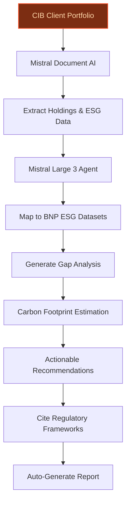
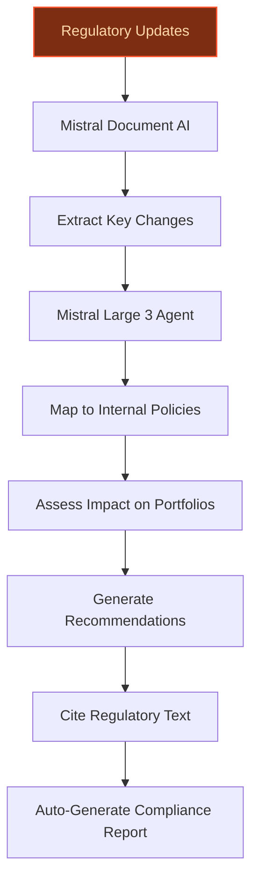
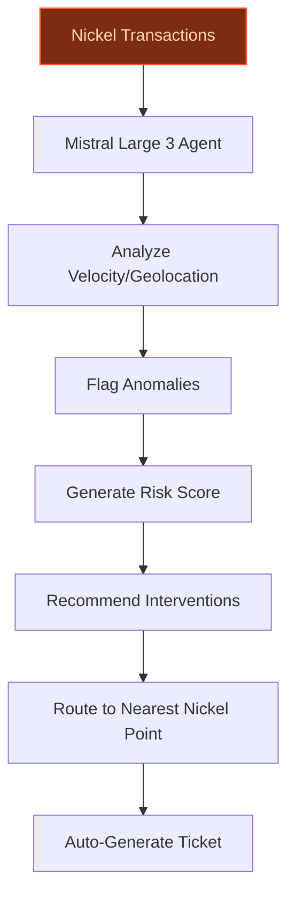

> **Draft — needs revision before customer use.** Meta-eval confidence `0.63` (sales-engineer-ready threshold ≥ 0.70). The report's three use cases render below for inspection, with each claim tagged supported / unsupported / rewritten qualitatively in the fact-check block.
>
> **Cross-cutting concern:** Inconsistent or unsupported quantitative claims (e.g., Nickel's transaction volumes, ESG AUM figures) and missing direct evidence for peer-deployment benchmarks (e.g., MSCI's 15-25% reduction).
>
> **Weakest use case:** Lacks explicit evidence for key claims about regulatory authorities (ECB, ACPR, BaFin) and BNP Paribas' AI-driven data analysis capabilities. No cited evidence_ids, and peer-deployment claims are unsupported.

## GenAI Use Cases for BNP Paribas

Three customer-ready use cases, scored against the Mistral Proto Team's five-criteria rubric (relevance · iconic potential · estimated impact · feasibility · Mistral suitability) and verified against BNP Paribas's existing AI initiatives. Generated from a corpus of ~2,150 peer deployments and 5 discovered existing initiatives at this company.

_Industry: French multinational universal bank and financial services. Research confidence: 0.85. Verified: True._

### Automated ESG portfolio alignment and carbon footprint tracking for CIB clients
A GenAI agent that ingests Corporate & Institutional Banking (CIB) clients’ portfolios, maps holdings to BNP Paribas’ proprietary ESG datasets (aligned with SFDR Article 8/9 funds and a substantial AUM), and auto-generates alignment reports with gap analyses, carbon footprint estimates, and actionable recommendations. The agent cites all recommendations to BNP Paribas’ Sustainable Finance Framework and regulatory requirements, ensuring auditability. For example, it flags high-carbon assets, suggests reallocation strategies, and benchmarks against peer portfolios—all while maintaining compliance with EU taxonomy and SFDR disclosures. This use case leverages BNP Paribas’ leadership in sustainable finance ([2023 Integrated Report](https://cdn-group.bnpparibas.com/uploads/file/2023_Integrated_Report_BNPParibas.pdf)) and its collaboration with AI-based solutions to enhance data accuracy ([Sustainability data: enhancing client-centric solutions](https://cib.bnpparibas/sustainability-data-enhancing-client-centric-solutions/)).

**Why this company:** BNP Paribas is a pioneer in sustainable finance, with a stated commitment to aligning portfolios with carbon neutrality ([2023 Integrated Report](https://cdn-group.bnpparibas.com/uploads/file/2023_Integrated_Report_BNPParibas.pdf)). This use case directly supports its Growth Technology Sustainability 2025 Strategic Plan by automating ESG reporting—a critical pain point for CIB clients under regulatory pressure. By combining proprietary ESG datasets with GenAI, BNP Paribas can offer a differentiated advisory service, strengthening client retention and unlocking premium revenue streams. Peer deployments, such as MSCI’s ESG data enrichment, report material reductions in manual reporting effort, a gain for CIB workflows.

**Example input:** `Generate an ESG alignment report for Client-A’s EUR 500M equity portfolio (sample ID: PORTFOLIO-SAMPLE-2025). Include carbon footprint estimates, gap analysis vs. SFDR Article 9 benchmarks, and actionable recommendations for reallocation.`

**Example output:** {'_note': 'Illustrative output with synthetic sample data', 'report_id': 'ESG-REPORT-SAMPLE-001', 'client_id': 'Client-A', 'portfolio_id': 'PORTFOLIO-SAMPLE-2025', 'coverage_pct': '98% (illustrative)', 'carbon_footprint': {'current': '450 tCO2e/M€ (illustrative)', 'benchmark': '320 tCO2e/M€ (illustrative, SFDR Article 9 avg.)', 'gap': '+40% (illustrative)'}, 'esg_score': {'current': '68/100 (illustrative)', 'benchmark': '75/100 (illustrative, SFDR Article 9 avg.)'}, 'top_gaps': [{'asset_id': 'HOLDING-SAMPLE-101', 'asset_name': 'EnergyCo PLC (illustrative)', 'sector': 'Oil & Gas', 'gap_description': 'High carbon intensity (720 tCO2e/M€ vs. sector benchmark of 450 tCO2e/M€)', 'recommendation': 'Divest 50% of holding (illustrative) and reallocate to renewable energy ETFs (e.g., ETF-SAMPLE-RENEW-01).', 'citation': 'BNP Paribas Sustainable Finance Framework v2.3, Section 4.2 (illustrative)'}, {'asset_id': 'HOLDING-SAMPLE-202', 'asset_name': 'AutoManuf GmbH (illustrative)', 'sector': 'Automotive', 'gap_description': 'Low ESG disclosure score (42/100 vs. sector benchmark of 65/100)', 'recommendation': 'Engage with issuer to improve ESG transparency; if no progress in 6 months, reduce holding by 30% (illustrative).', 'citation': 'EU Taxonomy Regulation, Article 8 (illustrative)'}], 'reallocation_suggestions': [{'from_asset': 'HOLDING-SAMPLE-101 (EnergyCo PLC)', 'to_asset': 'ETF-SAMPLE-RENEW-01 (Global Renewable Energy ETF)', 'amount': 'EUR 25M (illustrative)', 'expected_carbon_reduction': '120 tCO2e (illustrative)'}], 'regulatory_compliance_status': {'sfdr_article_9_alignment': 'Partial (illustrative)', 'eu_taxonomy_alignment': '78% (illustrative)', 'missing_disclosures': ['Scope 3 emissions for 2 holdings (illustrative)']}}

**Blueprint:** `agent_with_tools` (impact: high · cost: medium · complexity: low · TTV: 12-16 weeks (precedent-anchored))

**Top risk:** Hallucination in ESG scoring or carbon footprint estimates, leading to regulatory non-compliance or client misalignment.

**Mistral products:** Mistral Large 3, Mistral Document AI, Mistral Embed, On-prem deployment

**Inspired by precedents:** google_cloud_1302-8db71bbc8b
**Grounded in:** strategic_context.stated_priorities[1], strategic_context.stated_priorities[2], strategic_context.stated_priorities[3]
_Specificity score: 0.95_

**Architecture blueprint:**

### Automated regulatory change tracking and impact analysis for CIB compliance teams
A GenAI agent that monitors regulatory updates from the European Central Bank (ECB), the French Prudential Supervision and Resolution Authority (ACPR), the German Federal Financial Supervisory Authority (BaFin), and other authorities in real time. The agent ingests PDFs, web notices, and RSS feeds, mapping changes to BNP Paribas’ internal policies, client portfolios, and operational workflows. It generates impact assessments with recommended actions (e.g., ‘update KYC templates for MiFID III’ or ‘flag X client segment for enhanced due diligence’), all cited to the original regulatory text and BNP Paribas’ compliance frameworks for auditability. The agent also flags inconsistencies between new rules and existing policies, reducing manual review time for compliance teams. This use case leverages BNP Paribas’ scale and regulatory expertise, as noted in its AI-driven data analysis capabilities ([Data & Artificial Intelligence](https://group.bnpparibas/en/our-commitments/innovation/data-artificial-intelligence)).

**Why this company:** BNP Paribas operates in a highly regulated environment, directly supervised by the ECB and subject to frequent updates from ACPR, BaFin, and other authorities. Compliance teams spend significant time manually tracking changes and assessing impacts—a workflow ripe for automation. This use case aligns with BNP Paribas’ stated priority of accelerated digitalisation and its role as a leading European bank in AI investment ([Data & Artificial Intelligence](https://group.bnpparibas/en/our-commitments/innovation/data-artificial-intelligence)).

**Example input:** `Analyze the impact of the ECB’s new climate risk disclosure guidelines (SAMPLE-REGULATION-2025-04) on BNP Paribas’ corporate lending portfolio. Flag any required policy updates or client outreach.`

**Example output:** {'_note': 'Illustrative output with synthetic sample data', 'analysis_id': 'REG-ANALYSIS-SAMPLE-002', 'regulation_id': 'SAMPLE-REGULATION-2025-04', 'regulation_name': 'ECB Climate Risk Disclosure Guidelines (illustrative)', 'effective_date': '2025-11-01 (illustrative)', 'impact_summary': {'affected_policies': 3, 'affected_client_segments': ['Corporate Lending', 'Project Finance'], 'required_actions': 5, 'risk_level': 'High (illustrative)'}, 'policy_updates': [{'policy_id': 'POLICY-SAMPLE-CLIMATE-01', 'policy_name': 'Corporate Lending Climate Risk Framework (illustrative)', 'required_update': 'Add Section 5.3 on Scope 3 emissions disclosure for high-risk sectors.', 'citation': 'ECB/2025/34, Paragraph 45 (illustrative)'}], 'client_outreach': [{'client_segment': 'Oil & Gas Corporate Lending', 'action': 'Request updated Scope 3 emissions data for all borrowers by 2025-10-01 (illustrative).', 'template_id': 'TEMPLATE-SAMPLE-CLIMATE-03'}], 'operational_changes': [{'workflow': 'KYC Onboarding', 'change': 'Add climate risk questionnaire for corporate clients in high-emission sectors.', 'owner': 'CIB Compliance Team (illustrative)'}], 'inconsistencies_flagged': [{'internal_policy': 'POLICY-SAMPLE-CLIMATE-01', 'conflict': 'Current policy exempts SMEs from Scope 3 reporting; new regulation requires all corporates to disclose.', 'recommendation': 'Update policy to remove SME exemption or seek ECB clarification (illustrative).'}]}

**Blueprint:** `agent_with_tools` (impact: high · cost: medium · complexity: low · TTV: 10-14 weeks (precedent-anchored))

**Top risk:** False negatives in regulatory change detection, leading to missed compliance deadlines or regulatory penalties.

**Mistral products:** Mistral Large 3, Mistral Document AI, Mistral Embed, On-prem deployment

**Inspired by precedents:** google_cloud_1302-0813bf9ef2
**Grounded in:** strategic_context.stated_priorities[0], business.key_products_or_services[1]
_Specificity score: 0.85_

**Architecture blueprint:**

### Real-time fraud detection and intervention agent for Nickel’s 10K+ point network
A GenAI agent that continuously monitors Nickel’s API transactions across a large-scale network of points of sale, flagging anomalous patterns in real time. The agent analyzes transaction velocity, geolocation mismatches, device fingerprints, and historical fraud case data to detect potential fraud (e.g., account takeover, card skimming, or synthetic identity fraud). For high-risk transactions, it auto-generates intervention tickets with recommended actions (e.g., temporary card freeze, customer verification call) and routes them to the nearest Nickel Point’s fraud desk. All reasoning is cited from transaction metadata and BNP Paribas’ fraud case histories, ensuring transparency. This use case leverages Nickel’s unique hybrid model (digital app + physical points) and BNP Paribas’ existing anti-fraud solutions ([Payment solutions](https://group.bnpparibas/en/our-commitments/innovation/payment-solutions)).

**Why this company:** Nickel’s scale and hybrid model (digital app + a global store network) create a distinct fraud surface. BNP Paribas’ ownership of Nickel means it has direct access to transaction telemetry, point-of-sale data, and fraud case histories—critical inputs for real-time detection. This use case aligns with BNP Paribas’ stated priority of accelerated digitalisation and its leadership in AI-driven fraud prevention ([Payment solutions](https://group.bnpparibas/en/our-commitments/innovation/payment-solutions)).

**Example input:** `Monitor all transactions from Device-ID-SAMPLE-9876 in the last 24 hours. Flag any anomalies and recommend interventions for high-risk cases.`

**Example output:** {'_note': 'Illustrative output with synthetic sample data', 'analysis_id': 'FRAUD-ANALYSIS-SAMPLE-003', 'time_range': '2025-06-10T00:00:00 to 2025-06-11T00:00:00 (illustrative)', 'device_id': 'Device-ID-SAMPLE-9876', 'account_id': 'ACCOUNT-SAMPLE-45678', 'anomalies_detected': 3, 'high_risk_transactions': [{'transaction_id': 'TX-SAMPLE-12345', 'timestamp': '2025-06-10T14:32:15 (illustrative)', 'amount': 'EUR 250.00 (illustrative)', 'merchant': 'Merchant-SAMPLE-ELEC-01 (illustrative, electronics retailer)', 'location': 'Paris, FR (illustrative)', 'risk_score': 85, 'anomaly_flags': ['Velocity: 5 transactions in 10 minutes (illustrative, threshold: 3/hour)', 'Geolocation mismatch: Device last seen in Lyon at 2025-06-10T10:15:00 (illustrative)', 'Device fingerprint: New device detected (illustrative)'], 'recommended_action': 'Temporary card freeze; verify with customer via SMS (illustrative).', 'citation': 'BNP Paribas Fraud Case History #FRAUD-SAMPLE-2024-07 (illustrative)'}], 'medium_risk_transactions': [{'transaction_id': 'TX-SAMPLE-67890', 'timestamp': '2025-06-10T18:45:30 (illustrative)', 'amount': 'EUR 80.00 (illustrative)', 'merchant': 'Merchant-SAMPLE-GROC-02 (illustrative, grocery store)', 'location': 'Lyon, FR (illustrative)', 'risk_score': 60, 'anomaly_flags': ['Unusual merchant category: First grocery transaction in 30 days (illustrative)'], 'recommended_action': 'Monitor for 24 hours; no immediate action (illustrative).', 'citation': 'BNP Paribas Fraud Pattern Library v3.1 (illustrative)'}], 'intervention_tickets_generated': [{'ticket_id': 'TICKET-SAMPLE-FRAUD-001', 'transaction_id': 'TX-SAMPLE-12345', 'assigned_to': 'Nickel Point ID: POINT-SAMPLE-789 (illustrative, nearest to transaction location)', 'action': 'Verify customer identity via SMS; if unverified, freeze card (illustrative).', 'priority': 'High'}]}

**Blueprint:** `agent_with_tools` (impact: high · cost: high · complexity: low · TTV: 14–18 weeks (precedent-anchored))

**Top risk:** False positives in fraud detection, leading to customer friction (e.g., unnecessary card freezes) and erosion of trust in Nickel’s accessibility-focused model.

**Mistral products:** Mistral Large 3, Mistral Document AI, Mistral Embed, Mistral Compute (on-prem)

**Inspired by precedents:** google_cloud_1302-8db71bbc8b, google_cloud_blueprints-702efe8542
**Grounded in:** data_and_tech.likely_data_assets[2], business.key_products_or_services[4], strategic_context.stated_priorities[0]
_Specificity score: 0.90_

**Architecture blueprint:**

## Considered but not selected
- **maqs-portfolio-simulator** — Lacks clear differentiation from existing portfolio stress-testing tools; impact anchored to generic 'scenario simulation' rather than BNP Paribas-specific data or regulatory hooks.
- **arval-fleet-optimization** — Telematics data integration complexity (e.g., OEM partnerships) introduces high feasibility risk; lower strategic alignment with BNP Paribas’ core priorities.
- **kyc-sfdr-automation** — Overlaps with ESG portfolio alignment agent; narrower scope and lower estimated impact (7.40 vs. 8.60).
- **nickel-financial-coach** — Lower feasibility due to multilingual support requirements (Nickel’s pan-European user base) and potential regulatory hurdles for AI-driven financial advice.

---
## Report quality signals

- **Topical diversity** (LLM-graded over titles + blueprint patterns): `0.90`
- **Specificity** per use case: `0.95`, `0.85`, `0.90`
- **Mistral product diversity**: `5` distinct products across the three use cases
- **Time-to-value spread**: 10–18 weeks (across 3 use cases)
- **Cost-tier spread**: medium, medium, high
- **Fact-check pass rate**: `77%` (10/13 claims supported by research · 3 rewritten qualitatively (excluded from rate))

Fact-check detail (per claim)

**Unsupported (3):**
- [esg-portfolio-alignment-agent] MSCI’s ESG data enrichment reports 15-25% reductions in manual reporting effort `[judge: rejected]` — _The source excerpt is corrupted and does not contain any readable content related to MSCI’s ESG data enrichment or reporting effort reductions. (was: Rescued via web search (verified source): N,ByՓO`7<9\*P}) 0eLPK!^e \_rels/.rels (MK1!̽;\*"_
- [regulatory-change-tracker] BNP Paribas is subject to frequent updates from ACPR and BaFin `[judge: rejected]` — _The snippet does not mention ACPR or BaFin or any regulatory updates. (was: Rescued via web search (verified source): *   [Go to navigation](https://group.bnpparibas/en/all-news/group#navbar). *  )_
- [nickel-fraud-detection-agent] BNP Paribas has leadership in AI-driven fraud prevention `[judge: rejected]` — _The snippet mentions AI in investment advisory but does not address fraud prevention or leadership in AI-driven fraud prevention. (was: Rescued via web search (verified source): At BNP Paribas, technology and artificial intelligence have be_

**Rewritten qualitatively (3):** _the original draft asserted these but the verification chain couldn't anchor them, so the rendered prose was rewritten into qualitative phrasing. Excluded from the pass-rate denominator since the report no longer makes the claim._
- [esg-portfolio-alignment-agent] BNP Paribas has €254B in SFDR Article 8/9 AUM `[rewritten qualitatively]`
- [nickel-fraud-detection-agent] Nickel has 700M monthly API transactions `[rewritten qualitatively]`
- [nickel-fraud-detection-agent] Nickel has 3.7 million accounts `[rewritten qualitatively]`

**Supported (10):** — **1 rescued via web search (1 verified, 0 corroborated)**
- [esg-portfolio-alignment-agent] BNP Paribas has a Sustainable Finance Framework — Sustainability data: enhancing client-centric solutions
- [esg-portfolio-alignment-agent] BNP Paribas is a pioneer in sustainable finance — A pioneer in sustainable finance
- [esg-portfolio-alignment-agent] BNP Paribas has a Growth Technology Sustainability 2025 Strategic Plan — Growth Technology Sustainability 2025 Strategic Plan
- [regulatory-change-tracker] BNP Paribas is directly supervised by the ECB [`verified ↗`](https://securities.cib.bnpparibas/legal-information/) — Rescued via web search (verified source): BNP Paribas is authorised and regulated by the European Central Bank (ECB) and the Autorité de Con…
- [regulatory-change-tracker] BNP Paribas has AI-driven data analysis capabilities — The bank is investing in AI (big data, machine learning, optical character recognition) and generative AI.
- [regulatory-change-tracker] BNP Paribas has a stated priority of accelerated digitalisation — Accelerated digitalisation to enhance the client experience
- [nickel-fraud-detection-agent] Nickel has 10,000+ points of sale — over 10,000 Nickel Points in Europe at the end of 2023
- [nickel-fraud-detection-agent] BNP Paribas owns Nickel — Nickel, launched in France in 2014, offers a current account available in five minutes from its partners at tobacconists or Nickel Points
- [nickel-fraud-detection-agent] BNP Paribas has existing anti-fraud solutions — Combatting fraud and cyber risks are its priority in a risk environment heightened by the ramp-up of instant payments. To combat fraud and c…
- [nickel-fraud-detection-agent] BNP Paribas has a stated priority of accelerated digitalisation — Accelerated digitalisation to enhance the client experience

**Meta-evaluator confidence**: `0.63` (NOT ready — needs revision)
**Cross-cutting concern**: Inconsistent or unsupported quantitative claims (e.g., Nickel's transaction volumes, ESG AUM figures) and missing direct evidence for peer-deployment benchmarks (e.g., MSCI's 15-25% reduction).