# Pipeline blueprint (architecture)

Static view of the pipeline regardless of run timing — shows agents,
models, and gates. The chronological execution log follows below.

```mermaid
flowchart TD
    Start([User: company name]) --> R
    R["<b>1. Research</b><br/>parallel: Wikipedia · Tavily news ·<br/>existing initiatives · live verification<br/><i>mistral-medium</i> synthesis"]
    R --> G["<b>1b. Gap-fill</b><br/>identify missing fields →<br/><i>mistral-small</i> generates queries →<br/>Tavily search per field →<br/><i>mistral-small</i> per-field extraction"]
    G --> Conf{Confidence ≥ 0.5<br/>OR verified<br/>OR ≥ 1 existing initiative?}
    Conf -->|no| Refuse([Refusal])
    Conf -->|yes| Ret
    Ret["<b>2. Retrieve</b><br/><i>mistral-embed</i> on company query →<br/>cosine top-K + industry/depth filter +<br/>MMR diversification"]
    Ret --> Gen["<b>3. Generate 12 candidates</b><br/><i>mistral-medium</i> with web_search tool<br/>(Tavily + deep-read) — fact citations<br/>flow into the EvidenceLedger"]
    Gen --> Score["<b>4. Score</b><br/>self-consistency: 2 parallel passes<br/><i>mistral-small</i> @ T=0.2 and T=0.4 →<br/>aggregate weighted scores"]
    Score --> Verify["<b>5. Per-candidate verify</b><br/>top-3: Tavily search + deep-read +<br/><i>mistral-small</i> verdict (pass /<br/>partial / confirmed_existing)"]
    Verify --> Enrich["<b>6. Enrich</b><br/><i>mistral-large</i> drafts customer-facing<br/>prose for 3 use cases (or<br/><i>mistral-medium</i> on fast tier)"]
    Enrich --> NumScrub["<b>6a. Numeric scrub</b><br/>flag any number not in cited content"]
    NumScrub --> Polish["<b>6b. Polish</b><br/><i>mistral-small</i> per use case (parallel):<br/>convert markers→qualitative,<br/>(ev-XXX)→[title](url)"]
    Polish --> Attr["<b>6c. Attribution check</b><br/><i>mistral-small</i> per use case (parallel):<br/>fix corpus-ID ↔ company mismatches"]
    Attr --> Meta["<b>7. Meta-evaluation</b><br/><i>mistral-medium</i> reviews report against<br/>cited precedents + ledger entries:<br/>strict claim verification"]
    Meta --> RegenQ{confidence < 0.6<br/>AND not fast tier?}
    RegenQ -->|yes| Regen["<b>7b. Targeted regen</b><br/><i>mistral-large</i> re-enriches just the<br/>weakest use case with the next-best<br/>near-miss; re-runs meta-eval"]
    RegenQ -->|no| QS
    Regen --> QS
    QS["<b>Quality signals</b><br/>LLM-graded diversity + specificity,<br/>fact-check pass rate, TTV/cost spread"]
    QS --> Render([Markdown report + trace])

    classDef agent fill:#fef3c7,stroke:#f59e0b
    classDef gate fill:#dbeafe,stroke:#3b82f6
    classDef io fill:#dcfce7,stroke:#16a34a
    class R,G,Ret,Gen,Score,Verify,Enrich,NumScrub,Polish,Attr,Meta,Regen,QS agent
    class Conf,RegenQ gate
    class Start,Refuse,Render io
```

## Execution trace — BNP Paribas

Started: `2026-05-10T07:35:55.667045+00:00`. Total wall time: `197.9s` across `46` recorded actions.

### Per-step time totals

| Step | Calls | Total time | Avg time |
|---|---:|---:|---:|
| `research` | 1 | 8.12s | 8121ms |
| `gap_fill` | 4 | 5.62s | 1404ms |
| `retrieve` | 2 | 0.63s | 313ms |
| `generate` | 2 | 33.84s | 16921ms |
| `generate.web_search` | 2 | 6.10s | 3048ms |
| `score` | 2 | 35.54s | 17772ms |
| `verify` | 6 | 18.59s | 3099ms |
| `enrich` | 1 | 72.14s | 72139ms |
| `polish` | 3 | 8.75s | 2918ms |
| `meta_eval` | 1 | 10.31s | 10305ms |
| `web_verify` | 1 | 2.11s | 2113ms |
| `source_judge` | 17 | 13.00s | 765ms |
| `final_qualify` | 2 | 4.38s | 2189ms |
| `quality_signals` | 2 | 3.89s | 1945ms |

### Chronological event log

- `07:35:58.502` **[research]** `mistral-medium-2604.chat.complete` — 8121ms
   - inputs: synthesize CompanyContext for BNP Paribas | depth=medium
   - outputs: industry='French multinational universal bank and financial services' verified=True conf=0.75
- `07:36:06.626` **[gap_fill]** `mistral-small-2603.chat.complete` — 1121ms
   - inputs: generate gap queries | fields=['business_model', 'products', 'data_assets', 'priorities']
   - outputs: queries=4
- `07:36:15.779` **[gap_fill]** `mistral-small-2603.chat.complete` — 1490ms
   - inputs: layer-2 extract field=priorities
   - outputs: items=6
- `07:36:15.786` **[gap_fill]** `mistral-small-2603.chat.complete` — 1557ms
   - inputs: layer-2 extract field=data_assets
   - outputs: items=6
- `07:36:15.789` **[gap_fill]** `mistral-small-2603.chat.complete` — 1449ms
   - inputs: layer-2 extract field=products
   - outputs: items=6
- `07:36:17.346` **[retrieve]** `mistral-embed.embeddings.create` — 291ms
   - inputs: company_query | industries='French multinational universal bank and financial services'
   - outputs: embedded 1024-dim query vector
- `07:36:17.637` **[retrieve]** `precedent_corpus.cosine_topk` — 336ms
   - inputs: k=8 min_depth=0.4 target='BNP Paribas'
   - outputs: retrieved 8 | mmr=True | top_sim=0.791
- `07:36:18.990` **[generate]** `mistral-medium-2604.chat.complete` — 2107ms
   - inputs: iteration=0 tool_calls_used=0/2 tools=on
   - outputs: tool_calls=4 | content_chars=0
- `07:36:21.109` **[generate.web_search]** `tavily.search` — 3178ms
   - inputs: query='BNP Paribas Nickel Points network scale and features 2023'
   - outputs: 2 raw results
- `07:36:24.433` **[generate.web_search]** `tavily.search` — 2918ms
   - inputs: query='BNP Paribas Cardif insurance claims processing AI initiatives'
   - outputs: 2 raw results
- `07:36:28.877` **[generate]** `mistral-medium-2604.chat.complete` — 31735ms
   - inputs: iteration=1 tool_calls_used=2/2 tools=off
   - outputs: tool_calls=0 | content_chars=20723
- `07:37:01.153` **[score]** `mistral-small-2603.chat.complete` — 17474ms
   - inputs: self-consistency pass T=0.2
   - outputs: scored 12 candidates
- `07:37:01.157` **[score]** `mistral-small-2603.chat.complete` — 18070ms
   - inputs: self-consistency pass T=0.4
   - outputs: scored 12 candidates
- `07:37:19.265` **[verify]** `tavily.search` — 2150ms
   - inputs: candidate=esg-portfolio-alignment-agent | query='BNP Paribas Automated ESG portfolio alignment and carbon foo'
   - outputs: 4 results
- `07:37:19.266` **[verify]** `tavily.search` — 2120ms
   - inputs: candidate=regulatory-change-tracker | query='BNP Paribas Automated regulatory change tracking and impact '
   - outputs: 4 results
- `07:37:19.266` **[verify]** `tavily.search` — 2490ms
   - inputs: candidate=nickel-fraud-detection-agent | query='BNP Paribas Real-time fraud detection and intervention agent'
   - outputs: 4 results
- `07:37:22.071` **[verify]** `mistral-small-2603.chat.complete` — 4280ms
   - inputs: verdict for regulatory-change-tracker
   - outputs: verdict='pass'
- `07:37:22.309` **[verify]** `mistral-small-2603.chat.complete` — 3341ms
   - inputs: verdict for nickel-fraud-detection-agent
   - outputs: verdict='pass'
- `07:37:33.632` **[verify]** `mistral-small-2603.chat.complete` — 4214ms
   - inputs: verdict for esg-portfolio-alignment-agent
   - outputs: verdict='pass'
- `07:37:37.848` **[enrich]** `mistral-large-2512.chat.complete` — 72139ms
   - inputs: tier=standard top_3=['esg-portfolio-alignment-agent', 'regulatory-change-tracker', 'nickel-fraud-detection-agent']
   - outputs: enriched 3 use cases
- `07:38:50.008` **[polish]** `mistral-small-2603.chat.complete` — 2954ms
   - inputs: use_case=esg-portfolio-alignment-agent unanchored=True opaque_ev=True
   - outputs: polished 5 fields
- `07:38:50.018` **[polish]** `mistral-small-2603.chat.complete` — 2851ms
   - inputs: use_case=regulatory-change-tracker unanchored=True opaque_ev=False
   - outputs: polished 5 fields
- `07:38:50.023` **[polish]** `mistral-small-2603.chat.complete` — 2950ms
   - inputs: use_case=nickel-fraud-detection-agent unanchored=True opaque_ev=False
   - outputs: polished 5 fields
- `07:38:52.977` **[meta_eval]** `mistral-medium-2604.chat.complete` — 10305ms
   - inputs: reviewing 3 use cases
   - outputs: review + claims
- `07:39:03.298` **[web_verify]** `tavily.search.rescue_unsupported_claims` — 2113ms
   - inputs: company='BNP Paribas' unsupported=5 budget=12
   - outputs: rescued: verified=5 corroborated=0 of 5 attempted
- `07:39:05.416` **[source_judge]** `mistral-small-2603.judge_claim_sources` — 1633ms
   - inputs: pairs=16
   - outputs: judged 16 pairs
- `07:39:05.416` **[source_judge]** `mistral-small-2603.chat.complete` — 723ms
   - inputs: claim='BNP Paribas has €254B in SFDR Article 8/9 AUM'
   - outputs: verdict=unsupported
- `07:39:05.422` **[source_judge]** `mistral-small-2603.chat.complete` — 849ms
   - inputs: claim='BNP Paribas has a Sustainable Finance Framework'
   - outputs: verdict=supported
- `07:39:05.431` **[source_judge]** `mistral-small-2603.chat.complete` — 715ms
   - inputs: claim='BNP Paribas is a pioneer in sustainable finance'
   - outputs: verdict=supported
- `07:39:05.434` **[source_judge]** `mistral-small-2603.chat.complete` — 766ms
   - inputs: claim='BNP Paribas has a Growth Technology Sustainability 2025 Stra'
   - outputs: verdict=supported
- `07:39:05.438` **[source_judge]** `mistral-small-2603.chat.complete` — 826ms
   - inputs: claim='MSCI’s ESG data enrichment reports 15-25% reductions in manu'
   - outputs: verdict=unsupported
- `07:39:05.441` **[source_judge]** `mistral-small-2603.chat.complete` — 618ms
   - inputs: claim='BNP Paribas is directly supervised by the ECB'
   - outputs: verdict=supported
- `07:39:05.445` **[source_judge]** `mistral-small-2603.chat.complete` — 689ms
   - inputs: claim='BNP Paribas is subject to frequent updates from ACPR and BaF'
   - outputs: verdict=unsupported
- `07:39:05.448` **[source_judge]** `mistral-small-2603.chat.complete` — 847ms
   - inputs: claim='BNP Paribas has AI-driven data analysis capabilities'
   - outputs: verdict=supported
- `07:39:06.060` **[source_judge]** `mistral-small-2603.chat.complete` — 692ms
   - inputs: claim='BNP Paribas has a stated priority of accelerated digitalisat'
   - outputs: verdict=supported
- `07:39:06.134` **[source_judge]** `mistral-small-2603.chat.complete` — 689ms
   - inputs: claim='Nickel has 10,000+ points of sale'
   - outputs: verdict=supported
- `07:39:06.139` **[source_judge]** `mistral-small-2603.chat.complete` — 686ms
   - inputs: claim='Nickel has 700M monthly API transactions'
   - outputs: verdict=unsupported
- `07:39:06.145` **[source_judge]** `mistral-small-2603.chat.complete` — 653ms
   - inputs: claim='Nickel has 3.7 million accounts'
   - outputs: verdict=unsupported
- `07:39:06.200` **[source_judge]** `mistral-small-2603.chat.complete` — 595ms
   - inputs: claim='BNP Paribas owns Nickel'
   - outputs: verdict=supported
- `07:39:06.264` **[source_judge]** `mistral-small-2603.chat.complete` — 785ms
   - inputs: claim='BNP Paribas has existing anti-fraud solutions'
   - outputs: verdict=supported
- `07:39:06.271` **[source_judge]** `mistral-small-2603.chat.complete` — 613ms
   - inputs: claim='BNP Paribas has a stated priority of accelerated digitalisat'
   - outputs: verdict=supported
- `07:39:06.295` **[source_judge]** `mistral-small-2603.chat.complete` — 621ms
   - inputs: claim='BNP Paribas has leadership in AI-driven fraud prevention'
   - outputs: verdict=unsupported
- `07:39:07.053` **[final_qualify]** `mistral-small-2603.chat.complete` — 2321ms
   - inputs: use_case=esg-portfolio-alignment-agent unsupported=1
   - outputs: qualified 4 fields
- `07:39:07.058` **[final_qualify]** `mistral-small-2603.chat.complete` — 2057ms
   - inputs: use_case=nickel-fraud-detection-agent unsupported=2
   - outputs: qualified 4 fields
- `07:39:09.629` **[quality_signals]** `mistral-small-2603.chat.complete` — 2577ms
   - inputs: specificity grade (3 use cases)
   - outputs: scored 3 use cases
- `07:39:12.206` **[quality_signals]** `mistral-small-2603.chat.complete` — 1314ms
   - inputs: diversity grade
   - outputs: diversity=0.9

## Mermaid sequence diagram (execution)

```mermaid
sequenceDiagram
    autonumber
    participant pipeline as pipeline
    participant mistral_medium_2604 as mistral-medium-2604
    participant mistral_small_2603 as mistral-small-2603
    participant mistral_embed as mistral-embed
    participant precedent_corpus as precedent_corpus
    participant tavily as tavily
    participant mistral_large_2512 as mistral-large-2512
    participant tavily_search as tavily.search
    pipeline->>mistral_medium_2604: research: chat.complete (8121ms)
    mistral_medium_2604-->>pipeline: industry='French multinational universal bank and financial 
    pipeline->>mistral_small_2603: gap_fill: chat.complete (1121ms)
    mistral_small_2603-->>pipeline: queries=4
    pipeline->>mistral_small_2603: gap_fill: chat.complete (1490ms)
    mistral_small_2603-->>pipeline: items=6
    pipeline->>mistral_small_2603: gap_fill: chat.complete (1557ms)
    mistral_small_2603-->>pipeline: items=6
    pipeline->>mistral_small_2603: gap_fill: chat.complete (1449ms)
    mistral_small_2603-->>pipeline: items=6
    pipeline->>mistral_embed: retrieve: embeddings.create (291ms)
    mistral_embed-->>pipeline: embedded 1024-dim query vector
    pipeline->>precedent_corpus: retrieve: cosine_topk (336ms)
    precedent_corpus-->>pipeline: retrieved 8 | mmr=True | top_sim=0.791
    pipeline->>mistral_medium_2604: generate: chat.complete (2107ms)
    mistral_medium_2604-->>pipeline: tool_calls=4 | content_chars=0
    pipeline->>tavily: generate.web_search: search (3178ms)
    tavily-->>pipeline: 2 raw results
    pipeline->>tavily: generate.web_search: search (2918ms)
    tavily-->>pipeline: 2 raw results
    pipeline->>mistral_medium_2604: generate: chat.complete (31735ms)
    mistral_medium_2604-->>pipeline: tool_calls=0 | content_chars=20723
    pipeline->>mistral_small_2603: score: chat.complete (17474ms)
    mistral_small_2603-->>pipeline: scored 12 candidates
    pipeline->>mistral_small_2603: score: chat.complete (18070ms)
    mistral_small_2603-->>pipeline: scored 12 candidates
    pipeline->>tavily: verify: search (2150ms)
    tavily-->>pipeline: 4 results
    pipeline->>tavily: verify: search (2120ms)
    tavily-->>pipeline: 4 results
    pipeline->>tavily: verify: search (2490ms)
    tavily-->>pipeline: 4 results
    pipeline->>mistral_small_2603: verify: chat.complete (4280ms)
    mistral_small_2603-->>pipeline: verdict='pass'
    pipeline->>mistral_small_2603: verify: chat.complete (3341ms)
    mistral_small_2603-->>pipeline: verdict='pass'
    pipeline->>mistral_small_2603: verify: chat.complete (4214ms)
    mistral_small_2603-->>pipeline: verdict='pass'
    pipeline->>mistral_large_2512: enrich: chat.complete (72139ms)
    mistral_large_2512-->>pipeline: enriched 3 use cases
    pipeline->>mistral_small_2603: polish: chat.complete (2954ms)
    mistral_small_2603-->>pipeline: polished 5 fields
    pipeline->>mistral_small_2603: polish: chat.complete (2851ms)
    mistral_small_2603-->>pipeline: polished 5 fields
    pipeline->>mistral_small_2603: polish: chat.complete (2950ms)
    mistral_small_2603-->>pipeline: polished 5 fields
    pipeline->>mistral_medium_2604: meta_eval: chat.complete (10305ms)
    mistral_medium_2604-->>pipeline: review + claims
    pipeline->>tavily_search: web_verify: rescue_unsupported_claims (2113ms)
    tavily_search-->>pipeline: rescued: verified=5 corroborated=0 of 5 attempted
    pipeline->>mistral_small_2603: source_judge: judge_claim_sources (1633ms)
    mistral_small_2603-->>pipeline: judged 16 pairs
    pipeline->>mistral_small_2603: source_judge: chat.complete (723ms)
    mistral_small_2603-->>pipeline: verdict=unsupported
    pipeline->>mistral_small_2603: source_judge: chat.complete (849ms)
    mistral_small_2603-->>pipeline: verdict=supported
    pipeline->>mistral_small_2603: source_judge: chat.complete (715ms)
    mistral_small_2603-->>pipeline: verdict=supported
    pipeline->>mistral_small_2603: source_judge: chat.complete (766ms)
    mistral_small_2603-->>pipeline: verdict=supported
    pipeline->>mistral_small_2603: source_judge: chat.complete (826ms)
    mistral_small_2603-->>pipeline: verdict=unsupported
    pipeline->>mistral_small_2603: source_judge: chat.complete (618ms)
    mistral_small_2603-->>pipeline: verdict=supported
    pipeline->>mistral_small_2603: source_judge: chat.complete (689ms)
    mistral_small_2603-->>pipeline: verdict=unsupported
    pipeline->>mistral_small_2603: source_judge: chat.complete (847ms)
    mistral_small_2603-->>pipeline: verdict=supported
    pipeline->>mistral_small_2603: source_judge: chat.complete (692ms)
    mistral_small_2603-->>pipeline: verdict=supported
    pipeline->>mistral_small_2603: source_judge: chat.complete (689ms)
    mistral_small_2603-->>pipeline: verdict=supported
    pipeline->>mistral_small_2603: source_judge: chat.complete (686ms)
    mistral_small_2603-->>pipeline: verdict=unsupported
    pipeline->>mistral_small_2603: source_judge: chat.complete (653ms)
    mistral_small_2603-->>pipeline: verdict=unsupported
    pipeline->>mistral_small_2603: source_judge: chat.complete (595ms)
    mistral_small_2603-->>pipeline: verdict=supported
    pipeline->>mistral_small_2603: source_judge: chat.complete (785ms)
    mistral_small_2603-->>pipeline: verdict=supported
    pipeline->>mistral_small_2603: source_judge: chat.complete (613ms)
    mistral_small_2603-->>pipeline: verdict=supported
    pipeline->>mistral_small_2603: source_judge: chat.complete (621ms)
    mistral_small_2603-->>pipeline: verdict=unsupported
    pipeline->>mistral_small_2603: final_qualify: chat.complete (2321ms)
    mistral_small_2603-->>pipeline: qualified 4 fields
    pipeline->>mistral_small_2603: final_qualify: chat.complete (2057ms)
    mistral_small_2603-->>pipeline: qualified 4 fields
    pipeline->>mistral_small_2603: quality_signals: chat.complete (2577ms)
    mistral_small_2603-->>pipeline: scored 3 use cases
    pipeline->>mistral_small_2603: quality_signals: chat.complete (1314ms)
    mistral_small_2603-->>pipeline: diversity=0.9
```

