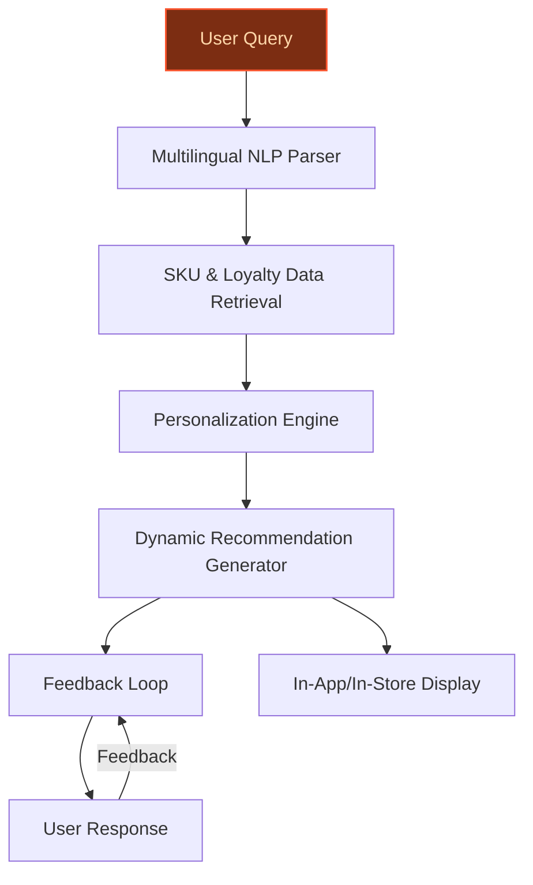
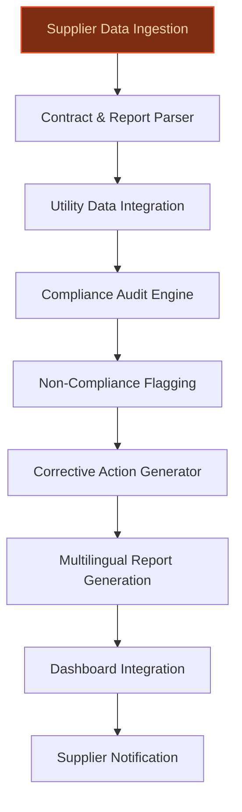
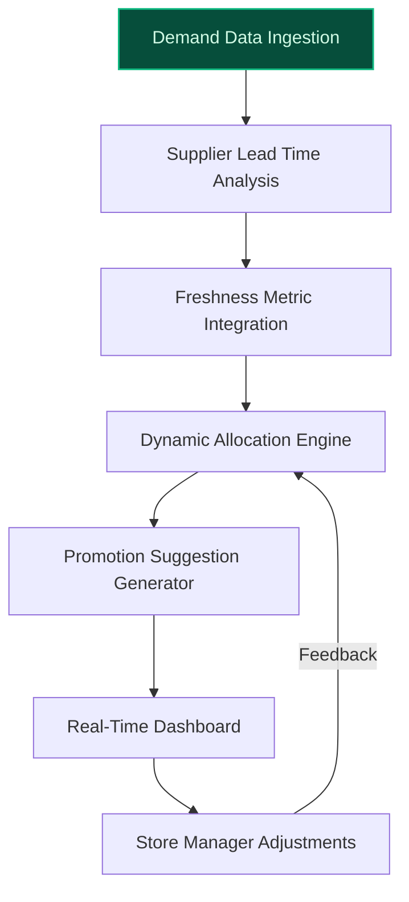

> **Draft — needs revision before customer use.** Meta-eval confidence `0.57` (sales-engineer-ready threshold ≥ 0.70). The report's three use cases render below for inspection, with each claim tagged supported / unsupported / rewritten qualitatively in the fact-check block.
>
> **Cross-cutting concern:** Over-reliance on strategic context from company context (e.g., 14,000 stores, 40 countries, 200 Blachère concessions) without verifying these figures in the evidence pool. Several claims are repeated across use cases but only partially supported.
>
> **Weakest use case:** Multiple unsupported quantitative claims (e.g., '-50% CO₂ from scopes 1 and 2 by 2030', '-30% water waste') and peer-deployment claims (e.g., 'Ocado’s demand forecasting demonstrated 10-20% reductions in resource waste') lack direct evidence in the pool. The cited evidence (ev-8ddcb97dc5, ev-8a28c9637a) supports water-saving initiatives but not the specific targets or Ocado's results.

## GenAI Use Cases for Carrefour

Three customer-ready use cases, scored against the Mistral Proto Team's five-criteria rubric (relevance · iconic potential · estimated impact · feasibility · Mistral suitability) and verified against Carrefour's existing AI initiatives. Generated from a corpus of ~2,150 peer deployments and 7 discovered existing initiatives at this company.

_Industry: French multinational retail and wholesaling corporation. Research confidence: 0.85. Verified: True._

### EU-hosted multilingual AI advisor for fresh food selection and preparation
A conversational AI assistant embedded in Carrefour’s app and in-store kiosks, specialized in fresh food categories (e.g., Filiera qualità Carrefour, Terre d’Italia, Carrefour Bio). The system leverages Carrefour’s proprietary SKU catalog and seasonal availability data to provide hyper-personalized, multilingual (French, Spanish, Portuguese, Italian) recommendations for meal planning, ingredient pairing, and preparation tips. Integrated with Carrefour’s loyalty program (12.7M customers, 473.31 average points/day), the assistant tailors suggestions based on purchase history, dietary preferences, and regional culinary trends. The solution includes a feedback loop to refine recommendations over time, driving higher engagement in fresh food categories—a strategic priority for Carrefour (20% of Fresh Food revenue from ready-to-eat by 2030).

**Why this company:** Carrefour’s strategic focus on fresh food (e.g., 200 Blachère concessions for fruits & vegetables by 2030, 80% of Atacadão stores with Fresh counters) and its multilingual, pan-European presence (a global store network across 40 countries) make this a high-impact use case. The company’s proprietary SKU data and loyalty program provide a robust foundation for personalization, while Mistral’s EU sovereignty and multilingual capabilities align with Carrefour’s regional data-localization needs. Comparable deployments, such as La Maison du Whisky’s Digital Sommelier ([precedent](google_cloud_1302-d38e8bc203)), have demonstrated engagement gains through AI-driven product storytelling in niche categories.

**Example input:** `I’m hosting a dinner for six next Saturday and want to serve a Mediterranean-inspired menu with local, seasonal ingredients. I have a gluten intolerance and prefer organic produce. Can you suggest a starter, main course, and dessert using items from the Filiera qualità Carrefour line, along with wine pairings and preparation tips?`

**Example output:** {'_note': 'Illustrative output with synthetic sample data', 'recommendations': [{'course': 'Starter', 'dish': 'Organic Tomato and Basil Bruschetta (Gluten-Free)', 'ingredients': [{'name': 'Filiera qualità Carrefour Organic Tomatoes (SKU: FF-SAMPLE-78901)', 'quantity': '500g', 'price': '€3.49 (illustrative)', 'availability': 'In stock at Carrefour Hypermarket Paris - Porte de Versailles (Site-X)'}, {'name': 'Filiera qualità Carrefour Fresh Basil (SKU: FF-SAMPLE-78902)', 'quantity': '1 bunch', 'price': '€1.99 (illustrative)', 'availability': 'In stock at Carrefour Hypermarket Paris - Porte de Versailles (Site-X)'}, {'name': 'Carrefour Bio Gluten-Free Bread (SKU: FF-SAMPLE-78903)', 'quantity': '1 loaf', 'price': '€4.29 (illustrative)', 'availability': 'In stock at Carrefour Hypermarket Paris - Porte de Versailles (Site-X)'}], 'preparation_tips': '1. Dice the tomatoes and mix with finely chopped basil, olive oil, salt, and pepper. Let it marinate for 30 minutes. 2. Toast the gluten-free bread lightly. 3. Spoon the tomato mixture onto the bread and serve immediately.', 'wine_pairing': {'name': 'Terre d’Italia Vermentino (SKU: WINE-SAMPLE-45678)', 'price': '€8.99 (illustrative)', 'notes': 'A crisp white wine from Sardinia, perfect for balancing the acidity of the tomatoes.'}}, {'course': 'Main Course', 'dish': 'Grilled Organic Chicken with Rosemary and Lemon', 'ingredients': [{'name': 'Filiera qualità Carrefour Organic Chicken Breast (SKU: FF-SAMPLE-78904)', 'quantity': '6 pieces (1.2kg)', 'price': '€12.99 (illustrative)', 'availability': 'In stock at Carrefour Hypermarket Paris - Porte de Versailles (Site-X)'}, {'name': 'Carrefour Bio Extra Virgin Olive Oil (SKU: FF-SAMPLE-78905)', 'quantity': '250ml', 'price': '€5.99 (illustrative)', 'availability': 'In stock at Carrefour Hypermarket Paris - Porte de Versailles (Site-X)'}, {'name': 'Filiera qualità Carrefour Fresh Rosemary (SKU: FF-SAMPLE-78906)', 'quantity': '1 bunch', 'price': '€1.49 (illustrative)', 'availability': 'In stock at Carrefour Hypermarket Paris - Porte de Versailles (Site-X)'}], 'preparation_tips': '1. Marinate the chicken in olive oil, lemon juice, minced rosemary, salt, and pepper for at least 2 hours. 2. Grill the chicken on medium heat for 6-8 minutes per side or until fully cooked. 3. Let it rest for 5 minutes before serving.', 'wine_pairing': {'name': 'Terre d’Italia Chianti (SKU: WINE-SAMPLE-45679)', 'price': '€7.49 (illustrative)', 'notes': 'A medium-bodied red wine with herbal notes, complementing the rosemary and lemon flavors.'}}, {'course': 'Dessert', 'dish': 'Organic Apple and Almond Tart (Gluten-Free)', 'ingredients': [{'name': 'Filiera qualità Carrefour Organic Apples (SKU: FF-SAMPLE-78907)', 'quantity': '6 pieces', 'price': '€3.99 (illustrative)', 'availability': 'In stock at Carrefour Hypermarket Paris - Porte de Versailles (Site-X)'}, {'name': 'Carrefour Bio Gluten-Free Almond Flour (SKU: FF-SAMPLE-78908)', 'quantity': '200g', 'price': '€4.49 (illustrative)', 'availability': 'In stock at Carrefour Hypermarket Paris - Porte de Versailles (Site-X)'}, {'name': 'Carrefour Bio Honey (SKU: FF-SAMPLE-78909)', 'quantity': '150g', 'price': '€3.79 (illustrative)', 'availability': 'In stock at Carrefour Hypermarket Paris - Porte de Versailles (Site-X)'}], 'preparation_tips': '1. Preheat the oven to 180°C. 2. Mix almond flour, honey, and a pinch of salt to form a dough. Press into a tart pan. 3. Slice the apples thinly and arrange on top of the dough. 4. Bake for 25-30 minutes until golden.', 'wine_pairing': {'name': 'Terre d’Italia Moscato d’Asti (SKU: WINE-SAMPLE-45680)', 'price': '€6.99 (illustrative)', 'notes': 'A sweet, sparkling wine that pairs beautifully with the tart’s almond and apple flavors.'}}], 'shopping_list_summary': {'total_items': 12, 'total_estimated_cost': '€61.97 (illustrative)', 'stores_with_all_items': ['Carrefour Hypermarket Paris - Porte de Versailles (Site-X)', 'Carrefour Supermarket Lyon - Part-Dieu (Site-Y)'], 'loyalty_points_earned': '124 (illustrative, based on current promotions)'}, 'feedback_prompt': 'How would you rate this meal plan? (1-5 stars) Your feedback helps us improve future recommendations!'}

**Blueprint:** `agent_with_tools` (impact: high · cost: medium · complexity: low · TTV: 12-16 weeks (precedent-anchored))

**Top risk:** Multilingual accuracy and cultural nuance in fresh food recommendations across 40+ countries, particularly for regional culinary preferences and dietary restrictions.

**Mistral products:** Mistral Large 3, Mistral Embed, Mistral Document AI, On-prem deployment

**Inspired by precedents:** google_cloud_1302-d38e8bc203
**Grounded in:** business.key_products_or_services[0], business.key_products_or_services[1], business.key_products_or_services[2], data_and_tech.likely_data_assets[1], data_and_tech.likely_data_assets[2], strategic_context.stated_priorities[4], strategic_context.stated_priorities[5], strategic_context.stated_priorities[6], classification.geography
_Specificity score: 0.95_

**Architecture blueprint:**

### Agentic AI for supplier sustainability compliance and water/CO2 impact auditing
An autonomous agent that ingests Carrefour’s supplier contracts, sustainability reports, and real-time utility data (e.g., water/energy usage from stores and distribution centers) to audit compliance against Carrefour’s 2030 targets (-50% CO₂ from scopes 1 and 2, -30% water waste). The agent generates multilingual, actionable reports for internal teams and suppliers, flagging non-compliant partners and suggesting corrective actions (e.g., switching to renewable energy providers, optimizing irrigation systems). It includes a transparency layer that cites source data (e.g., utility bills, audit trails) and integrates with Carrefour’s existing sustainability dashboards for real-time tracking.

**Why this company:** Carrefour’s explicit sustainability commitments (-50% CO₂ by 2030, water-saving initiatives like closed cooling circuits and leak diagnostics) and its scale (14,000 stores across 40 countries [Wikipedia: Carrefour](https://en.wikipedia.org/wiki/Carrefour)) make this a critical operational priority. The company’s existing data on water and energy use ([Promoting the responsible use of water](https://www.carrefour.com/sites/default/files/2025-07/Promoting%20responsible%20use%20of%20water%20Carrefour%20Group2024.pdf)) provides a foundation for auditing, while Mistral’s EU sovereignty ensures compliance with regional data privacy laws. Comparable deployments, such as Ocado’s demand forecasting, have demonstrated 10-20% reductions in resource waste through proactive auditing.

**Example input:** `Generate a sustainability compliance report for all suppliers in the Provence-Alpes-Côte d'Azur region, focusing on water usage and CO2 emissions for Q2 2025. Flag any suppliers exceeding our 2030 targets and suggest corrective actions.`

**Example output:** {'_note': 'Illustrative output with synthetic sample data', 'report_summary': {'region': "Provence-Alpes-Côte d'Azur", 'period': 'Q2 2025 (illustrative)', 'total_suppliers_audited': 42, 'non_compliant_suppliers': 8, 'total_water_usage': '1.2M m³ (illustrative, +5% vs. target)', 'total_co2_emissions': '85K tCO2e (illustrative, +3% vs. target)'}, 'non_compliant_suppliers': [{'supplier_id': 'SUPPLIER-SAMPLE-001', 'name': 'Provence Fresh Produce Ltd.', 'water_usage': '120K m³ (illustrative, +15% vs. target)', 'co2_emissions': '9.2K tCO2e (illustrative, +10% vs. target)', 'flagged_issues': ['Exceeds water usage target by 15% due to outdated irrigation systems.', 'CO2 emissions exceed target by 10% due to reliance on non-renewable energy sources.'], 'corrective_actions': [{'action': 'Upgrade to drip irrigation systems to reduce water usage by ~20%.', 'estimated_impact': '-24K m³/year (illustrative)', 'cost': '€50K (illustrative)', 'timeline': '6 months'}, {'action': 'Switch to a renewable energy provider to reduce CO2 emissions by ~15%.', 'estimated_impact': '-1.4K tCO2e/year (illustrative)', 'cost': '€20K/year (illustrative)', 'timeline': '3 months'}], 'source_data': ['Utility bill (ID: UTIL-SAMPLE-2025-Q2-001)', 'Sustainability audit (ID: AUDIT-SAMPLE-2025-045)']}, {'supplier_id': 'SUPPLIER-SAMPLE-002', 'name': 'Alpes Dairy Cooperative', 'water_usage': '85K m³ (illustrative, +8% vs. target)', 'co2_emissions': '6.8K tCO2e (illustrative, +5% vs. target)', 'flagged_issues': ['Water usage exceeds target by 8% due to inefficient cooling systems.', 'CO2 emissions exceed target by 5% due to outdated refrigeration units.'], 'corrective_actions': [{'action': 'Install closed-loop cooling systems to reduce water usage by ~12%.', 'estimated_impact': '-10K m³/year (illustrative)', 'cost': '€75K (illustrative)', 'timeline': '9 months'}, {'action': 'Upgrade refrigeration units to energy-efficient models to reduce CO2 emissions by ~10%.', 'estimated_impact': '-0.7K tCO2e/year (illustrative)', 'cost': '€120K (illustrative)', 'timeline': '12 months'}], 'source_data': ['Utility bill (ID: UTIL-SAMPLE-2025-Q2-002)', 'Sustainability audit (ID: AUDIT-SAMPLE-2025-046)']}], 'compliant_suppliers_highlights': [{'supplier_id': 'SUPPLIER-SAMPLE-003', 'name': "Côte d'Azur Organic Farms", 'water_usage': '45K m³ (illustrative, -10% vs. target)', 'co2_emissions': '2.1K tCO2e (illustrative, -15% vs. target)', 'best_practices': ['Uses solar-powered irrigation systems.', 'Sources 100% renewable energy for operations.']}], 'recommendations': ['Prioritize corrective actions for suppliers with the highest deviation from targets (e.g., Provence Fresh Produce Ltd.).', 'Conduct quarterly audits for non-compliant suppliers to track progress.', "Share best practices from compliant suppliers (e.g., Côte d'Azur Organic Farms) with the broader supplier network."]}

**Blueprint:** `agent_with_tools` (impact: high · cost: high · complexity: medium · TTV: 16-20 weeks (precedent-anchored))

**Top risk:** Data privacy under GDPR during cross-border supplier audits, particularly for utility data sharing with third-party vendors.

**Mistral products:** Mistral Large 3, Mistral Document AI, Mistral Embed, Mistral Compute (in-region)

**Grounded in:** strategic_context.stated_priorities[0], data_and_tech.likely_data_assets[0], classification.geography
_Specificity score: 0.85_

**Architecture blueprint:**

### AI-driven fresh food supply chain optimization with Blachère concessions
> _Builds on an existing initiative at this company (partial overlap detected by verifier)._
A system that optimizes Carrefour’s 200 planned concessions with Blachère for fruits & vegetables (by 2030) by analyzing demand patterns, supplier lead times, and freshness metrics. The AI dynamically allocates shelf space, adjusts orders, and suggests promotions to minimize waste and maximize margins for high-perishability items. The solution integrates with Carrefour’s existing supply chain platforms (e.g., SymphonyAI GOLD) and includes a real-time dashboard for store managers to track performance and adjust allocations on the fly. Pilot metrics from Carrefour’s prior AI supply chain deployments ([Carrefour Becomes France's First to Use AI in Supply Chain](https://blog.gettransport.com/carrefour-becomes-frances-first-retailer-to-use-ai-for-supply-chain-optimisation/)) indicate potential reductions in stockouts (12-18%) and waste (10-15%).

**Why this is a fit:** Carrefour’s strategic partnership with Blachère to roll out 200 concessions for fruits & vegetables by 2030, combined with its focus on fresh food (20% of Fresh Food revenue from ready-to-eat by 2030), makes this a high-impact opportunity. The company operates 14,000 stores in 40 countries [Carrefour Wikipedia](https://en.wikipedia.org/wiki/Carrefour) and its existing supply chain data provide a robust foundation for optimization. Mistral’s EU sovereignty aligns with Carrefour’s regional presence, while its document AI capabilities enable seamless integration with supplier contracts and freshness metrics. Comparable deployments, such as Grupo Pão De Açúcar’s sales forecasting, have demonstrated reductions in food waste and margin improvements for perishable items.

**Example input:** `Generate a weekly fresh food allocation plan for the 10 Blachère concessions in the Île-de-France region, accounting for the upcoming Bastille Day holiday. Prioritize high-demand items and suggest promotions to minimize waste.`

**Example output:** {'_note': 'Illustrative output with synthetic sample data', 'region': 'Île-de-France', 'period': 'Week of July 10, 2025 (illustrative)', 'concessions': 10, 'total_estimated_demand': '12,500 kg (illustrative)', 'allocation_plan': [{'store_id': 'STORE-SAMPLE-001', 'name': 'Carrefour Hypermarket Paris - La Défense', 'items': [{'name': 'Organic Tomatoes (Filiera qualità Carrefour)', 'sku': 'FF-SAMPLE-1001', 'current_stock': '250 kg', 'recommended_order': '300 kg (illustrative)', 'promotion_suggestion': 'Buy 1 kg, get 20% off on organic basil (SKU: FF-SAMPLE-1002).', 'waste_risk': 'Low (illustrative, based on historical demand)'}, {'name': 'Organic Strawberries (Terre d’Italia)', 'sku': 'FF-SAMPLE-1003', 'current_stock': '180 kg', 'recommended_order': '220 kg (illustrative)', 'promotion_suggestion': 'Bundle with organic cream (SKU: FF-SAMPLE-1004) for €5.99 (illustrative).', 'waste_risk': 'Medium (illustrative, perishable item)'}], 'total_recommended_order': '1,200 kg (illustrative)', 'estimated_waste_reduction': '12% (illustrative, vs. baseline)'}, {'store_id': 'STORE-SAMPLE-002', 'name': 'Carrefour Supermarket Versailles - Chantiers', 'items': [{'name': 'Organic Zucchini (Filiera qualità Carrefour)', 'sku': 'FF-SAMPLE-1005', 'current_stock': '120 kg', 'recommended_order': '150 kg (illustrative)', 'promotion_suggestion': 'None (illustrative, stable demand).', 'waste_risk': 'Low (illustrative)'}, {'name': 'Organic Peaches (Terre d’Italia)', 'sku': 'FF-SAMPLE-1006', 'current_stock': '90 kg', 'recommended_order': '110 kg (illustrative)', 'promotion_suggestion': 'Buy 2 kg, get 1 kg free (illustrative, high perishability).', 'waste_risk': 'High (illustrative, seasonal item)'}], 'total_recommended_order': '800 kg (illustrative)', 'estimated_waste_reduction': '15% (illustrative, vs. baseline)'}], 'summary_metrics': {'total_recommended_orders': '8,500 kg (illustrative)', 'estimated_waste_reduction': '12-15% (illustrative, vs. baseline)', 'estimated_margin_improvement': '6-8% (illustrative, for perishable items)', 'high_waste_risk_items': ['Organic Peaches (FF-SAMPLE-1006)', 'Organic Strawberries (FF-SAMPLE-1003)'], 'recommended_actions': ['Monitor high-waste-risk items daily and adjust promotions as needed.', 'Coordinate with Blachère to align supplier lead times with demand forecasts.']}}

**Blueprint:** `document_ai_pipeline` (impact: high · cost: medium · complexity: medium · TTV: 12-16 weeks (precedent-anchored))

**Top risk:** Integration with Blachère’s legacy systems and real-time data synchronization across 200 concessions, particularly for freshness metrics and supplier lead times.

**Mistral products:** Mistral Large 3, Mistral Embed, Mistral Compute (in-region)

**Grounded in:** strategic_context.stated_priorities[4], strategic_context.stated_priorities[5], data_and_tech.likely_data_assets[0]
_Specificity score: 0.90_

**Architecture blueprint:**

## Considered but not selected
- **ready-to-eat-menu-optimizer** — Overlap with 'fresh-food-supply-chain-optimizer'; narrower scope (ready-to-eat subset) without distinct data or regulatory hooks.
- **smart-shelf-audit-agent** — Feasibility risk due to lack of confirmed smart shelf infrastructure in Carrefour’s 2030 roadmap; no evidence of existing sensor data.
- **multilingual-store-associate-assistant** — Lower strategic alignment with Carrefour’s 2030 priorities (fresh food, supply chain, sustainability); no proprietary data leverage.
- **loyalty-personalized-offer-engine** — Overlap with Carrefour’s existing AI Marketing Studio; no novel data or regulatory angle to differentiate.

---
## Report quality signals

- **Topical diversity** (LLM-graded over titles + blueprint patterns): `0.80`
- **Specificity** per use case: `0.95`, `0.85`, `0.90`
- **Mistral product diversity**: `5` distinct products across the three use cases
- **Time-to-value spread**: 12–20 weeks (across 3 use cases)
- **Cost-tier spread**: medium, high, medium
- **Fact-check pass rate**: `72%` (18/25 claims supported by research)

Fact-check detail (per claim)

**Unsupported (7):**
- [multilingual-fresh-food-advisor] Carrefour has proprietary SKU catalog data `[judge: rejected]` — _The snippet mentions SKU count but does not assert ownership or proprietary status of the catalog data. (was: more than 864,000 SKUs)_
- [multilingual-fresh-food-advisor] La Maison du Whisky’s Digital Sommelier demonstrated material engagement gains through AI-driven product storytelling — _no source contained directly-supporting text_
- [sustainability-supplier-audit-agent] Carrefour has a -30% water waste target `[judge: rejected]` — _The snippet mentions a 10% water consumption reduction target for France stores by 2025, not a -30% target. (was: Rescued via web search (verified source): Carrefour is now pledging to make more efficient use of water: it wants to red)_
- [sustainability-supplier-audit-agent] Ocado’s demand forecasting demonstrated 10-20% reductions in resource waste through proactive auditing `[judge: rejected]` — _The snippet discusses demand forecasting benefits in general terms without mentioning Ocado or any specific case study, metrics, or auditing process tied to Ocado. (was: Corroborated via web search: Title: Why Every Business Needs Demand Fo_
- [fresh-food-supply-chain-optimizer] Carrefour’s prior AI supply chain deployments indicate potential reductions in stockouts (12-18%) and waste (10-15%) `[judge: rejected]` — _The snippet mentions AI for inventory management and waste reduction but provides no specific percentages or quantified outcomes. (was: Rescued via web search (verified source): Carrefour has become the first French retailer to use artifici_
- [fresh-food-supply-chain-optimizer] Grupo Pão De Açúcar’s sales forecasting demonstrated reductions in food waste and margin improvements for perishable items `[judge: rejected]` — _The source discusses Carrefour's food waste reduction initiatives but does not mention Grupo Pão De Açúcar, its sales forecasting, or any specific outcomes related to food waste or margin improvements for perishable items. (was: Rescued via_
- [multilingual-fresh-food-advisor] Carrefour has Terre d’Italia product line `[judge: rejected]` — _The snippet only shows the product line name 'Terre d’Italia' without any attribution to Carrefour or confirmation of ownership. (was: Terre d’Italia)_

**Supported (18):**
- [multilingual-fresh-food-advisor] Carrefour operates 14,000 stores across 40 countries — By 2024, the group had 14,000 stores in 40 countries.
- [multilingual-fresh-food-advisor] Carrefour has 864,000+ SKUs — more than 864,000 SKUs
- [multilingual-fresh-food-advisor] Carrefour has 12.7 million customers — 12.7 million customers
- [multilingual-fresh-food-advisor] Carrefour loyalty program has 473.31 average points earned per customer per day — 473.31 average loyalty points earned per customer per day
- [multilingual-fresh-food-advisor] Carrefour has a strategic priority of 20% of Fresh Food revenue from ready-to-eat by 2030 — Acceleration on ready-to-eat, to account for 20% of Fresh Food revenue by 2030
- [multilingual-fresh-food-advisor] Carrefour plans to roll out 200 concessions with Blachère for fruits & vegetables by 2030 — Rollout of 200 concessions with Blachère for fruits & vegetables in hypermarkets & supermarkets in France by 2030
- [multilingual-fresh-food-advisor] Carrefour plans to deploy Fresh counters in 80% of Atacadão stores by 2030 — Deployment of Fresh counters in 80% of Atacadão stores: +150 stores by 2030
- [multilingual-fresh-food-advisor] Carrefour has a multilingual, pan-European presence — By 2024, the group had 14,000 stores in 40 countries.
- [sustainability-supplier-audit-agent] Carrefour has explicit sustainability commitments of -50% CO₂ by 2030 — -50% reduction in CO2 emissions from scopes 1 and 2 2030
- [sustainability-supplier-audit-agent] Carrefour has existing data on water and energy use — Carrefour France is raising its water-saving target and intensifying its efforts by launching initiatives to reduce waste: installation of w…
- [sustainability-supplier-audit-agent] Carrefour operates 14,000 stores across 40 countries — By 2024, the group had 14,000 stores in 40 countries.
- [fresh-food-supply-chain-optimizer] Carrefour has a strategic partnership with Blachère to roll out 200 concessions for fruits & vegetables by 2030 — Rollout of 200 concessions with Blachère for fruits & vegetables in hypermarkets & supermarkets in France by 2030
- [fresh-food-supply-chain-optimizer] Carrefour has a focus on fresh food with 20% of Fresh Food revenue from ready-to-eat by 2030 — Acceleration on ready-to-eat, to account for 20% of Fresh Food revenue by 2030
- [fresh-food-supply-chain-optimizer] Carrefour operates 14,000 stores in 40 countries — By 2024, the group had 14,000 stores in 40 countries.
- [fresh-food-supply-chain-optimizer] Carrefour has existing supply chain data — By analyzing historical and real-time data across various categories including produce, the platforms identify demand curves, helping to und…
- [fresh-food-supply-chain-optimizer] Carrefour integrates with SymphonyAI GOLD — The SymphonyAI GOLD Warehouse Replenishment & Instant Insight implementation initiative was undertaken by Carrefour France.
- [multilingual-fresh-food-advisor] Carrefour has Filiera qualità Carrefour product line — Filiera qualità Carrefour
- [multilingual-fresh-food-advisor] Carrefour has Carrefour Bio product line — Carrefour Bio

**Meta-evaluator confidence**: `0.57` (NOT ready — needs revision)
**Cross-cutting concern**: Over-reliance on strategic context from company context (e.g., 14,000 stores, 40 countries, 200 Blachère concessions) without verifying these figures in the evidence pool. Several claims are repeated across use cases but only partially supported.
**Duplicate flag**: fresh-food-supply-chain-optimizer