# Pipeline blueprint (architecture)

Static view of the pipeline regardless of run timing — shows agents,
models, and gates. The chronological execution log follows below.

```mermaid
flowchart TD
    Start([User: company name]) --> R
    R["<b>1. Research</b><br/>parallel: Wikipedia · Tavily news ·<br/>existing initiatives · live verification<br/><i>mistral-medium</i> synthesis"]
    R --> G["<b>1b. Gap-fill</b><br/>identify missing fields →<br/><i>mistral-small</i> generates queries →<br/>Tavily search per field →<br/><i>mistral-small</i> per-field extraction"]
    G --> Conf{Confidence ≥ 0.5<br/>OR verified<br/>OR ≥ 1 existing initiative?}
    Conf -->|no| Refuse([Refusal])
    Conf -->|yes| Ret
    Ret["<b>2. Retrieve</b><br/><i>mistral-embed</i> on company query →<br/>cosine top-K + industry/depth filter +<br/>MMR diversification"]
    Ret --> Gen["<b>3. Generate 12 candidates</b><br/><i>mistral-medium</i> with web_search tool<br/>(Tavily + deep-read) — fact citations<br/>flow into the EvidenceLedger"]
    Gen --> Score["<b>4. Score</b><br/>self-consistency: 2 parallel passes<br/><i>mistral-small</i> @ T=0.2 and T=0.4 →<br/>aggregate weighted scores"]
    Score --> Verify["<b>5. Per-candidate verify</b><br/>top-3: Tavily search + deep-read +<br/><i>mistral-small</i> verdict (pass /<br/>partial / confirmed_existing)"]
    Verify --> Enrich["<b>6. Enrich</b><br/><i>mistral-large</i> drafts customer-facing<br/>prose for 3 use cases (or<br/><i>mistral-medium</i> on fast tier)"]
    Enrich --> NumScrub["<b>6a. Numeric scrub</b><br/>flag any number not in cited content"]
    NumScrub --> Polish["<b>6b. Polish</b><br/><i>mistral-small</i> per use case (parallel):<br/>convert markers→qualitative,<br/>(ev-XXX)→[title](url)"]
    Polish --> Attr["<b>6c. Attribution check</b><br/><i>mistral-small</i> per use case (parallel):<br/>fix corpus-ID ↔ company mismatches"]
    Attr --> Meta["<b>7. Meta-evaluation</b><br/><i>mistral-medium</i> reviews report against<br/>cited precedents + ledger entries:<br/>strict claim verification"]
    Meta --> RegenQ{confidence < 0.6<br/>AND not fast tier?}
    RegenQ -->|yes| Regen["<b>7b. Targeted regen</b><br/><i>mistral-large</i> re-enriches just the<br/>weakest use case with the next-best<br/>near-miss; re-runs meta-eval"]
    RegenQ -->|no| QS
    Regen --> QS
    QS["<b>Quality signals</b><br/>LLM-graded diversity + specificity,<br/>fact-check pass rate, TTV/cost spread"]
    QS --> Render([Markdown report + trace])

    classDef agent fill:#fef3c7,stroke:#f59e0b
    classDef gate fill:#dbeafe,stroke:#3b82f6
    classDef io fill:#dcfce7,stroke:#16a34a
    class R,G,Ret,Gen,Score,Verify,Enrich,NumScrub,Polish,Attr,Meta,Regen,QS agent
    class Conf,RegenQ gate
    class Start,Refuse,Render io
```

## Execution trace — Carrefour

Started: `2026-05-10T07:28:17.113302+00:00`. Total wall time: `224.2s` across `53` recorded actions.

### Per-step time totals

| Step | Calls | Total time | Avg time |
|---|---:|---:|---:|
| `research` | 1 | 8.95s | 8947ms |
| `gap_fill` | 4 | 4.85s | 1214ms |
| `retrieve` | 2 | 0.56s | 282ms |
| `generate` | 2 | 35.52s | 17760ms |
| `generate.web_search` | 2 | 5.42s | 2710ms |
| `score` | 2 | 34.63s | 17314ms |
| `verify` | 6 | 15.04s | 2506ms |
| `enrich` | 1 | 91.17s | 91174ms |
| `polish` | 2 | 10.85s | 5424ms |
| `attribution_check` | 1 | 2.22s | 2222ms |
| `meta_eval` | 1 | 14.28s | 14279ms |
| `web_verify` | 1 | 3.95s | 3947ms |
| `source_judge` | 25 | 17.35s | 694ms |
| `final_qualify` | 1 | 2.23s | 2233ms |
| `quality_signals` | 2 | 4.29s | 2146ms |

### Chronological event log

- `07:28:21.293` **[research]** `mistral-medium-2604.chat.complete` — 8947ms
   - inputs: synthesize CompanyContext for Carrefour | depth=medium
   - outputs: industry='French multinational retail and wholesaling corporation' verified=True conf=0.75
- `07:28:30.242` **[gap_fill]** `mistral-small-2603.chat.complete` — 2033ms
   - inputs: generate gap queries | fields=['business_model', 'products', 'data_assets', 'priorities']
   - outputs: queries=4
- `07:28:41.520` **[gap_fill]** `mistral-small-2603.chat.complete` — 1143ms
   - inputs: layer-2 extract field=priorities
   - outputs: items=8
- `07:28:41.523` **[gap_fill]** `mistral-small-2603.chat.complete` — 991ms
   - inputs: layer-2 extract field=data_assets
   - outputs: items=6
- `07:28:41.527` **[gap_fill]** `mistral-small-2603.chat.complete` — 688ms
   - inputs: layer-2 extract field=products
   - outputs: items=9
- `07:28:42.666` **[retrieve]** `mistral-embed.embeddings.create` — 209ms
   - inputs: company_query | industries='French multinational retail and wholesaling corporation'
   - outputs: embedded 1024-dim query vector
- `07:28:42.875` **[retrieve]** `precedent_corpus.cosine_topk` — 354ms
   - inputs: k=8 min_depth=0.4 target='Carrefour'
   - outputs: retrieved 8 | mmr=True | top_sim=0.810
- `07:28:43.578` **[generate]** `mistral-medium-2604.chat.complete` — 1860ms
   - inputs: iteration=0 tool_calls_used=0/2 tools=on
   - outputs: tool_calls=4 | content_chars=0
- `07:28:45.455` **[generate.web_search]** `tavily.search` — 2544ms
   - inputs: query='Carrefour 2024 sustainability goals and initiatives'
   - outputs: 2 raw results
- `07:28:48.030` **[generate.web_search]** `tavily.search` — 2875ms
   - inputs: query='Carrefour loyalty program Hopi Zubizu details and scale'
   - outputs: 2 raw results
- `07:28:52.554` **[generate]** `mistral-medium-2604.chat.complete` — 33659ms
   - inputs: iteration=1 tool_calls_used=2/2 tools=off
   - outputs: tool_calls=0 | content_chars=22325
- `07:29:26.603` **[score]** `mistral-small-2603.chat.complete` — 16851ms
   - inputs: self-consistency pass T=0.2
   - outputs: scored 12 candidates
- `07:29:26.608` **[score]** `mistral-small-2603.chat.complete` — 17777ms
   - inputs: self-consistency pass T=0.4
   - outputs: scored 12 candidates
- `07:29:44.419` **[verify]** `tavily.search` — 2277ms
   - inputs: candidate=multilingual-fresh-food-advisor | query='Carrefour EU-hosted multilingual AI advisor for fresh food s'
   - outputs: 4 results
- `07:29:44.419` **[verify]** `tavily.search` — 1786ms
   - inputs: candidate=sustainability-supplier-audit-agent | query='Carrefour Agentic AI for supplier sustainability compliance '
   - outputs: 4 results
- `07:29:44.419` **[verify]** `tavily.search` — 2085ms
   - inputs: candidate=fresh-food-supply-chain-optimizer | query='Carrefour AI-driven fresh food supply chain optimization wit'
   - outputs: 4 results
- `07:29:47.645` **[verify]** `mistral-small-2603.chat.complete` — 1835ms
   - inputs: verdict for multilingual-fresh-food-advisor
   - outputs: verdict='pass'
- `07:29:48.022` **[verify]** `mistral-small-2603.chat.complete` — 2259ms
   - inputs: verdict for sustainability-supplier-audit-agent
   - outputs: verdict='pass'
- `07:29:48.031` **[verify]** `mistral-small-2603.chat.complete` — 4795ms
   - inputs: verdict for fresh-food-supply-chain-optimizer
   - outputs: verdict='partial_overlap'
- `07:29:52.828` **[enrich]** `mistral-large-2512.chat.complete` — 91174ms
   - inputs: tier=standard top_3=['multilingual-fresh-food-advisor', 'sustainability-supplier-audit-agent', 'fresh-food-supply-chain-optimizer']
   - outputs: enriched 3 use cases
- `07:31:24.025` **[polish]** `mistral-small-2603.chat.complete` — 2860ms
   - inputs: use_case=sustainability-supplier-audit-agent unanchored=True opaque_ev=False
   - outputs: polished 5 fields
- `07:31:24.031` **[polish]** `mistral-small-2603.chat.complete` — 7988ms
   - inputs: use_case=fresh-food-supply-chain-optimizer unanchored=True opaque_ev=False
   - outputs: polished 5 fields
- `07:31:32.020` **[attribution_check]** `mistral-small-2603.chat.complete` — 2222ms
   - inputs: use_case=multilingual-fresh-food-advisor cited_ids=['google_cloud_1302-d38e8bc203']
   - outputs: received 4 fields
- `07:31:34.243` **[meta_eval]** `mistral-medium-2604.chat.complete` — 14279ms
   - inputs: reviewing 3 use cases
   - outputs: review + claims
- `07:31:48.538` **[web_verify]** `tavily.search.rescue_unsupported_claims` — 3947ms
   - inputs: company='Carrefour' unsupported=5 budget=12
   - outputs: rescued: verified=3 corroborated=1 of 5 attempted
- `07:31:52.486` **[source_judge]** `mistral-small-2603.judge_claim_sources` — 2129ms
   - inputs: pairs=24
   - outputs: judged 24 pairs
- `07:31:52.486` **[source_judge]** `mistral-small-2603.chat.complete` — 591ms
   - inputs: claim='Carrefour operates 14,000 stores across 40 countries'
   - outputs: verdict=supported
- `07:31:52.492` **[source_judge]** `mistral-small-2603.chat.complete` — 656ms
   - inputs: claim='Carrefour has 864,000+ SKUs'
   - outputs: verdict=supported
- `07:31:52.498` **[source_judge]** `mistral-small-2603.chat.complete` — 626ms
   - inputs: claim='Carrefour has 12.7 million customers'
   - outputs: verdict=supported
- `07:31:52.501` **[source_judge]** `mistral-small-2603.chat.complete` — 651ms
   - inputs: claim='Carrefour loyalty program has 473.31 average points earned p'
   - outputs: verdict=supported
- `07:31:52.504` **[source_judge]** `mistral-small-2603.chat.complete` — 615ms
   - inputs: claim='Carrefour has a strategic priority of 20% of Fresh Food reve'
   - outputs: verdict=supported
- `07:31:52.507` **[source_judge]** `mistral-small-2603.chat.complete` — 672ms
   - inputs: claim='Carrefour plans to roll out 200 concessions with Blachère fo'
   - outputs: verdict=supported
- `07:31:52.512` **[source_judge]** `mistral-small-2603.chat.complete` — 645ms
   - inputs: claim='Carrefour plans to deploy Fresh counters in 80% of Atacadão '
   - outputs: verdict=supported
- `07:31:52.514` **[source_judge]** `mistral-small-2603.chat.complete` — 677ms
   - inputs: claim='Carrefour has a multilingual, pan-European presence'
   - outputs: verdict=supported
- `07:31:53.077` **[source_judge]** `mistral-small-2603.chat.complete` — 591ms
   - inputs: claim='Carrefour has proprietary SKU catalog data'
   - outputs: verdict=unsupported
- `07:31:53.119` **[source_judge]** `mistral-small-2603.chat.complete` — 779ms
   - inputs: claim='Carrefour has explicit sustainability commitments of -50% CO'
   - outputs: verdict=supported
- `07:31:53.124` **[source_judge]** `mistral-small-2603.chat.complete` — 574ms
   - inputs: claim='Carrefour has a -30% water waste target'
   - outputs: verdict=unsupported
- `07:31:53.149` **[source_judge]** `mistral-small-2603.chat.complete` — 760ms
   - inputs: claim='Carrefour has existing data on water and energy use'
   - outputs: verdict=supported
- `07:31:53.152` **[source_judge]** `mistral-small-2603.chat.complete` — 722ms
   - inputs: claim='Ocado’s demand forecasting demonstrated 10-20% reductions in'
   - outputs: verdict=unsupported
- `07:31:53.157` **[source_judge]** `mistral-small-2603.chat.complete` — 672ms
   - inputs: claim='Carrefour operates 14,000 stores across 40 countries'
   - outputs: verdict=supported
- `07:31:53.179` **[source_judge]** `mistral-small-2603.chat.complete` — 756ms
   - inputs: claim='Carrefour has a strategic partnership with Blachère to roll '
   - outputs: verdict=supported
- `07:31:53.192` **[source_judge]** `mistral-small-2603.chat.complete` — 632ms
   - inputs: claim='Carrefour has a focus on fresh food with 20% of Fresh Food r'
   - outputs: verdict=supported
- `07:31:53.667` **[source_judge]** `mistral-small-2603.chat.complete` — 570ms
   - inputs: claim='Carrefour operates 14,000 stores in 40 countries'
   - outputs: verdict=supported
- `07:31:53.698` **[source_judge]** `mistral-small-2603.chat.complete` — 585ms
   - inputs: claim='Carrefour has existing supply chain data'
   - outputs: verdict=supported
- `07:31:53.824` **[source_judge]** `mistral-small-2603.chat.complete` — 583ms
   - inputs: claim='Carrefour’s prior AI supply chain deployments indicate poten'
   - outputs: verdict=unsupported
- `07:31:53.829` **[source_judge]** `mistral-small-2603.chat.complete` — 578ms
   - inputs: claim='Carrefour integrates with SymphonyAI GOLD'
   - outputs: verdict=supported
- `07:31:53.875` **[source_judge]** `mistral-small-2603.chat.complete` — 739ms
   - inputs: claim='Grupo Pão De Açúcar’s sales forecasting demonstrated reducti'
   - outputs: verdict=unsupported
- `07:31:53.898` **[source_judge]** `mistral-small-2603.chat.complete` — 508ms
   - inputs: claim='Carrefour has Filiera qualità Carrefour product line'
   - outputs: verdict=supported
- `07:31:53.909` **[source_judge]** `mistral-small-2603.chat.complete` — 533ms
   - inputs: claim='Carrefour has Terre d’Italia product line'
   - outputs: verdict=unsupported
- `07:31:53.936` **[source_judge]** `mistral-small-2603.chat.complete` — 509ms
   - inputs: claim='Carrefour has Carrefour Bio product line'
   - outputs: verdict=supported
- `07:31:54.616` **[final_qualify]** `mistral-small-2603.chat.complete` — 2233ms
   - inputs: use_case=multilingual-fresh-food-advisor unsupported=1
   - outputs: qualified 4 fields
- `07:31:57.020` **[quality_signals]** `mistral-small-2603.chat.complete` — 3036ms
   - inputs: specificity grade (3 use cases)
   - outputs: scored 3 use cases
- `07:32:00.057` **[quality_signals]** `mistral-small-2603.chat.complete` — 1256ms
   - inputs: diversity grade
   - outputs: diversity=0.8

## Mermaid sequence diagram (execution)

```mermaid
sequenceDiagram
    autonumber
    participant pipeline as pipeline
    participant mistral_medium_2604 as mistral-medium-2604
    participant mistral_small_2603 as mistral-small-2603
    participant mistral_embed as mistral-embed
    participant precedent_corpus as precedent_corpus
    participant tavily as tavily
    participant mistral_large_2512 as mistral-large-2512
    participant tavily_search as tavily.search
    pipeline->>mistral_medium_2604: research: chat.complete (8947ms)
    mistral_medium_2604-->>pipeline: industry='French multinational retail and wholesaling corpor
    pipeline->>mistral_small_2603: gap_fill: chat.complete (2033ms)
    mistral_small_2603-->>pipeline: queries=4
    pipeline->>mistral_small_2603: gap_fill: chat.complete (1143ms)
    mistral_small_2603-->>pipeline: items=8
    pipeline->>mistral_small_2603: gap_fill: chat.complete (991ms)
    mistral_small_2603-->>pipeline: items=6
    pipeline->>mistral_small_2603: gap_fill: chat.complete (688ms)
    mistral_small_2603-->>pipeline: items=9
    pipeline->>mistral_embed: retrieve: embeddings.create (209ms)
    mistral_embed-->>pipeline: embedded 1024-dim query vector
    pipeline->>precedent_corpus: retrieve: cosine_topk (354ms)
    precedent_corpus-->>pipeline: retrieved 8 | mmr=True | top_sim=0.810
    pipeline->>mistral_medium_2604: generate: chat.complete (1860ms)
    mistral_medium_2604-->>pipeline: tool_calls=4 | content_chars=0
    pipeline->>tavily: generate.web_search: search (2544ms)
    tavily-->>pipeline: 2 raw results
    pipeline->>tavily: generate.web_search: search (2875ms)
    tavily-->>pipeline: 2 raw results
    pipeline->>mistral_medium_2604: generate: chat.complete (33659ms)
    mistral_medium_2604-->>pipeline: tool_calls=0 | content_chars=22325
    pipeline->>mistral_small_2603: score: chat.complete (16851ms)
    mistral_small_2603-->>pipeline: scored 12 candidates
    pipeline->>mistral_small_2603: score: chat.complete (17777ms)
    mistral_small_2603-->>pipeline: scored 12 candidates
    pipeline->>tavily: verify: search (2277ms)
    tavily-->>pipeline: 4 results
    pipeline->>tavily: verify: search (1786ms)
    tavily-->>pipeline: 4 results
    pipeline->>tavily: verify: search (2085ms)
    tavily-->>pipeline: 4 results
    pipeline->>mistral_small_2603: verify: chat.complete (1835ms)
    mistral_small_2603-->>pipeline: verdict='pass'
    pipeline->>mistral_small_2603: verify: chat.complete (2259ms)
    mistral_small_2603-->>pipeline: verdict='pass'
    pipeline->>mistral_small_2603: verify: chat.complete (4795ms)
    mistral_small_2603-->>pipeline: verdict='partial_overlap'
    pipeline->>mistral_large_2512: enrich: chat.complete (91174ms)
    mistral_large_2512-->>pipeline: enriched 3 use cases
    pipeline->>mistral_small_2603: polish: chat.complete (2860ms)
    mistral_small_2603-->>pipeline: polished 5 fields
    pipeline->>mistral_small_2603: polish: chat.complete (7988ms)
    mistral_small_2603-->>pipeline: polished 5 fields
    pipeline->>mistral_small_2603: attribution_check: chat.complete (2222ms)
    mistral_small_2603-->>pipeline: received 4 fields
    pipeline->>mistral_medium_2604: meta_eval: chat.complete (14279ms)
    mistral_medium_2604-->>pipeline: review + claims
    pipeline->>tavily_search: web_verify: rescue_unsupported_claims (3947ms)
    tavily_search-->>pipeline: rescued: verified=3 corroborated=1 of 5 attempted
    pipeline->>mistral_small_2603: source_judge: judge_claim_sources (2129ms)
    mistral_small_2603-->>pipeline: judged 24 pairs
    pipeline->>mistral_small_2603: source_judge: chat.complete (591ms)
    mistral_small_2603-->>pipeline: verdict=supported
    pipeline->>mistral_small_2603: source_judge: chat.complete (656ms)
    mistral_small_2603-->>pipeline: verdict=supported
    pipeline->>mistral_small_2603: source_judge: chat.complete (626ms)
    mistral_small_2603-->>pipeline: verdict=supported
    pipeline->>mistral_small_2603: source_judge: chat.complete (651ms)
    mistral_small_2603-->>pipeline: verdict=supported
    pipeline->>mistral_small_2603: source_judge: chat.complete (615ms)
    mistral_small_2603-->>pipeline: verdict=supported
    pipeline->>mistral_small_2603: source_judge: chat.complete (672ms)
    mistral_small_2603-->>pipeline: verdict=supported
    pipeline->>mistral_small_2603: source_judge: chat.complete (645ms)
    mistral_small_2603-->>pipeline: verdict=supported
    pipeline->>mistral_small_2603: source_judge: chat.complete (677ms)
    mistral_small_2603-->>pipeline: verdict=supported
    pipeline->>mistral_small_2603: source_judge: chat.complete (591ms)
    mistral_small_2603-->>pipeline: verdict=unsupported
    pipeline->>mistral_small_2603: source_judge: chat.complete (779ms)
    mistral_small_2603-->>pipeline: verdict=supported
    pipeline->>mistral_small_2603: source_judge: chat.complete (574ms)
    mistral_small_2603-->>pipeline: verdict=unsupported
    pipeline->>mistral_small_2603: source_judge: chat.complete (760ms)
    mistral_small_2603-->>pipeline: verdict=supported
    pipeline->>mistral_small_2603: source_judge: chat.complete (722ms)
    mistral_small_2603-->>pipeline: verdict=unsupported
    pipeline->>mistral_small_2603: source_judge: chat.complete (672ms)
    mistral_small_2603-->>pipeline: verdict=supported
    pipeline->>mistral_small_2603: source_judge: chat.complete (756ms)
    mistral_small_2603-->>pipeline: verdict=supported
    pipeline->>mistral_small_2603: source_judge: chat.complete (632ms)
    mistral_small_2603-->>pipeline: verdict=supported
    pipeline->>mistral_small_2603: source_judge: chat.complete (570ms)
    mistral_small_2603-->>pipeline: verdict=supported
    pipeline->>mistral_small_2603: source_judge: chat.complete (585ms)
    mistral_small_2603-->>pipeline: verdict=supported
    pipeline->>mistral_small_2603: source_judge: chat.complete (583ms)
    mistral_small_2603-->>pipeline: verdict=unsupported
    pipeline->>mistral_small_2603: source_judge: chat.complete (578ms)
    mistral_small_2603-->>pipeline: verdict=supported
    pipeline->>mistral_small_2603: source_judge: chat.complete (739ms)
    mistral_small_2603-->>pipeline: verdict=unsupported
    pipeline->>mistral_small_2603: source_judge: chat.complete (508ms)
    mistral_small_2603-->>pipeline: verdict=supported
    pipeline->>mistral_small_2603: source_judge: chat.complete (533ms)
    mistral_small_2603-->>pipeline: verdict=unsupported
    pipeline->>mistral_small_2603: source_judge: chat.complete (509ms)
    mistral_small_2603-->>pipeline: verdict=supported
    pipeline->>mistral_small_2603: final_qualify: chat.complete (2233ms)
    mistral_small_2603-->>pipeline: qualified 4 fields
    pipeline->>mistral_small_2603: quality_signals: chat.complete (3036ms)
    mistral_small_2603-->>pipeline: scored 3 use cases
    pipeline->>mistral_small_2603: quality_signals: chat.complete (1256ms)
    mistral_small_2603-->>pipeline: diversity=0.8
```

