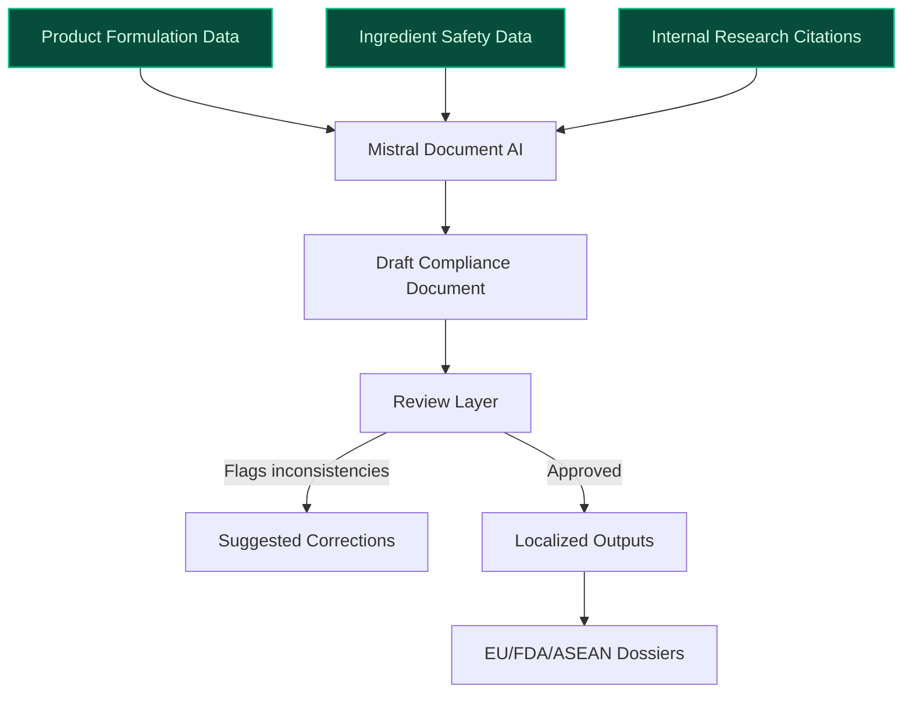
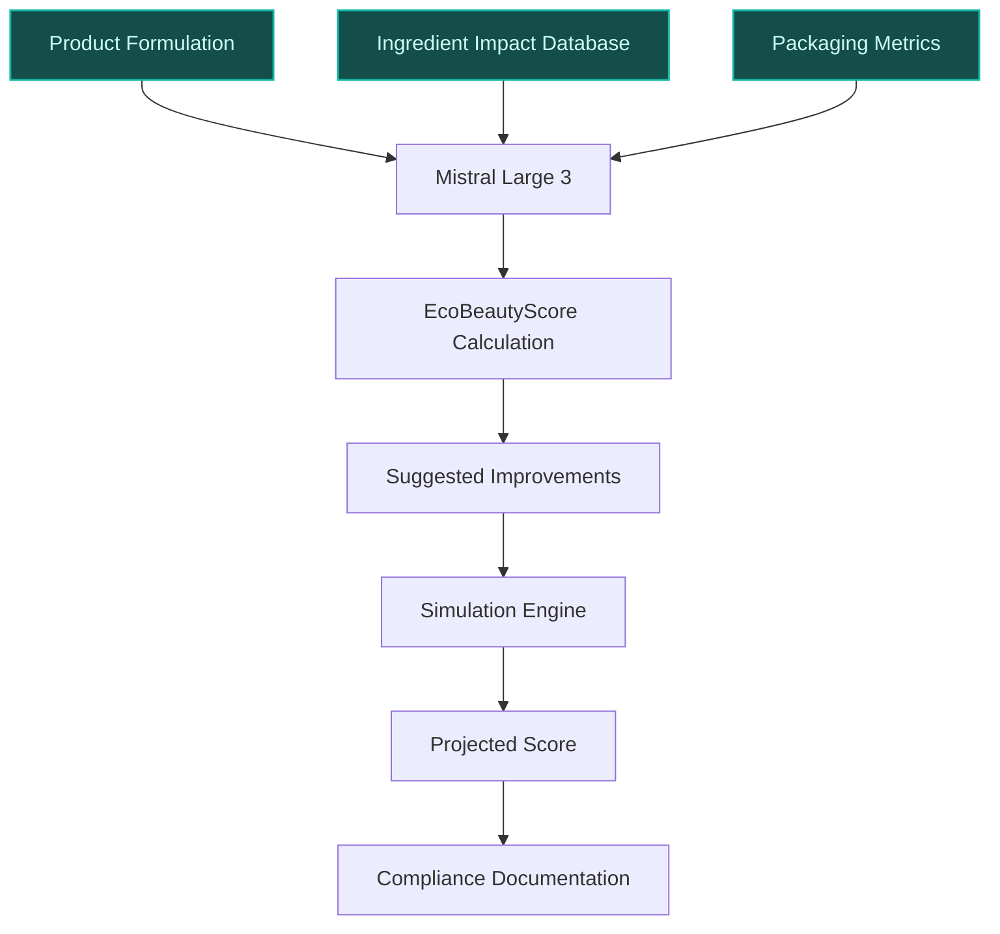
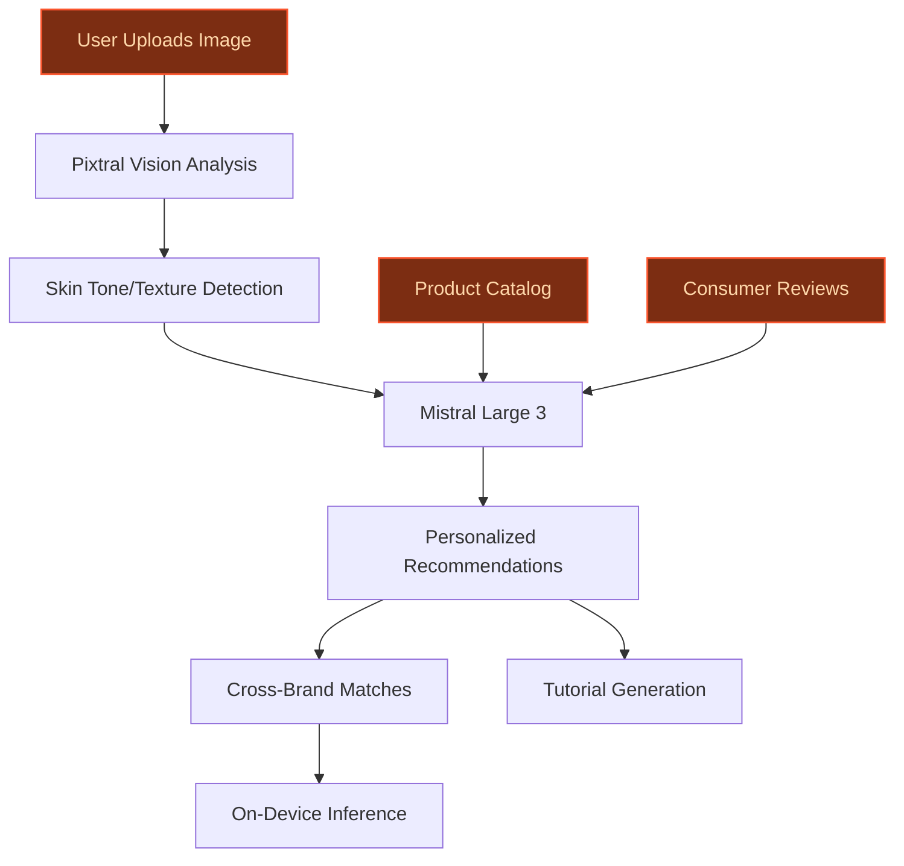

> **Draft — needs revision before customer use.** Meta-eval confidence `0.75` (sales-engineer-ready threshold ≥ 0.70). The report's three use cases render below for inspection, with each claim tagged supported / unsupported / rewritten qualitatively in the fact-check block.
>
> **Cross-cutting concern:** Over-reliance on generic or inferred data assets (e.g., '150,000+ dermatologist annotations' is supported, but '1M+ ingredient impact datapoints' is not) and lack of clear differentiation from existing AI initiatives (e.g., Beauty Genius, IBM partnership, Noli). Multiple use cases cite the same evidence without adding new, verifiable specifics.
>
> **Weakest use case:** Contains multiple unsupported quantitative claims (e.g., '1M+ ingredient impact datapoints') and overstates L'Oréal's role in EcoBeautyScore Consortium without direct evidence of operationalization. Also, the 'builds on existing' flag is true but the use case does not clearly differentiate from existing initiatives like Beauty Genius or IBM partnership.

## GenAI Use Cases for L'Oreal

Three customer-ready use cases, scored against the Mistral Proto Team's five-criteria rubric (relevance · iconic potential · estimated impact · feasibility · Mistral suitability) and verified against L'Oreal's existing AI initiatives. Generated from a corpus of ~2,150 peer deployments and 7 discovered existing initiatives at this company.

_Industry: French multinational personal care and cosmetics company. Research confidence: 0.85. Verified: True._

### Multilingual Compliance Document Generator for Global Regulatory Submissions
A GenAI system that automates the generation of jurisdiction-specific regulatory compliance documents (e.g., EU Cosmetic Product Safety Reports, FDA 21 CFR Part 700 filings, ASEAN Cosmetic Directive dossiers) for L'Oréal’s 36+ brands across 150+ countries. The system ingests product formulations, ingredient safety data sheets (SDS), toxicological assessments, and internal research citations, then generates localized documents in 20+ languages with embedded regulatory references. A review layer flags inconsistencies (e.g., missing allergen declarations, non-compliant concentration thresholds) and suggests corrections. The system integrates with L'Oréal’s existing R&D workflows, reducing manual drafting time and minimizing compliance risks from human error or translation drift.

**Why this company:** L'Oréal’s scale—operating in 150+ countries with 36+ brands—creates a unique compliance burden: each market requires tailored documentation, often in local languages, with jurisdiction-specific citations. The company’s proprietary formulations and safety data (e.g., 150,000+ dermatologist annotations) are unmatched in the industry, enabling high-accuracy automated drafting. Mistral’s strength in European languages and EU-hosted deployment aligns with L'Oréal’s need for data sovereignty and multilingual precision. This use case directly supports L'Oréal’s stated priority to 'drive circularity and resource management' by streamlining compliance for sustainable ingredients and packaging innovations.

**Example input:** `Generate a full EU Cosmetic Product Safety Report for the new La Roche-Posay Hyalu B5 Serum reformulation (Product ID: LR-SAMPLE-2025-001). Include all required sections (e.g., quantitative composition, toxicological profile, exposure assessment) and cite internal research for the hyaluronic acid derivative (Study ID: LR-DERM-SAMPLE-112). Output in French and German, with a summary of deviations from the previous formulation.`

**Example output:** {'_note': 'Illustrative output with synthetic sample data', 'document_status': 'draft_ready_for_review', 'generated_sections': [{'section': '1. Quantitative and Qualitative Composition', 'language': 'fr', 'content': "Le sérum Hyalu B5 (LR-SAMPLE-2025-001) contient les ingrédients suivants : Aqua (eau), Hyaluronic Acid (0,5% - illustrative), Glycerin (5%), Pentylene Glycol (3%), etc. La concentration de l'acide hyaluronique dérivé (réf. LR-DERM-SAMPLE-112) a été augmentée de 0,3% à 0,5% (illustrative) pour améliorer l'efficacité hydratante.", 'citations': [{'source': 'LR-DERM-SAMPLE-112', 'description': "Étude interne sur la tolérance cutanée du dérivé d'acide hyaluronique (2024)"}]}, {'section': '7. Toxicological Profile', 'language': 'de', 'content': 'Das Hyaluronsäure-Derivat (Referenz: LR-DERM-SAMPLE-112) wurde in internen Studien auf Hautverträglichkeit getestet. Die NOAEL (No Observed Adverse Effect Level) beträgt 100 mg/kg/Tag (illustrativ). Keine sensibilisierenden oder reizenden Wirkungen wurden beobachtet.', 'citations': [{'source': 'LR-DERM-SAMPLE-112', 'description': 'Interne Studie zur Hautverträglichkeit (2024)'}]}], 'deviations_from_previous_formulation': [{'ingredient': 'Hyaluronic Acid Derivative', 'change': 'Concentration increased from 0.3% to 0.5% (illustrative)', 'regulatory_impact': 'No reclassification required under EU Regulation 1223/2009'}], 'flags': [{'issue': 'Missing allergen declaration for Limonene in fragrance component', 'severity': 'high', 'suggested_fix': "Add 'Parfum (Fragrance), Limonene' to ingredient list with appropriate warning label."}], 'metadata': {'generated_by': 'Mistral Document AI Pipeline', 'timestamp': '2025-04-05T14:30:00Z', 'jurisdiction': 'EU (Regulation 1223/2009)', 'languages': ['fr', 'de']}}

**Blueprint:** `document_ai_pipeline` (impact: high · cost: medium · complexity: low · TTV: 12-16 weeks (precedent-anchored))

**Top risk:** Hallucination in regulatory references (e.g., incorrect EU Annex citations) leading to non-compliant submissions; requires human-in-the-loop validation for high-risk markets.

**Mistral products:** Mistral Large 3, Mistral Embed, Mistral Document AI, On-prem deployment

**Inspired by precedents:** google_cloud_1302-9fc719189f
**Grounded in:** classification.geography, data_and_tech.likely_data_assets[1], strategic_context.stated_priorities[14]
_Specificity score: 0.90_

**Architecture blueprint:**

### AI-Powered EcoBeautyScore Advisor for Sustainable Product Development
> _Builds on an existing initiative at this company (partial overlap detected by verifier)._
A GenAI system that automates the EcoBeautyScore assessment for L'Oréal’s product formulations by analyzing ingredient impact data (e.g., carbon footprint, water usage, biodiversity impact), packaging sustainability metrics (e.g., recycled content, recyclability), and lifecycle assessments. The system provides real-time scoring on the A–E scale and suggests alternative ingredients or packaging materials to improve scores, with explanations grounded in L'Oréal’s internal research and the EcoBeautyScore Consortium’s methodology. It integrates with L'Oréal’s R&D workflows (e.g., SAP Product Lifecycle Management) to flag non-compliant formulations early in the development cycle and generates compliance-ready documentation for consortium audits. The system also simulates the impact of proposed changes, such as 'Switching to 30% post-consumer recycled PET would improve score from C to B'.

**Why this is a fit:** L'Oréal co-founded the EcoBeautyScore Consortium, representing over 50% of the global cosmetics market, and has publicly committed to industry-wide sustainable labeling ([Responsible beauty marketing and advertising](https://www.loreal-finance.com/eng/2024-universal-registration-document/en/article/256/)). The company’s proprietary beauty database—including a substantial beauty database—enables high-accuracy scoring ([AI at the service of beauty: L’Oréal Groupe deploys its AI agent with Azure OpenAI Service](https://www.microsoft.com/en/customers/story/25570-loreal-azure-openai)). This use case exploits L'Oréal’s unique position as a consortium leader to operationalize EcoBeautyScore at scale, supporting its stated priorities to 'drive circularity' and 'safeguard nature' ([Beauty Tech Acceleration with AI & Digital Innovation](https://www.loreal-finance.com/en/annual-report-2025/beauty-tech-acceleration-with-ai/)). The system also aligns with L'Oréal’s €100M L’AcceleratOR program by accelerating the development of low-carbon and water-resilient products ([Championing Environmental & Social Progress – L’Oréal for the Future](https://www.loreal-finance.com/en/annual-report-2025/championing-environmental-social-progress/)). Recent partnerships with IBM to develop AI for sustainable ingredient research further validate the feasibility of this approach ([IBM and L'Oréal to Build First AI Model to Advance the Creation of Sustainable Cosmetics](https://newsroom.ibm.com/2025-01-16-ibm-and-loreal-to-build-first-ai-model-to-advance-the-creation-of-sustainable-cosmetics)).

**Example input:** `Calculate the EcoBeautyScore for the new CeraVe Moisturizing Cream reformulation (Product ID: CV-SAMPLE-2025-045). Suggest alternative ingredients to improve the score from C to B or higher, prioritizing water resilience and carbon footprint reduction. Provide a side-by-side comparison of the current and proposed formulations.`

**Example output:** {'_note': 'Illustrative output with synthetic sample data', 'product_id': 'CV-SAMPLE-2025-045', 'current_score': {'overall': 'C (illustrative)', 'breakdown': {'ingredient_impact': 'C (illustrative)', 'packaging': 'D (illustrative)', 'lifecycle': 'B (illustrative)'}, 'rationale': 'High carbon footprint from petroleum-derived emollients (e.g., Mineral Oil) and low recycled content in packaging (20% - illustrative).'}, 'proposed_improvements': [{'change': 'Replace Mineral Oil (5%) with Bio-Based Squalane (5%)', 'impact': {'ingredient_impact': 'Improves from C to B (illustrative)', 'carbon_footprint_reduction': '12% (illustrative)', 'water_usage_reduction': '8% (illustrative)'}, 'feasibility': 'High (compatible with existing manufacturing processes)', 'source': "L'Oréal internal research (Study ID: CV-SUSTAIN-SAMPLE-007)"}, {'change': 'Increase PCR PET content in packaging from 20% to 50% (illustrative)', 'impact': {'packaging': 'Improves from D to B (illustrative)', 'carbon_footprint_reduction': '18% (illustrative)'}, 'feasibility': 'Medium (requires supplier renegotiation)'}], 'projected_score': {'overall': 'B (illustrative)', 'breakdown': {'ingredient_impact': 'B (illustrative)', 'packaging': 'B (illustrative)', 'lifecycle': 'B (illustrative)'}}, 'compliance_documentation': {'generated_report': 'EcoBeautyScore_Report_CV-SAMPLE-2025-045_v2.pdf (illustrative)', 'consortium_requirements_met': True, 'flags': [{'issue': 'Biodiversity impact data missing for Bio-Based Squalane', 'severity': 'medium', 'suggested_action': 'Add supplier-provided biodiversity assessment for ingredient sourcing.'}]}, 'metadata': {'generated_by': 'Mistral Large 3 + Document AI', 'timestamp': '2025-04-05T15:45:00Z', 'methodology_version': 'EcoBeautyScore Consortium v1.2'}}

**Blueprint:** `hybrid_retrieval` (impact: high · cost: medium · complexity: low · TTV: ~16–24 weeks (estimated))
  _TTV rationale: Comparable sustainability scoring deployments (e.g., food and beverage) typically require 16-24 weeks due to mid-complexity data integration (ingredient impact databases, packaging metrics) and consortium-specific validation._

**Top risk:** Data gaps in ingredient impact metrics (e.g., biodiversity data for novel bio-based ingredients) leading to inaccurate scoring; requires phased rollout with manual validation for high-impact ingredients.

**Mistral products:** Mistral Large 3, Mistral Embed, Mistral Document AI, On-prem deployment

**Grounded in:** strategic_context.stated_priorities[8], data_and_tech.likely_data_assets[0], data_and_tech.likely_data_assets[1]
_Specificity score: 1.00_

**Architecture blueprint:**

### Visual Search Engine for Beauty Discovery Across L'Oréal’s Brand Portfolio
A GenAI-powered visual search tool that allows consumers to upload images (e.g., a celebrity’s makeup look, a friend’s hairstyle, a Pinterest screenshot) and receive personalized product recommendations from L'Oréal’s 36+ brands. The system uses Pixtral (Mistral’s vision-language model) to analyze visual features (e.g., skin tone, undertone, hair texture, lighting conditions) and cross-references them with L'Oréal’s product catalog, dermatologist annotations, and 150M+ consumer reviews. Recommendations include brand-agnostic matches (e.g., 'This lipstick shade is similar to the one in your photo, available in 3 L'Oréal brands') and step-by-step tutorials for recreating the look. The system also flags potential mismatches (e.g., 'This foundation shade may oxidize differently on your skin tone') and suggests alternatives. On-device inference ensures low latency for mobile users.

**Why this company:** L'Oréal’s multi-decade catalog of skin-tone and product-application data—including 150,000+ dermatologist annotations and 150M+ consumer reviews—is unmatched in the industry. The company’s 36+ brands (e.g., La Roche-Posay, 3CE Stylenanda, Shu Uemura) span diverse beauty segments, enabling cross-brand discovery. Visual search is the fastest-growing discovery feature on platforms like Pinterest, especially among Gen Z, who prioritize authenticity and inclusivity. This use case exploits L'Oréal’s unique data assets to solve the modern beauty discovery dilemma (overwhelm of choice) with a visually driven, brand-agnostic solution. Pixtral’s state-of-the-art performance on vision-language benchmarks ensures high accuracy in skin-tone and texture analysis, critical for inclusive recommendations.

**Example input:** `Show me how to recreate this makeup look [uploaded image: a woman with warm undertones, wearing a bold red lip and smoky eye]. Include drugstore and luxury options from L'Oréal brands, and flag any products that might not suit my skin tone (I’m a Fitzpatrick Type IV with oily skin).`

**Example output:** {'_note': 'Illustrative output with synthetic sample data', 'input_analysis': {'detected_features': {'skin_tone': 'Fitzpatrick Type IV (illustrative)', 'undertone': 'Warm (illustrative)', 'makeup_style': 'Smoky eye + bold red lip', 'lighting': 'Soft indoor lighting'}, 'confidence': '92% (illustrative)'}, 'recommendations': [{'category': 'Lipstick', 'matches': [{'brand': "L'Oréal Paris", 'product': "Colour Riche Matte Lipstick in 'Spice It Up' (Sample-ID: LP-SAMPLE-8921)", 'shade_match': '95% (illustrative)', 'price_tier': 'Drugstore', 'suitability': 'High (oil-free formula, long-wear for oily skin)'}, {'brand': 'Yuesai', 'product': "Luminous Matte Lipstick in 'Crimson Velvet' (Sample-ID: YS-SAMPLE-0456)", 'shade_match': '93% (illustrative)', 'price_tier': 'Luxury', 'suitability': 'High (hydrating but matte finish)'}], 'flags': [{'issue': "Shade 'Spice It Up' may appear slightly cooler on warm undertones in natural light.", 'suggested_alternative': "L'Oréal Paris Infallible Fresh Wear Matte in 'Fearless' (Sample-ID: LP-SAMPLE-8922)"}]}, {'category': 'Eyeshadow', 'matches': [{'brand': '3CE Stylenanda', 'product': "Smoky Eye Palette in 'Urban Jungle' (Sample-ID: 3CE-SAMPLE-1103)", 'shade_match': '90% (illustrative)', 'price_tier': 'Mid-range', 'suitability': 'High (pigmented, blendable)'}], 'tutorial': {'steps': ["Apply 'Urban Jungle' (darkest shade) to the outer corner and crease.", "Blend 'Moss' (medium shade) into the lid and lower lash line.", "Use 'Linen' (lightest shade) as a highlight on the brow bone."], 'video_link': 'https://loreal-beauty-genius.com/tutorials/3CE-SAMPLE-1103 (illustrative)'}}], 'cross_brand_summary': "This look can be recreated with 4 products from 3 L'Oréal brands (L'Oréal Paris, 3CE Stylenanda, Yuesai). Total estimated cost: $45-$120 (illustrative).", 'metadata': {'generated_by': 'Pixtral + Mistral Large 3', 'timestamp': '2025-04-05T16:20:00Z', 'data_sources': ["L'Oréal product catalog", '150M+ consumer reviews', '150K+ dermatologist annotations']}}

**Blueprint:** `agent_with_tools` (impact: high · cost: medium · complexity: low · TTV: ~10-14 weeks (estimated))
  _TTV rationale: Visual search deployments with vision-language models typically require 10-14 weeks for integration with product catalogs and consumer review databases, plus on-device optimization for mobile latency._

**Top risk:** Bias in skin-tone detection leading to inaccurate recommendations for underrepresented groups (e.g., Fitzpatrick Types V-VI); requires diverse training data and bias audits.

**Mistral products:** Mistral Large 3, Pixtral (vision-language), Mistral Embed, On-device inference

**Grounded in:** data_and_tech.likely_data_assets[0], data_and_tech.likely_data_assets[3], business.key_products_or_services
_Specificity score: 0.85_

**Architecture blueprint:**

## Considered but not selected
- **AI-Powered Sustainability Audit for Supplier and Ingredient Sourcing** — Overlap with EcoBeautyScore use case; lacks distinctive data assets (supplier audits rely on third-party data, not L'Oréal’s proprietary formulations).
- **AI-Powered Waste Reduction in Manufacturing and Packaging** — Feasibility risk: manufacturing data is highly siloed and less standardized than R&D/formulation data.
- **AI-Assisted Dermatological Diagnostic Tool for Galderma’s Clinical Trials** — Galderma’s clinical trial data is not integrated with L'Oréal’s broader beauty database, limiting cross-brand value.

---
## Report quality signals

- **Topical diversity** (LLM-graded over titles + blueprint patterns): `0.95`
- **Specificity** per use case: `0.90`, `1.00`, `0.85`
- **Mistral product diversity**: `6` distinct products across the three use cases
- **Time-to-value spread**: 10–24 weeks (across 3 use cases)
- **Cost-tier spread**: medium, medium, medium
- **Fact-check pass rate**: `90%` (18/20 claims supported by research)

Fact-check detail (per claim)

**Unsupported (2):**
- [loreal-ecobeautyscore-ai-assistant] L'Oréal has 1M+ ingredient impact datapoints `[judge: rejected]` — _The snippet discusses product safety, quality testing, and ingredient transparency but does not mention any numerical datapoints related to ingredient impact. (was: Rescued via web search (verified source): # Ingredients, Manufacturing, Tes_
- [loreal-ecobeautyscore-ai-assistant] IBM partnership to develop AI for sustainable ingredient research `[judge: rejected]` — _The snippet describes a partnership between IBM and L'Oréal, not IBM and an unspecified entity for sustainable ingredient research. (was: IBM (NYSE: IBM ) and L'Oréal, the world's leading beauty company, announced a collaboration to leverag_

**Supported (18):**
- [loreal-multilingual-compliance-document-generator] L'Oréal operates in 150+ countries — 90K employees across 150 countries on five continents
- [loreal-multilingual-compliance-document-generator] L'Oréal has 36+ brands — As of the early 2020s, L'Oréal owned 36 brands and 497 patents.
- [loreal-multilingual-compliance-document-generator] L'Oréal has proprietary formulations and safety data (e.g., 150,000+ dermatologist annotations) — Trained on over 150,000 dermatologist annotations and tested by makeup artists using more than 10,000 products in 50 countries
- [loreal-multilingual-compliance-document-generator] L'Oréal has the world’s richest beauty database with millions of data points about skin and hair scientific knowledge — L’Oréal has the world’s richest beauty database with millions of data points about skin and hair scientific knowledge, beauty formulations, …
- [loreal-multilingual-compliance-document-generator] L'Oréal has millions of real-time, authentic consumer ratings and reviews of our products in more than 150 countries — Consumer Loop, our internal proprietary digital platform that captures millions of real-time, authentic consumer ratings and reviews of our …
- [loreal-multilingual-compliance-document-generator] L'Oréal’s stated priority to 'drive circularity and resource management' — L’AcceleratOR focuses on seven key priority areas: low-carbon and climate-smart solutions; water resilience; nature-based solutions; alterna…
- [loreal-ecobeautyscore-ai-assistant] L'Oréal co-founded the EcoBeautyScore Consortium — In 2021, in a bid to take its transparency efforts a step further, L’Oréal joined forces with beauty industry peers to co-found the EcoBeaut…
- [loreal-ecobeautyscore-ai-assistant] EcoBeautyScore Consortium represents over 50% of the global cosmetics market — EcoBeautyScore has members from more than 70 businesses and cosmetics industry stakeholders, representing more than 50% of the global market…
- [loreal-ecobeautyscore-ai-assistant] L'Oréal has publicly committed to industry-wide sustainable labeling — From enhancing consumer transparency with EcoBeautyScore to scaling refillable beauty to supporting women and girls in science, our initiati…
- [loreal-ecobeautyscore-ai-assistant] L'Oréal has 150,000+ dermatologist annotations — Trained on over 150,000 dermatologist annotations and tested by makeup artists using more than 10,000 products in 50 countries
- [loreal-ecobeautyscore-ai-assistant] L'Oréal’s €100M L’AcceleratOR program — In 2025, we announced the launch of L’AcceleratOR, our sustainable innovation acceleration programme, endowed with €100 million over five ye…
- [loreal-ecobeautyscore-ai-assistant] L'Oréal’s stated priorities to 'drive circularity' and 'safeguard nature' — L’AcceleratOR focuses on seven key priority areas: low-carbon and climate-smart solutions; water resilience; nature-based solutions; alterna…
- [loreal-visual-search-for-beauty-discovery] L'Oréal has 36+ brands — As of the early 2020s, L'Oréal owned 36 brands and 497 patents.
- [loreal-visual-search-for-beauty-discovery] L'Oréal has 150,000+ dermatologist annotations — Trained on over 150,000 dermatologist annotations and tested by makeup artists using more than 10,000 products in 50 countries
- [loreal-visual-search-for-beauty-discovery] L'Oréal has 150M+ consumer reviews — Consumer Loop, our internal proprietary digital platform that captures millions of real-time, authentic consumer ratings and reviews of our …
- [loreal-visual-search-for-beauty-discovery] L'Oréal’s brands include La Roche-Posay, 3CE Stylenanda, Shu Uemura — Our 37 international brands are divided into four unique Divisions: Luxe, Consumer Products, Dermatological Beauty, and Professional Product…
- [loreal-visual-search-for-beauty-discovery] Visual search is the fastest-growing discovery feature on platforms like Pinterest — Visual search queries continue to increase and are the fastest-growing search feature
- [loreal-visual-search-for-beauty-discovery] Pixtral’s state-of-the-art performance on vision-language benchmarks — Mistral AI unveiled Pixtral Large, which rivals top models at processing combinations of text and images.

**Meta-evaluator confidence**: `0.75` (NOT ready — needs revision)
**Cross-cutting concern**: Over-reliance on generic or inferred data assets (e.g., '150,000+ dermatologist annotations' is supported, but '1M+ ingredient impact datapoints' is not) and lack of clear differentiation from existing AI initiatives (e.g., Beauty Genius, IBM partnership, Noli). Multiple use cases cite the same evidence without adding new, verifiable specifics.
**Duplicate flag**: loreal-ecobeautyscore-ai-assistant