# Pipeline blueprint (architecture)

Static view of the pipeline regardless of run timing — shows agents,
models, and gates. The chronological execution log follows below.

```mermaid
flowchart TD
    Start([User: company name]) --> R
    R["<b>1. Research</b><br/>parallel: Wikipedia · Tavily news ·<br/>existing initiatives · live verification<br/><i>mistral-medium</i> synthesis"]
    R --> G["<b>1b. Gap-fill</b><br/>identify missing fields →<br/><i>mistral-small</i> generates queries →<br/>Tavily search per field →<br/><i>mistral-small</i> per-field extraction"]
    G --> Conf{Confidence ≥ 0.5<br/>OR verified<br/>OR ≥ 1 existing initiative?}
    Conf -->|no| Refuse([Refusal])
    Conf -->|yes| Ret
    Ret["<b>2. Retrieve</b><br/><i>mistral-embed</i> on company query →<br/>cosine top-K + industry/depth filter +<br/>MMR diversification"]
    Ret --> Gen["<b>3. Generate 12 candidates</b><br/><i>mistral-medium</i> with web_search tool<br/>(Tavily + deep-read) — fact citations<br/>flow into the EvidenceLedger"]
    Gen --> Score["<b>4. Score</b><br/>self-consistency: 2 parallel passes<br/><i>mistral-small</i> @ T=0.2 and T=0.4 →<br/>aggregate weighted scores"]
    Score --> Verify["<b>5. Per-candidate verify</b><br/>top-3: Tavily search + deep-read +<br/><i>mistral-small</i> verdict (pass /<br/>partial / confirmed_existing)"]
    Verify --> Enrich["<b>6. Enrich</b><br/><i>mistral-large</i> drafts customer-facing<br/>prose for 3 use cases (or<br/><i>mistral-medium</i> on fast tier)"]
    Enrich --> NumScrub["<b>6a. Numeric scrub</b><br/>flag any number not in cited content"]
    NumScrub --> Polish["<b>6b. Polish</b><br/><i>mistral-small</i> per use case (parallel):<br/>convert markers→qualitative,<br/>(ev-XXX)→[title](url)"]
    Polish --> Attr["<b>6c. Attribution check</b><br/><i>mistral-small</i> per use case (parallel):<br/>fix corpus-ID ↔ company mismatches"]
    Attr --> Meta["<b>7. Meta-evaluation</b><br/><i>mistral-medium</i> reviews report against<br/>cited precedents + ledger entries:<br/>strict claim verification"]
    Meta --> RegenQ{confidence < 0.6<br/>AND not fast tier?}
    RegenQ -->|yes| Regen["<b>7b. Targeted regen</b><br/><i>mistral-large</i> re-enriches just the<br/>weakest use case with the next-best<br/>near-miss; re-runs meta-eval"]
    RegenQ -->|no| QS
    Regen --> QS
    QS["<b>Quality signals</b><br/>LLM-graded diversity + specificity,<br/>fact-check pass rate, TTV/cost spread"]
    QS --> Render([Markdown report + trace])

    classDef agent fill:#fef3c7,stroke:#f59e0b
    classDef gate fill:#dbeafe,stroke:#3b82f6
    classDef io fill:#dcfce7,stroke:#16a34a
    class R,G,Ret,Gen,Score,Verify,Enrich,NumScrub,Polish,Attr,Meta,Regen,QS agent
    class Conf,RegenQ gate
    class Start,Refuse,Render io
```

## Execution trace — L'Oreal

Started: `2026-05-10T07:39:14.522758+00:00`. Total wall time: `211.8s` across `49` recorded actions.

### Per-step time totals

| Step | Calls | Total time | Avg time |
|---|---:|---:|---:|
| `research` | 1 | 9.15s | 9149ms |
| `gap_fill` | 4 | 4.46s | 1115ms |
| `retrieve` | 2 | 0.58s | 288ms |
| `generate` | 2 | 35.71s | 17856ms |
| `generate.web_search` | 2 | 5.88s | 2942ms |
| `score` | 2 | 39.48s | 19741ms |
| `verify` | 6 | 22.40s | 3734ms |
| `enrich` | 1 | 79.35s | 79345ms |
| `polish` | 3 | 11.04s | 3681ms |
| `meta_eval` | 1 | 14.47s | 14465ms |
| `web_verify` | 1 | 1.46s | 1460ms |
| `source_judge` | 21 | 16.36s | 779ms |
| `final_qualify` | 1 | 3.17s | 3171ms |
| `quality_signals` | 2 | 4.81s | 2407ms |

### Chronological event log

- `07:39:17.602` **[research]** `mistral-medium-2604.chat.complete` — 9149ms
   - inputs: synthesize CompanyContext for L'Oreal | depth=medium
   - outputs: industry='French multinational personal care and cosmetics company' verified=True conf=0.75
- `07:39:26.753` **[gap_fill]** `mistral-small-2603.chat.complete` — 1112ms
   - inputs: generate gap queries | fields=['business_model', 'products', 'data_assets', 'priorities']
   - outputs: queries=4
- `07:39:36.015` **[gap_fill]** `mistral-small-2603.chat.complete` — 1255ms
   - inputs: layer-2 extract field=priorities
   - outputs: items=22
- `07:39:36.020` **[gap_fill]** `mistral-small-2603.chat.complete` — 1062ms
   - inputs: layer-2 extract field=data_assets
   - outputs: items=5
- `07:39:36.023` **[gap_fill]** `mistral-small-2603.chat.complete` — 1031ms
   - inputs: layer-2 extract field=products
   - outputs: items=12
- `07:39:37.274` **[retrieve]** `mistral-embed.embeddings.create` — 165ms
   - inputs: company_query | industries='French multinational personal care and cosmetics company'
   - outputs: embedded 1024-dim query vector
- `07:39:37.439` **[retrieve]** `precedent_corpus.cosine_topk` — 411ms
   - inputs: k=8 min_depth=0.4 target="L'Oreal"
   - outputs: retrieved 8 | mmr=True | top_sim=0.785
- `07:39:38.737` **[generate]** `mistral-medium-2604.chat.complete` — 3799ms
   - inputs: iteration=0 tool_calls_used=0/2 tools=on
   - outputs: tool_calls=3 | content_chars=0
- `07:39:42.548` **[generate.web_search]** `tavily.search` — 3739ms
   - inputs: query="L'Oréal EcoBeautyScore 2024 details and implementation"
   - outputs: 2 raw results
- `07:39:47.023` **[generate.web_search]** `tavily.search` — 2146ms
   - inputs: query="L'Oréal Noli AI marketplace 2024 features and data assets"
   - outputs: 2 raw results
- `07:39:50.114` **[generate]** `mistral-medium-2604.chat.complete` — 31913ms
   - inputs: iteration=1 tool_calls_used=2/2 tools=off
   - outputs: tool_calls=0 | content_chars=21456
- `07:40:22.441` **[score]** `mistral-small-2603.chat.complete` — 21025ms
   - inputs: self-consistency pass T=0.2
   - outputs: scored 12 candidates
- `07:40:22.446` **[score]** `mistral-small-2603.chat.complete` — 18457ms
   - inputs: self-consistency pass T=0.4
   - outputs: scored 12 candidates
- `07:40:43.491` **[verify]** `tavily.search` — 2225ms
   - inputs: candidate=loreal-multilingual-compliance-document-generator | query="L'Oreal Multilingual Compliance Document Generator for Globa"
   - outputs: 4 results
- `07:40:43.491` **[verify]** `tavily.search` — 2096ms
   - inputs: candidate=loreal-ecobeautyscore-ai-assistant | query="L'Oreal AI-Powered EcoBeautyScore Advisor for Sustainable Pr"
   - outputs: 4 results
- `07:40:43.491` **[verify]** `tavily.search` — 2100ms
   - inputs: candidate=loreal-visual-search-for-beauty-discovery | query="L'Oreal Visual Search Engine for Beauty Discovery Across L'O"
   - outputs: 4 results
- `07:40:46.074` **[verify]** `mistral-small-2603.chat.complete` — 10255ms
   - inputs: verdict for loreal-ecobeautyscore-ai-assistant
   - outputs: verdict='partial_overlap'
- `07:40:46.107` **[verify]** `mistral-small-2603.chat.complete` — 1921ms
   - inputs: verdict for loreal-multilingual-compliance-document-generator
   - outputs: verdict='pass'
- `07:40:46.286` **[verify]** `mistral-small-2603.chat.complete` — 3807ms
   - inputs: verdict for loreal-visual-search-for-beauty-discovery
   - outputs: verdict='pass'
- `07:40:56.335` **[enrich]** `mistral-large-2512.chat.complete` — 79345ms
   - inputs: tier=standard top_3=['loreal-multilingual-compliance-document-generator', 'loreal-ecobeautyscore-ai-assistant', 'loreal-visual-search-for-beauty-discovery']
   - outputs: enriched 3 use cases
- `07:42:15.709` **[polish]** `mistral-small-2603.chat.complete` — 2953ms
   - inputs: use_case=loreal-multilingual-compliance-document-generator unanchored=True opaque_ev=False
   - outputs: polished 5 fields
- `07:42:15.715` **[polish]** `mistral-small-2603.chat.complete` — 4229ms
   - inputs: use_case=loreal-ecobeautyscore-ai-assistant unanchored=True opaque_ev=False
   - outputs: polished 5 fields
- `07:42:15.719` **[polish]** `mistral-small-2603.chat.complete` — 3861ms
   - inputs: use_case=loreal-visual-search-for-beauty-discovery unanchored=True opaque_ev=False
   - outputs: polished 5 fields
- `07:42:19.949` **[meta_eval]** `mistral-medium-2604.chat.complete` — 14465ms
   - inputs: reviewing 3 use cases
   - outputs: review + claims
- `07:42:34.430` **[web_verify]** `tavily.search.rescue_unsupported_claims` — 1460ms
   - inputs: company="L'Oreal" unsupported=1 budget=12
   - outputs: rescued: verified=1 corroborated=0 of 1 attempted
- `07:42:35.894` **[source_judge]** `mistral-small-2603.judge_claim_sources` — 2104ms
   - inputs: pairs=20
   - outputs: judged 20 pairs
- `07:42:35.894` **[source_judge]** `mistral-small-2603.chat.complete` — 533ms
   - inputs: claim="L'Oréal operates in 150+ countries"
   - outputs: verdict=supported
- `07:42:35.900` **[source_judge]** `mistral-small-2603.chat.complete` — 667ms
   - inputs: claim="L'Oréal has 36+ brands"
   - outputs: verdict=supported
- `07:42:35.907` **[source_judge]** `mistral-small-2603.chat.complete` — 941ms
   - inputs: claim="L'Oréal has proprietary formulations and safety data (e.g., "
   - outputs: verdict=supported
- `07:42:35.911` **[source_judge]** `mistral-small-2603.chat.complete` — 813ms
   - inputs: claim="L'Oréal has the world’s richest beauty database with million"
   - outputs: verdict=supported
- `07:42:35.915` **[source_judge]** `mistral-small-2603.chat.complete` — 865ms
   - inputs: claim="L'Oréal has millions of real-time, authentic consumer rating"
   - outputs: verdict=supported
- `07:42:35.918` **[source_judge]** `mistral-small-2603.chat.complete` — 1398ms
   - inputs: claim="L'Oréal’s stated priority to 'drive circularity and resource"
   - outputs: verdict=supported
- `07:42:35.922` **[source_judge]** `mistral-small-2603.chat.complete` — 770ms
   - inputs: claim="L'Oréal co-founded the EcoBeautyScore Consortium"
   - outputs: verdict=supported
- `07:42:35.925` **[source_judge]** `mistral-small-2603.chat.complete` — 704ms
   - inputs: claim='EcoBeautyScore Consortium represents over 50% of the global '
   - outputs: verdict=supported
- `07:42:36.427` **[source_judge]** `mistral-small-2603.chat.complete` — 653ms
   - inputs: claim="L'Oréal has publicly committed to industry-wide sustainable "
   - outputs: verdict=supported
- `07:42:36.567` **[source_judge]** `mistral-small-2603.chat.complete` — 653ms
   - inputs: claim="L'Oréal has 1M+ ingredient impact datapoints"
   - outputs: verdict=unsupported
- `07:42:36.629` **[source_judge]** `mistral-small-2603.chat.complete` — 567ms
   - inputs: claim="L'Oréal has 150,000+ dermatologist annotations"
   - outputs: verdict=supported
- `07:42:36.691` **[source_judge]** `mistral-small-2603.chat.complete` — 596ms
   - inputs: claim="L'Oréal’s €100M L’AcceleratOR program"
   - outputs: verdict=supported
- `07:42:36.724` **[source_judge]** `mistral-small-2603.chat.complete` — 727ms
   - inputs: claim="L'Oréal’s stated priorities to 'drive circularity' and 'safe"
   - outputs: verdict=supported
- `07:42:36.780` **[source_judge]** `mistral-small-2603.chat.complete` — 662ms
   - inputs: claim='IBM partnership to develop AI for sustainable ingredient res'
   - outputs: verdict=unsupported
- `07:42:36.848` **[source_judge]** `mistral-small-2603.chat.complete` — 447ms
   - inputs: claim="L'Oréal has 36+ brands"
   - outputs: verdict=supported
- `07:42:37.081` **[source_judge]** `mistral-small-2603.chat.complete` — 642ms
   - inputs: claim="L'Oréal has 150,000+ dermatologist annotations"
   - outputs: verdict=supported
- `07:42:37.196` **[source_judge]** `mistral-small-2603.chat.complete` — 762ms
   - inputs: claim="L'Oréal has 150M+ consumer reviews"
   - outputs: verdict=supported
- `07:42:37.221` **[source_judge]** `mistral-small-2603.chat.complete` — 593ms
   - inputs: claim="L'Oréal’s brands include La Roche-Posay, 3CE Stylenanda, Shu"
   - outputs: verdict=supported
- `07:42:37.287` **[source_judge]** `mistral-small-2603.chat.complete` — 557ms
   - inputs: claim='Visual search is the fastest-growing discovery feature on pl'
   - outputs: verdict=supported
- `07:42:37.295` **[source_judge]** `mistral-small-2603.chat.complete` — 702ms
   - inputs: claim='Pixtral’s state-of-the-art performance on vision-language be'
   - outputs: verdict=supported
- `07:42:38.001` **[final_qualify]** `mistral-small-2603.chat.complete` — 3171ms
   - inputs: use_case=loreal-ecobeautyscore-ai-assistant unsupported=1
   - outputs: qualified 4 fields
- `07:42:41.515` **[quality_signals]** `mistral-small-2603.chat.complete` — 3211ms
   - inputs: specificity grade (3 use cases)
   - outputs: scored 3 use cases
- `07:42:44.726` **[quality_signals]** `mistral-small-2603.chat.complete` — 1602ms
   - inputs: diversity grade
   - outputs: diversity=0.95

## Mermaid sequence diagram (execution)

```mermaid
sequenceDiagram
    autonumber
    participant pipeline as pipeline
    participant mistral_medium_2604 as mistral-medium-2604
    participant mistral_small_2603 as mistral-small-2603
    participant mistral_embed as mistral-embed
    participant precedent_corpus as precedent_corpus
    participant tavily as tavily
    participant mistral_large_2512 as mistral-large-2512
    participant tavily_search as tavily.search
    pipeline->>mistral_medium_2604: research: chat.complete (9149ms)
    mistral_medium_2604-->>pipeline: industry='French multinational personal care and cosmetics c
    pipeline->>mistral_small_2603: gap_fill: chat.complete (1112ms)
    mistral_small_2603-->>pipeline: queries=4
    pipeline->>mistral_small_2603: gap_fill: chat.complete (1255ms)
    mistral_small_2603-->>pipeline: items=22
    pipeline->>mistral_small_2603: gap_fill: chat.complete (1062ms)
    mistral_small_2603-->>pipeline: items=5
    pipeline->>mistral_small_2603: gap_fill: chat.complete (1031ms)
    mistral_small_2603-->>pipeline: items=12
    pipeline->>mistral_embed: retrieve: embeddings.create (165ms)
    mistral_embed-->>pipeline: embedded 1024-dim query vector
    pipeline->>precedent_corpus: retrieve: cosine_topk (411ms)
    precedent_corpus-->>pipeline: retrieved 8 | mmr=True | top_sim=0.785
    pipeline->>mistral_medium_2604: generate: chat.complete (3799ms)
    mistral_medium_2604-->>pipeline: tool_calls=3 | content_chars=0
    pipeline->>tavily: generate.web_search: search (3739ms)
    tavily-->>pipeline: 2 raw results
    pipeline->>tavily: generate.web_search: search (2146ms)
    tavily-->>pipeline: 2 raw results
    pipeline->>mistral_medium_2604: generate: chat.complete (31913ms)
    mistral_medium_2604-->>pipeline: tool_calls=0 | content_chars=21456
    pipeline->>mistral_small_2603: score: chat.complete (21025ms)
    mistral_small_2603-->>pipeline: scored 12 candidates
    pipeline->>mistral_small_2603: score: chat.complete (18457ms)
    mistral_small_2603-->>pipeline: scored 12 candidates
    pipeline->>tavily: verify: search (2225ms)
    tavily-->>pipeline: 4 results
    pipeline->>tavily: verify: search (2096ms)
    tavily-->>pipeline: 4 results
    pipeline->>tavily: verify: search (2100ms)
    tavily-->>pipeline: 4 results
    pipeline->>mistral_small_2603: verify: chat.complete (10255ms)
    mistral_small_2603-->>pipeline: verdict='partial_overlap'
    pipeline->>mistral_small_2603: verify: chat.complete (1921ms)
    mistral_small_2603-->>pipeline: verdict='pass'
    pipeline->>mistral_small_2603: verify: chat.complete (3807ms)
    mistral_small_2603-->>pipeline: verdict='pass'
    pipeline->>mistral_large_2512: enrich: chat.complete (79345ms)
    mistral_large_2512-->>pipeline: enriched 3 use cases
    pipeline->>mistral_small_2603: polish: chat.complete (2953ms)
    mistral_small_2603-->>pipeline: polished 5 fields
    pipeline->>mistral_small_2603: polish: chat.complete (4229ms)
    mistral_small_2603-->>pipeline: polished 5 fields
    pipeline->>mistral_small_2603: polish: chat.complete (3861ms)
    mistral_small_2603-->>pipeline: polished 5 fields
    pipeline->>mistral_medium_2604: meta_eval: chat.complete (14465ms)
    mistral_medium_2604-->>pipeline: review + claims
    pipeline->>tavily_search: web_verify: rescue_unsupported_claims (1460ms)
    tavily_search-->>pipeline: rescued: verified=1 corroborated=0 of 1 attempted
    pipeline->>mistral_small_2603: source_judge: judge_claim_sources (2104ms)
    mistral_small_2603-->>pipeline: judged 20 pairs
    pipeline->>mistral_small_2603: source_judge: chat.complete (533ms)
    mistral_small_2603-->>pipeline: verdict=supported
    pipeline->>mistral_small_2603: source_judge: chat.complete (667ms)
    mistral_small_2603-->>pipeline: verdict=supported
    pipeline->>mistral_small_2603: source_judge: chat.complete (941ms)
    mistral_small_2603-->>pipeline: verdict=supported
    pipeline->>mistral_small_2603: source_judge: chat.complete (813ms)
    mistral_small_2603-->>pipeline: verdict=supported
    pipeline->>mistral_small_2603: source_judge: chat.complete (865ms)
    mistral_small_2603-->>pipeline: verdict=supported
    pipeline->>mistral_small_2603: source_judge: chat.complete (1398ms)
    mistral_small_2603-->>pipeline: verdict=supported
    pipeline->>mistral_small_2603: source_judge: chat.complete (770ms)
    mistral_small_2603-->>pipeline: verdict=supported
    pipeline->>mistral_small_2603: source_judge: chat.complete (704ms)
    mistral_small_2603-->>pipeline: verdict=supported
    pipeline->>mistral_small_2603: source_judge: chat.complete (653ms)
    mistral_small_2603-->>pipeline: verdict=supported
    pipeline->>mistral_small_2603: source_judge: chat.complete (653ms)
    mistral_small_2603-->>pipeline: verdict=unsupported
    pipeline->>mistral_small_2603: source_judge: chat.complete (567ms)
    mistral_small_2603-->>pipeline: verdict=supported
    pipeline->>mistral_small_2603: source_judge: chat.complete (596ms)
    mistral_small_2603-->>pipeline: verdict=supported
    pipeline->>mistral_small_2603: source_judge: chat.complete (727ms)
    mistral_small_2603-->>pipeline: verdict=supported
    pipeline->>mistral_small_2603: source_judge: chat.complete (662ms)
    mistral_small_2603-->>pipeline: verdict=unsupported
    pipeline->>mistral_small_2603: source_judge: chat.complete (447ms)
    mistral_small_2603-->>pipeline: verdict=supported
    pipeline->>mistral_small_2603: source_judge: chat.complete (642ms)
    mistral_small_2603-->>pipeline: verdict=supported
    pipeline->>mistral_small_2603: source_judge: chat.complete (762ms)
    mistral_small_2603-->>pipeline: verdict=supported
    pipeline->>mistral_small_2603: source_judge: chat.complete (593ms)
    mistral_small_2603-->>pipeline: verdict=supported
    pipeline->>mistral_small_2603: source_judge: chat.complete (557ms)
    mistral_small_2603-->>pipeline: verdict=supported
    pipeline->>mistral_small_2603: source_judge: chat.complete (702ms)
    mistral_small_2603-->>pipeline: verdict=supported
    pipeline->>mistral_small_2603: final_qualify: chat.complete (3171ms)
    mistral_small_2603-->>pipeline: qualified 4 fields
    pipeline->>mistral_small_2603: quality_signals: chat.complete (3211ms)
    mistral_small_2603-->>pipeline: scored 3 use cases
    pipeline->>mistral_small_2603: quality_signals: chat.complete (1602ms)
    mistral_small_2603-->>pipeline: diversity=0.95
```

