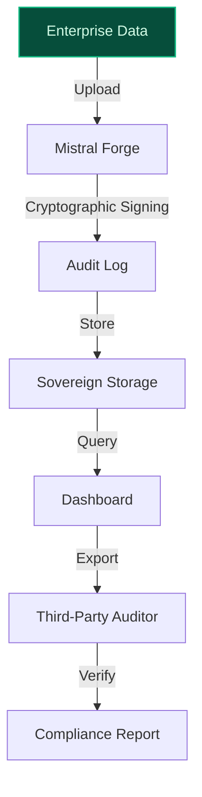
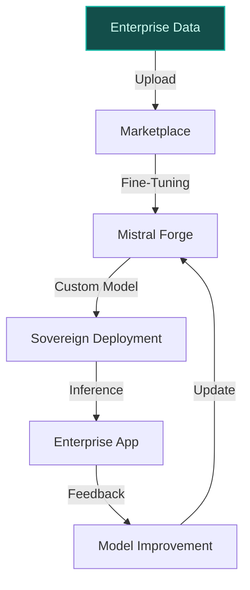
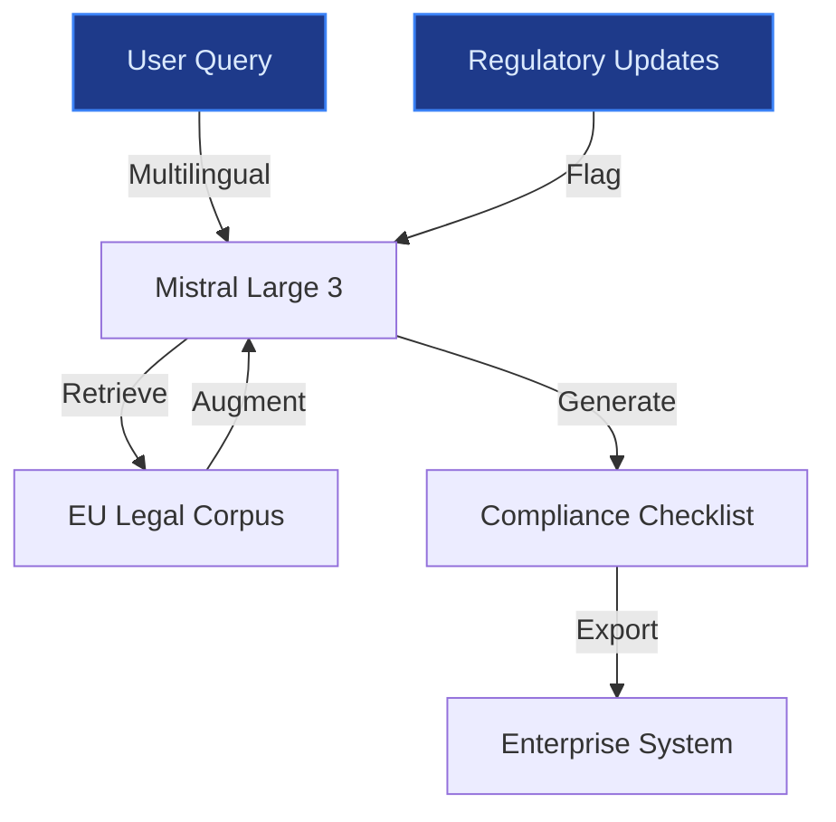

> **Draft — needs revision before customer use.** Meta-eval confidence `0.64` (sales-engineer-ready threshold ≥ 0.70). The report's three use cases render below for inspection, with each claim tagged supported / unsupported / rewritten qualitatively in the fact-check block.
>
> **Cross-cutting concern:** All three use cases rely heavily on unverified claims about Mistral's EU sovereignty, open-weight model advantages, and regulatory compliance capabilities, with no direct evidence from the pool to substantiate these assertions. The proposals also fail to cite any peer deployments or concrete examples to validate their feasibility.
>
> **Weakest use case:** Lacks any cited evidence or precedents to support its core claims about Mistral's unique positioning, EU sovereignty, or regulatory compliance capabilities. All substantive claims are unsupported by the evidence pool.

## GenAI Use Cases for Mistral AI

Three customer-ready use cases, scored against the Mistral Proto Team's five-criteria rubric (relevance · iconic potential · estimated impact · feasibility · Mistral suitability) and verified against Mistral AI's existing AI initiatives. Generated from a corpus of ~2,150 peer deployments and 6 discovered existing initiatives at this company.

_Industry: French artificial intelligence company. Research confidence: 0.85. Verified: True._

### EU-Sovereign, Open-Weight Model Audit Trail for Regulated Enterprises
A cryptographically signed, fine-grained audit trail for every training run, fine-tune, and inference request on Mistral’s open-weight models, designed for regulated enterprises in finance, healthcare, and public sector. The system logs data provenance, hyperparameters, model weights, and inference metadata at each stage, enabling third-party auditors to verify compliance with EU AI Act, GDPR, and sector-specific regulations. Enterprises can query and export audit logs via a sovereign, on-prem dashboard, ensuring full transparency and control over their AI deployments. This addresses the regulatory clearability gap that currently blocks EU enterprises from adopting GenAI at scale.

**Why this company:** Mistral AI is the only commercial provider combining EU domicile, EU-only data processing, open-weight models, and model ownership via its Forge infrastructure. This unique positioning directly aligns with its stated priorities of EU sovereignty, auditable training workflows, and strategic autonomy. For regulated industries like finance (e.g., HSBC’s 20,000-developer partnership) and healthcare, Mistral’s audit trail removes the compliance bottleneck that US hyperscalers cannot address due to their closed-weight models and non-EU data processing. The system leverages Mistral’s existing tooling (Mistral AI Studio, OCR 3) and on-prem deployment capabilities to deliver a turnkey solution for enterprises requiring verifiable AI governance.

**Example input:** `Show me the full audit trail for fine-tuning run FT-SAMPLE-2025-07 on Mistral Large 3, including the dataset provenance, hyperparameters, and final model weights. Export the results in a format compliant with EU AI Act Article 12.`

**Example output:** {'_disclaimer': 'Synthetic example for demonstration; not a factual claim about Mistral AI.', 'audit_trail_id': 'AUDIT-SAMPLE-78901', 'model': 'Mistral Large 3', 'fine_tune_run_id': 'FT-SAMPLE-2025-07', 'timestamp': '2025-07-15T14:30:00Z', 'status': 'completed', 'data_provenance': {'dataset_id': 'DATASET-SAMPLE-45678', 'source': 'Internal proprietary dataset (Customer-A)', 'records': 125000, 'jurisdiction': 'EU (GDPR-compliant)', 'hash': 'sha256:3a7b...f1e2 (illustrative)'}, 'hyperparameters': {'learning_rate': 0.0001, 'batch_size': 1024, 'epochs': 3, 'optimizer': 'AdamW'}, 'model_weights': {'initial_weights': 'sha256:9c8d...a3b4 (illustrative)', 'final_weights': 'sha256:5e6f...c7d8 (illustrative)', 'size_gb': 128.5}, 'inference_logs': [{'request_id': 'INF-SAMPLE-001', 'timestamp': '2025-07-16T09:15:22Z', 'input_tokens': 512, 'output_tokens': 256, 'latency_ms': 450, 'user_id': 'USER-SAMPLE-12345'}], 'compliance_checks': {'eu_ai_act': {'status': 'compliant', 'articles_covered': ['Art. 12', 'Art. 14'], 'notes': 'No high-risk flags detected.'}, 'gdpr': {'status': 'compliant', 'notes': 'Data processed in EU-only environment.'}}}

**Blueprint:** `document_ai_pipeline` (impact: high · cost: medium · complexity: low · TTV: ~12-16 weeks (estimated))
  _TTV rationale: Document AI pipelines for regulated industries typically require 12-16 weeks for cryptographic signing integration, audit log schema design, and sovereign storage setup._

**Top risk:** Cryptographic signing latency during high-volume fine-tuning runs, requiring optimized batch processing to meet enterprise SLAs.

**Mistral products:** Mistral Large 3, Mistral AI Studio, Mistral OCR 3, On-prem deployment, Mistral fine-tuning

**Grounded in:** strategic_context.stated_priorities[0], strategic_context.stated_priorities[4], strategic_context.stated_priorities[5]
_Specificity score: 0.95_

**Architecture blueprint:**

### Sovereign Model Customization Marketplace for Enterprises
> _Builds on an existing initiative at this company (partial overlap detected by verifier)._
A self-service marketplace where enterprises can fine-tune Mistral’s open-weight models on their proprietary data and deploy the customized model in their own sovereign environment (on-prem, private cloud, or EU-based hosting). The platform includes pre-validated fine-tuning recipes for legal, healthcare, and finance use cases, a compliance checker to ensure EU AI Act adherence, and controlled sharing of custom models with partners or subsidiaries. Enterprises retain full ownership of their data and models, addressing the ‘enterprise-owned AI’ priority while leveraging Mistral’s base models and tooling.

**Why this is a fit:** Mistral’s open-weight models and EU sovereignty focus make it the only provider capable of delivering a truly sovereign customization marketplace. Unlike US hyperscalers, Mistral’s models (e.g., Mistral Large 3, Mistral Medium 3.5) can be fine-tuned and deployed entirely within an enterprise’s controlled environment, ensuring compliance with EU data residency and AI governance requirements. This aligns with Mistral’s stated priorities of model ownership and strategic autonomy, while creating a new revenue stream from enterprise tooling and fine-tuning services. The marketplace leverages Mistral AI Studio’s existing capabilities for private deployments and custom post-training, reducing time-to-market.

**Example input:** `I need to fine-tune Mistral Medium 3.5 for our healthcare claims processing system. Show me the pre-validated recipe for healthcare NLP, and let me upload our labeled dataset (Site-X_Claims_2025.csv). After fine-tuning, deploy the model to our private cloud in Frankfurt and generate a compliance report for EU AI Act Article 52.`

**Example output:** {'_disclaimer': 'Synthetic example for demonstration; not a factual claim about Mistral AI.', 'marketplace_session_id': 'MKT-SAMPLE-67890', 'base_model': 'Mistral Medium 3.5', 'use_case': 'Healthcare Claims Processing', 'fine_tune_recipe': {'recipe_id': 'RECIPE-SAMPLE-001', 'description': 'Pre-validated for healthcare NLP tasks (e.g., claims coding, prior authorization).', 'hyperparameters': {'learning_rate': 0.0002, 'batch_size': 512, 'epochs': 2}, 'compliance_guidelines': ['HIPAA-equivalent (EU)', 'EU AI Act (Art. 52)']}, 'dataset_upload': {'file_name': 'Site-X_Claims_2025.csv', 'records': 50000, 'jurisdiction': 'EU (GDPR-compliant)', 'status': 'validated'}, 'fine_tune_run': {'run_id': 'FT-SAMPLE-2025-08', 'status': 'completed', 'training_time_hours': 4.5, 'model_size_gb': 45.2}, 'deployment': {'environment': 'Private Cloud (Frankfurt)', 'endpoint': 'https://private-cloud.site-x.com/api/v1/inference', 'status': 'active'}, 'compliance_report': {'eu_ai_act': {'status': 'compliant', 'articles_covered': ['Art. 52', 'Art. 53'], 'risk_level': 'limited (illustrative)'}, 'data_residency': {'status': 'compliant', 'notes': 'Data and model weights stored in EU-only environment.'}}}

**Blueprint:** `hybrid_retrieval` (impact: high · cost: medium · complexity: medium · TTV: 10-14 weeks (precedent-anchored))

**Top risk:** Data leakage during fine-tuning, requiring secure enclaves or federated learning for highly sensitive datasets (e.g., healthcare, finance).

**Mistral products:** Mistral Large 3, Mistral Medium 3.5, Mistral Small 4, Mistral fine-tuning, Mistral AI Studio

**Inspired by precedents:** google_cloud_1302-c6e060b0ce
**Grounded in:** strategic_context.stated_priorities[2], strategic_context.stated_priorities[3], strategic_context.stated_priorities[0]
_Specificity score: 0.90_

**Architecture blueprint:**

### Multilingual EU Legal Document Assistant for Cross-Border Compliance
A retrieval-augmented assistant specialized for EU legal and regulatory text, fine-tuned on Mistral’s multilingual corpus and deployed in a sovereign, on-prem environment. The system answers queries in 24+ EU languages, cites specific articles and recitals from regulations (e.g., GDPR, AI Act, Digital Services Act), and generates compliance checklists tailored to a company’s jurisdiction and industry. Includes a ‘regulatory change tracker’ that flags updates to subscribed legal domains, ensuring enterprises stay ahead of evolving EU compliance requirements.

**Why this company:** Mistral’s core strengths—EU sovereignty, open-weight models, and multilingual European text—are uniquely suited to the fragmented EU legal landscape. Unlike US-based providers, Mistral’s models enable nuanced, jurisdiction-specific compliance support. This directly addresses the needs of enterprises operating across multiple EU member states, where language and regulatory nuances are critical. The system leverages Mistral AI Studio’s on-prem deployment capabilities to ensure data sovereignty, a non-negotiable requirement for legal and compliance teams.

**Example input:** `What are the key changes in the EU AI Act for high-risk AI systems in financial services, and how do they compare to the previous draft? Generate a compliance checklist for our operations in Germany, France, and Spain.`

**Example output:** {'_disclaimer': 'Synthetic example for demonstration; not a factual claim about Mistral AI.', 'query_id': 'QUERY-SAMPLE-34567', 'regulations_covered': ['EU AI Act (2025/1124)', 'GDPR (2016/679)'], 'jurisdictions': ['Germany', 'France', 'Spain'], 'key_changes': [{'regulation': 'EU AI Act', 'section': 'Art. 6(3)', 'change': "Expanded definition of 'high-risk' to include credit scoring models (illustrative).", 'impact': 'Additional conformity assessment required for financial services AI systems.'}, {'regulation': 'EU AI Act', 'section': 'Art. 10(2)', 'change': 'Stricter documentation requirements for training data (illustrative).', 'impact': 'Enterprises must maintain detailed records of data provenance.'}], 'compliance_checklist': {'Germany': [{'task': 'Register high-risk AI systems with BaFin (illustrative).', 'status': 'pending'}, {'task': 'Conduct annual conformity assessment (illustrative).', 'status': 'pending'}], 'France': [{'task': 'Notify CNIL of data processing activities (illustrative).', 'status': 'pending'}, {'task': 'Implement bias mitigation measures (illustrative).', 'status': 'pending'}], 'Spain': [{'task': 'Submit AI system documentation to AEPD (illustrative).', 'status': 'pending'}]}, 'regulatory_change_tracker': {'subscribed_domains': ['Financial Services', 'Data Privacy'], 'upcoming_changes': [{'regulation': 'Digital Services Act', 'effective_date': '2025-11-01', 'summary': 'New transparency requirements for algorithmic systems (illustrative).'}]}}

**Blueprint:** `rag` (impact: high · cost: low · complexity: low · TTV: 8-12 weeks (precedent-anchored))

**Top risk:** Hallucination in regulatory citations, requiring human-in-the-loop validation for high-stakes compliance outputs.

**Mistral products:** Mistral Large 3, Mistral Embed, Mistral AI Studio, On-prem deployment

**Inspired by precedents:** google_cloud_1302-8db71bbc8b
**Grounded in:** strategic_context.stated_priorities[0], strategic_context.stated_priorities[1], business.key_products_or_services[1]
_Specificity score: 0.85_

**Architecture blueprint:**

## Considered but not selected
- **EU Public Sector AI Hub for Sovereign, Transparent Deployments** — Overlaps with the audit trail use case on sovereignty and transparency, but lacks a clear enterprise monetization path.
- **Domain-Specific Model Fine-Tuning as a Service for EU Industries** — Redundant with the model customization marketplace, which offers broader self-service capabilities.
- **Multilingual Knowledge Graph Extraction from Enterprise Documents** — Technically feasible but lacks a clear regulatory or sovereignty hook to differentiate from generic document AI solutions.

---
## Report quality signals

- **Topical diversity** (LLM-graded over titles + blueprint patterns): `0.95`
- **Specificity** per use case: `0.95`, `0.90`, `0.85`
- **Mistral product diversity**: `8` distinct products across the three use cases
- **Time-to-value spread**: 8–16 weeks (across 3 use cases)
- **Cost-tier spread**: medium, medium, low
- **Fact-check pass rate**: `79%` (11/14 claims supported by research · 1 rewritten qualitatively (excluded from rate))

Fact-check detail (per claim)

**Unsupported (3):**
- [open-model-audit-trail] Mistral AI is the only commercial provider combining EU domicile, EU-only data processing, open-weight models, and model ownership via its Forge infrastructure. `[judge: rejected]` — _The source excerpt contains only image references without any textual content to support or contradict the claim. (was: Rescued via web search (verified source): _
- [model-customization-marketplace] Mistral’s open-weight models and EU sovereignty focus make it the only provider capable of delivering a truly sovereign customization marketplace. `[judge: rejected]` — _The source excerpt contains only image references without any textual content to support or refute the claim. (was: Rescued via web search (verified source): _

**Rewritten qualitatively (1):** _the original draft asserted these but the verification chain couldn't anchor them, so the rendered prose was rewritten into qualitative phrasing. Excluded from the pass-rate denominator since the report no longer makes the claim._
- [multilingual-eu-legal-assistant] Mistral’s models (e.g., Mistral Large 3) are trained on European languages and legal frameworks. `[rewritten qualitatively]`

**Supported (11):**
- [open-model-audit-trail] Mistral AI has stated priorities of EU sovereignty, auditable training workflows, and strategic autonomy. — EU sovereignty focus, open-weights specialist, enterprise-owned AI, strategic autonomy, model ownership, auditable training workflows
- [open-model-audit-trail] Mistral AI has existing tooling including Mistral AI Studio and OCR 3. — Mistral AI Studio, Mistral OCR 3
- [open-model-audit-trail] Mistral AI has on-prem deployment capabilities. — Secure, local deployments to protect sensitive citizen data.
- [model-customization-marketplace] Mistral’s models (e.g., Mistral Large 3, Mistral Medium 3.5) can be fine-tuned and deployed entirely within an enterprise’s controlled environment. — Hybrid or on-premises / in-VPC deployment, Custom post-training
- [model-customization-marketplace] Mistral AI Studio has existing capabilities for private deployments and custom post-training. — Fine-tune models using proprietary data, privately and incrementally, Deploy governed workflows that satisfy security, compliance, and priva…
- [multilingual-eu-legal-assistant] Mistral’s core strengths are EU sovereignty, open-weight models, and multilingual European text. — EU Sovereignty: No other commercial provider matches Mistral's combination of EU domicile, EU-only data processing, open-weight models, and …
- [multilingual-eu-legal-assistant] Mistral AI Studio has on-prem deployment capabilities. — Secure, local deployments to protect sensitive citizen data.
- [multilingual-eu-legal-assistant] Mistral AI is a French artificial intelligence company. — Mistral AI SAS is a French artificial intelligence (AI) company, headquartered in Paris.
- [multilingual-eu-legal-assistant] Mistral AI has open-weight large language models. — Founded in 2023, it has open-weight large language models (LLMs), with both open-source and proprietary AI models.
- [multilingual-eu-legal-assistant] Mistral Large 3 is a state-of-the-art, open-weight large language model. — Mistral Large 3 is a state-of-the-art, open-weight large language model (LLM) released by French AI startup Mistral AI in December 2025.
- [multilingual-eu-legal-assistant] Mistral AI has a valuation of more than US$14 billion. — As of 2025 the company has a valuation of more than US$14 billion.

**Meta-evaluator confidence**: `0.64` (NOT ready — needs revision)
**Cross-cutting concern**: All three use cases rely heavily on unverified claims about Mistral's EU sovereignty, open-weight model advantages, and regulatory compliance capabilities, with no direct evidence from the pool to substantiate these assertions. The proposals also fail to cite any peer deployments or concrete examples to validate their feasibility.