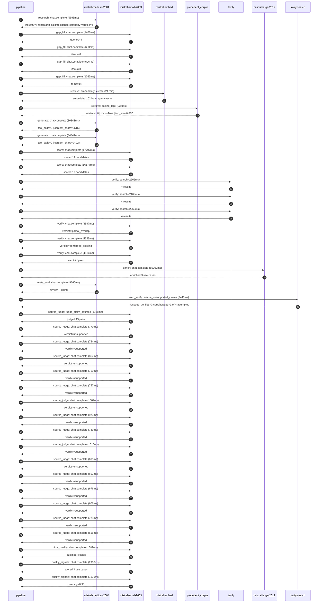

# Pipeline blueprint (architecture)

Static view of the pipeline regardless of run timing — shows agents,
models, and gates. The chronological execution log follows below.

```mermaid
flowchart TD
    Start([User: company name]) --> R
    R["<b>1. Research</b><br/>parallel: Wikipedia · Tavily news ·<br/>existing initiatives · live verification<br/><i>mistral-medium</i> synthesis"]
    R --> G["<b>1b. Gap-fill</b><br/>identify missing fields →<br/><i>mistral-small</i> generates queries →<br/>Tavily search per field →<br/><i>mistral-small</i> per-field extraction"]
    G --> Conf{Confidence ≥ 0.5<br/>OR verified<br/>OR ≥ 1 existing initiative?}
    Conf -->|no| Refuse([Refusal])
    Conf -->|yes| Ret
    Ret["<b>2. Retrieve</b><br/><i>mistral-embed</i> on company query →<br/>cosine top-K + industry/depth filter +<br/>MMR diversification"]
    Ret --> Gen["<b>3. Generate 12 candidates</b><br/><i>mistral-medium</i> with web_search tool<br/>(Tavily + deep-read) — fact citations<br/>flow into the EvidenceLedger"]
    Gen --> Score["<b>4. Score</b><br/>self-consistency: 2 parallel passes<br/><i>mistral-small</i> @ T=0.2 and T=0.4 →<br/>aggregate weighted scores"]
    Score --> Verify["<b>5. Per-candidate verify</b><br/>top-3: Tavily search + deep-read +<br/><i>mistral-small</i> verdict (pass /<br/>partial / confirmed_existing)"]
    Verify --> Enrich["<b>6. Enrich</b><br/><i>mistral-large</i> drafts customer-facing<br/>prose for 3 use cases (or<br/><i>mistral-medium</i> on fast tier)"]
    Enrich --> NumScrub["<b>6a. Numeric scrub</b><br/>flag any number not in cited content"]
    NumScrub --> Polish["<b>6b. Polish</b><br/><i>mistral-small</i> per use case (parallel):<br/>convert markers→qualitative,<br/>(ev-XXX)→[title](url)"]
    Polish --> Attr["<b>6c. Attribution check</b><br/><i>mistral-small</i> per use case (parallel):<br/>fix corpus-ID ↔ company mismatches"]
    Attr --> Meta["<b>7. Meta-evaluation</b><br/><i>mistral-medium</i> reviews report against<br/>cited precedents + ledger entries:<br/>strict claim verification"]
    Meta --> RegenQ{confidence < 0.6<br/>AND not fast tier?}
    RegenQ -->|yes| Regen["<b>7b. Targeted regen</b><br/><i>mistral-large</i> re-enriches just the<br/>weakest use case with the next-best<br/>near-miss; re-runs meta-eval"]
    RegenQ -->|no| QS
    Regen --> QS
    QS["<b>Quality signals</b><br/>LLM-graded diversity + specificity,<br/>fact-check pass rate, TTV/cost spread"]
    QS --> Render([Markdown report + trace])

    classDef agent fill:#fef3c7,stroke:#f59e0b
    classDef gate fill:#dbeafe,stroke:#3b82f6
    classDef io fill:#dcfce7,stroke:#16a34a
    class R,G,Ret,Gen,Score,Verify,Enrich,NumScrub,Polish,Attr,Meta,Regen,QS agent
    class Conf,RegenQ gate
    class Start,Refuse,Render io
```

## Execution trace — Mistral AI

Started: `2026-05-10T07:42:47.230728+00:00`. Total wall time: `196.7s` across `39` recorded actions.

### Per-step time totals

| Step | Calls | Total time | Avg time |
|---|---:|---:|---:|
| `research` | 1 | 9.70s | 9695ms |
| `gap_fill` | 4 | 3.69s | 922ms |
| `retrieve` | 2 | 0.55s | 277ms |
| `generate` | 2 | 71.18s | 35592ms |
| `score` | 2 | 33.97s | 16987ms |
| `verify` | 6 | 19.44s | 3241ms |
| `enrich` | 1 | 55.21s | 55207ms |
| `meta_eval` | 1 | 9.66s | 9660ms |
| `web_verify` | 1 | 3.44s | 3441ms |
| `source_judge` | 16 | 13.52s | 845ms |
| `final_qualify` | 1 | 1.59s | 1589ms |
| `quality_signals` | 2 | 4.54s | 2271ms |

### Chronological event log

- `07:42:51.036` **[research]** `mistral-medium-2604.chat.complete` — 9695ms
   - inputs: synthesize CompanyContext for Mistral AI | depth=medium
   - outputs: industry='French artificial intelligence company' verified=True conf=0.75
- `07:43:00.736` **[gap_fill]** `mistral-small-2603.chat.complete` — 1406ms
   - inputs: generate gap queries | fields=['business_model', 'products', 'data_assets', 'priorities']
   - outputs: queries=4
- `07:43:07.692` **[gap_fill]** `mistral-small-2603.chat.complete` — 653ms
   - inputs: layer-2 extract field=priorities
   - outputs: items=6
- `07:43:07.696` **[gap_fill]** `mistral-small-2603.chat.complete` — 596ms
   - inputs: layer-2 extract field=data_assets
   - outputs: items=3
- `07:43:07.699` **[gap_fill]** `mistral-small-2603.chat.complete` — 1033ms
   - inputs: layer-2 extract field=products
   - outputs: items=14
- `07:43:08.733` **[retrieve]** `mistral-embed.embeddings.create` — 217ms
   - inputs: company_query | industries='French artificial intelligence company'
   - outputs: embedded 1024-dim query vector
- `07:43:08.950` **[retrieve]** `precedent_corpus.cosine_topk` — 337ms
   - inputs: k=8 min_depth=0.4 target='Mistral AI'
   - outputs: retrieved 8 | mmr=True | top_sim=0.807
- `07:43:10.153` **[generate]** `mistral-medium-2604.chat.complete` — 36843ms
   - inputs: iteration=0 tool_calls_used=0/2 tools=on
   - outputs: tool_calls=0 | content_chars=25153
- `07:43:46.997` **[generate]** `mistral-medium-2604.chat.complete` — 34341ms
   - inputs: iteration=1 tool_calls_used=0/2 tools=on
   - outputs: tool_calls=0 | content_chars=24024
- `07:44:21.676` **[score]** `mistral-small-2603.chat.complete` — 17797ms
   - inputs: self-consistency pass T=0.2
   - outputs: scored 12 candidates
- `07:44:21.680` **[score]** `mistral-small-2603.chat.complete` — 16177ms
   - inputs: self-consistency pass T=0.4
   - outputs: scored 12 candidates
- `07:44:39.508` **[verify]** `tavily.search` — 2265ms
   - inputs: candidate=eu-public-sector-ai-hub | query='Mistral AI EU Public Sector AI Hub for Sovereign, Transparen'
   - outputs: 4 results
- `07:44:39.508` **[verify]** `tavily.search` — 2169ms
   - inputs: candidate=open-model-audit-trail | query='Mistral AI EU-Sovereign, Open-Weight Model Audit Trail for R'
   - outputs: 4 results
- `07:44:39.508` **[verify]** `tavily.search` — 2269ms
   - inputs: candidate=model-customization-marketplace | query='Mistral AI Sovereign Model Customization Marketplace for Ent'
   - outputs: 4 results
- `07:44:42.193` **[verify]** `mistral-small-2603.chat.complete` — 3597ms
   - inputs: verdict for model-customization-marketplace
   - outputs: verdict='partial_overlap'
- `07:44:42.434` **[verify]** `mistral-small-2603.chat.complete` — 4332ms
   - inputs: verdict for eu-public-sector-ai-hub
   - outputs: verdict='confirmed_existing'
- `07:44:42.517` **[verify]** `mistral-small-2603.chat.complete` — 4814ms
   - inputs: verdict for open-model-audit-trail
   - outputs: verdict='pass'
- `07:44:47.333` **[enrich]** `mistral-large-2512.chat.complete` — 55207ms
   - inputs: tier=standard top_3=['open-model-audit-trail', 'model-customization-marketplace', 'multilingual-eu-legal-assistant']
   - outputs: enriched 3 use cases
- `07:45:42.567` **[meta_eval]** `mistral-medium-2604.chat.complete` — 9660ms
   - inputs: reviewing 3 use cases
   - outputs: review + claims
- `07:45:52.244` **[web_verify]** `tavily.search.rescue_unsupported_claims` — 3441ms
   - inputs: company='Mistral AI' unsupported=4 budget=12
   - outputs: rescued: verified=3 corroborated=1 of 4 attempted
- `07:45:55.688` **[source_judge]** `mistral-small-2603.judge_claim_sources` — 1788ms
   - inputs: pairs=15
   - outputs: judged 15 pairs
- `07:45:55.688` **[source_judge]** `mistral-small-2603.chat.complete` — 770ms
   - inputs: claim='Mistral AI is the only commercial provider combining EU domi'
   - outputs: verdict=unsupported
- `07:45:55.692` **[source_judge]** `mistral-small-2603.chat.complete` — 784ms
   - inputs: claim='Mistral AI has stated priorities of EU sovereignty, auditabl'
   - outputs: verdict=supported
- `07:45:55.697` **[source_judge]** `mistral-small-2603.chat.complete` — 857ms
   - inputs: claim='HSBC has a 20,000-developer partnership.'
   - outputs: verdict=unsupported
- `07:45:55.700` **[source_judge]** `mistral-small-2603.chat.complete` — 760ms
   - inputs: claim='Mistral AI has existing tooling including Mistral AI Studio '
   - outputs: verdict=supported
- `07:45:55.702` **[source_judge]** `mistral-small-2603.chat.complete` — 757ms
   - inputs: claim='Mistral AI has on-prem deployment capabilities.'
   - outputs: verdict=supported
- `07:45:55.706` **[source_judge]** `mistral-small-2603.chat.complete` — 1009ms
   - inputs: claim='Mistral’s open-weight models and EU sovereignty focus make i'
   - outputs: verdict=unsupported
- `07:45:55.710` **[source_judge]** `mistral-small-2603.chat.complete` — 973ms
   - inputs: claim='Mistral’s models (e.g., Mistral Large 3, Mistral Medium 3.5)'
   - outputs: verdict=supported
- `07:45:55.713` **[source_judge]** `mistral-small-2603.chat.complete` — 789ms
   - inputs: claim='Mistral AI Studio has existing capabilities for private depl'
   - outputs: verdict=supported
- `07:45:56.460` **[source_judge]** `mistral-small-2603.chat.complete` — 1016ms
   - inputs: claim='Mistral’s core strengths are EU sovereignty, open-weight mod'
   - outputs: verdict=supported
- `07:45:56.467` **[source_judge]** `mistral-small-2603.chat.complete` — 613ms
   - inputs: claim='Mistral’s models (e.g., Mistral Large 3) are trained on Euro'
   - outputs: verdict=unsupported
- `07:45:56.471` **[source_judge]** `mistral-small-2603.chat.complete` — 692ms
   - inputs: claim='Mistral AI Studio has on-prem deployment capabilities.'
   - outputs: verdict=supported
- `07:45:56.475` **[source_judge]** `mistral-small-2603.chat.complete` — 676ms
   - inputs: claim='Mistral AI is a French artificial intelligence company.'
   - outputs: verdict=supported
- `07:45:56.502` **[source_judge]** `mistral-small-2603.chat.complete` — 606ms
   - inputs: claim='Mistral AI has open-weight large language models.'
   - outputs: verdict=supported
- `07:45:56.553` **[source_judge]** `mistral-small-2603.chat.complete` — 773ms
   - inputs: claim='Mistral Large 3 is a state-of-the-art, open-weight large lan'
   - outputs: verdict=supported
- `07:45:56.683` **[source_judge]** `mistral-small-2603.chat.complete` — 655ms
   - inputs: claim='Mistral AI has a valuation of more than US$14 billion.'
   - outputs: verdict=supported
- `07:45:57.478` **[final_qualify]** `mistral-small-2603.chat.complete` — 1589ms
   - inputs: use_case=multilingual-eu-legal-assistant unsupported=1
   - outputs: qualified 4 fields
- `07:45:59.393` **[quality_signals]** `mistral-small-2603.chat.complete` — 2906ms
   - inputs: specificity grade (3 use cases)
   - outputs: scored 3 use cases
- `07:46:02.299` **[quality_signals]** `mistral-small-2603.chat.complete` — 1636ms
   - inputs: diversity grade
   - outputs: diversity=0.95

## Mermaid sequence diagram (execution)

