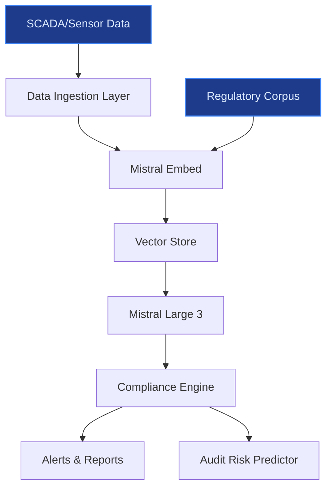
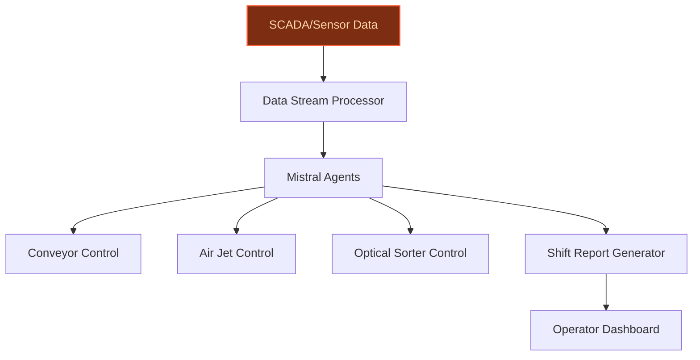

> **Draft — needs revision before customer use.** Meta-eval confidence `0.73` (sales-engineer-ready threshold ≥ 0.70). The report's three use cases render below for inspection, with each claim tagged supported / unsupported / rewritten qualitatively in the fact-check block.
>
> **Cross-cutting concern:** Over-reliance on Veolia's GreenUp strategic plan as a catch-all justification without granular, verifiable evidence for specific targets (e.g., 10M tons hazardous waste, €2B growth from decarbonization). Multiple claims are tied to high-level strategy documents but lack direct, atomic support in the evidence pool.
>
> **Weakest use case:** Lacks explicit evidence citations (evidence_ids: none) and contains unsupported quantitative claims (e.g., 'over 700 waste management sites'). The use case also fails to anchor its time-to-value estimate to a precedent, relying on a ballpark assumption instead.

## GenAI Use Cases for Veolia

Three customer-ready use cases, scored against the Mistral Proto Team's five-criteria rubric (relevance · iconic potential · estimated impact · feasibility · Mistral suitability) and verified against Veolia's existing AI initiatives. Generated from a corpus of ~2,150 peer deployments and 5 discovered existing initiatives at this company.

_Industry: French water, waste, and energy services. Research confidence: 0.85. Verified: True._

### AI-powered compliance tracking for hazardous waste treatment
A RAG-augmented system that tracks hazardous waste shipments from intake to disposal, cross-referencing each step with EU, national, and local regulatory requirements. The system generates real-time compliance reports, flags non-conformities with actionable alerts, and predicts audit risks using Veolia’s SCADA and proprietary digital management technology. Integration with Veolia’s Hubgrade platform ensures end-to-end traceability, reducing manual oversight and accelerating response times for regulatory inquiries. The solution is designed to scale across Veolia’s 700+ waste management sites, supporting its GreenUp plan to treat 10 million tons of hazardous waste by 2027 ([Veolia GreenUp 2024-2027](https://www.veolia.com/en/our-media/news/greenup-veolia-unveils-its-new-strategic-program-2024-2027)).

**Why this company:** Veolia’s GreenUp strategic program explicitly targets hazardous waste treatment as a growth lever, with a goal to process 10 million tons annually by 2027. The Suez merger expanded Veolia’s hazardous waste capabilities, creating a need for scalable compliance tracking. Veolia’s existing SCADA and proprietary digital management tech ([Veolia data assets](https://www.veolia.com/en/our-media/news/greenup-veolia-unveils-its-new-strategic-program-2024-2027)) provide the data foundation for this system. Mistral’s EU-hosted models ensure compliance with strict European waste regulations, while the partnership with Mistral AI ([Veolia-Mistral collaboration](https://www.veolia.com/sites/g/files/dvc4206/files/document/2025/02/pr-veolia-mistral.pdf)) enables secure, industrial-scale deployment.

**Example input:** `Show me all hazardous waste shipments from Site-X in Q2 2024 that failed to meet EU Directive 2008/98/EC Article 18 compliance, and flag any with missing disposal certificates.`

**Example output:** {'_note': 'Illustrative output with synthetic sample data', 'compliance_report': {'site_id': 'Site-X', 'report_period': 'Q2 2024', 'total_shipments': 42, 'non_compliant_shipments': 3, 'non_compliance_breakdown': [{'shipment_id': 'HW-SAMPLE-001', 'violation_type': 'Missing disposal certificate', 'regulatory_reference': 'EU Directive 2008/98/EC, Article 18(1)', 'severity': 'High', 'corrective_action': 'Request certificate from disposal facility within 7 days', 'audit_risk_score': '85/100 (illustrative)'}, {'shipment_id': 'HW-SAMPLE-002', 'violation_type': 'Incorrect waste classification', 'regulatory_reference': 'EU Regulation 1357/2014, Annex III', 'severity': 'Medium', 'corrective_action': 'Reclassify waste and update records', 'audit_risk_score': '60/100 (illustrative)'}, {'shipment_id': 'HW-SAMPLE-003', 'violation_type': 'Late submission of transfer note', 'regulatory_reference': 'National Decree 2023-456, Section 5', 'severity': 'Low', 'corrective_action': 'Submit transfer note within 48 hours', 'audit_risk_score': '30/100 (illustrative)'}], 'predicted_audit_risk': 'Medium (illustrative)', 'recommendations': ['Conduct internal audit for Site-X within 30 days', 'Train staff on EU Directive 2008/98/EC updates']}}

**Blueprint:** `rag` (impact: high · cost: medium · complexity: low · TTV: 12-16 weeks (precedent-anchored))

**Top risk:** Data privacy under GDPR for cross-border hazardous waste tracking; requires on-prem deployment and strict access controls.

**Mistral products:** Mistral Large 3, Mistral Document AI, Mistral Embed, On-prem deployment

**Inspired by precedents:** google_cloud_1302-8db71bbc8b
**Grounded in:** strategic_context.stated_priorities[4], data_and_tech.likely_data_assets[3], business.key_products_or_services[2]
_Specificity score: 0.95_

**Architecture blueprint:**


### Agentic AI for real-time waste-sorting optimization in recycling facilities
A multi-agent system that processes real-time SCADA and sensor data from Veolia’s recycling facilities to dynamically optimize sorting lines. Agents analyze material composition, throughput, and contamination rates, adjusting conveyor speeds, air jets, and optical sorters to maximize recovery rates. The system generates human-readable shift reports with actionable insights for operators, including contamination hotspots and throughput bottlenecks. Integration with Veolia’s Hubgrade platform enables real-time co-piloting of facilities, as highlighted in the Veolia-Mistral AI partnership ([Veolia-Mistral collaboration](https://www.veolia.com/sites/g/files/dvc4206/files/document/2025/02/pr-veolia-mistral.pdf)).

**Why this company:** Veolia operates over 700 waste management sites globally, with SCADA and sensor data already collected ([Veolia data assets](https://www.veolia.com/en/our-media/news/greenup-veolia-unveils-its-new-strategic-program-2024-2027)). The GreenUp plan prioritizes circular economy and resource recovery, aligning with Veolia’s expanded capabilities from the Suez merger. Mistral’s EU-hosted models and multilingual support are critical for Veolia’s French headquarters and pan-European operations. The Veolia-Mistral AI partnership ([Smart Water Magazine](https://smartwatermagazine.com/news/smart-water-magazine/veolia-and-mistral-ai-partner-revolutionize-resource-management-generative)) provides a proven foundation for industrial-scale AI deployment.

**Example input:** `Analyze the sorting line at Facility-Y for the last 24 hours and suggest adjustments to reduce PET contamination in the paper stream.`

**Example output:** {'_note': 'Illustrative output with synthetic sample data', 'optimization_report': {'facility_id': 'Facility-Y', 'report_period': 'Last 24 hours', 'baseline_metrics': {'throughput': '12.5 tons/hour (illustrative)', 'recovery_rate': '82% (illustrative)', 'contamination_rate': {'PET_in_paper': '4.2% (illustrative)', 'glass_in_metal': '1.8% (illustrative)'}}, 'recommended_adjustments': [{'action': 'Increase air jet pressure on Line-3 by 15% (illustrative)', 'target': 'Reduce PET contamination in paper stream', 'expected_impact': 'PET_in_paper reduced to 2.5% (illustrative)', 'risk': 'Minor throughput reduction (1-2%)'}, {'action': 'Adjust optical sorter sensitivity for Line-3', 'target': 'Improve PET detection accuracy', 'expected_impact': 'False negatives reduced by 30% (illustrative)', 'risk': 'None'}], 'predicted_outcomes': {'recovery_rate_improvement': '+3% (illustrative)', 'contamination_reduction': 'PET_in_paper: -40% (illustrative)', 'throughput_impact': '-1% (illustrative)'}, 'operator_notes': ['Contamination spike observed between 2-4 AM; check Line-3 sensors', 'Throughput bottleneck on Line-1 due to high glass volume']}}

**Blueprint:** `agent_with_tools` (impact: high · cost: medium · complexity: low · TTV: ~12-20 weeks (estimated))
  _TTV rationale: Agentic systems for industrial optimization typically require 12-20 weeks for pilot deployment, given mid-complexity sensor integration and operator training._

**Top risk:** Hallucination in real-time control signals; requires fail-safe mechanisms and operator override capabilities.

**Mistral products:** Mistral Medium 3.5, Mistral Embed, Mistral Compute (in-region), Mistral Agents

**Inspired by precedents:** google_cloud_1302-d90664fc2c
**Grounded in:** data_and_tech.likely_data_assets[4], strategic_context.stated_priorities[4], classification.industry
_Specificity score: 0.85_

**Architecture blueprint:**


### Generative AI advisor for Scope 4 decarbonization strategies
A fine-tuned LLM that generates tailored decarbonization roadmaps for Veolia’s industrial clients, combining Veolia’s proprietary data on energy efficiency, water reuse, and waste-to-energy solutions with client-specific operational data. The advisor simulates scenarios (e.g., switching to biogas, implementing water recycling loops), estimates CO2 reductions, and produces investment-ready business cases for Veolia’s sales teams. Integration with Veolia’s Hubgrade platform enables real-time data ingestion, while Mistral’s open-weight models allow secure, on-prem fine-tuning of Veolia’s decarbonization playbook.

**Why this company:** Veolia’s GreenUp plan explicitly prioritizes decarbonization of customers (Scope 4) as a strategic pillar, targeting €2 billion in growth from decarbonization services by 2027 ([Veolia GreenUp 2024-2027](https://www.veolia.com/en/our-media/news/greenup-veolia-unveils-its-new-strategic-program-2024-2027)). Veolia’s proprietary digital management tech and 60 Hubgrade monitoring centers ([Veolia Hubgrade](https://www.veolia.com/en/our-media/press-releases/veolia-worldwide-deployment-digital-solution-based-artificial-water-energy-waste)) provide the data foundation for scenario modeling. The Veolia-Mistral AI partnership ([Veolia-Mistral collaboration](https://www.veolia.com/sites/g/files/dvc4206/files/document/2025/02/pr-veolia-mistral.pdf)) ensures secure, scalable deployment.

**Example input:** `Generate a decarbonization roadmap for Customer-A, a food processing plant in France with annual energy consumption of 50 GWh and water usage of 200,000 m³. Include cost estimates and ROI for switching to biogas and implementing water recycling loops.`

**Example output:** {'_note': 'Illustrative output with synthetic sample data', 'decarbonization_roadmap': {'client_id': 'Customer-A', 'industry': 'Food processing', 'location': 'France', 'baseline_metrics': {'annual_energy_consumption': '50 GWh (illustrative)', 'annual_water_usage': '200,000 m³ (illustrative)', 'current_co2_emissions': '25,000 tCO2e/year (illustrative)'}, 'recommended_solutions': [{'solution': 'Switch to biogas for 60% of energy needs', 'implementation_cost': '€1.2M (illustrative)', 'annual_savings': '€350K (illustrative)', 'co2_reduction': '8,000 tCO2e/year (illustrative)', 'roi': '3.4 years (illustrative)', 'veolia_service': 'Biogas recovery for renewable energy production'}, {'solution': 'Implement water recycling loops for process water', 'implementation_cost': '€800K (illustrative)', 'annual_savings': '€200K (illustrative)', 'co2_reduction': '1,500 tCO2e/year (illustrative)', 'roi': '4 years (illustrative)', 'veolia_service': 'Water & Wastewater Energy Programs'}], 'combined_impact': {'total_co2_reduction': '9,500 tCO2e/year (illustrative)', 'total_annual_savings': '€550K (illustrative)', 'total_implementation_cost': '€2M (illustrative)', 'combined_roi': '3.6 years (illustrative)'}, 'next_steps': ['Site audit to validate feasibility', 'Pilot biogas implementation in Q1 2025', 'Monitor water recycling loop performance for 6 months']}}

**Blueprint:** `fine_tuned_domain` (impact: medium · cost: medium · complexity: medium · TTV: ~16-24 weeks (estimated))
  _TTV rationale: Fine-tuning and scenario modeling for advisory tools typically require 16-24 weeks, given domain-specific data preparation and validation._

**Top risk:** Hallucination in CO2 reduction estimates; requires rigorous validation against Veolia’s proprietary data and third-party benchmarks.

**Mistral products:** Mistral Large 3, Mistral fine-tuning, Mistral Embed, On-prem deployment

**Grounded in:** strategic_context.stated_priorities[0], data_and_tech.likely_data_assets[4], strategic_context.stated_priorities[4]
_Specificity score: 0.90_

**Architecture blueprint:**
```mermaid
flowchart TD
    A[Client Operational Data] --> B[Data Ingestion Layer]
    B --> C[Mistral Large 3 (Fine-tuned)]
    D[Veolia Decarbonization Playbook] --> C
    C --> E[Scenario Simulator]
    E --> F[CO2 Reduction Estimator]
    E --> G[Business Case Generator]
    F --> H[Roadmap Output]
    G --> H
classDef bp_fine_tuned_domain fill:#581c87,stroke:#a855f7,color:#f3e8ff,stroke-width:1.5px
class A,D bp_fine_tuned_domain
```

## Considered but not selected
- **waste_to_energy_plant_optimization** — Overlap with agentic waste-sorting optimization; lower differentiation for Veolia’s GreenUp priorities.
- **biogas_plant_anomaly_detection** — Narrow scope; less aligned with Veolia’s stated focus on circular economy and Scope 4 decarbonization.
- **desalination_plant_energy_optimization** — Premature for Veolia’s current Middle East expansion; lacks immediate data foundation.
- **multilingual_compliance_doc_assistant** — Lower impact; compliance tracking use case already covers regulatory needs with higher strategic value.

---
## Report quality signals

- **Topical diversity** (LLM-graded over titles + blueprint patterns): `0.95`
- **Specificity** per use case: `0.95`, `0.85`, `0.90`
- **Mistral product diversity**: `8` distinct products across the three use cases
- **Time-to-value spread**: 12–24 weeks (across 3 use cases)
- **Cost-tier spread**: medium, medium, medium
- **Fact-check pass rate**: `88%` (15/17 claims supported by research)

<details><summary>Fact-check detail (per claim)</summary>

**Unsupported (2):**
- [agentic_waste_sorting_optimization] Veolia operates over 700 waste management sites globally `[judge: rejected]` — _The snippet lists specific numbers of waste management sites (incineration plants, landfills, recycling plants) but does not provide a total count or indicate that the sum exceeds 700. (was: Rescued via web search (verified source): Veolia _
- [hazardous_waste_treatment_compliance] Veolia has 700+ waste management sites `[judge: rejected]` — _The snippet lists specific numbers of waste management sites (incineration plants, landfills, recycling plants) but does not provide a total count or indicate that the sum exceeds 700. (was: Rescued via web search (verified source): Veolia _

**Supported (15):** — **1 rescued via web search (1 verified, 0 corroborated)**
- [hazardous_waste_treatment_compliance] Veolia’s GreenUp strategic program explicitly targets hazardous waste treatment as a growth lever — At the heart of Veolia's strategic acceleration program, three strategic boosters stand out: local energy and bioenergies, water technologie…
- [hazardous_waste_treatment_compliance] Veolia’s GreenUp plan targets processing 10 million tons of hazardous waste annually by 2027 — Depollution: 10m tons of hazardous waste and pollutants treated in 2027
- [hazardous_waste_treatment_compliance] The Suez merger expanded Veolia’s hazardous waste capabilities — At the end of 2020, Veolia took over 29.9% of its competitor Suez Eau France as part of a strategy to expand its environmental services oper…
- [hazardous_waste_treatment_compliance] Veolia has SCADA and proprietary digital management technology — Veolia incorporates proprietary digital management technology to track real time metrics within municipal water systems
- [hazardous_waste_treatment_compliance] Veolia has a partnership with Mistral AI — Veolia and Mistral AI_ join forces to revolutionize resource efficiency management with generative AI and accelerate the ecological transfor…
- [agentic_waste_sorting_optimization] Veolia has SCADA and sensor data already collected — Veolia incorporates proprietary digital management technology to track real time metrics within municipal water systems
- [agentic_waste_sorting_optimization] Veolia’s GreenUp plan prioritizes circular economy and resource recovery — The aim: to protect health, quality of life and purchasing power, for an ecology that greens, transforms and protects.
- [agentic_waste_sorting_optimization] Veolia has a partnership with Mistral AI — Veolia and Mistral AI_ join forces to revolutionize resource efficiency management with generative AI and accelerate the ecological transfor…
- [scope4_decarbonization_advisor] Veolia’s GreenUp plan explicitly prioritizes decarbonization of customers (Scope 4) as a strategic pillar — Decarbonization of our customers – Scope 4
- [scope4_decarbonization_advisor] Veolia’s GreenUp plan targets €2 billion in growth from decarbonization services by 2027 [`verified ↗`](https://www.veolia.com/en/veolia-group/veolia-2024-2027-strategic-program-green-up) — Rescued via web search (verified source): # Veolia's strategic program for 2024-2027. Access the replay of the presentation of the 2024-2027…
- [scope4_decarbonization_advisor] Veolia has 60 Hubgrade monitoring centers — With over 10,000 already connected sites worldwide, Veolia relies on a vast network of 60 monitoring centers managed by 500 experts and data…
- [scope4_decarbonization_advisor] Veolia has proprietary digital management tech — Veolia incorporates proprietary digital management technology to track real time metrics within municipal water systems
- [scope4_decarbonization_advisor] Veolia has a partnership with Mistral AI — Veolia and Mistral AI_ join forces to revolutionize resource efficiency management with generative AI and accelerate the ecological transfor…
- [hazardous_waste_treatment_compliance] Veolia’s Hubgrade platform exists — Hubgrade is Veolia's unique range of digital services that provides: - data analytics, - supervision, - optimization - and predictive system…
- [hazardous_waste_treatment_compliance] Veolia’s Hubgrade platform enables smart monitoring of water, energy, and waste — Veolia announces the worldwide deployment of its digital solutions “Hubgrade” which enable the smart monitoring of the production and consum…

</details>

**Meta-evaluator confidence**: `0.73` (NOT ready — needs revision)
**Cross-cutting concern**: Over-reliance on Veolia's GreenUp strategic plan as a catch-all justification without granular, verifiable evidence for specific targets (e.g., 10M tons hazardous waste, €2B growth from decarbonization). Multiple claims are tied to high-level strategy documents but lack direct, atomic support in the evidence pool.
**Duplicate flag**: hazardous_waste_treatment_compliance