# Pipeline blueprint (architecture)

Static view of the pipeline regardless of run timing — shows agents,
models, and gates. The chronological execution log follows below.

```mermaid
flowchart TD
    Start([User: company name]) --> R
    R["<b>1. Research</b><br/>parallel: Wikipedia · Tavily news ·<br/>existing initiatives · live verification<br/><i>mistral-medium</i> synthesis"]
    R --> G["<b>1b. Gap-fill</b><br/>identify missing fields →<br/><i>mistral-small</i> generates queries →<br/>Tavily search per field →<br/><i>mistral-small</i> per-field extraction"]
    G --> Conf{Confidence ≥ 0.5<br/>OR verified<br/>OR ≥ 1 existing initiative?}
    Conf -->|no| Refuse([Refusal])
    Conf -->|yes| Ret
    Ret["<b>2. Retrieve</b><br/><i>mistral-embed</i> on company query →<br/>cosine top-K + industry/depth filter +<br/>MMR diversification"]
    Ret --> Gen["<b>3. Generate 12 candidates</b><br/><i>mistral-medium</i> with web_search tool<br/>(Tavily + deep-read) — fact citations<br/>flow into the EvidenceLedger"]
    Gen --> Score["<b>4. Score</b><br/>self-consistency: 2 parallel passes<br/><i>mistral-small</i> @ T=0.2 and T=0.4 →<br/>aggregate weighted scores"]
    Score --> Verify["<b>5. Per-candidate verify</b><br/>top-3: Tavily search + deep-read +<br/><i>mistral-small</i> verdict (pass /<br/>partial / confirmed_existing)"]
    Verify --> Enrich["<b>6. Enrich</b><br/><i>mistral-large</i> drafts customer-facing<br/>prose for 3 use cases (or<br/><i>mistral-medium</i> on fast tier)"]
    Enrich --> NumScrub["<b>6a. Numeric scrub</b><br/>flag any number not in cited content"]
    NumScrub --> Polish["<b>6b. Polish</b><br/><i>mistral-small</i> per use case (parallel):<br/>convert markers→qualitative,<br/>(ev-XXX)→[title](url)"]
    Polish --> Attr["<b>6c. Attribution check</b><br/><i>mistral-small</i> per use case (parallel):<br/>fix corpus-ID ↔ company mismatches"]
    Attr --> Meta["<b>7. Meta-evaluation</b><br/><i>mistral-medium</i> reviews report against<br/>cited precedents + ledger entries:<br/>strict claim verification"]
    Meta --> RegenQ{confidence < 0.6<br/>AND not fast tier?}
    RegenQ -->|yes| Regen["<b>7b. Targeted regen</b><br/><i>mistral-large</i> re-enriches just the<br/>weakest use case with the next-best<br/>near-miss; re-runs meta-eval"]
    RegenQ -->|no| QS
    Regen --> QS
    QS["<b>Quality signals</b><br/>LLM-graded diversity + specificity,<br/>fact-check pass rate, TTV/cost spread"]
    QS --> Render([Markdown report + trace])

    classDef agent fill:#fef3c7,stroke:#f59e0b
    classDef gate fill:#dbeafe,stroke:#3b82f6
    classDef io fill:#dcfce7,stroke:#16a34a
    class R,G,Ret,Gen,Score,Verify,Enrich,NumScrub,Polish,Attr,Meta,Regen,QS agent
    class Conf,RegenQ gate
    class Start,Refuse,Render io
```

## Execution trace — Veolia

Started: `2026-05-10T07:32:02.213154+00:00`. Total wall time: `232.5s` across `43` recorded actions.

### Per-step time totals

| Step | Calls | Total time | Avg time |
|---|---:|---:|---:|
| `research` | 1 | 7.78s | 7785ms |
| `gap_fill` | 4 | 3.05s | 762ms |
| `retrieve` | 2 | 1.08s | 541ms |
| `generate` | 2 | 34.09s | 17043ms |
| `generate.web_search` | 2 | 4.65s | 2324ms |
| `score` | 2 | 38.25s | 19124ms |
| `verify` | 6 | 21.67s | 3612ms |
| `enrich` | 2 | 111.21s | 55603ms |
| `meta_eval` | 1 | 10.76s | 10756ms |
| `web_verify` | 1 | 1.21s | 1214ms |
| `source_judge` | 18 | 18.03s | 1002ms |
| `quality_signals` | 2 | 3.99s | 1995ms |

### Chronological event log

- `07:32:04.889` **[research]** `mistral-medium-2604.chat.complete` — 7785ms
   - inputs: synthesize CompanyContext for Veolia | depth=medium
   - outputs: industry='French water, waste, and energy services' verified=True conf=0.75
- `07:32:12.675` **[gap_fill]** `mistral-small-2603.chat.complete` — 963ms
   - inputs: generate gap queries | fields=['business_model', 'products', 'data_assets', 'priorities']
   - outputs: queries=4
- `07:32:17.922` **[gap_fill]** `mistral-small-2603.chat.complete` — 889ms
   - inputs: layer-2 extract field=priorities
   - outputs: items=6
- `07:32:17.926` **[gap_fill]** `mistral-small-2603.chat.complete` — 600ms
   - inputs: layer-2 extract field=data_assets
   - outputs: items=6
- `07:32:17.929` **[gap_fill]** `mistral-small-2603.chat.complete` — 597ms
   - inputs: layer-2 extract field=products
   - outputs: items=3
- `07:32:18.813` **[retrieve]** `mistral-embed.embeddings.create` — 762ms
   - inputs: company_query | industries='French water, waste, and energy services'
   - outputs: embedded 1024-dim query vector
- `07:32:19.575` **[retrieve]** `precedent_corpus.cosine_topk` — 320ms
   - inputs: k=8 min_depth=0.4 target='Veolia'
   - outputs: retrieved 8 | mmr=True | top_sim=0.792
- `07:32:20.889` **[generate]** `mistral-medium-2604.chat.complete` — 1828ms
   - inputs: iteration=0 tool_calls_used=0/2 tools=on
   - outputs: tool_calls=4 | content_chars=0
- `07:32:22.739` **[generate.web_search]** `tavily.search` — 2132ms
   - inputs: query='Veolia Hubgrade smart monitoring water energy waste 2024'
   - outputs: 2 raw results
- `07:32:25.930` **[generate.web_search]** `tavily.search` — 2516ms
   - inputs: query='Veolia GreenUp 2024-2027 strategic plan details'
   - outputs: 2 raw results
- `07:32:39.088` **[generate]** `mistral-medium-2604.chat.complete` — 32257ms
   - inputs: iteration=1 tool_calls_used=2/2 tools=off
   - outputs: tool_calls=0 | content_chars=20993
- `07:33:11.584` **[score]** `mistral-small-2603.chat.complete` — 16367ms
   - inputs: self-consistency pass T=0.2
   - outputs: scored 12 candidates
- `07:33:11.588` **[score]** `mistral-small-2603.chat.complete` — 21881ms
   - inputs: self-consistency pass T=0.4
   - outputs: scored 12 candidates
- `07:33:33.499` **[verify]** `tavily.search` — 1963ms
   - inputs: candidate=hazardous_waste_treatment_compliance | query='Veolia AI-powered compliance tracking for hazardous waste tr'
   - outputs: 4 results
- `07:33:33.499` **[verify]** `tavily.search` — 1830ms
   - inputs: candidate=multilingual_compliance_doc_assistant | query='Veolia EU-hosted multilingual assistant for environmental co'
   - outputs: 4 results
- `07:33:33.499` **[verify]** `tavily.search` — 2385ms
   - inputs: candidate=scope4_decarbonization_advisor | query='Veolia Generative AI advisor for Scope 4 decarbonization str'
   - outputs: 4 results
- `07:33:35.793` **[verify]** `mistral-small-2603.chat.complete` — 2620ms
   - inputs: verdict for multilingual_compliance_doc_assistant
   - outputs: verdict='pass'
- `07:33:35.798` **[verify]** `mistral-small-2603.chat.complete` — 6625ms
   - inputs: verdict for hazardous_waste_treatment_compliance
   - outputs: verdict='pass'
- `07:33:36.522` **[verify]** `mistral-small-2603.chat.complete` — 6248ms
   - inputs: verdict for scope4_decarbonization_advisor
   - outputs: verdict='pass'
- `07:33:42.772` **[enrich]** `mistral-large-2512.chat.complete` ❌ — 50857ms
   - inputs: tier=standard top_3=['hazardous_waste_treatment_compliance', 'agentic_waste_sorting_optimization', 'scope4_decarbonization_advisor']
   - error: `SDKError`
- `07:34:35.631` **[enrich]** `mistral-large-2512.chat.complete` — 60349ms
   - inputs: tier=standard top_3=['hazardous_waste_treatment_compliance', 'agentic_waste_sorting_optimization', 'scope4_decarbonization_advisor']
   - outputs: enriched 3 use cases
- `07:35:36.006` **[meta_eval]** `mistral-medium-2604.chat.complete` — 10756ms
   - inputs: reviewing 3 use cases
   - outputs: review + claims
- `07:35:46.777` **[web_verify]** `tavily.search.rescue_unsupported_claims` — 1214ms
   - inputs: company='Veolia' unsupported=3 budget=12
   - outputs: rescued: verified=3 corroborated=0 of 3 attempted
- `07:35:47.992` **[source_judge]** `mistral-small-2603.judge_claim_sources` — 2536ms
   - inputs: pairs=17
   - outputs: judged 17 pairs
- `07:35:47.993` **[source_judge]** `mistral-small-2603.chat.complete` — 1065ms
   - inputs: claim='Veolia’s GreenUp strategic program explicitly targets hazard'
   - outputs: verdict=supported
- `07:35:47.995` **[source_judge]** `mistral-small-2603.chat.complete` — 951ms
   - inputs: claim='Veolia’s GreenUp plan targets processing 10 million tons of '
   - outputs: verdict=supported
- `07:35:47.998` **[source_judge]** `mistral-small-2603.chat.complete` — 886ms
   - inputs: claim='The Suez merger expanded Veolia’s hazardous waste capabiliti'
   - outputs: verdict=supported
- `07:35:48.000` **[source_judge]** `mistral-small-2603.chat.complete` — 1024ms
   - inputs: claim='Veolia has SCADA and proprietary digital management technolo'
   - outputs: verdict=supported
- `07:35:48.004` **[source_judge]** `mistral-small-2603.chat.complete` — 983ms
   - inputs: claim='Veolia has a partnership with Mistral AI'
   - outputs: verdict=supported
- `07:35:48.006` **[source_judge]** `mistral-small-2603.chat.complete` — 2145ms
   - inputs: claim='Veolia operates over 700 waste management sites globally'
   - outputs: verdict=unsupported
- `07:35:48.009` **[source_judge]** `mistral-small-2603.chat.complete` — 932ms
   - inputs: claim='Veolia has SCADA and sensor data already collected'
   - outputs: verdict=supported
- `07:35:48.011` **[source_judge]** `mistral-small-2603.chat.complete` — 971ms
   - inputs: claim='Veolia’s GreenUp plan prioritizes circular economy and resou'
   - outputs: verdict=supported
- `07:35:48.884` **[source_judge]** `mistral-small-2603.chat.complete` — 619ms
   - inputs: claim='Veolia has a partnership with Mistral AI'
   - outputs: verdict=supported
- `07:35:48.941` **[source_judge]** `mistral-small-2603.chat.complete` — 558ms
   - inputs: claim='Veolia’s GreenUp plan explicitly prioritizes decarbonization'
   - outputs: verdict=supported
- `07:35:48.947` **[source_judge]** `mistral-small-2603.chat.complete` — 721ms
   - inputs: claim='Veolia’s GreenUp plan targets €2 billion in growth from deca'
   - outputs: verdict=supported
- `07:35:48.982` **[source_judge]** `mistral-small-2603.chat.complete` — 1546ms
   - inputs: claim='Veolia has 60 Hubgrade monitoring centers'
   - outputs: verdict=supported
- `07:35:48.987` **[source_judge]** `mistral-small-2603.chat.complete` — 484ms
   - inputs: claim='Veolia has proprietary digital management tech'
   - outputs: verdict=supported
- `07:35:49.025` **[source_judge]** `mistral-small-2603.chat.complete` — 555ms
   - inputs: claim='Veolia has a partnership with Mistral AI'
   - outputs: verdict=supported
- `07:35:49.057` **[source_judge]** `mistral-small-2603.chat.complete` — 677ms
   - inputs: claim='Veolia’s Hubgrade platform exists'
   - outputs: verdict=supported
- `07:35:49.472` **[source_judge]** `mistral-small-2603.chat.complete` — 669ms
   - inputs: claim='Veolia’s Hubgrade platform enables smart monitoring of water'
   - outputs: verdict=supported
- `07:35:49.499` **[source_judge]** `mistral-small-2603.chat.complete` — 708ms
   - inputs: claim='Veolia has 700+ waste management sites'
   - outputs: verdict=unsupported
- `07:35:50.760` **[quality_signals]** `mistral-small-2603.chat.complete` — 2330ms
   - inputs: specificity grade (3 use cases)
   - outputs: scored 3 use cases
- `07:35:53.091` **[quality_signals]** `mistral-small-2603.chat.complete` — 1660ms
   - inputs: diversity grade
   - outputs: diversity=0.95

## Mermaid sequence diagram (execution)

```mermaid
sequenceDiagram
    autonumber
    participant pipeline as pipeline
    participant mistral_medium_2604 as mistral-medium-2604
    participant mistral_small_2603 as mistral-small-2603
    participant mistral_embed as mistral-embed
    participant precedent_corpus as precedent_corpus
    participant tavily as tavily
    participant mistral_large_2512 as mistral-large-2512
    participant tavily_search as tavily.search
    pipeline->>mistral_medium_2604: research: chat.complete (7785ms)
    mistral_medium_2604-->>pipeline: industry='French water, waste, and energy services' verified
    pipeline->>mistral_small_2603: gap_fill: chat.complete (963ms)
    mistral_small_2603-->>pipeline: queries=4
    pipeline->>mistral_small_2603: gap_fill: chat.complete (889ms)
    mistral_small_2603-->>pipeline: items=6
    pipeline->>mistral_small_2603: gap_fill: chat.complete (600ms)
    mistral_small_2603-->>pipeline: items=6
    pipeline->>mistral_small_2603: gap_fill: chat.complete (597ms)
    mistral_small_2603-->>pipeline: items=3
    pipeline->>mistral_embed: retrieve: embeddings.create (762ms)
    mistral_embed-->>pipeline: embedded 1024-dim query vector
    pipeline->>precedent_corpus: retrieve: cosine_topk (320ms)
    precedent_corpus-->>pipeline: retrieved 8 | mmr=True | top_sim=0.792
    pipeline->>mistral_medium_2604: generate: chat.complete (1828ms)
    mistral_medium_2604-->>pipeline: tool_calls=4 | content_chars=0
    pipeline->>tavily: generate.web_search: search (2132ms)
    tavily-->>pipeline: 2 raw results
    pipeline->>tavily: generate.web_search: search (2516ms)
    tavily-->>pipeline: 2 raw results
    pipeline->>mistral_medium_2604: generate: chat.complete (32257ms)
    mistral_medium_2604-->>pipeline: tool_calls=0 | content_chars=20993
    pipeline->>mistral_small_2603: score: chat.complete (16367ms)
    mistral_small_2603-->>pipeline: scored 12 candidates
    pipeline->>mistral_small_2603: score: chat.complete (21881ms)
    mistral_small_2603-->>pipeline: scored 12 candidates
    pipeline->>tavily: verify: search (1963ms)
    tavily-->>pipeline: 4 results
    pipeline->>tavily: verify: search (1830ms)
    tavily-->>pipeline: 4 results
    pipeline->>tavily: verify: search (2385ms)
    tavily-->>pipeline: 4 results
    pipeline->>mistral_small_2603: verify: chat.complete (2620ms)
    mistral_small_2603-->>pipeline: verdict='pass'
    pipeline->>mistral_small_2603: verify: chat.complete (6625ms)
    mistral_small_2603-->>pipeline: verdict='pass'
    pipeline->>mistral_small_2603: verify: chat.complete (6248ms)
    mistral_small_2603-->>pipeline: verdict='pass'
    pipeline->>mistral_large_2512: enrich: chat.complete (50857ms) ERR
    pipeline->>mistral_large_2512: enrich: chat.complete (60349ms)
    mistral_large_2512-->>pipeline: enriched 3 use cases
    pipeline->>mistral_medium_2604: meta_eval: chat.complete (10756ms)
    mistral_medium_2604-->>pipeline: review + claims
    pipeline->>tavily_search: web_verify: rescue_unsupported_claims (1214ms)
    tavily_search-->>pipeline: rescued: verified=3 corroborated=0 of 3 attempted
    pipeline->>mistral_small_2603: source_judge: judge_claim_sources (2536ms)
    mistral_small_2603-->>pipeline: judged 17 pairs
    pipeline->>mistral_small_2603: source_judge: chat.complete (1065ms)
    mistral_small_2603-->>pipeline: verdict=supported
    pipeline->>mistral_small_2603: source_judge: chat.complete (951ms)
    mistral_small_2603-->>pipeline: verdict=supported
    pipeline->>mistral_small_2603: source_judge: chat.complete (886ms)
    mistral_small_2603-->>pipeline: verdict=supported
    pipeline->>mistral_small_2603: source_judge: chat.complete (1024ms)
    mistral_small_2603-->>pipeline: verdict=supported
    pipeline->>mistral_small_2603: source_judge: chat.complete (983ms)
    mistral_small_2603-->>pipeline: verdict=supported
    pipeline->>mistral_small_2603: source_judge: chat.complete (2145ms)
    mistral_small_2603-->>pipeline: verdict=unsupported
    pipeline->>mistral_small_2603: source_judge: chat.complete (932ms)
    mistral_small_2603-->>pipeline: verdict=supported
    pipeline->>mistral_small_2603: source_judge: chat.complete (971ms)
    mistral_small_2603-->>pipeline: verdict=supported
    pipeline->>mistral_small_2603: source_judge: chat.complete (619ms)
    mistral_small_2603-->>pipeline: verdict=supported
    pipeline->>mistral_small_2603: source_judge: chat.complete (558ms)
    mistral_small_2603-->>pipeline: verdict=supported
    pipeline->>mistral_small_2603: source_judge: chat.complete (721ms)
    mistral_small_2603-->>pipeline: verdict=supported
    pipeline->>mistral_small_2603: source_judge: chat.complete (1546ms)
    mistral_small_2603-->>pipeline: verdict=supported
    pipeline->>mistral_small_2603: source_judge: chat.complete (484ms)
    mistral_small_2603-->>pipeline: verdict=supported
    pipeline->>mistral_small_2603: source_judge: chat.complete (555ms)
    mistral_small_2603-->>pipeline: verdict=supported
    pipeline->>mistral_small_2603: source_judge: chat.complete (677ms)
    mistral_small_2603-->>pipeline: verdict=supported
    pipeline->>mistral_small_2603: source_judge: chat.complete (669ms)
    mistral_small_2603-->>pipeline: verdict=supported
    pipeline->>mistral_small_2603: source_judge: chat.complete (708ms)
    mistral_small_2603-->>pipeline: verdict=unsupported
    pipeline->>mistral_small_2603: quality_signals: chat.complete (2330ms)
    mistral_small_2603-->>pipeline: scored 3 use cases
    pipeline->>mistral_small_2603: quality_signals: chat.complete (1660ms)
    mistral_small_2603-->>pipeline: diversity=0.95
```

